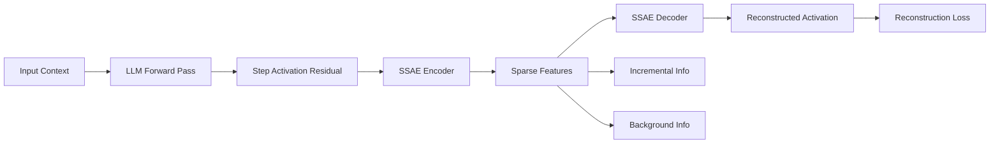

## 서론

최근 대규모 언어 모델(LLM)이 Chain-of-Thought(CoT) prompting을 통해 복잡한 추론 능력을 갖추게 되면서, 우리는 모델이 "생각"하는 과정을 확인할 수 있게 되었습니다. 하지만 아이러니하게도 모델이 생성하는 텍스트의 논리가 틀렸을 때, 우리는 왜 틀렸는지, 혹은 모델 내부의 어느 단계에서 오류가 발생했는지를 진단하기가 매우 어렵습니다. 기존의 Sparse Autoencoder(SAE)와 같은 해석 가능성 도구들은 주로 **토큰(Token)** 단위로 모델의 활성화(activation)를 분석해 왔습니다.

그런나 추론은 단일 토큰의 의미가 아니라, 토큰들이 쌓여 만들어내는 **단계(Step)** 전체의 문맥과 논리적 흐름에서 발생합니다. 이러한 토큰 수준의 분석은 추론 과정에서 발생하는 의미적 전환(semantic transition)이나 방향성(directionality)과 같은 더 높은 차원의 정보를 포착하는 데 한계가 있었습니다. 이른바 '세분성 불일치(Granularity Mismatch)' 문제입니다.

이러한 배경에서 등장한 것이 **Step-Level Sparse Autoencoder(SSAE)**입니다. SSAE는 토큰 단위를 넘어 추론의 '단계'를 하나의 단위로 보고, 이 과정에서 새롭게 등장하는 정보(증분 정보)와 기존에 알던 정보(배경 정보)를 분리합니다. 이 글에서는 SSAE가 어떻게 LLM의 블랙박스를 열어 추론 과정을 희소 특징(Sparse Features)으로 해석하는지, 그 기술적 메커니즘과 실험 결과를 심도 있게 다루고자 합니다.

## 본론

### 1. 기술적 배경: 토큰 단위 vs 단계 단위 분석

기존 SAE 기법은 잔차 스트림(Residual Stream)의 각 토큰 위치에서 활성화 벡터를 압축하여 해석 가능한 단위의 뉴런으로 분해합니다. 하지만 추론 과정은 순차적인 단계들이 연결된 것입니다. 예를 들어, "A는 B보다 크고, B는 C보다 크다"는 전제에서 "A와 C 중 누가 더 큰가?"를 묻는 과정에서, 첫 번째 단계(전제 파악)와 두 번째 단계(비교)는 서로 다른 논리적 역할을 수행합니다.

토큰 단위 SAE는 이러한 단계 간의 흐름을 포착하지 못합니다. 반면, SSAE는 **문맥에 조건부된 희소성 제어(Context-conditioned Sparsity Control)**를 통해 특정 단계에서 발생한 정보의 변화량을 집중적으로 포착합니다. 이는 SSAE가 정보 병목(Information Bottleneck)을 형성하여, 현재 단계에 꼭 필요한 '증분 정보(Incremental Information)'만을 걸러내도록 유도하기 때문입니다.

### 2. SSAE의 아키텍처 및 메커니즘

SSAE의 핵심 아키텍처는 기본적인 Autoencoder와 유사하지만, 희소성을 부과하는 방식에서 차별점이 있습니다. SSAE는 입력으로 이전 단계까지의 문맥과 현재 단계의 활성화를 받아, 이를 재구성(Reconstruction)합니다. 이때 재구성 오류를 최소화하면서도 활성화되는 특징의 수(L0 norm)를 엄격하게 제한합니다.

다음은 SSAE가 추론 단계를 처리하는 과정을 개념적으로 나타낸 흐름도입니다.



위 다이어그램에서 볼 수 있듯이, SSAE의 인코더는 잔차 스트림에서 핵심적인 희소 특징(Sparse Features)을 추출합니다. 이 특징들은 크게 두 가지로 해석될 수 있습니다.

1.  **증분 정보 (Incremental Information)**: 이전 단계까지의 문맥에는 없었지만, 현재 단계의 추론을 위해 새롭게 필요해진 정보입니다. 예를 들어, "따라서(consequently)"와 같은 결정적인 논리적 연결 고리가 여기에 해당합니다.
2.  **배경 정보 (Background Information)**: 이전 단계에서 이미 계산되었거나 유지되어야 하는 일반적인 지식이나 문맥입니다.

SSAE는 희소성 제약을 통해 이 둘을 분리(Disentangle)합니다. 이를 통해 연구자들은 "모델이 이 단계에서 새롭게 무엇을 배웠는가?"를 명확히 식별할 수 있습니다.

### 3. 구현 가이드: PyTorch로 SSAE 구현하기

이론을 바탕으로 실제로 SSAE를 어떻게 구현할 수 있는지 PyTorch를 사용한 간소화된 예제 코드를 살펴보겠습니다. 이 코드는 잔차 스트림의 특정 레이어 활성화를 압축하는 SSAE 모듈을 보여줍니다.

```python
import torch
import torch.nn as nn
import torch.nn.functional as F

class SSAE(nn.Module):
    def __init__(self, input_dim, hidden_dim, l1_coefficient=0.01):
        super(SSAE, self).__init__()
        # 인코더: 입력 차원을 훨씬 큰 희소 차원으로 사상
        self.encoder = nn.Linear(input_dim, hidden_dim)
        # 디코더: 희소 특징을 다시 원래 차원으로 복원
        self.decoder = nn.Linear(hidden_dim, input_dim)
        
        self.l1_coefficient = l1_coefficient
        self.input_dim = input_dim

    def forward(self, x):
        # x: [batch_size, input_dim] (특정 레이어의 잔차 스트림 활성화)
        
        # 인코딩: ReLU 활성화 함수를 사용하여 희소성 유도
        # 이 활성화 벡터가 우리가 해석하고자 하는 '희소 특징'입니다
        features = F.relu(self.encoder(x))
        
        # 디코딩: 원래 입력 재구성
        x_reconstructed = self.decoder(features)
        
        # 손실 계산
        # 1. 재구성 손실 (MSE): 정보가 손실되지 않도록 함
        reconstruction_loss = F.mse_loss(x_reconstructed, x)
        
        # 2. L1 정규화 손실: 활성화된 뉴런의 수를 줄여 희소성 강제
        sparsity_loss = torch.mean(torch.abs(features))
        
        # 총 손실
        loss = reconstruction_loss + self.l1_coefficient * sparsity_loss
        
        return loss, x_reconstructed, features

# 사용 예시
# LLM의 잔차 스트림 차원이 4096이고, SSAE의 잠재 차원을 8192로 설정한다고 가정
ssae_model = SSAE(input_dim=4096, hidden_dim=8192, l1_coefficient=0.0005)
dummy_residuals = torch.randn(32, 4096) # 배치 사이즈 32

loss, reconstructed, features = ssae_model(dummy_residuals)
print(f"Loss: {loss.item()}, Active Features: {(features > 0).sum().item()}")
```

이 코드의 핵심은 `hidden_dim`을 `input_dim`보다 크게 설정하는 것(Over-complete)입니다. 이는 모델이 자유로운 표현을 할 수 있게 하면서도, L1 정규화를 통해 필요한 특징만 선택적으로 사용하게 만들어 정보의 병목을 효과적으로 생성합니다.

### 4. 실험 결과 및 성능 분석

논문에서는 다양한 베이스 모델과 추론 작업(GSM8K, LogiQA 등)을 통해 SSAE의 성능을 검증했습니다. SSAE의 희소 특징을 사용하여 **Linear Probing** 실험을 수행한 결과는 매우 흥미롭습니다.

다음은 토큰 수준 메트릭(예측하기 쉬움)과 추론 수준 메트릭(예측하기 어려움)에 대한 특징의 예측 성능을 비교한 표입니다.

| 평가 속성 (Property) | 속성 설명 | 예측 난이도 | SSAE 특징의 예측 정확도 |
| :--- | :--- | :--- | :--- |
| **생성 길이 (Generation Length)** | 해당 단계에서 생성될 토큰의 수 | 낮음 (Low) | 매우 높음 (~98%) |
| **첫 토큰 분포 (First Token Dist.)** | 다음 토큰의 확률 분포 | 낮음 (Low) | 매우 높음 (~95%) |
| **정답 여부 (Correctness)** | 전체 추론의 결과가 정답인지 여부 | 높음 (High) | 높음 (~75%) |
| **논리성 (Logicality)** | 추론 단계의 논리적 타당성 | 매우 높음 (Very High) | 중간 ~ 높음 (~65%) |

이 결과는 SSAE가 단순히 텍스트의 표면적 통계(길이, 단어 선택)뿐만 아니라, 추론이 올바른지(Correctness), 논리적인지(Logicality)와 같은 **심층적인 속성을 단계별로 포착하고 있음**을 시사합니다. 즉, LLM이 추론 과정에서 사실상 "내가 지금 제대로 풀고 있나?"라는 메타 인지를 특정 뉴런의 활성화 패턴으로 인코딩하고 있다는 강력한 증거입니다.

### 5. Step-by-Step 적용 전략

실무 환경에서 LLM의 추론 과정을 디버깅하거나 개선하기 위해 SSAE를 적용하는 단계를 정리해 보겠습니다.

1.  **데이터 수집 (Data Collection)**: LLM이 CoT를 생성할 때, 각 단계(Step)별로 특정 레이어의 잔차 스트림(Residual Stream) 활성화값 $h_t$를 저장합니다.
2.  **SSAE 사전 학습 (Pre-training)**: 수집한 활성화값을 사용하여 SSAE를 학습시킵니다. 이때 문맥(Context)을 고려하여 희소성을 조절해야 합니다.
3.  **특징 해석 (Feature Interpretation)**: 학습된 SSAE의 활성화 벡터를 분석하여, 특정 뉴런(Feature)이 의미하는 바를 라벨링합니다. (예: "Feature #405는 수학적 덧셈 단계에 강하게 활성화됨")
4.  **이상 탐지 (Anomaly Detection)**: 새로운 추론 과정을 수행할 때, SSAE 특징이 비정상적인 패턴을 보이는 단계를 식별합니다. 예를 들어, 정답을 도출하는 문제에서 '논리성'과 관련된 특징이 낮게 활성화된다면, 해당 단계에서 추론이 꼬였을 가능성이 높습니다.
5.  **개선 적용 (Intervention)**: 식별된 오류 단계의 활성화를 수정하거나, 모델이 해당 단계를 재생성하도록 유도하여 자가 수정(Self-Correction) 능력을 강화합니다.

## 결론

SSAE(Step-Level Sparse Autoencoder)는 토큰 단위의 분석을 넘어, LLM 추론 과정의 '단계'라는 본질적인 단위에 주목한 혁신적인 연구입니다. 문맥에 조건화된 희소성 제어를 통해 증분 정보와 배경 정보를 성공적으로 분리해낸 점은 높은 평가를 받을 만합니다.

이 연구의 가장 큰 의의는 LLM이 단순히 다음 단어를 맞추는 확률적 모델을 넘어, **자신의 추론 과정의 정확성을 판단할 수 있는 잠재적 표현(Latent Representation)을 내부에 형성하고 있다는 점**을 입증했다는 것입니다. 이는 향후 "스스로 생각을 교정할 수 있는(Self-Correcting) AI"를 개발하는 데 있어 중요한 이론적 및 실무적 기초가 될 것입니다.

앞으로 SSAE는 모델 디버깅 도구를 넘어, 프로세스 감독(Process Supervision) 기반의 RLHF(Reinforcement Learning from Human Feedback)나 고품질 합성 데이터 생성 등 다양한 MLOps 파이프라인에 핵심 컴포넌트로 통합될 가능성이 매우 높습니다.

### 참고자료

- **논문 원본**: [Step-Level Sparse Autoencoder for Reasoning Process Interpretation (arXiv:2603.03031)](http://arxiv.org/abs/2603.03031v1)

- **GitHub Repository**: [Miaow-Lab/SSAE](https://github.com/Miaow-Lab/SSAE)
