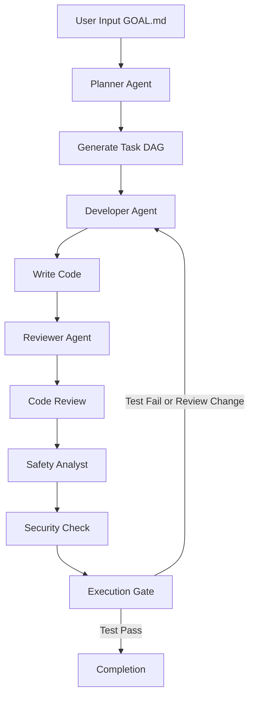

## 서론

"이 코드를 리팩토링해줘", "테스트 케이스를 추가해줘", "아니, 그게 아니라 이 로직은 이렇게 돌아가야 해". 개발자가 AI 코딩 어시스턴트를 사용할 때 겪는 가장 큰 피로감은 단순히 코드를 생성하는 것에 있지 않습니다. 바로 AI를 '상호작용하는 도구'가 아닌 '지시를 따르야 하는 수동적인 실행기'로 다루어야 한다는 점입니다. 우리는 여전히 복잡한 소프트웨어 개발 과정을 수십 번의 프롬프트로 쪼개어 일일이 관리하고 있으며, 문맥(Context)이 길어질수록 AI는 의도와 다른 방향으로 가닥을 잡곤 합니다.

이러한 '프롬프트 엔지니어링의 병목'을 해결하기 위해 등장한 새로운 패러다임이 바로 'Agentic Workflow(에이전트 워크플로우)'입니다. 오늘 소개할 **Sgai**는 사용자가 "무엇(What)"을 만들지 정의하면, 시스템이 "어떻게(How)" 만들지를 스스로 계획하고 실행하는 GOAL.md 기반의 멀티 에이전트 자동 코딩 시스템입니다. 단일 LLM이 답변을 생성하는 것이 아니라, 개발자, 검토자, 보안 분석가 등 역할이 부여된 여러 에이전트가 협력하여 실제 작동하는 소프트웨어를 만들어내는 과정을 살펴보겠습니다.

## 본론

### GOAL.md와 DAG 기반 워크플로우의 작동 원리

Sgai의 핵심 철학은 프롬프트 엔지니어링이 아닌 **Goal Engineering(목적 기반 설계)**에 있습니다. 사용자는 프로젝트 루트에 `GOAL.md`라는 파일을 생성하고, 달성하고자 하는 소프트웨어의 기능적 요구사항과 비기능적 요구사항을 명시합니다. Sgai는 이 목표를 분석하여 작업을 DAG(Directed Acyclic Graph, 유향 비순환 그래프)로 변환합니다.

이 과정은 단순한 순차 실행이 아닙니다. 예를 들어, '코드 작성'이 완료되어야 '코드 검토'가 가능하고, 검토가 통과되어야 '보안 점검'이 가능하며, 보안 점검 통과 후 '테스트 실행'이 가능한 의존성 구조를 형성합니다. 각 노드(Node)는 특정 역할(Role)을 부여받은 AI 에이전트이며, 에이전트 간의 통신을 통해 상태를 업데이트합니다.

다음은 Sgai의 내부 워크플로우를 개념적으로 도식화한 것입니다.



### 기술적 아키텍처와 메커니즘

Sgai는 Go(Golang)로 작성되었으며, 로컬 환경에서 실행되는 것을 원칙으로 하여 보안과 프라이버시를 보장합니다. 웹 대시보드를 통해 에이전트들의 실시간 활동을 모니터링할 수 있으며, 로그가 GitHub에 자동 푸시되지 않으므로 안심하고 사용할 수 있습니다.

가장 흥미로운 기술적 특징은 **Completion Gates(완료 게이트)**입니다. AI가 "코드를 작성했습니다"라고 텍스트로 답변하는 것으로 끝나는 것이 아니라, 실제 환경에서 `make test`, `npm run build`와 같은 명령어를 실행하여 그 결과(Exit Code, Stdout, Stderr)를 확인합니다. 테스트가 실패하거나 리뷰어가 수정을 요구하면, 해당 결과를 피드백(Feedback) 루프로 돌려보내어 개발자 에이전트가 코드를 수정하게 됩니다.

이러한 접근 방식은 최근 AI 연구에서 논의되는 **Reflexion**이나 **Self-Refine**과 같은 자기 성찰(Self-reflection) 메커니즘을 실무적으로 구현한 사례로 볼 수 있습니다. 에이전트는 외부 도구(Shell, Linter)를 통해 자신의 산출물을 검증하고, 오류를 자기 자신이 수정합니다.

### 기존 AI 코딩 툴과의 비교

Sgai와 같은 멀티 에이전트 시스템이 기존의 Copilot이나 ChatGPT와 어떻게 다른지 명확히 이해할 필요가 있습니다. 아래 표는 각 접근 방식의 차이를 요약합니다.

| 비교 항목 | 기존 AI Pair Programmer (e.g., Copilot) | Sgai (Goal-driven Multi-agent) |
| :--- | :--- | :--- |
| **상호작용 모드** | 인간이 질문(Prompt)하고 AI가 답변 (Chat / Inline) | 인간이 목표(GOAL)를 제시하면 AI가 실행 |
| **책임 소재** | 코드 생성 및 제안 (Human이 검증 및 적용) | 코드 생성, 검증, 수정까지 자동화 (Loop) |
| **검증 방식** | 정적 텍스트 분석 또는 사용자의 수동 확인 | 실제 환경에서의 테스트 실행 (Test Execution) |
| **작업 단위** | 함수 또는 파일 단위의 단발성 생성 | 프로젝트 전체 수준의 워크플로우 자동화 |
| **에이전트 구조** | 단일 LLM (Single Model) | 역할 분담된 다중 에이전트 (DAG) |

### 실무 적용 가이드: Sgai로 프로토타이핑하기

Sgai를 실제 프로젝트에 적용하여 간단한 웹 서비스를 프로토타이핑하는 과정을 단계별로 살펴보겠습니다. 이 과정은 로컬 환경에 Docker와 Go가 설치되어 있음을 가정합니다.

#### 1. 환경 설정 및 설치 먼저 Sgai 리포지토리를 클론하고 필요한 의존성을 설치합니다.

```bash
git clone https://github.com/sandgardenhq/sgai.git
cd sgai
make build
```

#### 2. GOAL.md 작성 (The "What") 프로젝트의 루트 디렉토리에 `GOAL.md` 파일을 생성하고 목표를 정의합니다. 구체적일수록 좋지만, 구현 방식(How)은 서술하지 않는 것이 핵심입니다.

```markdown
# GOAL.md

## Objective
Create a simple Python REST API that calculates the Fibonacci sequence.

## Requirements
1. Use FastAPI framework.
2. Implement an endpoint `/fib/{n}` that returns the n-th Fibonacci number.
3. Input validation: `n` must be a positive integer.
4. Include unit tests for the calculation logic.
5. Provide a README.md with instructions on how to run the server.
```

#### 3. Sgai 실행 (The "How") 이제 Sgai를 실행하여 에이전트들이 목표를 달성하도록 합니다. OpenAI 또는 Anthropic API 키가 필요하며, 로컬 LLM(Llama 3 등)을 사용할 경우 OpenAI 호환 서버 포인트를 설정할 수 있습니다.

```bash
# 환경 변수 설정
export OPENAI_API_KEY="sk-..."
export SGAI_MODEL="gpt-4o"

# Sgai 워크플로우 실행
./sgai run
```

실행하면 브라우저에서 `http://localhost:8080` 대시보드가 자동으로 열립니다. 여기서 **Developer Agent**가 `main.py`를 작성하고, **Reviewer Agent**가 코드를 검토하며, **Tester Agent**가 `pytest`를 실행하는 과정을 실시간으로 관찰할 수 있습니다.

#### 4. 피드백 루프와 최종 산출물 만약 **Reviewer Agent**가 "입력 검증 로직이 누락되었습니다"라고 코멘트를 달면, **Planner**는 이를 DAG의 새로운 태스크로 등록하고 **Developer Agent**에게 수정을 지시합니다. 모든 게이트(테스트 통과, 리뷰 승인)가 통과되면 최종적으로 작동하는 코드와 README.md가 프로젝트 폴더에 생성됩니다.

## 결론

Sgai는 소프트웨어 개발 자동화의 수준을 '단순한 코드 제안'에서 '자율적인 프로젝트 수행'으로 끌어올린 실험적인 도구입니다. GOAL.md라는 인터페이스와 DAG 기반의 멀티 에이전트 협업 시스템을 통해, 개발자는 복잡한 구현 세부사항에서 벗어나 창의적인 문제 정의와 아키텍처 설계에 집중할 수 있게 됩니다.

물론 현재 버전은 완벽하지 않습니다. 복잡한 레거시 코드를 수정하거나 대규모 시스템을 통합하는 데에는 한계가 있을 수 있습니다. 하지만 **Agentic AI**가 엔터프라이즈 환경에 적용되는 미래를 시험한다는 점에서 매우 의미 있는 프로젝트입니다. 특히 "텍스트 생성"을 넘어 "실제 환경에서의 검증(Execution)"까지 포함한 워크플로우는 향후 MLOps 및 AutoML 영역에서도 중요한 참고 모델이 될 것입니다.

AI 연구자이자 엔지니어로서, 우리는 이제 하나의 모델을 튜닝하는 시대를 지나 모델들이 상호작용하는 시스템을 설계하는 시대로 접어들고 있습니다. Sgai는 그 전환점을 보여주는 훌륭한 오픈소스 사례입니다.

### 참고자료

- **Sgai GitHub Repository**: https://github.com/sandgardenhq/sgai

- **Anthropic's Agents Research**: Building effective agents (Anthropic)

- **AutoGPT**: Autonomous GPT-4 Agent

- **Paper**: "Reflexion: Language Agents with Verbal Reinforcement Learning" (arXiv)
