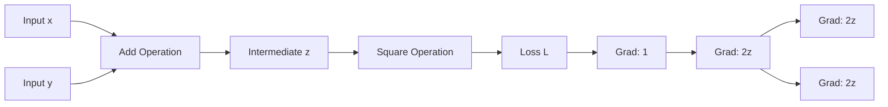

## 서론

수천만 개의 파라미터를 가진 거대 언어 모델(LLM)을 학습시키다 보면, 가끔씩 눈앞이 캄캄해지는 순간이 옵니다. Loss가 전혀 줄어들지 않거나, 특정 레이어에서 Gradient가 소멸해버리는 'Vanishing Gradient' 문제가 발생했을 때입니다. 이때 많은 엔지니어들이 무작정 Learning Rate를 조절하거나 Optimizer를 Adam에서 SGD로 바꿔보는 '카멜레온 같은 튜닝'을 시도합니다. 하지만 이러한 시행착오는 근본적인 해결책이 되지 못합니다.

우리가 흔히 사용하는 PyTorch나 TensorFlow와 같은 프레임워크는 편리하지만, 역설적으로 그 내부 작동 메커니즘을 '블랙박스'로 만들어 버리는 경향이 있습니다. "왜 이 레이어의 가중치가 업데이트되지 않을까?"라는 질문에 답하기 위해서는 고수준 API 뒤에 숨겨진 수학적 원리, 즉 **Computational Graph(연산 그래프)**와 **Backpropagation(역전파)**의 흐름을 정확히 이해해야 합니다.

Show GN과 같은 시각화 플랫폼이 주목받는 이유는 바로 지금 이 맥락에 있습니다. 단순히 코딩 실습을 넘어서, 수학적 기초(Fundamentals)를 시각적으로 직관하게 확인함으로써, 모델 성능의 차이를 만드는 핵심 원인을 파악할 수 있게 해주기 때문입니다. 이 글에서는 복잡한 딥러닝 알고리즘의 숨막히는 수식을 벗어나, 연산 흐름(Computational Flow)을 통해 역전파의 메커니즘을 완벽하게 이해하는 여정을 시작하겠습니다.

## 본론

### 연산 그래프(Computational Graph)와 역전파의 원리

딥러닝 모델의 학습 과정은 수학적으로 거대한 합성 함수(Composite Function)를 최적화하는 과정과 같습니다. $y = f(x)$라는 함수가 있을 때, 우리는 $x$를 조금씩 변화시켜 $y$가 원하는 값에 가까워지도록 만듭니다. 뉴럴 네트워크에서는 이 함수가 수많은 레이어와 연산을 거쳐 구성됩니다.

역전파(Backpropagation)는 이러한 복합 함수의 미분(Gradient)을 효율적으로 계산하기 위한 알고리즘입니다. 핵심은 **연쇄 법칙(Chain Rule)**을 사용하여 출력 단계에서 입력 단계로 거슬러 올라가며 기울기를 전달하는 것입니다. Show GN은 이 추상적인 개념을 눈에 보이는 '노드'와 '엣지'의 흐름으로 변환하여, 데이터가 어떻게 흐르고 기울기가 어떻게 계산되는지를 단계별로 보여줍니다.

#### 1. 단순 연산의 시각화

가장 기초적인 연산인 $z = x + y$와 $L = z^2$로 구성된 손실 함수를 상상해 봅시다. Forward Pass(순전파)에서는 입력 $x, y$가 더해져 $z$가 되고, $z$는 제곱되어 최종 Loss $L$이 됩니다.

Backward Pass(역전파)에서는 Loss에 대한 기울기($\frac{\partial L}{\partial L}$)가 1에서 시작하여 거꾸로 흘러갑니다. $L = z^2$이므로 $z$에 대한 미분은 $2z$가 되고, $z = x + y$이므로 $x$와 $y$에 대한 미분은 각각 1이 됩니다. 이 흐름을 다이어그램으로 표현하면 다음과 같습니다.



이 다이어그램은 Show GN이 제공하는 시각화의 핵심을 단순화한 것입니다. 데이터가 왼쪽에서 오른쪽으로 흘러 Loss를 만들고, Error가 오른쪽에서 왼쪽으로 흘러 가중치를 조정하는 과정을 명확히 보여줍니다.

#### 2. Step-by-Step 가이드: 역전파 수기 계산과 코드의 매칭

시각화만으로는 부족합니다. 실제 코드가 이 수학적 원리와 어떻게 1:1로 매칭되는지 확인해야 합니다. 다음은 PyTorch를 사용하여 앞서 설명한 연산 과정을 구현하고, 각 단계별로 기울기(Gradient)를 확인하는 과정입니다.

**Step 1: 텐서 정의 및 연산 (Forward Pass)** 우선 $x=2.0, y=3.0$이라고 가정하고 연산을 수행합니다. 이때 `requires_grad=True`는 이 텐서에 대한 기울기를 계산하겠다는 의미입니다.

```python
import torch

# 1. 입력 데이터 정의 (x=2.0, y=3.0)
x = torch.tensor([2.0], requires_grad=True)
y = torch.tensor([3.0], requires_grad=True)

# 2. 순전파 (Forward Pass)
# z = x + y
z = x + y

# L = z^2
loss = z ** 2

print(f"Forward Pass 결과:")
print(f"z = {z.item()}")  # 예상: 5.0
print(f"Loss = {loss.item()}")  # 예상: 25.0
```

**Step 2: 역전파 수행 (Backward Pass)** `.backward()` 함수를 호출하면, Computational Graph를 따라 Chain Rule이 적용됩니다. PyTorch는 내부적으로 자동 미분(Autograd) 엔진을 통해 각 변수의 `.grad` 속성에 누적된 기울기를 저장합니다.

```python
# 3. 역전파 (Backward Pass)
loss.backward()

print(f"
Backward Pass 결과 (Gradients):")
# dL/dz = 2z = 2 * 5.0 = 10.0
print(f"dL/dz (z.grad) = {z.grad.item()}") # 주의: 중간 변수 z의 grad는 보통 None이거나 retain_graph 필요

# dL/dx = dL/dz * dz/dx = 2z * 1 = 10.0
print(f"dL/dx (x.grad) = {x.grad.item()}") 

# dL/dy = dL/dz * dz/dy = 2z * 1 = 10.0
print(f"dL/dy (y.grad) = {y.grad.item()}")
```

이 코드를 실행하면 $x.grad$와 $y.grad$가 모두 10.0임을 확인할 수 있습니다. 이는 앞서 수학적으로 유도한 값과 정확히 일치합니다. Show GN과 같은 도구는 이러한 `backward()` 호출이 내부적으로 어떤 그래프를 순회하며 계산을 수행하는지를 시각적으로 도식화해 줍니다.

#### 3. 시각화 학습 도구(Show GN)의 실무적 효용

최신 Transformer 구조나 GNN(Graph Neural Networks)과 같은 복잡한 모델을 다룰 때, 연산 그래프의 복잡도는 기하급수적으로 늘어납니다. 이때 단순한 텍스트 로그(Log)만으로는 문제의 원인을 찾기 어렵습니다. 다음은 연산 흐름 시각화 도구를 활용했을 때의 이점을 정리한 표입니다.

| 비교 항목 | 기존 디버깅 방식 (Print/Log) | 시각화 도구 활용 (Show GN 등) |
| :--- | :--- | :--- |
| **Gradient Flow 확인** | 수동으로 `.grad` 값을 하나씩 출력하여 확인 | 그래프 상에서 Edge를 따라 Gradient의 크기와 방향을 직관적 확인 |
| **연산 그래프 구조 파악** | 코드를 줄 단위로 추적하며 상상력에 의존 | 노드와 연결선을 통해 전체 토폴로지(Topology)를 즉시 파악 |
| **Vanishing/Exploding 감지** | 수치가 비정상적으로 크거나 작은 경우 추정 | 시각적으로 Gradient가 사라지거나 폭발하는 경로를 색상/굵기로 식별 |
| **학습 효율** | 디버깅 시간이 길어져 연구 속도 저하 | 원인 파악이 빨라져 모델 수정과 실험 반복 속도 향상 |

이러한 시각화는 특히 **Custom Layer**나 **Complex Loss Function**을 구현할 때 필수적입니다. 예를 들어, Attention 메커니즘의 가중치 행렬 연산 과정에서 차원 불일치(Dimension Mismatch)가 발생해 역전파가 중단되는 경우를 생각해 봅시다.

#### 4. 심화 예시: 행렬 연산에서의 역전파

딥러닝에서 대부분의 연산은 행렬(Matrix) 단위로 이루어집니다. $Y = XW$ (Linear Layer)가 있고 Loss가 $L$일 때, $W$에 대한 기울기는 $X^T \cdot \frac{\partial L}{\partial Y}$가 됩니다. Show GN은 이러한 행렬 연산의 흐름을 텐서의 차원 변화와 함께 보여줍니다.

```python
import torch

# 배치 사이즈 3, 입력 차원 4, 출력 차원 2
batch_size = 3
input_dim = 4
output_dim = 2

# 입력 X (3x4)
X = torch.randn(batch_size, input_dim, requires_grad=True)
# 가중치 W (4x2)
W = torch.randn(input_dim, output_dim, requires_grad=True)
# 편향 b (2)
b = torch.randn(output_dim, requires_grad=True)

# Forward Pass: Y = XW + b
Y = torch.matmul(X, W) + b

# 가상의 Loss (MSE)
target = torch.randn(batch_size, output_dim)
loss = torch.mean((Y - target) ** 2)

# Backward Pass
loss.backward()

print(f"X.shape: {X.shape}, W.grad.shape: {W.grad.shape}")
# W.grad는 X.T와 dL/dY의 행렬 곱 결과이므로 (4x2) 형태를 가져야 합니다.
print(f"W Gradient calculated successfully.")
```

이 코드에서 `torch.matmul`은 하나의 거대한 노드로 표현될 수 있지만, 내부적으로는 수많은 스칼라 곱셈과 덧셈으로 구성된 Computational Graph를 가집니다. 시각화 도구는 이 행렬 연산 하나가 가지는 의미를 "데이터의 선형 변환"이라는 관점에서, 그리고 그 변환이 Loss에 어떻게 기여하는지를 기울기 흐름을 통해 명확히 보여줍니다. 이것이 단순한 수식 암기와는 다른, 직관적인 이해(Intuition)를 제공하는 방식입니다.

## 결론

결국 Show GN과 같은 연산 흐름 시각화 도구가 강조하는 것은 "어떤 라이브러리를 사용하느냐"가 아니라 "수학적 원리를 얼마나 직관적으로 이해하고 있느냐"입니다. 우리는 종종 ChatGPT나 Claude 같은 최신 LLM의 놀라운 성능에 매료되어, 그 바탕에 깔린 단순하고 명확한 수학적 사실—즉, 기울기를 따라 내려가는 최적화의 과정—을 간과하기 쉽습니다.

전문가로서의 인사이트를 말씀드리자면, 실제 산업 현장에서 모델의 성능을 극한으로 끌어올리는 것은 최신 논문에 나온 복잡한 테크닉보다, 역전파가 얼마나 건강하게 흐르고 있는지를 파악하는 **Fundamental한 능력**에서 결정됩니다. Gradient Clipping, Proper Initialization, Residual Connection과 같은 기법들은 모두 이 연산 흐름을 제어하기 위한 장치들입니다.

따라서 여러분이 다음에 모델이 학습되지 않는 문제에 직면한다면, 무작정 하이퍼파라미터를 바꾸기보다 잠시 멈춰서 Computational Graph를 상상해 보시기 바랍니다. 데이터가 어떤 경로를 통해 Loss로 변환되고, Error가 다시 어떤 경로를 통해 파라미터를 수정하는지, 그 흐름을 눈으로 그려보는 것이 진정한 AI 연구자와 엔지니어의 자질일 것입니다.

### 참고자료

- [Show GN: 모두의AI – 기초수학부터 역전파까지, 연산 흐름으로 이해하는 AI 학습 플랫폼](https://news.hada.io/topic?id=27168)

- Rumelhart, D. E., Hinton, G. E., & Williams, R. J. (1986). Learning representations by back-propagating errors. *Nature*.

- PyTorch Documentation: Autograd Mechanics
