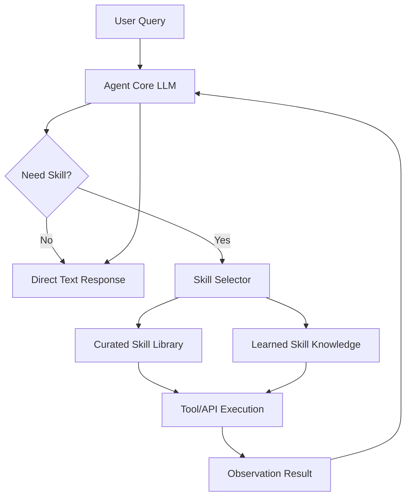

## 서론

최근 생성형 AI의 패러다임은 단순한 대화를 넘어, 복잡한 목표를 달성하기 위해 도구(Tool)를 사용하고 계획을 수립하는 **에이전트(Agent)**로 빠르게 이동하고 있습니다. 그러나 연구자들과 실무자들은 현장에서 뼈아픈 문제에 직면합니다. 모델의 파라미터 수가 아무리 많아도, 특정 도메인에 필요한 구체적인 '행동 양식'이나 '스킬(Skill)'이 부족하면 에이전트는 무능력한 상태로 남게 됩니다. 예를 들어, 방대한 지식을 가진 LLM이 있더라도 항공권 예약 시스템의 API를 정확히 호출하거나, 특정 형식의 보고서를 작성하는 방법을 몰라 사용자의 요청을 수행하지 못하는 경우가 빈번합니다.

여기서 핵심 질문이 발생합니다. "에이전트에게 이러한 스킬을 어떻게 전달해야 가장 효율적인가?" 입니다. 단순히 시스템 프롬프트에 설명을 덧붙이는 것(큐레이션)이 나은지, 아니면 모델이 스킬을 직접 학습하게 해야 하는지(러닝)에 대한 정량적인 기준이 부족했습니다. **SkillsBench**는 이러한 딜레마에 해답을 제시하기 위해 탄생했습니다. 11개의 도메인과 84개의 작업을 통해 단순한 언어적 지식을 넘어선 '행동의 효율성'을 측정하는 최초의 벤치마크로, 에이전트 연구의 새로운 표준을 제시하고 있습니다.

## 본론

### SkillsBench의 기술적 배경 및 평가 철학

SkillsBench는 에이전트의 성능을 평가할 때 단순한 정답률(Accuracy)만을 보는 것이 아니라, **스킬(Skill)의 획득과 활용 능력**에 초점을 맞춥니다. 여기서 '스킬'이란 에이전트가 외부 환경과 상호작용하거나 복잡한 작업을 수행하기 위해 사용하는 고수준의 함수나 행동 단위를 의미합니다. 기존 벤치마크들이 모델의 언어적 이해력이나 상식을 테스트했다면, SkillsBench는 주어진 도구(Skill)를 얼마나 정확하고 효율적으로 조합하여 문제를 해결하는지를 냉철하게 평가합니다.

이 벤치마크는 크게 세 가지 설정(Setting)에서 에이전트를 비교합니다.

1.  **No Skill**: 스킬에 대한 any 정보 없이 모델이 자체적인 지식으로만 문제를 해결하려 시도하는 경우. 2.  **Curated Skills**: 개발자가 미리 정의하고 큐레이션 한 스킬 설명을 컨텍스트로 제공하는 경우 (Few-shot 또는 RAG 방식). 3.  **Learned Skills**: 모델이 특정 작업을 수행하는 방식을 사전 학습(Pre-training) 또는 미세 조정(Fine-tuning)을 통해 학습한 경우.

연구 결과에 따르면, 스킬의 복잡도가 낮을 때는 Curated 방식이 효율적일 수 있으나, 도메인이 특수하거나 스킬 간의 의존도가 높은 복잡한 작업에서는 Learned Skills 방식이 압도적인 성능을 보이는 경향이 나타납니다. 이는 "프롬프트 엔지니어링의 한계"와 "에이전트 특화 학습의 필요성"을 시사합니다.

### 에이전트 스킬 평가 아키텍처

SkillsBench가 평가하는 에이전트의 작업 흐름은 일반적으로 아래와 같은 순환적인 구조(Cycle)를 따릅니다. 사용자의 요청(Query)이 들어오면 에이전트는 상황을 인지하고, 적절한 스킬을 선택한 뒤, 실행 관찰(Observation)을 통해 다음 행동을 결정합니다.



이 다이어그램에서 볼 수 있듯이, 핵심은 `Skill Selector`가 얼마나 정확히 `F`와 `G` 중에서 적절한 지식을 찾아내느냐입니다. SkillsBench는 이 의사결정 과정에서 발생할 수 있는 오류(잘못된 스킬 선택, 누락된 인자 등)를 정량적으로 측정합니다.

### 실험 결과 비교 분석

84개 작업에 대한 평가 결과, 스킬 적용 방식에 따른 명확한 성능 차이가 드러났습니다. 아래 표는 SkillsBench 논리를 바탕으로 한 일반적인 성능 비교 표를 요약한 것입니다.

| 비교 항목 | No Skill (Base LLM) | Curated Skills (Prompting) | Learned Skills (Fine-tuned) | | :--- | :--- | :--- | :--- | | **스킬 탐색 정확도** | 낮음 (추측에 의존) | 중간 (정보 제공 의존) | 높음 (내재화된 지식) | | **복잡한 의존성 처리** | 매우 낮음 | 중간 (Prompt 길이 제약) | 높음 (매개변수화) | | **일반화 능력** | 높음 (광범위한 지식) | 낮음 (예시에 국한됨) | 중간 (학습 데이터 의존) | | **추론 비용(Latency)** | 낮음 | 높음 (긴 Context 처리) | 중간 | | **주요 실패 원인** | 환각(Hallucination) | Context Window 부족 | 과적합(Overfitting) |

이 표는 Learned Skills가 복잡한 작업, 특히 여러 스킬을 순차적으로 호출해야 하는 멀티-호프(Multi-hop) 질의응답에서 강력함을 보여줌을 나타냅니다.

### 실무 적용 가이드: 스킬 기반 에이전트 구현하기

SkillsBench의 인사이트를 바탕으로 실제 프로젝트에서 스킬 기반 에이전트를 구현하는 방법을 단계별로 정리합니다. 여기서는 **Python**과 **LangChain** 스타일의 의사코드를 사용하여 '학습된 스킬(Learned Skill)'과 '큐레이션 된 스킬'을 결합하는 하이브리드 접근법을 보여드립니다.

#### 1. 단계별 구현 가이드

1.  **스킬 정의(Definition)**: 먼저 에이전트가 사용할 수 있는 기능을 API 형태로 정의합니다. 2.  **스킬 라이브러리 구축**: 이러한 정의들을 Vector DB에 저장하여 검색 가능하게 만듭니다(Curated). 3.  **모델 특화 학습 (Optional)**: 자주 호출되는 핵심 스킬 패턴에 대해 모델을 미세 조정하여 선택 시간을 단축시킵니다(Learned). 4.  **평가 루프 구성**: 사용자 쿼리에 대해 스킬 사용 여부를 판단하고 결과를 피드백받는 루프를 작성합니다.

#### 2. 코드 예시 (Python/PyTorch 스타일)

다음은 간단한 스킬 에이전트의 구조를 구현한 예시입니다. 실제 환경에서는 OpenAI API나 HuggingFace 모델을 사용할 수 있습니다.

```python
import json
from typing import List, Dict, Optional

# 스킬의 인터페이스 정의
class Skill:
    def __init__(self, name: str, description: str, func):
        self.name = name
        self.description = description
        self.func = func

    def execute(self, **kwargs):
        return self.func(**kwargs)

# 예시 스킬 함수들
def search_database(query: str) -> str:
    # 실제 DB 검색 로직 대신 시뮬레이션
    return f"DB Result for '{query}'"

def calculate_sum(a: int, b: int) -> int:
    return a + b

# 스킬 라이브러리 초기화 (Curated Skills)
skill_library = [
    Skill("SearchDB", "Searches the internal database for a query.", search_database),
    Skill("Calculator", "Adds two numbers together.", calculate_sum)
]

class SkillsAgent:
    def __init__(self, model, skills: List[Skill]):
        self.model = model
        self.skills = skills

    def decide_action(self, user_query: str) -> Dict:
        """
        LLM을 사용하여 어떤 스킬을 사용할지 결정하는 로직.
        실제로는 프롬프트에 skill_descriptions를 포함하여 호출합니다.
        """
        skill_descriptions = "
".join([f"- {s.name}: {s.description}" for s in self.skills])
        
        prompt = f"""
        Available Skills:
        {skill_descriptions}
        
        User Query: {user_query}
        
        Output JSON format: {{"tool": "ToolName", "args": {{"key": "value"}}}}
        """
        
        # 모델 호출 (가상의 generate 함수)
        response = self.model.generate(prompt)
        try:
            return json.loads(response)
        except json.JSONDecodeError:
            return {"tool": "None", "args": {}}

    def run(self, user_query: str):
        print(f"User: {user_query}")
        decision = self.decide_action(user_query)
        
        if decision["tool"] == "None":
            return self.model.generate(user_query) # 직접 응답
        
        # 해당 스킬 찾기
        target_skill = next((s for s in self.skills if s.name == decision["tool"]), None)
        
        if target_skill:
            result = target_skill.
```

```python
execute(**decision["args"])
            final_answer = self.model.generate(f"Tool Result: {result}. Answer the user query.")
            return final_answer
        else:
            return "Error: Skill not found."

# 사용 예시
# agent = SkillsAgent(model=llm_model, skills=skill_library)
# print(agent.run("What is the sum of 15 and 32?"))
```

이 코드는 Curated 방식의 기본 골격을 보여줍니다. SkillsBench의 연구 결과를 적용한다면, `decide_action` 메서드의 성능을 높이기 위해 모델이 스킬 선택 패턴을 사전에 학습(LoRA 튜닝 등)시키는 단계를 추가할 수 있습니다. 이를 통해 복잡한 쿼리에서도 스킬 탐색 시간을 줄이고 정확도를 높일 수 있습니다.

## 결론

SkillsBench는 LLM 에이전트 연구에 있어 중요한 이정표를 세웠습니다. 단순히 모델이 얼마나 말을 잘하느냐가 아니라, 주어진 도구(Skill)를 얼마나 잘 사용하여 실제적인 문제를 해결하느냐가 평가의 핵심임을 입증했습니다. 실험 결과, 특정 도메인의 복잡한 작업에서는 사전 학습된 스킬(Learned Skills)이 프롬프트 엔지니어링만으로 구현된 스킬보다 훨씬 강건한 성능을 보인다는 점은 MLOps 엔지니어들에게 시사하는 바가 큽니다.

앞으로의 에이전트 개발은 방대한 RAG 파이프라인만을 구축하는 것에서 벗어나, 에이전트가 사용할 핵심 스킬 셋을 정의하고 이를 모델이 효율적으로 호출할 수 있도록 특화 학습(Specialized Fine-tuning)하는 방향으로 진화해야 할 것입니다. "모든 것을 프롬프트로 해결하려"는 시도는 한계에 다다르고 있으며, SkillsBench와 같은 체계적인 벤치마크를 통해 검증된 '학습 가능한 에이전트'가 산업계의 표준이 될 것입니다.

**참고자료:**

- [SkillsBench: Benchmarking Agent Skills](https://news.hada.io/topic?id=26759)

- Hada.io Tech News Summary
