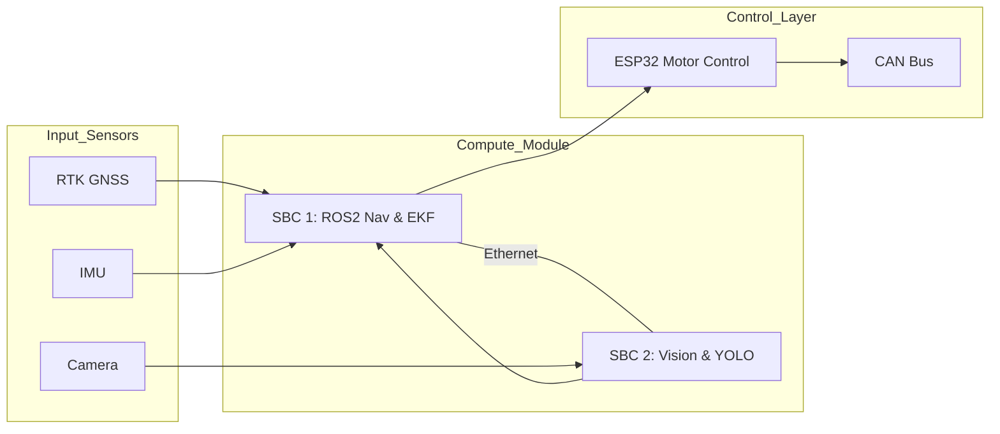

## 서론

농업 로봇 연구자나 스타트업 엔지니어가 겪는 가장 큰 악몽은 무엇일까요? 바로 '프로토타입의 갭(Prototype Gap)'입니다. 혁신적인 알고리즘이나 새로운 작업 기능을 구현하기도 전에, 센서 드라이버 작성, 통신 프로토콜 설정, 안전 워치독 구현, 하드웨어 인터페이스 빌드 등과 같은 잡다한 업무에 18개월 이상의 시간이 소진되곤 합니다. 이러한 반복적인 '인프라 구축' 과정은 연구의 초기 동기를 꺾어버리고, 프로젝트를 실패로 이끄는 주요 원인이 됩니다.

Sowbot은 바로 이 지점에서 착안한 오픈 하드웨어 농업 로봇 플랫폼입니다. 이 프로젝트는 단순한 로봇 하나를 만드는 것이 아니라, 연구자들이 본연의 연구에 집중할 수 있도록 하는 '표준화된 기반'을 제공하는 것을 목표로 합니다. 특히 딥러닝 기반의 비전 시스템과 실시간 제어 시스템을 유기적으로 결합하는 과정에서 발생하는 하드웨어 병목 현상을 듀얼 SBC 아키텍처로 우아하게 해결했습니다.

## 본론

### 1. 듀얼 컴퓨팅 아키텍처: ROS2와 YOLO의 공존

농업 자율 주행 로봇의 핵심은 **정확한 위치 인식(Localization)**과 **실시간 장애물/작물 인식(Vision)**의 조화입니다. 일반적으로 단일 컴퓨팅 보드에서 이 두 가지를 처리하려면 자원 분배(Computational Resource Allocation) 문제에 직면하게 됩니다. Sowbot은 이를 해결하기 위해 10x10cm 크기의 적층형 컴퓨트 모듈을 설계했으며, 두 개의 ARM Cortex-A55 SBC를 탑재하여 시스템을 물리적, 논리적으로 분리했습니다.

하나의 SBC는 ROS2 기반의 내비게이션과 EKF(Extended Kalman Filter) localization을 담당하여 실시간 제어의 안정성을 확보하고, 다른 하나는 Vision 처리와 YOLO(YOU Only Look Once) 기반의 객체 탐지 추론(Inference)에 전념합니다. 이 두 시스템은 단일 이더넷 케이블로 연결되어 고대역폭 통신을 수행합니다.

이러한 아키텍처 설계는 로보틱스 시스템 설계의 전형적인 패턴인 'Decoupling of Concerns'를 따르며, 연구자가 비전 모델을 업데이트할 때 제어 시스템의 안정성에 영향을 주지 않도록 보장합니다.



### 2. 센티미터급 정밀도: RTK GNSS와 EKF

야외 농업 환경에서는 GPS 신호의 오차 범위가 수 미터에 달할 수 있어, 일반 GPS만으로는 정밀 작업이 불가능합니다. Sowbot은 RTK(Real-Time Kinematic) GNSS를 채용하여 실시간 오차 보정을 통해 센티미터(cm) 수준의 절대 위치 정확도를 달성합니다. 이는 이동경로 계획(Path Planning)과 정밀 파종 작업에 필수적인 요소입니다.

이때 단순히 GPS 데이터만 믿는 것은 위험합니다. 따라서 IMU(관성 측정 장치)와 휠 오도메트리 데이터를 EKF 알고리즘을 통해 융합(Fusion)합니다. EKF는 비선형 시스템의 상태를 추정하는 데 널리 사용되는 알고리즘으로, 센서의 노이즈를 필터링하고 GPS 신호가 일시적으로 끊기더라도 로봇의 위치를 안정적으로 추정합니다.

### 3. 실시간 비전 처리와 YOLO 통합

작물의 상태를 진단하거나 잡초를 제거하기 위해서는 고성능의 객체 인식(Object Detection) 능력이 필요합니다. Sowbot은 경량화된 Cortex-A55 프로세서에서도 효율적으로 구동 가능한 YOLO 모델을 활용합니다. 전용 SBC를 할당함으로써, 고해상도 카메라 입력을 실시간으로 처리하고 추론 속도(Inference Speed)를 확보합니다.

아래는 ROS2 환경에서 YOLO 모델을 통해 이미지를 처리하고, 감지된 객체 정보를 메시지로 발행(Publishing)하는 Python 예제 코드의 개념적 구조입니다. OpenCV와 ROS2 래퍼를 사용하여 구현합니다.

```python
import rclpy
from rclpy.node import Node
from sensor_msgs.msg import Image
from cv_bridge import CvBridge
# 실제 환경에서는 ultralytics 등의 라이브러리를 사용
# import ultralytics 

class YOLODetector(Node):
    def __init__(self):
        super().__init__('yolo_detector')
        self.subscription = self.create_subscription(
            Image,
            'camera/image_raw',
            self.listener_callback,
            10)
        self.publisher_ = self.create_publisher(Image, 'processed_image', 10)
        self.cv_bridge = CvBridge()
        # self.model = ultralytics.YOLO('yolov8n.pt')

    def listener_callback(self, msg):
        try:
            cv_image = self.cv_bridge.imgmsg_to_cv2(msg, desired_encoding='bgr8')
            
            # YOLO Inference 실행
            # results = self.model(cv_image)
            # annotated_frame = results[0].plot()
            
            # 예시를 위해 원본 이미지를 그대로 전달 (실제로는 annotated_frame 사용)
            self.publisher_.publish(self.cv_bridge.cv2_to_imgmsg(cv_image, encoding='bgr8'))
            
        except Exception as e:
            self.get_logger().error(f'Error processing image: {str(e)}')

def main(args=None):
    rclpy.init(args=args)
    yolo_detector = YOLODetector()
    rclpy.spin(yolo_detector)
    yolo_detector.destroy_node()
    rclpy.shutdown()

if __name__ == '__main__':
    main()
```

### 4. 실시간 제어를 위한 ESP32와 Lizard 펌웨어

상위 레벨의 명령(ROS2 Navigation)을 모터의 실제 회전 속도로 변환하는 것은 하드웨어의 실시간성(Real-time capability)이 요구되는 영역입니다. Sowbot은 이를 위해 ESP32 마이크로컨트롤러를 사용하며, 'Lizard'라는 오픈 소스 펌웨어를 탑재했습니다. ESP32는 듀얼 코어 프로세서로, 하나의 코어는 통신을, 다른 코어는 모터 제어 루프를 담당하여 결정론적(Deterministic)인 제어 성능을 보장합니다. 모든 필드 통신(Field Communications)은 CAN(Controller Area Network) 버스를 통해 이루어집니다.

### 5. 구축 가이드 및 비교

Sowbot은 크게 Open Core(두뇌 부분)와 본체(Body)로 나뉩니다. 연구자들은 이미 제작된 Open Core를 사용하여 Docker 이미지를 통해 연구 환경을 즉시 구축할 수 있습니다. RoSys나 Field Friend 같은 소프트웨어 스택을 사용하면 빠른 반복(Iteration) 개발이 가능합니다.

| 비교 항목 | 기존 커스텀 프로토타입 | Sowbot 플랫폼 |
| :--- | :--- | :--- |
| **개발 기간** | 12~18개월 (드라이버/통신 포함) | 1~2개월 (애플리케이션 개발만) |
| **하드웨어 아키텍처** | 연구자별 상이 (재현성 어려움) | 표준화된 듀얼 SBC + ESP32 |
| **위치 정밀도** | 일반 GPS (미터급 오차) | RTK GNSS (센티미터급) |
| **비전 시스템** | 단일 SBC에서의 리소스 경쟁 | 전용 SBC 할당 (고성능 Inference) |
| **소프트웨어 스택** | 개별 스크립트 (유지보수 어려움) | ROS2 + Docker (환경 이식성 높음) |

**Step-by-Step 구축 프로세스:**
1.  **하드웨어 획득**: 오픈 소스 회로도와 BOM(Bill of Materials)을 참조하여 Sowbot Open Core 조립.
2.  **펌웨어 플래싱**: ESP32에 Lizard 펌웨어를 업로드하고 CAN 통신 설정.
3.  **Docker 환경 구성**: 제공된 Docker 이미지를 풀(Pull)하여 ROS2 및 YOLO 의존성 설치 자동화.
4.  **네비게이션 설정**: RTK GPS 데이터와 맵 데이터를 ROS2 Navigation Stack에 입력.
5.  **알고리즘 통합**: 자신의 연구 모델(예: 작물 질병 탐지 AI)을 Vision SBC에 배포 및 테스트.

## 결론

Sowbot은 단순한 오픈 소스 하드웨어 프로젝트를 넘어, 농업 로봇 연구의 '생태계'를 구축하려는 시도입니다. 연구자들이 드라이버나 하드웨어 인터페이스 같은 보일러플레이트(Boilerplate) 코드에 시간을 낭비하는 대신, 실제 농업 문제를 해결하는 알고리즘 개발에 몰입할 수 있도록 견고한 발판을 마련해 줍니다.

전문가적인 관점에서 볼 때, Sowbot의 가장 큰 기여는 **'재현성(Reproducibility)'의 확보**입니다. 연구실 간에 하드웨어 사양과 소프트웨어 환경(Docker Image)을 공유함으로써, 한 국가의 실험 결과를 다른 국지적 환경에서도 즉시 검증할 수 있는 길을 열었습니다. 특히 NLP 분야에서 Transformers가 표준이 되었듯이, Agri-Robotics 분야에서도 이러한 표준화된 플랫폼의 등장은 연구 속도를 가속화할 중요한 전환점이 될 것입니다.

현재 Sowbot은 Open Core가 제작되었으며, Mini와 Pico 같은 개발 플랫폼도 테스트 단계에 있습니다. 하드웨어, ROS, 펌웨어, 문서화 등 다양한 분야에서 기여자를 모집하고 있으므로, 관련 있는 연구자나 엔지니어에게 참여를 권장합니다.

**참고자료:**

- Sowbot 공식 웹사이트: https://sowbot.co.uk/

- GitHub 저장소: https://github.com/Agroecology-Lab/feldfreund_devkit_ros

- 커뮤니티 (Discord): https://discord.gg/SvztEBr4KZ
