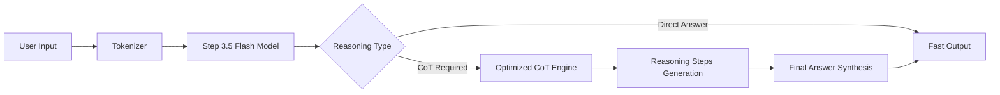

## 서론

실시간 금융 트레이딩 시스템이나 고객 응대 챗봇을 운영하는 엔지니어라면 한 번쯤은 딜레마에 빠집니다. 복잡한 논리적 추론이 필요한 질문에는 GPT-4급의 대규모 모델(Large Model)을 사용해야 정답에 가까운 답변을 얻을 수 있지만, 그렇게 하면 추론 지연 시간(Latency)이 급증해 사용자 경험을 해치게 됩니다. 반면, 응답 속도를 높이기 위해 경량화된 모델(Small Model)을 사용하면, 답변의 정확도가 떨어지거나 멍청한 답변을 내놓는 '환각' 현상에 직면하기 일쑤입니다.

이러한 **'지능(Inference)과 속도(Speed)의 트레이드오프'**는 실무 MLOps 환경에서 가장 해결하고 싶은 숙제였습니다. Stepfun에서 공개한 **Step 3.5 Flash**는 바로 이 지점을 타깃으로 설계된 모델입니다. 단순히 파라미터 수를 줄여 속도를 높이는 것이 아니라, **Deep Reasoning(심층 추론)** 능력을 유지하면서도 추론 속도를 극대화하도록 아키텍처가 최적화되어 있습니다. 이 글에서는 Step 3.5 Flash가 어떻게 빠른 속도와 높은 추론 능력을 동시에 달성했는지 그 기술적 원리와 실무 적용 방안을 심층적으로 분석합니다.

## 본론

### 기술적 배경 및 아키텍처 원리

Step 3.5 Flash의 핵심은 경량화된 아키텍처 설계와 추론 최적화 기술에 있습니다. 일반적인 대규모 언어 모델(LLM)이 방대한 지식을 저장하기 위해 거대한 매트릭스 연산을 수행하는 반면, Step 3.5 Flash는 추론(Reasoning)에 특화된 구조적 효율성을 추구합니다.

특히 이 모델은 **Chain-of-Thought (CoT)** 방식의 추론을 수행할 때 발생하는 연산 병목을 줄이는 데 주력했습니다. CoT는 모델이 답변에 도달하기 전에 중간 과정을 단계적으로 생성하는 기법으로, 정확도를 높이는 데 필수적이지만 생성해야 할 토큰 수가 늘어나 지연 시간이 길어지는 원인이 되기도 합니다. Step 3.5 Flash는 Attention 메커니즘과 KV Cache 관리를 최적화하여, 이러한 장면 생성 과정에서의 메모리 접근 비용을 획기적으로 줄였습니다.

아래 다이어그램은 Step 3.5 Flash의 추론 최적화 과정을 단순화하여 나타낸 것입니다.



이와 같은 설계는 모델이 단순한 팩트 검색이 아닌, 복잡한 논리적 비교나 수학적 계산이 필요한 'Deep Reasoning' 작업을 수행할 때도 빛을 발합니다. 기존 오픈소스 모델들이 복잡한 질의를 받으면 연산 과정에서 긴 정지 시간을 갖는 것과 달리, 이 모델은 실시간으로 흐름을 유지하며 답변을 생성합니다.

### 성능 비교 및 실무 유용성

Step 3.5 Flash의 경쟁력은 성능 벤치마크에서 명확히 드러납니다. 특히 추론 능력을 평가하는 GSM8K(수학 문제 해결)나 MMLU(다분야 지식) 같은 데이터셋에서, 자신보다 훨씬 큰 파라미터를 가진 모델들과 비교해도 손색없는 성능을 보여줍니다.

다음은 일반적인 경량 모델(7B 급)과 Step 3.5 Flash의 특성을 비교한 표입니다.

| 비교 항목 | 일반적인 7B 경량 모델 | Step 3.5 Flash |
| :--- | :--- | :--- |
| **주 목적** | 일반적인 텍스트 생성 및 질의응답 | **Deep Reasoning** 및 고속 추론 |
| **CoT 성능** | 중간 단계에서 논리적 오류 빈발 | **단계별 추론의 정합성 우수** |
| **추론 속도 (Latency)** | 보통 (수식 처리 시 급격히 감소) | **초고속 (Reasoning 최적화)** |
| **운영 비용** | 저렴하지만 재시도(Retry) 비용 발생 | **저렴하고 1회 수신율 높음** |
| **추천 케이스** | 단순 요약, 감정 분석 | **복잡한 로직 처리, 실시간 의사결정 지원** |

이 표에서 알 수 있듯이, Step 3.5 Flash는 단순히 "빠른" 모델이 아닙니다. "생각할 때도 느려지지 않는" 모델입니다. 이는 실제 서비스 환경에서 사용자가 긴 호흡의 질문을 던졌을 때, 답답한 로딩 시간 없이 즉각적이고 논리적인 피드백을 제공할 수 있음을 의미합니다.

### 구현 가이드: PyTorch를 이용한 추론

이제 실제 코드를 통해 Step 3.5 Flash를 어떻게 사용하는지 살펴보겠습니다. 아래 예제는 Hugging Face `transformers` 라이브러리를 사용하여 모델을 로드하고, 복잡한 추론 질문을 수행하는 과정을 보여줍니다. 이 코드는 모델이 Deep Reasoning을 수행하는 과정을 가시화하는 것을 목표로 합니다.

```python
import torch
from transformers import AutoTokenizer, AutoModelForCausalLM

def run_inference(model_name, prompt):
    # 1. 토크나이저 및 모델 로드 (GPU 활용 권장)
    tokenizer = AutoTokenizer.from_pretrained(model_name)
    model = AutoModelForCausalLM.from_pretrained(
        model_name, 
        torch_dtype=torch.float16, 
        device_map="auto"
    )

    # 2. 입력 전처리
    inputs = tokenizer(prompt, return_tensors="pt").to(model.device)

    # 3. 추론 수행 (샘플링 파라미터 조정을 통한 정확도 확보)
    with torch.no_grad():
        outputs = model.generate(
            **inputs,
            max_new_tokens=512,
            temperature=0.1,     # 낮은 온도로 결정적 답변 유도
            top_p=0.9,
            do_sample=True,
            eos_token_id=tokenizer.eos_token_id
        )

    # 4. 결과 디코딩
    generated_text = tokenizer.decode(outputs[0], skip_special_tokens=True)
    return generated_text

# 실행 예시: 복잡한 논리적 추론이 필요한 프롬프트
if __name__ == "__main__":
    model_id = "stepfun-ai/Step-3.5-Flash" # 실제 리포지토리 ID로 대체 필요
    
    reasoning_prompt = """
    Q: 시장에 참여하는 기업 A, B, C가 있습니다. 
    A의 점유율은 40%이며 매년 5%씩 성장합니다. 
    B의 점유율은 30%이며 매년 2%씩 감소합니다. 
    C의 점유율은 나머지이며 변동이 없습니다.
    3년 뒤, 기업 A의 점유율이 B보다 얼마나 더 높게 되는지 단계적으로 계산하고 설명하세요.
    
    A:
    """
    
    print("Step 3.5 Flash Inference Start...")
    result = run_inference(model_id, reasoning_prompt)
    print("-" * 30)
    print(result)
    print("-" * 30)
```

이 코드는 `temperature=0.1`과 같은 낮은 샘플링 온도를 사용하여, 수학적 계산이나 논리적 비교가 필요한 Deep Reasoning 작업에서 모델이 최대한 사실에 기반하여 답변하도록 유도합니다.

### MLOps 파이프라인 최적화 전략

Step 3.5 Flash를 실제 프로덕션 환경에 배포할 때 고려해야 할 MLOps 전략은 다음과 같습니다.

1.  **양자화 (Quantization) 적용**: FP16이나 BF16 혼합 정밀도로 학습되었지만, 추론 시 **AWQ(Activation-aware Weight Quantization)**나 **GPTQ**를 적용하여 4-bit 또는 8-bit로 양자화하면, 메모리 사용량을 절반 이상 줄이면서도 추론 성능의 저하는 거의 없습니다.
2.  **배치 처리 (Batching)**: vLLM이나 TGI(Text Generation Inference)와 같은 추론 서버를 활용할 때, **Continuous Batching** 기능을 켜면 동시에 들어오는 여러 요청을 효율적으로 처리하여 초당 처리량(TPS)을 극대화할 수 있습니다. Step 3.5 Flash는 빠른 응답 속도가 특징이므로, 배치 처리를 통해 하드웨어利用率을 높이는 것이 중요합니다.
3.  **KV Cache 관리**: 롱텍스트(Long-context) 추론이 필요한 경우, PagedAttention과 같은 기술을 사용하여 메모리 파편화를 방지해야 합니다.

## 결론

Step 3.5 Flash는 "오픈소스 모델은 상업용 폐쇄 모델보다 느릴 수밖에 없다"는 통념을 깬 중요한 사례입니다. **Deep Reasoning**이라는 고난도 과제를 **초고속 솔루션**으로 해결한 이 모델은, 비용 민감도가 높은 스타트업부터 대규모 트래픽을 처리하는 엔터프라이즈까지 폭넓게 활용될 수 있습니다.

전문가의 관점에서 볼 때, 이 모델의 등장은 LLM 시장이 '단순히 큰 모델'에서 '얼마나 효율적으로 추론하는가'로 관심사가 이동하고 있음을 시사합니다. 특히 CoT와 같은 추론 기법이 실시간 서비스의 필수 요소가 되어가는 현시점에서, Step 3.5 Flash와 같은 최적화된 아키텍처는 향후 LLM 서비스의 표준이 될 가능성이 높습니다.

개발자들은 이제 단순히 파라미터 수에 현혹되지 말고, 자신의 서비스 도메인에 필요한 추론의 깊이와 허용 가능한 지연 시간을 저울질하여 이러한 특화된 모델들을 도입하는 전략이 필요합니다.

### 참고자료

- [Step 3.5 Flash 공식 블로그 및 릴리즈 노트](https://static.stepfun.com/blog/step-3.5-flash/)

- Hugging Face Transformers Documentation

- vLLM: Easy, Fast, and Cheap LLM Serving with PagedAttention
