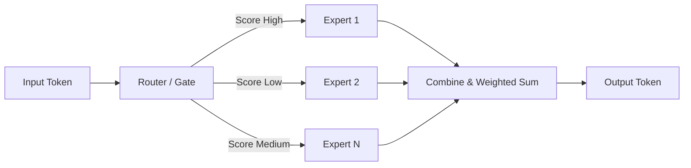

## 서론

최근 생성형 AI를 활용한 실시간 서비스를 개발하는 과정에서 우리는 항상 딜레마에 직면합니다. 사용자 경험을 위해 "초고속 응답 속도"는 필수적이지만, 복잡한 추론이나 긴 문맥 이해를 위해서는 거대한 모델 용량이 필요하기 때문입니다. 전통적인 Dense 모델(예: Llama-3-70B)은 압도적인 성능을 제공하지만, 모든 토큰 생성마다 전체 파라미터를 연산해야 하므로 지연 시간(Latency)이 큽니다. 반면 소형 모델(예: Llama-3-8B)은 빠르지만 복잡한 작업에서는 성능이 저하되곤 합니다.

이러한 **"성능 vs 속도"의 트레이드오프**를 깬 기술이 바로 **Mixture of Experts (MoE)**입니다. 최근 발표된 **Step 3.5 Flash**는 이 MoE 구조를 극한으로 최적화하여, 1960억 개의 거대한 지식 저장소를 가지고 있으면서도 추론 시에는 단 110억 개의 파라미터만 활성화하여 초당 최대 350토큰이라는 경이적인 속도를 냅니다. 이 글에서는 Step 3.5 Flash가 어떻게 이러한 효율성을 달성했는지 그 기술적 원리와 구현, 그리고 실무 적용 방안을 심도 있게 다루겠습니다.

## 본론

### Mixture of Experts (MoE)의 원리와 Step 3.5 Flash의 접근

MoE의 핵심 아이디어는 단일 모델이 모든 작업을 처리하는 대신, 여러 개의 전문가(Expert) 네트워크를 두고 **라우터(Router, Gating Network)**가 각 토큰에 가장 적합한 전문가를 선택하여 처리하게 하는 것입니다.

기존의 Dense 모델이 모든 레이어의 가중치를 통과한다면, MoE 모델은 라우터에 의해 선택된 일부 레이어(Expert)만 통과하면 됩니다. Step 3.5 Flash는 총 196B(1960억) 파라미터 중에서 추론 시 단 11B(110억)의 파라미터만 활성화하는 **희소 활성화(Sparse Activation)** 방식을 채택했습니다. 이는 실제 연산량은 소형 모델 수준으로 유지하면서, 모델이 지닌 총 지식 용량은 초거대 모델 수준으로 끌어올리는 설계입니다.

다음은 MoE 레이어 내부에서 토큰이 처리되는 간단한 과정을 시각화한 다이어그램입니다.



### 기술적 깊이: 라우팅 메커니즘과 로드 밸런싱

MoE 모델의 성능을 결정짓는 가장 중요한 요소는 **라우터**입니다. 라우터는 입력 토큰을 받아 각 전문가에게 할당할 확률 분포를 출력합니다. 이때 단순히 가장 점수가 높은 전문가 하나만 선택하는 것이 아니라, 상위 K개의 전문가(Top-K routing)를 선택하여 그 결과를 가중합(Weighted Sum)하는 것이 일반적입니다.

하지만 여기에는 **"전문 남용(Token Dropping)"**과 **"로드 밸런싱(Load Balancing)"**이라는 중요한 문제가 있습니다. 특정 전문가가 매우 뛰어나다고 판단되어 라우터가 항상 그 전문가에게만 토큰을 보낸다면, 해당 전문가는 병목 현상(Bottleneck)을 일으키고 다른 전문가는 놀게 됩니다. 이는 병렬 처리 효율을 떨어뜨립니다.

이를 해결하기 위해 학습 과정에서는 **보조 손실(Auxiliary Loss)**을 추가하여 각 전문가가 거의 균등하게 토큰을 받도록 강제합니다. Step 3.5 Flash는 이러한 최적화된 라우팅 전략을 통해 350 tok/s라는 압도적인 처리 속도를 실현했습니다. 특히 256k 토큰이라는 긴 컨텍스트 윈도우를 처리할 때도 이러한 효율성은 더욱 빛을 발합니다.

### 성능 비교 및 검증

단순히 빠른 것만으로는 부족합니다. SWE-bench Verified와 같은 실제 코딩 벤치마크에서의 성능이 검증되어야 실무에서 사용할 수 있습니다. SWE-bench는 실제 오픈소스 프로젝트의 GitHub 이슈와 해결 코드를 기반으로 모델의 코딩 능력을 평가하는 난이도 높은 데이터셋입니다.

아래 표는 Step 3.5 Flash와 일반적인 Dense 모델들의 추론 효율성과 성능 지표를 비교한 것입니다.

| 비교 항목 | 일반적인 Dense 70B 모델 | 일반적인 Dense 8B 모델 | Step 3.5 Flash (MoE) | | :--- | :--- | :--- | :--- | | **총 파라미터** | 70B | 8B | 196B | | **활성화 파라미터** | 70B (100%) | 8B (100%) | 11B (~5.6%) | | **생성 속도 (Peak)** | ~50 tok/s | ~120 tok/s | **350 tok/s** | | **컨텍스트 윈도우** | 32k ~ 128k | 32k ~ 128k | **256k** | | **SWE-bench Verified** | ~60% ~ 65% | ~30% ~ 40% | **74.4%** |

표에서 알 수 있듯이, Step 3.5 Flash는 활성화 파라미터 기준으로는 8B 모델과 유사한 연산량을 가지지만, SWE-bench 점수는 70B 모델을 상회하는 성능을 보여줍니다. 이는 "거대한 지식"을 필요한 순간에만 "집중적으로" 꺼내 쓴다는 MoE의 강점을 증명합니다.

### PyTorch를 이용한 간단한 MoE 레이어 구현

MoE의 작동 방식을 명확히 이해하기 위해, PyTorch로 간단하게 구현해 보겠습니다. 실제 Step 3.5 Flash는 훨씬 복잡한 최적화되어 있겠지만, 핵심 메커니즘은 아래 코드와 같습니다.

```python
import torch
import torch.nn as nn
import torch.nn.functional as F

class ExpertLayer(nn.Module):
    def __init__(self, input_dim, hidden_dim):
        super().__init__()
        self.net = nn.Sequential(
            nn.Linear(input_dim, hidden_dim),
            nn.ReLU(),
            nn.Linear(hidden_dim, input_dim)
        )

    def forward(self, x):
        return self.net(x)

class SparseMoE(nn.Module):
    def __init__(self, input_dim, num_experts, top_k=2):
        super().__init__()
        # 라우터(Gate): 토큰이 어떤 전문가에게 갈지 결정
        self.router = nn.Linear(input_dim, num_experts)
        # 전문가(Experts)들
        self.experts = nn.ModuleList([ExpertLayer(input_dim, input_dim * 4) for _ in range(num_experts)])
        self.top_k = top_k

    def forward(self, x):
        # x: [batch_size, seq_len, input_dim]
        batch_size, seq_len, input_dim = x.shape
        x_flat = x.view(-1, input_dim) # [batch_size * seq_len, input_dim]

        # 1. 라우터 점수 계산
        logits = self.router(x_flat) # [batch_size * seq_len, num_experts]
        
        # 2. Top-K 전문가 선택 및 Softmax 가중치 계산
        topk_weights, topk_indices = torch.topk(logits, self.top_k, dim=-1)
        topk_weights = F.softmax(topk_weights, dim=-1)

        # 3. 선택된 전문가들에게 연산 분산 (간단화를 위해 루프 사용, 실제는 병렬화 필요)
        final_hidden_states = torch.zeros_like(x_flat)
        
        for i in range(self.top_k):
            expert_idx = topk_indices[:, i] # 각 토큰이 선택한 i번째 전문가 인덱스
            weight = topk_weights[:, i].unsqueeze(-1) # 가중치
            
            # 배치 내 모든 토큰에 대해 해당 전문가 연산 수행 (비효율적이지만 이해를 위해)
            # 실제 구현에서는 grouped_gemm 등을 사용하여 효율적으로 뽑아서 연산함
            for expert_id in range(len(self.experts)):
                # 현재 expert_id에 할당된 토큰만 마스킹
                mask = (expert_idx == expert_id)
                if mask.sum() > 0:
                    expert_input = x_flat[mask]
                    expert_output = self.
```

```python
experts[expert_id](expert_input)
                    final_hidden_states[mask] += weight[mask] * expert_output

        return final_hidden_states.view(batch_size, seq_len, input_dim)

# 사용 예시
moe_layer = SparseMoE(input_dim=512, num_experts=8, top_k=2)
input_tensor = torch.randn(2, 10, 512) # 배치 2, 시퀀스 10
output = moe_layer(input_tensor)
print(output.shape)
```

### 실무 적용 가이드 및 팁

Step 3.5 Flash와 같은 MoE 모델을 실제 서비스에 배포할 때는 몇 가지 주의사항이 필요합니다.

1.  **VRAM 용량 관리**:     *   **Total Params** vs **Active Params**: 추론 시 연산량은 11B분이지만, 모든 196B 파라미터는 GPU 메모리(VRAM)에 로드되어 있어야 합니다. 따라서 단순히 11B 모델 돌리는 것보다 훨씬 큰 VRAM(예: A100 80GB 1~2장 이상)이 필요할 수 있습니다.     *   **양자화(Quantization)**: 8비트 또는 4비트 양자화를 적용하면 VRAM 사용량을 크게 줄이면서도 성능 저하를 최소화할 수 있습니다.

2.  **추론 프레임워크 최적화**:     *   MoE 모델은 연산 패턴이 불규칙하기 때문에 vLLM, TensorRT-LLM과 같은 최신 추론 엔진에서 **PagedAttention**이나 **Expert Parallelism** 기능을 활성화하는 것이 필수적입니다. 이를 통해 전문가 간의 스케줄링 오버헤드를 줄여야 350 tok/s 속도를 달성할 수 있습니다.

3.  **Long Context 활용**:     *   256k 컨텍스트는 긴 문서 요약, 대규모 코드베이스 분석에 유리합니다. 프롬프트 엔지니어링 시 RAG(Retrieval-Augmented Generation)와 결합하여 방대한 지식을 컨텍스트에 담아 전달하면 MoE의 추론 능력을 극대화할 수 있습니다.

## 결론

Step 3.5 Flash는 단순히 파라미터 수를 늘리는 "스케일링의 법칙(Scaling Laws)"을 넘어, 효율적인 아키텍처 설계가 얼마나 중요한지를 보여주는 사례입니다. 196B의 거대한 지식 베이스를 유지하면서도, 필요한 순간에만 11B를 꺼내 쓰는 **희소성(Sparsity)**의 힘을 입증했습니다.

특히 SWE-bench Verified에서 74.4%라는 압도적인 점수를 기록하며, 코딩과 같은 복잡한 추론 작업에서도 속도를 타협하지 않고 성능을 유지할 수 있음을 증명했습니다. 향후 LLM 시장은 단순히 모델의 크기보다, **얼마나 효율적으로 파라미터를 활용하느냐**와 **얼마나 빠르게 응답하느냐**가 경쟁의 핵심이 될 것입니다. Step 3.5 Flash는 그 새로운 기준을 제시한 모델이라 할 수 있습니다.

## 참고자료

- [Step 3.5 Flash – 고속 추론을 지원하는 오픈소스 LLM (Hada.io)](https://news.hada.io/topic?id=26834)

- "Outrageously Large Neural Networks: The Sparsely-Gated Mixture-of-Experts Layer" (Shazeer et al., 2017)

- "Mixture of Experts Explained" (Hugging Face Blog)
