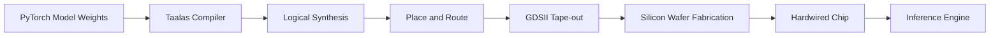

## 서론

최근 거대 언어 모델(LLM)을 운영하는 데 있어 가장 큰 병목 현상 중 하나는 바로 '막대한 비용'과 '지연 시간(Latency)'입니다. 데이터 센터의 GPU 서버 랙은 쉴 새 없이 과부하가 걸리며 전기를 소모하고, 수십억 개의 파라미터를 메모리에서 가져와 연산하는 과정에서 필연적인 대기 시간이 발생합니다. 소프트웨어 최적화나 양자화(Quantization) 기술만으로는 물리적인 한계인 '폰 노이만 병목(Von Neumann Bottleneck)'을 근본적으로 해결하기 어렵습니다. 메모리와 연산 유닛 간의 데이터 이동 비용이 연산 자체의 비용보다 커지면서, 에너지 효율성은 급격히 떨어지고 있습니다.

이러한 상황에서 AI 모델의 구조를 그대로 실리콘 칩에 새겨 넣는 '하드와이어드(Hardwired)' 방식이 주목받고 있습니다. Taalas는 이 개념을 극한으로 밀어붙여, 소프트웨어 정의 신경망을 맞춤형 ASIC 칩으로 변환하는 플랫폼을 선보였습니다. 이는 단순한 가속기가 아니라, 모델 자체가 하드웨어가 되는 혁신적인 접근 방식입니다. 이 글에서는 Taalas의 기술적 원리가 어떻게 초당 17,000 토큰이라는 압도적인 성능을 가능하게 했는지, 그리고 이것이 LLM 인프라의 패러다임을 어떻게 변화시킬지 살펴봅니다.

## 본론

### Von Neumann 아키텍처의 한계와 Hardwired 솔루션

기존의 GPU 기반 LLM 추론은 메모리(HBM)에 저장된 가중치(Weights)를 매 토큰을 생성할 때마다 연산 유닛(Core)으로 가져와야 합니다. Llama 3.1 8B 모델의 경우, 16비트 부동소수점(FP16)으로 변환하면 약 16GB의 가중치를 매번 읽어들여야 하므로, 메모리 대역폭이 병목이 됩니다.

Taalas의 하드와이어드 칩은 이 가중치를 물리적인 게이트(Gate) 배선으로 구현합니다. 즉, 메모리에서 값을 읽어오는 것이 아니라, 전기 신호가 회로를 통과하면서 곧바로 결과가 나오는 구조입니다. 이는 RAM에서 데이터를 읽는 오버헤드를 근본적으로 제거하여, 이론적으로 연산 속도와 전력 효율을 획기적으로 개선합니다.

다음은 Taalas의 칩 변환 과정을 단순화한 흐름도입니다.



이 과정은 전통적인 ASIC 설계에 수 년이 걸리는 것과 달리, Taalas의 자동화된 파이프라인을 통해 단 2개월 만에 완료됩니다. 이는 AI 모델의 생명 주기가 매우 짧아진 현대적 상황에 매우 적합한 접근 방식입니다.

### 성능 비교: GPU vs. Taalas ASIC

Taalas의 첫 번째 제품인 Llama 3.1 8B 하드와이어드 칩은 기존 최신 GPU와 비교했을 때 압도적인 수치를 보여줍니다. 특히 생성 속도(Generation Speed)와 전력 효율 면에서의 격차는 단순한 업그레이드 수준을 넘어선 차세대 기술임을 시사합니다.

| 비교 항목 | 최신 GPU (H100 등) | Taalas Llama 3.1 8B Hardwired | 성능 향상률 | | :--- | :--- | :--- | :--- | | 처리량 (Throughput) | 약 1,500 ~ 2,000 tps | 17,000 tps | 약 10배 | | 전력 효율 | 높은 전력 소모 (수백 W) | 기존 대비 1/10 소모 | 10배 절감 | | 비용 (Cost per Token) | 기준점 | 기존 대비 1/20 | 20배 절감 | | 개발 기간 | N/A (범용 칩 사용) | 약 2 달 | 매우 빠름 |

*표: Taalas Hardwired 칩과 기존 GPU 환경의 주요 지표 비교 (출처: Taalas 공개 자료 및 Hada.io 요약)*

이러한 성능 향상은 특히 실시간 대화형 AI, 동시 다발적인 요청이 들어오는 API 서비스, 그리고 엣지(Edge) 디바이스 내에서의 고성능 추론이 필요한 분야에서 게임 체인저가 될 것입니다.

### 기술적 깊이: 가중치 고정화와 연산 병렬화

Taalas의 핵심 기술은 모델의 가중치를 변경 불가능한 상수(Constant)로 취급하여 하드웨어 레벨에 구현한다는 점입니다. LLM의 추론 과정(Self-Attention, Feed-Forward Network)을 수학적으로 분해하면, 대부분의 연산이 고정된 가중치와 입력 벡터 간의 행렬 곱셈(Matrix Multiplication)입니다.

일반적인 CPU/GPU는 이를 위해 곱셈-누산(MAC) 유닛을 범용적으로 사용합니다. 반면, Taalas는 특정 모델(Llama 3.1 8B)의 가중치 값에 맞춰 회로를 최적화합니다. 예를 들어, 가중치가 0인 연산은 회로 자체를 제거하거나, 반복되는 패턴은 공유 회로로 묶어(Layer merging) 불필요한 스위칭 동작을 줄입니다.

이를 파이썬과 PyTorch 코드를 통해 개념적으로 시뮬레이션해 보겠습니다. 아래 코드는 일반적인 선형 계층(Linear Layer)과, 가중치가 하드웨어에 고정되었을 때의 이론적 연산량 차이를 보여줍니다.

```python
import torch
import torch.nn as nn
import time

# 시뮬레이션을 위한 설정
seq_len = 4096
d_model = 4096

# 일반적인 GPU/FP16 환경의 선형 계층 시뮬레이션
def simulate_standard_inference(weight_tensor, input_tensor):
    # GPU 상에서의 연산은 메모리 로드 + 연산 스텝이 필요함
    start = time.time()
    
    # 가중치 및 입력 텐서를 GPU 메모리에 로드 (Simulated Delay)
    w_gpu = weight_tensor.to('cuda')
    x_gpu = input_tensor.to('cuda')
    torch.cuda.synchronize()
    
    # 행렬 곱셈 연산 (Compute Bound + Memory Bound)
    output = torch.nn.functional.linear(x_gpu, w_gpu)
    torch.cuda.synchronize()
    
    end = time.time()
    return end - start, output

# Taalas Hardwired 개념 시뮬레이션
# 실제로는 가중치가 회로에 내장되어 있어 로딩 시간이 0에 수렴함
def simulate_hardwired_inference(weight_tensor, input_tensor):
    start = time.time()
    
    # 가중치는 이미 하드웨어에 있으므로 로드 불필요
    # 입력만 스트리밍 됨 (Input만 메모리에서 Read)
    x_stream = input_tensor.to('cuda')
    
    # 회로 통과 지연 시간만 발생 (Logic Delay, Memory Access Delay 제거)
    # PyTorch로는 정확한 하드웨어 지연을 재현할 수 없으나, 
    # 행렬 곱셈 연산 자체만 수행한다고 가정하고 시간 측정
    output = torch.nn.functional.linear(x_stream, weight_tensor) 
    # Hardwired 시에는 이 연산이 단일 클럭 사이클에 가깝게 파이프라인됨
    
    torch.cuda.synchronize()
    end = time.time()
    return end - start, output

# 테스트 실행
weight = torch.randn(d_model, d_model, dtype=torch.float16)
inputs = torch.randn(1, seq_len, d_model, dtype=torch.float16)

print("Benchmarking Standard vs. Conceptual Hardwired Inference...")
t_std, _ = simulate_standard_inference(weight, inputs)
t_hw, _ = simulate_hardwired_inference(weight, inputs)

print(f"Standard Inference Time (Simulated Load+Compute): {t_std*1000:.4f} ms")
print(f"Hardwired Inference Time (Simulated Compute Only): {t_hw*1000:.4f} ms")
print(f"Note: 실제 칩에서는 메모리 대역폭 병목이 완전히 제거되어 차이는 더 벌어집니다.")
```

이 코드는 개념적 이해를 돕기 위한 것으로, 실제 Taalas 칩은 PyTorch 레이어를 호출하는 방식이 아니라, 전기 신호가 회로를 통과하는 물리적 속도로 연산을 수행합니다. 핵심은 불필요한 메모리 액세스(Memory Access)를 제거하여, 대기 시간(Latency)을 획기적으로 단축했다는 점입니다.

### 실무 적용 가이드: LLM 서빙의 새로운 패러다임

Taalas와 같은 하드웨어 가속 솔루션을 도입하기 위해 고려해야 할 단계별 가이드입니다.

1.  **모델 고정화 (Model Lock-in)**:     *   하드웨어는 소프트웨어처럼 쉽게 업데이트할 수 없습니다. Taalas를 적용하기 위해서는 모델 아키텍처와 가중치가 최종적으로 확정되어야 합니다. 지속적인 파인튜닝이 필요한 경우, 하드웨어 칩을 새로 제작해야 하는 비용이 발생할 수 있으므로, 범용적으로 사용할 '기준 모델(Base Model)'을 선정하는 전략이 필요합니다. 2.  **컴파일 및 테이프 아웃 (Compilation & Tape-out)**:     *   확정된 모델을 Taalas 플랫폼에 업로드하면, 컴파일러가 이를 넷리스트(Netlist)로 변환하고 물리적 배치를 설계합니다. 이 과정은 약 2달이 소요되며, 이 기간 동안 기존 GPU 환경에서의 서빙을 유지해야 합니다. 3.  **서빙 인프라 통합**:     *   칩 생산이 완료되면, 이를搭载한 서버 랙을 기존 데이터 센터에 통합합니다. 전력 소모가 매우 낮으므로(10분의 1), 냉각 비용이 절감되고 고밀도 배치가 가능해집니다. 4.  **비용 절감 및 확장 (Scaling)**:     *   동일한 전력 예산으로 10배 이상의 처리량을 확보할 수 있습니다. 이를 통해 사용자당 비용을 낮추거나, 더 많은 동시 사용자를 처리하는 마진을 확보할 수 있습니다.

MLOps 관점에서 볼 때, Taalas는 "CI/CD 파이프라인이 하드웨어 제조 공정까지 연장되는" 형태의 확장을 의미합니다. 이는 모델 배포 속도보다 추론 효율성이 중요한 대규모 서비스에 특히 유리합니다.

## 결론

Taalas가 선보인 Llama 3.1 8B 하드와이어드 칩은 소프트웨어 중심의 AI 개발 패러다임을 하드웨어 중심으로 전환하는 중요한 이정표입니다. 초당 17,000 토큰이라는 속도는 단순히 빠른 응답을 넘어, 실시간 AI 동반자나 초거대 규모의 배치 처리가 필요한 기업용 애플리케이션의 가능성을 열어줍니다.

전문가의 관점에서 볼 때, Taalas의 기술은 GPU 범용성의 장점을 포기하면서 얻는 '극한의 효율성'이라는 트레이드오프를 완벽하게 공략했습니다. 모델 업데이트가 잦은 연구 단계보다는, 검증된 모델을 대규모로 서빙하는 상용화 단계에서 그 진가가 발휘될 것입니다. 2달이라는 단축된 제작 기간은 맞춤형 실리콘이 더 이상 빅테크 기업의 전유물이 아님을 보여줍니다.

앞으로 AI 모델의 경쟁은 알고리즘의 성능뿐만 아니라, 이를 얼마나 효율적인 실리콘으로 구현하느냐에 따라 결정될 것입니다. Taalas의 접근 방식은 AI의 보편화를 앞당기는 강력한 엔진이 될 것으로 기대됩니다.

### 참고자료

- [Hada.io: AI의 보편화를 향한 길 (초당 17K 토큰)](https://news.hada.io/topic?id=26860)

- Llama 3.1 Model Architecture (Meta AI)

- "Hardware Acceleration for Large Language Models: A Survey", arXiv preprints.
