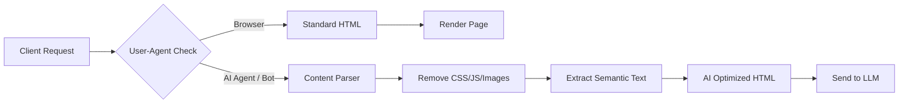

## 서론

최근 생성형 AI(Generative AI)와 LLM(Large Language Model) 기반 에이전트가 웹 상의 정보를 직접 탐색하며 작업을 수행하는 경우가 급증하고 있습니다. 하지만 이 과정에서 치명적인 비효율성이 발생합니다. AI 에이전트가 특정 웹사이트에서 정보를 추출하기 위해 요청을 보낼 때, 서버는 현대적인 웹 브라우저를 위한 완벽한 HTML 문서를 전송합니다. 여기에는 인간에게 시각적인 즐거움을 주는 CSS 스타일시트, 복잡한 자바스크립트 인터랙션, 고해상도 이미지, 광고 트래커 등이 포함되어 있습니다.

문제는 이러한 데이터 대부분이 연산 능력이 있는 뇌가 아닌, 텍스트를 토큰 단위로 처리하는 LLM에게는 '잡음(Noise)'에 불과하다는 점입니다. 예를 들어, 500KB에 달하는 HTML 문서를 AI 에이전트가 수집한다고 가정해 봅시다. 이를 토큰으로 환산하면 수십만 토큰에 달할 수 있으며, 이는 곧 엄청난 추론 비용과 지연 시간(Latency)으로 직결됩니다. LLM의 컨텍스트 윈도우(Context Window)는 비싼 자원입니다. 우리는 AI 에이전트를 위해 인간 중심의 웹을 '기계 중심'의 웹으로 최적화할 필요가 있습니다. 이번 글에서는 Vercel이 제시한 웹페이지 페이로드 최적화 전략을 분석하고, 이를 통해 어떻게 토큰 비용을 획기적으로 절감할 수 있는지 기술적으로 깊이 있게 다루겠습니다.

## 본론

### 기술적 배경: LLM과 웹 콘텐츠의 구조적 불일치

현대 웹 개발은 'User Experience(UX)'에 극도로 최적화되어 있습니다. React, Vue 같은 프레임워크로 빌드된 SPA(Single Page Application)는 초기 로딩 시 방대한 JavaScript 번들을 내려줍니다. 하지만 LLM 입장에서 `<div class="flex-container text-blue-500 animate-pulse">`와 같은 클래스 네이밍이나 인라인 스타일은 의미를 갖지 못합니다. LLM에게 중요한 것은 오직 **의미론적 구조(Semantic Structure)**와 **순수 텍스트 정보**입니다.

Vercel의 접근법은 아주 단순하지만 강력합니다. **"AI 에이전트에게는 기계가 읽기 좋은 버전의 페이지를 따로 제공하자"**입니다. 이를 통해 데이터 전송량을 기존 500KB에서 2KB 수준으로 99.6% 이상 감소시킬 수 있습니다. 이는 단순히 네트워크 트래픽을 줄이는 것을 넘어, LLM이 유효한 토큰(Context)을 더 많이 확보할 수 있게 하여 추론의 정확도를 높이는 부수적인 이점까지 제공합니다.

### 아키텍처: AI-Optimized Routing

이 최적화의 핵심은 요청을 보내는 클라이언트가 '사람'인지 'AI 에이전트'인지를 식별하고, 그에 따라 다른 렌더링 파이프라인을 거치게 하는 것입니다. Vercel의 인프라와 같은 엣지 컴퓨팅 환경에서는 이를 아주 낮은 지연 시간으로 처리할 수 있습니다.

다음은 이 처리 과정을 간소화한 흐름도입니다.



위 다이어그램에서 볼 수 있듯이, 일반 브라우저 요청은 기존의 풍부한 HTML(C)을 받지만, AI 에이전트로 식별되는 요청은 파싱 및 정제 과정(D, F, G)을 거쳐 극도로 압축된 AI 최적화 HTML(H)을 전달받습니다. 이 과정에서 LLM은 불필요한 토큰 소모를 막고 핵심 콘텐츠에 집중할 수 있습니다.

### 성능 비교: Standard Web vs. AI-Optimized Web

이 최적화가 실제 메트릭에 어떤 영향을 미치는지 비교해 보겠습니다. 토큰 절감은 곧 비용 절감과 속도 향상을 의미합니다.

| 비교 항목 | 기존 웹 페이지 (Standard) | AI 최적화 페이지 (Optimized) | 개선 효과
|:--- | :--- | :--- | :---
|**평균 페이지 크기** | ~500 KB | ~2 KB | **약 250배 감소**
|**불필요 요소** | CSS, JS, SVG, Icons, Ads | 전부 제거 (Pure Text) | 잡음 제거
|**토큰 수량 (추정)** | ~100,000+ Tokens | ~500 Tokens | 컨텍스트 효율 극대화
|**처리 시간 (Latency)** | 네트워크 전송 + 렌더링 지연 | 즉시 전송 및 파싱 | 실시간 대화 성능 향상
|**주요 용도** | 시각적 컨슈머 서비스 | RAG, Agent Crawling, Summarization | 용도별 특화 |

### 구현 가이드: 파이썬으로 AI용 웹 스크래퍼 구현하기

실무에서 우리가 직접 웹사이트를 구축하는 것이 아니라, 기존의 웹사이트를 AI 에이전트가 수집할 때 이를 최적화하는 미들웨어를 만들거나 스크래핑 로직을 개선해야 할 수 있습니다. 아래는 Python의 `BeautifulSoup` 라이브러리를 사용하여 복잡한 HTML에서 LLM에 필요한 텍스트만 추출하는 간단한 구현 예제입니다.

이 코드는 CSS, 스크립트, 주석 등을 제거하고 순수한 콘텐츠 트리를 재구성합니다.

```python
from bs4 import BeautifulSoup, Comment
import html2text

def optimize_html_for_ai(html_content: str) -> str:
    """
    AI 에이전트를 위해 HTML에서 불필요한 요소를 제거하고
    텍스트 밀도를 높인 마크다운 또는 순수 텍스트로 변환하는 함수
    """
    soup = BeautifulSoup(html_content, 'html.parser')

    # 1. 제거할 태그 목록 (스크립트, 스타일, nav, footer, header 등)
    for tag in soup(['script', 'style', 'nav', 'footer', 'header', 'aside', 'iframe', 'noscript']):
        tag.decompose()

    # 2. HTML 주석 제거
    for comment in soup.find_all(string=lambda text: isinstance(text, Comment)):
        comment.extract()

    # 3. 불필요한 속성 제거 (class, id, style 등 LLM에 방해되는 시각적 정보)
    # LLM은 시맨틱 태그(h1, p) 자체는 이해하므로 태그 구조는 유지하되 속성은 정리
    for tag in soup.find_all(True):
        tag.attrs = {}

    # 4. 시맨틱 구조를 유지하며 텍스트 변환 (HTML -> Markdown 변환 라이브러리 활용)
    # html2text은 복잡한 HTML을 읽기 쉬운 Markdown으로 변환해주어 LLM 입력으로 적합
    h = html2text.HTML2Text()
    h.ignore_links = False
    h.ignore_images = True
    h.body_width = 0  # 라인 길이 제한 없앰
    
    optimized_content = h.handle(str(soup))
    
    return optimized_content

# 사용 예시
raw_html = """
<html>
    <head><style>body { color: red; }</style></head>
    <body>
        <nav>Menu</nav>
        <article>
            <h1>AI Optimization</h1>
            <p>This is the core content.</p>
        </article>
        <script>console.log('debug');</script>
    </body>
</html>
"""

cleaned_text = optimize_html_for_ai(raw_html)
print(cleaned_text)
```

이 코드를 실행하면, `<style>`, `<script>`, `<nav>` 태그가 모두 사라지고 `<h1>` 제목과 본문 `<p>` 텍스트만 깔끔하게 추출됩니다. 이를 LLM에 입력한다면 글자 수 대비 정보 밀도(Information Density)가 극대화되어 RAG(검색 증강 생성) 성능이 크게 향상됩니다.

### 실무 적용 전략 및 MLOps 고려사항

실제 서비스 환경에서 이를 적용하기 위해서는 단순한 스크래핑 라이브러리 사용을 넘어 시스템 레벨의 접근이 필요합니다.

1.  **User-Agent 헤더 분석**: 요청 헤더의 `User-Agent`를 확인하여 `ChatGPT-User`, `Google-Extended`, `CCBot` 등 알려진 AI 에이전트인지 식별합니다. 2.  **미들웨어 레벨 처리**: Next.js Middleware나 Nginx 레벨에서 에이전트 요청을 감지하고, 별도의 렌더링 함수나 SSG(Static Site Generation) 출력물(plain.json 혹은 stripped.html)으로 라우팅합니다. 3.  **구조화된 데이터 제공 (JSON-LD)**: 가능하다면 단순 텍스트 제거를 넘어, 웹페이지의 핵심 정보를 `application/json` 형태나 `JSON-LD` 형식으로 제공하는 것이 가장 이상적입니다. 이는 LLM이 텍스트를 파싱하며 추론하는 수고를 덜어줍니다. 4.  **캐싱 전략**: AI 에이전트가 자주 방문하는 페이지에 대해 최적화된 버전을 캐싱하여 불필요한 파싱 연산을 반복하지 않도록 합니다.

## 결론

Vercel이 제시한 500KB에서 2KB로의 웹페이지 최적화는 단순한 데이터 압축 기술을 넘어, **"인간을 위한 웹과 기계를 위한 웹의 분리"**라는 새로운 패러다임을 시사합니다. LLM 에이전트의 비용 효율성과 추론 속도는 입력 데이터의 품질에 의해 좌우되며, 불필요한 CSS와 자바스크립트는 LLM에게 독이 됩니다.

연구자 및 엔지니어 관점에서, 이제 우리는 콘텐츠를 생성할 때 독자가 인간인지 기계인지를 고려해야 하는 시대에 접어들었습니다. `html2text`와 같은 라이브러리를 활용한 파이프라인 구축은 LLM 기반 서비스의 운영 비용(OPEX)을 획기적으로 줄이고, 동시에 더 긴 컨텍스트를 활용할 수 있게 합니다. 앞으로는 AI 에이전트가 웹을 탐색할 때, 시각적 요소가 배제된 오직 지성(Intelligence)만을 위한 순수한 데이터 교환(Routing)이 표준이 될 것입니다.

### 참고자료

- [Vercel AI SDK Documentation](https://sdk.vercel.ai/docs)

- [Building AI-Native Web Applications](https://vercel.com/blog)

- html2text GitHub Repository
