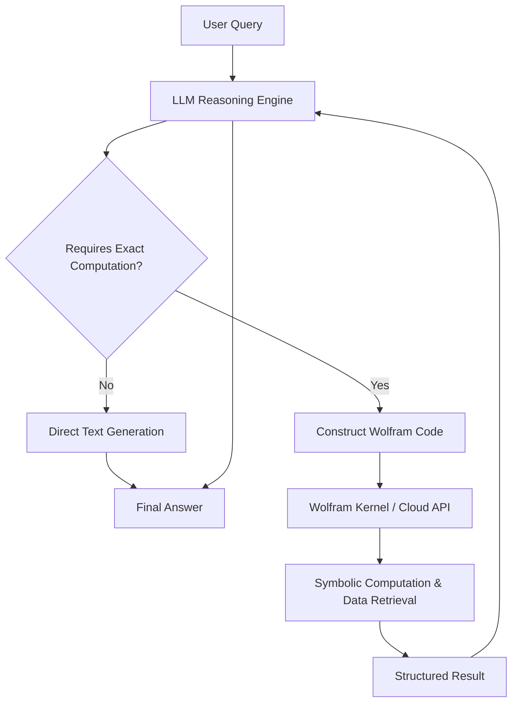

## 서론

최근 생성형 AI 모델들이 놀라운 언어 이해 능력을 보여주고 있지만, 여전히 정량적 계산과 사실적 검증에 있어서는 구조적인 한계를 드러내고 있습니다. 예를 들어, 복잡한 미적분 문제를 풀거나 특정 지역의 인구 통계 데이터를 정확히 인용하라고 요청했을 때, 최신 LLM은 종종 그럴듯하지만 사실이 아닌 답변을 생성하거나(Hallucination), 단순한 산술 오류를 범하기도 합니다. 이는 트랜스포머(Transformer) 아키텍처가 확률적 토큰 예측을 기반으로 하기 때문에, 기호적(Symbolic) 연산과 엄밀한 논리 체계가 요구되는 영역에서 필연적으로 나타나는 '신경망의 한계'입니다.

이러한 문제를 해결하기 위해 연구자들은 LLM에 외부 도구(Tool)를 연결하여 모델의 능력을 확장하는 'Tool-augmented LLM' 패러다임에 주목하고 있습니다. 그중에서도 스티븐 울프람(Stephen Wolfram)이 제안한 **Wolfram Language**를 LLM의 기반 도구(Foundation Tool)로 활용하는 접근법은 매우 독보적입니다. Wolfram Language는 30년 이상 축적된 수학, 과학, 데이터베이스를 기호적으로 계산할 수 있는 완벽한 시스템입니다. LLM의 '직관적 언어 이해 능력'과 Wolfram의 '정교한 기호적 연산 능력'을 결합한다면, 우리는 각 분야의 장점을 극대화하여 신뢰할 수 있는 지능형 에이전트를 구축할 수 있습니다. 이 글에서는 기술적인 관점에서 Wolfram Language가 어떻게 LLM의 취약점을 보완하고, Function Calling 메커니즘을 통해 이 둘이 어떻게 유기적으로 통합될 수 있는지 심도 있게 다루고자 합니다.

## 본론

### LLM과 Wolfram의 만남: Neuro-Symbolic Architecture

LLM과 Wolfram Language의 통합은 단순히 API를 연결하는 것을 넘어, 두 패러다임의 결합을 의미합니다. LLM은 'Subsymbolic(부호적)' 접근 방식을 사용하여 패턴을 인식하는 반면, Wolfram Language는 'Symbolic(기호적)' 접근 방식을 사용하여 수학적이고 논리적인 변환을 수행합니다.

이 아키텍처의 핵심은 **Function Calling**입니다. LLM은 사용자의 질문을 분석하여 스스로 계산해야 할지, 아니면 Wolfram Alpha 혹은 Wolfram Kernel에게 질의해야 할지 판단합니다. 필요한 경우 Wolfram Language 코드를 생성하여 실행하고, 그 결과를 다시 텍스트로 변환하여 사용자에게 전달합니다.

아래는 이 과정을 시각화한 간단한 흐름도입니다.



이 다이어그램에서 볼 수 있듯이, LLM은 컨트롤러(Controller) 역할을 수행하며 Wolfram 시스템은 계산기(Calculator) 및 지식 베이스(Knowledge Base) 역할을 수행합니다. 이를 통해 LLM은 토큰 생성 확률에 의존하지 않고, 검증된 알고리즘에 기반한 정확한 답변을 생성할 수 있게 됩니다.

### 기술적 구현: Function Calling과 Wolfram API

실제 구현에서는 OpenAI의 GPT나 Anthropic의 Claude와 같은 최신 LLM이 제공하는 Function Calling(또는 Tool Use) 기능을 활용합니다. LLM에게 Wolfram Language를 호출할 수 있는 함수 스펙(JSON Schema)을 정의해 주면, 모델은 필요 시 적절한 파라미터와 함께 이 함수를 호출하려고 시도합니다.

다음은 Python을 사용하여 LLM과 Wolfram Alpha(또는 Wolfram Cloud)를 연동하는 개념적인 예시 코드입니다.

```python
import openai
import requests

# Wolfram App ID 설정 (실제 사용 시 환경 변수로 관리 권장)
WOLFRAM_APP_ID = "YOUR_WOLFRAM_APP_ID"

def call_wolfram_alpha(input_query):
    """
    Wolfram Alpha API를 호출하여 질의에 대한 답변을 받습니다.
    """
    url = f"http://api.wolframalpha.com/v2/query"
    params = {
        "input": input_query,
        "format": "plaintext",
        "output": "JSON",
        "appid": WOLFRAM_APP_ID,
        "interpret": "1"
    }
    try:
        response = requests.get(url, params=params)
        response.raise_for_status()
        data = response.json()
        # 결과 파싱 (단순화된 예시)
        pods = data.get('queryresult', {}).get('pods', [])
        if pods:
            return pods[1].get('subpods', [{}])[0].get('plaintext', "No result found")
        return "No result found"
    except Exception as e:
        return f"Error calling Wolfram Alpha: {str(e)}"

# LLM에게 제공할 도구(Tool) 정의
tools = [
    {
        "type": "function",
        "function": {
            "name": "ask_wolfram",
            "description": "Query Wolfram Alpha for complex calculations, math, or factual data retrieval.",
            "parameters": {
                "type": "object",
                "properties": {
                    "query": {
                        "type": "string",
                        "description": "The query string to send to Wolfram Alpha, e.g., 'integral of x^2 from 0 to 1'",
                    },
                },
                "required": ["query"],
            },
        },
    }
]

def run_agent(user_message):
    """
    LLM 에이전트 실행 함수
    """
    client = openai.OpenAI(api_key="YOUR_OPENAI_API_KEY")
    
    # 1. LLM에게 메시지와 도구 전달
    response = client.chat.completions.create(
        model="gpt-4o",
        messages=[
            {"role": "system", "content": "You are a helpful assistant with access to a powerful calculation tool."},
            {"role": "user", "content": user_message}
        ],
        tools=tools,
        tool_choice="auto"
    )


```

```python
    response_message = response.choices[0].message
    tool_calls = response_message.tool_calls

    # 2. 도구 호출이 있는 경우 실행
    if tool_calls:
        available_functions = {
            "ask_wolfram": call_wolfram_alpha,
        }
        
        # 함수 호출 결과를 저장할 리스트
        function_responses = []
        
        for tool_call in tool_calls:
            function_name = tool_call.function.name
            function_to_call = available_functions[function_name]
            function_args = eval(tool_call.function.arguments) # 주의: 실제 환경에서는 json.loads 사용 권장
            function_response = function_to_call(
                query=function_args.get("query")
            )
            function_responses.append({
                "tool_call_id": tool_call.id,
                "role": "tool",
                "name": function_name,
                "content": function_response,
            })

        # 3. 도구 실행 결과를 다시 LLM에 전달하여 최종 답변 생성
        second_response = client.chat.completions.create(
            model="gpt-4o",
            messages=[
                {"role": "user", "content": user_message},
                response_message,
                *function_responses
            ],
        )
        return second_response.choices[0].message.content
    
    return response_message.content

# 실행 예시
if __name__ == "__main__":
    result = run_agent("지난 10년간 한국의 GDP 변화 추이를 그래프로 보여줘.")
    print(result)
```

이 코드는 사용자가 복잡한 질문을 던졌을 때, LLM이 자체 파라미터로 답할 수 없다고 판단하면 `ask_wolfram` 함수를 호출하여 Wolfram Alpha의 정교한 데이터베이스를 조회하도록 유도합니다. 이러한 방식은 "Grounding" 효과를 제공하여 LLM의 환각 현상을 획기적으로 줄여줍니다.

### LLM 단독 수행 vs. Wolfram 연동 수행 비교

Wolfram Language를 통합했을 때 얻을 수 있는 이점은 단순히 "계산이 빨라진다"는 수준을 넘어, 모델의 신뢰성과 활용 범위의 차이를 만듭니다. 다음 표는 순수 LLM과 Wolfram이 결합된 LLM 시스템의 성능 차이를 비교한 것입니다.

| 비교 항목 | 순수 LLM (예: GPT-4o Zero-shot) | LLM + Wolfram Tool | | :--- | :--- | :--- | | **복잡한 미적분/수식 계산** | 단순한 것은 가능하나, 복잡한 적분/미분에서 단계적 오류 및 결과 오류 높음 | Wolfram Kernel의 Symbolic 엔진을 통해 100% 수학적 정확도 보장 | | **실시간 데이터 접근** | 학습 Cut-off 시점 이후의 데이터 또는 실시간 통계 접근 불가능 | Wolfram Knowledgebase를 통해 최신 데이터 및 통계 치 즉시 조회 | | **Hallucination (허위 생성)** | 구체적인 수치나 사실 관계에 있어 자신감 있게 잘못된 정보 제시 가능 | Wolfram의 검증된 지식 베이스를 근거로 하므로 허위 생성 가능성 최소화 | | **단위 변환 및 물리량** | 문맥에 따라 단위를 혼동하거나 변환 상수를 잘못 적용할 수 있음 | Wolfram Language의 강력한 물리 단위 시스템으로 자동화된 정확한 변환 | | **코드 실행 가능성** | 텍스트로 코드를 생성할 수 있으나, 실행 결과를 보장할 수 없음 | 생성된 Wolfram Language 코드를 실제로 실행하여 결과를 검증 (Code Interpreter) |

### 실무 적용을 위한 Step-by-Step 가이드

Wolfram Language를 내 LLM 서비스에 통합하기 위해서는 다음과 같은 단계적인 접근이 필요합니다.

1.  **사용 사례 정의 (Use Case Definition)**     *   단순한 채팅보다는 데이터 분석, 공학적 시뮬레이션, 금융 모델링 등 정확성이 중요한 도메인을 선정합니다.     *   Wolfram이 가장 강점을 보이는 분야(수학, 과학, 지리학 등)에 집중합니다.

2.  **Wolfram 인프라 준비**     *   **Wolfram Alpha API**: 간단한 질의응답(Natural Language Query)이 필요한 경우 사용합니다.     *   **Wolfram Cloud (Wolfram Language as a Service)**: 복잡한 사용자 정의 함수, 이미지 처리, 심층 분석이 필요한 경우 Wolfram Cloud에 데플로이된 API를 호출하는 것이 유리합니다.

3.  **RAG (Retrieval-Augmented Generation) 설계**     *   Wolfram은 검색기(Retriever) 역할을 합니다. LLM이 질문을 분석하여 Wolfram Query(질의어)를 생성하도록 프롬프트를 엔지니어링해야 합니다.     *   Prompt 예시: "You have access to a calculation tool. Convert the user's question into a precise Wolfram Language input string."

4.  **결과 통합 및 시각화**     *   Wolfram은 텍스트뿐만 아니라 그래프, 차트, 이미지 등 다양한 형식의 결과를 반환할 수 있습니다.     *   LLM은 Wolfram으로부터 받은 이러한 멀티모달 데이터를 해석하여, 사용자에게 "그래프에서 볼 수 있듯이..."와 같은 정교한 설명을 덧붙일 수 있습니다.

## 결론

LLM 시대에 Wolfram Language의 도입은 단순한 '계산기' 연동을 넘어, 생성형 AI의 신뢰성을 담보하는 핵심 인프라로 자리 잡고 있습니다. LLM이 가진 언어적 유연성과 Wolfram이 가진 기호적 엄밀성의 결합은 앞으로의 AI 애플리케이션 개발에서 필수불가결한 패턴이 될 것입니다.

특히 금융, 과학 기술, 엔지니어링 등 오류가 허용되지 않는 'Critical Domain'에서는 이러한 **Neuro-Symbolic 접근 방식**이 표준이 될 것입니다. 우리는 이제 "언어 모델이 답을 말하는 것"에서 "언어 모델이 정교한 도구를 조작하여 검증된 답을 찾아주는 것"으로 패러다임을 전환해야 합니다.

이 기사에서 다룬 Function Calling 패턴과 통합 아키텍처는 개발자들이 자신의 LLM 서비스에 '사고의 정확성'을 더하는 첫걸음이 될 것입니다. Wolfram Language는 단순한 레거시 툴이 아니라, LLM이라는 거대한 두뇌를 위한 가장 완벽한 소프트웨어적 척수(Backbone)가 될 준비가 되어 있습니다.

### 참고자료 및 링크

- [Stephen Wolfram Blog: Making Wolfram tech available as a foundation tool for LLM systems](https://writings.stephenwolfram.com/2026/02/making-wolfram-tech-available-as-a-foundation-tool-for-llm-systems/)

- [Wolfram Alpha API Documentation](https://products.wolframalpha.com/api/)

- [OpenAI Function Calling Guide](https://platform.openai.com/docs/guides/function-calling)
