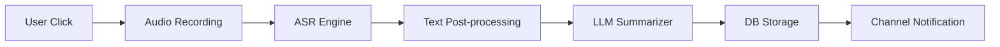

## 서론

중요한 브레인스토밍 미팅이 끝난 직후, 우리는 종종 흔히 말하는 '기록의 악몽'에 직면합니다. 회의록 작성은 단순히 들은 내용을 옮기는 것이 아니라, 난상토론 속에서 핵심 인사이트를 추출하고 구조화하는 고차원적인 인지 활동입니다. 많은 조직에서 AI 기반 음성 인식(ASR) 도구를 도입했지만, 여전히 현장의 만족도는 낮습니다. 그 이유는 기술적 한계 때문이 아니라, **'워크플로우의 단절'** 때문입니다.

사용자는 AI가 변환한 텍스트를 다시 복사하고, 요약을 정돈한 뒤, 이를 노션(Notion)이나 슬랙(Slack) 같은 지식 베이스(DB)로 옮겨 담는 수작업을 반복해야 합니다. 이 과정에서 발생하는 맥락 전환(Context Switching) 비용은 생각보다 큽니다. 이러한 배경에서 탄생한 'archy'는 단순한 전사(Transcription) 도구를 넘어, **음성 수집부터 팀 공유까지의 'Last Mile'를 완전히 자동화하는 AI 에이전트**로 설계되었습니다. 이 글에서는 archy가 어떻게 최신 ASR과 LLM 기술을 활용하여 버튼 하나, 즉 원클릭만으로 이 복잡한 워크플로우를 해결했는지 기술적인 관점에서 심층적으로 분석합니다.

## 본론

### 기술적 아키텍처: ASR과 LLM의 파이프라인 통합

archy의 핵심은 비동기적이지만 강력하게 결합된 파이프라인 아키텍처에 있습니다. 전통적인 방식이 사용자의 요청에 의해 동기적으로 처리된다면, archy는 이벤트 기반(Event-driven) 방식을 채택하여 지연 시간을 최소화하고 사용자 경험을 향상시킵니다.

이 과정은 크게 (1) 음성 처리 및 전사(ASR), (2) 텍스트 후처리 및 청킹(Chunking), (3) LLM 기반 요약 및 추천, (4) DB 저장 및 알림 발송의 4단계로 나뉩니다. 특히, 최근 Transformer 기반의 인코더-디코더 구조를 활용한 ASR 모델(예: OpenAI Whisper)과 대규모 언어 모델(LLM)의 결합이 자동화의 핵심입니다.

다음은 archy의 처리 과정을 간략화한 데이터 플로우입니다.



이 다이어그램에서 볼 수 있듯이, 사용자의 개입은 'A' 단계, 즉 버튼 클릭뿐입니다. 이후의 모든 과정은 백그라운드에서 자동으로 처리됩니다. C 단계의 ASR 엔진은 음성 신호를 텍스트로 변환할 때, 단순히 단어를 매핑하는 것을 넘어 문맥을 고려한 문장 부호와 구두점을 복원합니다. D 단계에서는 긴 미팅 내용을 LLM의 Context Window에 맞춰 적절한 크기로 분할(Chunking)하되, 문맥이 끊기지 않도록 오버랩(Overlap) 기술을 적용합니다.

E 단계인 LLM 요약 과정에서는 RAG(Retrieval-Augmented Generation)와 유사한 접근 방식을 사용하여 미팅의 주제와 관련된 선행 지식이나 이전 미팅록을 참조할 수도 있어, 더 정교한 요약을 생성합니다. 마지막으로 F와 G 단계에서는 생성된 결과물을 구조화된 JSON 형태로 조직의 DB에 저장하고, Webhook이나 API를 통해 슬랙 등 협업 툴로 자동 푸시(Push)합니다.

### 핵심 기술 구현: 가상의 archy 파이프라인 코드

archy와 유사한 시스템을 직접 구현한다고 가정하고, Python을 사용하여 핵심 파이프라인을 구성해 보겠습니다. 이 코드는 음성 파일을 입력받아 요약된 결과를 반환하는 백엔드 서비스의 일부를 시뮬레이션합니다.

여기서는 ASR을 위해 `faster-whisper`를, 요약을 위해 `openai` 라이브러리를 사용하며, 메모리 효율을 위해 스트리밍 방식이 아닌 배치 처리 방식을 예시로 듭니다.

```python
import os
from faster_whisper import WhisperModel
from openai import OpenAI
import json

# 1. ASR Model Initialization (Quantized model for efficiency)
# 실제 환경에서는 GPU 가속을 권장합니다.
model_size = "base"
asr_model = WhisperModel(model_size, device="cpu", compute_type="int8")

# 2. LLM Client Initialization
llm_client = OpenAI(api_key=os.environ.get("OPENAI_API_KEY"))

def transcribe_audio(audio_path):
    """
    오디오 파일을 텍스트로 변환하고 세그먼트별로 반환합니다.
    """
    segments, info = asr_model.transcribe(audio_path, beam_size=5)
    
    full_text = ""
    segment_data = []
    
    print(f"Detected language '{info.language}' with probability {info.language_probability}")
    
    for segment in segments:
        segment_info = {
            "start": segment.start,
            "end": segment.end,
            "text": segment.text
        }
        segment_data.append(segment_info)
        full_text += segment.text + " "
        
    return full_text, segment_data

def summarize_meeting(text):
    """
    LLM을 사용하여 미팅 텍스트를 요약하고 주요 안건을 추출합니다.
    """
    prompt = f"""
    다음은 팀 미팅의 전사본입니다. 다음 지침에 따라 결과를 JSON 형식으로 출력하세요:
    1. 전체 요약 (1문단)
    2. 주요 논의 사항 (Bullet points)
    3. Action Items (담당자 포함)
    
    전사본:
    {text}
    
    출력 형식:
    {{
        "summary": "...",
        "key_points": ["...", "..."],
        "action_items": ["...", "..."]
    }}
    """
    
    response = llm_client.chat.completions.create(
        model="gpt-4o",
        messages=[
            {"role": "system", "content": "당신은 전문적인 기록 요원입니다."},
            {"role": "user", "content": prompt}
        ],
        temperature=0.3,
        response_format={"type": "json_object"}
    )
    
    return json.loads(response.choices[0].message.content)


```

```python
def save_to_db_and_notify(summary_data):
    """
    요약된 데이터를 DB에 저장하고 협업 채널에 알림을 보냅니다.
    (가상의 함수 구현)
    """
    # DB 저장 로직
    print(f"[DB] Saving meeting summary: {summary_data['summary'][:30]}...")
    
    # Slack Notification 로직
    slack_message = f"""
    📝 *새로운 미팅록이 도착했습니다.*
    
    *요약:* {summary_data['summary']}
    *Action Items:*
    """
    for item in summary_data['action_items']:
        slack_message += f"- {item}
"
        
    print(f"[Slack] Sending notification: {slack_message}")

# archy Workflow Execution
# audio_file = "team_meeting.wav"
# text, segments = transcribe_audio(audio_file)
# summary_json = summarize_meeting(text)
# save_to_db_and_notify(summary_json)
```

이 코드는 실제 서비스에서 일어나는 일련의 과정을 단순화한 것입니다. `transcribe_audio` 함수는 실시간성보다는 정확도를 중시하여 배치 처리를 수행하며, `summarize_meeting` 함수는 LLM의 추론 능력을 활용하여 비정형 텍스트를 정형화된 JSON 데이터로 변환합니다. 이렇게 구조화된 데이터는 마지막 단계에서 별도의 파싱 과정 없이 바로 DB 스키마에 매핑되어 저장 효율성을 높입니다.

### 기존 솔루션 대비 archy의 효율성 비교

기존 수동 방식, 일반적인 AI 노트테이커, 그리고 archy를 비교하면 워크플로우 자동화가 업무 효율성에 미치는 영향을 명확히 알 수 있습니다. 특히 '저장'과 '공유' 단계에서의 차이가 결정적입니다.

| 비교 항목 | 수동 기록 (Legacy) | 일반 AI 노트테이커 | archy (Auto-Pilot) |
| :--- | :--- | :--- | :--- |
| **음성 수집** | 직접 녹음 또는 메모 | 앱 내부 녹음 | 버튼 원클릭 녹음 |
| **전사 (ASR)** | (없음) 또는 수작업 | 자동 처리 | 자동 처리 (고정밀 모델) |
| **요약 (LLM)** | 수작업 (시간 소요 큼) | 자동 처리 (수정 필요) | 자동 처리 (Action Item 추출 포함) |
| **DB 저장** | 직접 문서 작성 및 업로드 | 텍스트 복사 후 DB 붙여넣기 | **자동 구조화 저장** |
| **팀 공유** | 이메일/메신저 전송 | 링크 복사 후 채널 공유 | **자동 채널 알림 발송** |
| **Total Time** | 60분 (미팅) + 30분 (정리) | 60분 + 10분 (수정 및 공유) | **60분 + 1분 (클릭)** |

표에서 볼 수 있듯이, 기존 AI 노트테이커들은 '전사'와 '요약'까지는 자동화했지만, 그 결과물을 조직의 지식 자산으로 만드는 'DB 저장'과 '공유' 과정에서 사용자의 수작업을 요구했습니다. archy는 이 마지막 고리를 API 연동을 통해 완전히 제거함으로써, 사용자가 오직 미팅 내용에만 집중할 수 있게 합니다.

### 실무 적용 가이드 및 MLOps 관점

실무 환경에서 archy와 같은 시스템을 안정적으로 운영하기 위해서는 몇 가지 기술적 고려사항이 필요합니다.

1.  **청킹(Chunking) 전략**: 미팅 시간이 길어질수록 토큰 수는 LLM의 컨텍스트 윈도우(Context Window)를 초과하게 됩니다. 이를 해결하기 위해 텍스트를 일정 크기로 자르되, 이전 청크의 끝부분을 다음 청크의 시작부분에 포함시키는 'Sliding Window' 기법을 적용해야 문맥 손실을 막을 수 있습니다.
2.  **지연(Latency) 최적화**: 사용자가 버튼을 누르고 결과를 확인하기까지의 시간을 줄이기 위해, ASR 모델과 LLM 추론은 GPU 인스턴스에서 병렬로 처리되어야 합니다. 특히 ASR 결과가 스트리밍으로 들어오는 즉시 LLM에 전달하여 처리하는 스트리밍 파이프라인을 구축하면 전체 지연 시간을 획기적으로 줄일 수 있습니다.
3.  **데이터 파이프라인 안정성**: 네트워크 오류나 API 장애 대비하여 재시도(Retry) 메커니즘과 데드 레터 큐(Dead Letter Queue)를 도입해야 합니다. 만약 알림 발송에 실패하더라도 DB에는 기록이 남아 있어야 데이터 무결성을 보장할 수 있습니다.

## 결론

archy는 단순히 '말을 적어주는' 도구가 아닙니다. 복잡한 딥러닝 파이프라인(ASR + LLM)과 실무 워크플로우(DB/Notification)를 완벽하게 결합한 **Agentic Workflow**의 구현체입니다. AI 연구자의 관점에서 볼 때, archy의 가장 큰 의의는 모델의 성능(Perplexity나 BLEU 점수)을 높이는 것에 집중하기보다, **사용자의 인지 부하를 줄이는 데 초점을 맞춘 시스템 설계**에 있다는 점입니다.

앞으로도 생성형 AI 서비스는 단순히 텍스트를 생성하는 것을 넘어, 버튼 하나로 사용자의 의도를 파악하고 모든 후속 작업을 수행하는 'Autonomous Agent' 형태로 진화할 것입니다. archy는 이러한 미래의 업무 방식을 보여주는 훌륭한 사례입니다. ASR과 LLM의 기술적 발전이 만들어낸 텍스트를, 실제 비즈니스 가치가 있는 '지식'으로 전환하는 자동화의 과정은 앞으로도 모든 AI 서비스가 풀어야 할 숙제입니다.

## 참고자료

- **OpenAI Whisper paper:** "Robust Speech Recognition via Large-Scale Weak Supervision" (arXiv:2212.04356)

- **Transformer Architecture:** "Attention Is All You Need" (Vaswani et al., 2017)

- **LangChain Documentation:** Building context-aware reasoning applications

- **archy Service:** [https://news.hada.io/topic?id=26925](https://news.hada.io/topic?id=26925)
