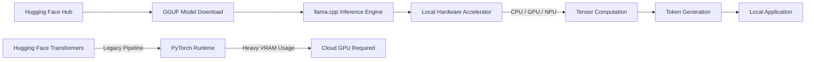

## 서론

최근 수천 개의 GPU 클러스터에서만 구동 가능했던 거대 언어 모델(LLM)을 이제는 우리의 노트북, 심지어 스마트폰에서도 실행할 수 있게 되었습니다. 이러한 패러다임의 전환은 단순히 하드웨어 성능의 향상 때문만이 아닙니다. 연구자들은 모델의 정밀도를 희생하여 추론 속도를 획기적으로 높이고 메모리 사용량을 줄이는 '양자화(Quantization)' 기술을 끊임없이 개발해 왔습니다. 하지만 여전히 많은 엔지니어와 연구자는 로컬 환경에서의 모델 배포를 어려워합니다. PyTorch 같은 프레임워크는 연구에는 훌륭하지만, 리소스가 제한된 엣지 디바이스에서의 실 서빙(Serving)에는 무겁고 복잡하기 때문입니다.

바로 이 지점에서 `llama.cpp`와 `ggml` 프로젝트가 등장했습니다. C++로 작성되어 가볍고, Apple Silicon의 Metal 코어나 x86 CPU의 명령어 세트를 최적화하여 방대한 모델을 소비자용 하드웨어에서 돌릴 수 있게 해주는 이 프로젝트는 로컬 AI 생태계의 혁명을 주도했습니다. 최근 이 프로젝트의 핵심 인물들이 모인 `ggml.ai`가 Hugging Face와 전략적 협력을 발표했습니다. 이는 단순한 기업 간의 제휴가 아닌, 오픈소스 AI의 미래를 클라우드 거대 기업 독점에서 벗어나 탈중앙화된 로컬 환경으로 견인하려는 중요한 Motivation입니다. 본 글에서는 이 협력의 기술적 의미와 `llama.cpp`를 활용한 로컬 추론의 원리, 그리고 실무 적용 방안을 심도 있게 다루고자 합니다.

## 본론: 로컬 AI의 기술적 심화와 생태계 확장

### 1. 왜 ggml과 llama.cpp인가? (기술적 배경)

기존의 딥러닝 생태계는 주로 Python과 PyTorch/TensorFlow 중심으로 돌아갑니다. 이는 연구(Research) 단계에서는 빠른 프로토타이핑을 가능하게 하지만, 배포(Deployment) 단계에서는 많은 오버헤드를 발생시킵니다. 반면, `ggml`은 텐서 연산을 위한 C++ 기반의 라이브러리로, 웹어셈블리(WASM) 등 다양한 플랫폼에서의 컴파일을 지원하며 메모리 관리가 매우 효율적입니다. `llama.cpp`는 이 `ggml`을 기반으로 하여 Meta의 LLaMA 모델 및 그 변종들을 로컬에서 구동할 수 있게 해주는 추론 엔진입니다.

이 프로젝트의 핵심은 **GGUF (GPT-Generated Unified Format)**라는 파일 형식과 고도로 최적화된 양자화 기법입니다. 예를 들어, 16비트(FP16)로 저장된 모델을 4비트 또는 5비트 정수로 변환하더라도 성능 저하를 최소화하면서 모델 크기를 1/4 수준으로 줄일 수 있습니다. 이는 VRAM이 부족한 로컬 머신에서 거대 모델을 실행할 수 있는 유일한 실마리가 되었습니다.

ggml.ai와 Hugging Face의 협력은 Hugging Face가 보유한 방대한 모델 허브(Hub)와 커뮤니티 역량이, llama.cpp의 탁월한 엣지 디바이스 최적화 기술과 만나는 것을 의미합니다. 이는 개발자들이 Hugging Face에서 모델을 다운로드하고, 별도의 복잡한 변환 과정 없이도 로컬 환경에서 바로 최적화된 형태로 실행할 수 있는 생태계를 구축할 것입니다.

### 2. 추론 파이프라인의 변화: Cloud vs. Local

전통적인 클라우드 기반 추론과 로컬 기반 추론의 파이프라인 차이를 이해하는 것은 중요합니다. 아래 다이어그램은 Hugging Face 생태계 내에서의 새로운 로컬 추론 흐름을 간소화하여 나타낸 것입니다.



이 다이어그램은 기존의 PyTorch 기반 무거운 파이프라인과 달리, GGUF 포맷이 llama.cpp 엔진을 통해 하드웨어에 직접적으로 최적화되어 접근하는 경량화된 구조를 보여줍니다.

### 3. PyTorch vs. llama.cpp 기술적 비교

로컬 AI 도구를 선택할 때는 성능과 호환성 사이의 트레이드오프를 고려해야 합니다. 다음은 전통적인 방식과 ggml 생태계를 비교한 표입니다.

| 비교 항목 | Hugging Face Transformers (PyTorch) | llama.cpp (ggml/GGUF) | | :--- | :--- | :--- | | **주요 언어** | Python | C++ (Python 바인딩 제공) | | **모델 포맷** | Safetensors / .bin | GGUF | | **양자화 지원** | 제한적 (bitsandbytes 등 별도 라이브러리 필요) | 다양한 최적화 알고리즘 내장 (Q4_K_M, Q5_K_M 등) | | **메모리 요구량** | 높음 (모델 전체를 VRAM/RAM에 로드) | 낮음 (메모리 매핑 및 양자화 활용) | | **주요 타겟 하드웨어** | 서버급 GPU (NVIDIA A100/H100) | 소비자용 CPU, Apple Silicon, 저전력 GPU | | **부팅 속도 (Cold Start)** | 느림 (런타임 초기화 오버헤드) | 매우 빠름 (실행 파일 바로 실행) |

### 4. 실무 적용 가이드: llama.cpp로 로컬 LLM 구축하기

이제 실제로 이 기술을 어떻게 사용하는지 살펴보겠습니다. Python 환경에서 `llama-cpp-python` 라이브러리를 사용하여 Hugging Face에서 GGUF 모델을 불러오고 추론하는 과정을 Step-by-step으로 설명합니다.

#### Step 1: 라이브러리 설치 및 준비

먼저 C++ 컴파일러가 필요하며, 시스템에 맞는 하드웨어 가속(예: Apple의 Metal, NVIDIA의 CUDA)을 위해 플래그를 주어 설치합니다.

```bash
# Apple Silicon (M1/M2/M3)을 사용하는 Mac의 경우
CMAKE_ARGS="-DLLAMA_METAL=on" pip install llama-cpp-python

# NVIDIA GPU를 사용하는 Linux의 경우
CMAKE_ARGS="-DLLAMA_CUBLAS=on" pip install llama-cpp-python
```

#### Step 2: Python 코드로 추론 실행

아래 코드는 Hugging Face에서 호스팅되는 양자화된 모델(예: Llama-3-8B-Instruct의 GGUF 버전)을 다운로드받아 로컬에서 실행하는 예제입니다. `n_gpu_layers` 옵션을 통해 일부 레이어를 GPU에 오프로드하여 CPU와 GPU를 혼합 사용하는 방법도 보여줍니다.

```python
from llama_cpp import Llama
import json

# 모델 로드 (Hugging Face 리포지토리의 GGUF 파일 직접 지정)
# n_gpu_layers=-1 은 가능한 모든 레이어를 GPU에 올린다는 의미 (GPU 메모리가 충분할 때)
# n_ctx는 컨텍스트 윈도우 크기입니다.
llm = Llama(
    model_path="Meta-Llama-3-8B-Instruct.Q4_K_M.gguf",
    n_gpu_layers=-1, 
    n_ctx=2048,
    verbose=True
)

# 프롬프트 구성 (Llama 3 Chat 템플릿 적용)
prompt = "딥러닝에서 양자화(Quantization)가 중요한 이유는 무엇인가요?"
system_message = "당신은 친절한 AI 연구자 조수입니다."

messages = [
    {"role": "system", "content": system_message},
    {"role": "user", "content": prompt}
]

# 추론 실행
output = llm.create_chat_completion(
    messages=messages,
    temperature=0.7,
    max_tokens=512
)

# 결과 출력
print("Response:", output['choices'][0]['message']['content'])
```

이 코드는 복잡한 Docker 컨테이너나 클라우드 API 키 없이도, 단 몇 줄의 코드로 강력한 LLM을 로컬 머신 위에 구축할 수 있음을 보여줍니다. 연구자들은 이를 통해 민감한 데이터가 외부로 유출되는 것을 방지하며, 실험을 반복 수행할 수 있습니다.

#### Step 3: 양자화 성능 최적화 팁

MLOps 관점에서 로컬 배포 시 고려해야 할 핵심은 양자화 레벨의 선택입니다.

- **Q4_K_M**: 가장 균형 잡힌 옵션입니다. 속도와 품질의 균형이 좋아 일반적인 챗봇 서비스에 적합합니다.

- **Q5_K_M**: 품질이 중요하고 약간의 속도 저하가 허용될 때 사용합니다.

- **Q8_0**: 거의 원본 손실 없는 성능을 필요로 하지만, 메모리 절약이 필요할 때 사용합니다.

## 결론

ggml.ai와 Hugging Face의 협력은 로컬 AI 생태계에 있어 중요한 이정표가 될 것입니다. 이 단순히 "누가 누구를 합병했다"는 소식을 넘어, 고성능 AI 모델을 누구나 손쉽게 자신의 장비에서 구동할 수 있게 하는 기술적 기반이 공고해졌음을 시사합니다. 클라우드 의존도를 낮추고 데이터 프라이버시를 보장하며, 비용 효율적인 AI 서비스를 설계하려는 현대의 MLOps 트렌드에 `llama.cpp`와 GGUF 포맷은 필수적인 요소가 되었습니다.

앞으로 우리는 Hugging Face의 방대한 모델 허브가 `llama.cpp`의 추론 엔진과 더 긴밀하게 통합되는 것을 볼 것입니다. 연구자들은 이제 연구 단계에서부터 배포 단계까지를 하나의 흐름으로 연결할 수 있는 도구를 갖게 되었습니다. 이는 AI 개발의 민주화를 가속화하고, 진정으로 "사용자 중심의 개인정보 보호 AI" 시대를 여는 발판이 될 것입니다.

### References

- [llama.cpp GitHub Repository](https://github.com/ggerganov/llama.cpp)

- [ggml.ai Official Announcement](https://ggml.ai)

- [Hugging Face - The Open Source AI Community](https://huggingface.co)

- [Quantization in Deep Learning (arXiv:2305.14314)](https://arxiv.org/abs/2305.14314)
