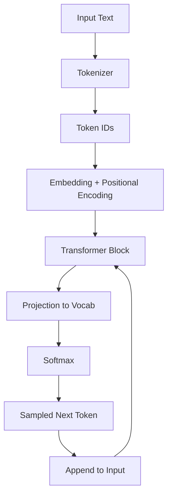

## 서론

대규모 언어 모델(LLM)이 쏟아내는 놀라운 텍스트 생성 능력 뒤에는 복잡한 수식과 행렬 연산이 자리 잡고 있습니다. 많은 개발자와 연구자가 Hugging Face Transformers 라이브러리를 통해 모델을 손쉽게 로드하고 실행할 수 있지만, 모델 내부에서 정확히 무슨 일이 벌어지는지 설명하기는 쉽지 않습니다. 우리는 종종 "어텐션 메커니즘이 중요하다"라고 말하지만, 그 메커니즘이 실제 추론 과정에서 텐서(Tensor)를 어떻게 변형시키는지에 대한 직관은 부족합니다.

이러한 이해의 격차를 해소하기 위해, OpenAI의 공동 창립자인 Andrej Karpathy는 순수 PyTorch로 작성된 `microGPT`(혹은 nanoGPT)를 공개하며 모델의 본질을 다시 돌아보게 했습니다. 그러나 코드는 여전히 정적입니다. 수천 줄의 코드를 디버거 없이 읽으며 데이터의 흐름을 머릿속으로 그려내는 것은 큰 인지적 부담을 줍니다.

이 글에서는 Karpathy의 `microGPT` 아키텍처를 기반으로 구축된 인터랙티브 시각화 도구를 심층적으로 분석합니다. 이 도구는 단순한 다이어그램을 넘어, 사용자의 입력이 토큰화(Tokenization), 임베딩(Embedding), 트랜스포머 블록(Transformer Block), 그리고 최종 확률 분포(Softmax)를 거쳐 다음 토큰을 생성하기까지의 전체 파이프라인을 단계별로 관찰할 수 있게 합니다. 이를 통해 우리는 Transformer의 "블랙 박스"를 열어 그 내부의 기어가 어떻게 맞물려 돌아가는지 명확히 이해할 수 있습니다.

## 본론

### 1. GPT 아키텍처의 데이터 파이프라인 이해

Transformer 아키텍처, 특히 GPT(Generative Pre-trained Transformer)는 본질적으로 확률적 단어 맞추기 기계입니다. 하지만 그 과정에서 고차원 벡터 공간에서의 복잡한 연산이 수행됩니다. 시각화 도구는 이 과정을 다음과 같은 단순화된 흐름으로 구조화하여 보여줍니다.

아래 다이어그램은 `microGPT`의 핵심 추론 과정을 나타낸 것입니다.



이 과정은 한 번의 생성이 아닌, 토큰이 생성될 때마다 반복(Loop)되는 자기 회귀(Autoregressive) 특성을 가집니다. 시각화 도구의 핵심 가치는 사용자가 각 단계 사이를 오가며 텐서의 차원과 값이 어떻게 변하는지 확인할 수 있다는 점입니다.

### 2. 기술적 심층 분석: 토큰화에서 어텐션까지

#### 토큰화 및 임베딩 (Tokenization & Embedding) 시각화의 첫 단계는 자연어를 모델이 이해할 수 있는 정수(Integer) 형태로 변환하는 BPE(Byte Pair Encoding) 과정입니다. 이 정수는 고정된 크기의 임베딩 테이블(Lookup Table)을 통해 고차원 벡터로 매핑됩니다. 이때 단순히 단어의 의미만 담는 것이 아니라, 문장 내에서의 위치 정보(Positional Encoding)가 더해져 순서 정보가 보존됩니다.

#### 멀티 헤드 어텐션 (Multi-Head Attention) 가장 중요한 부분은 셀프 어텐션(Self-Attention) 레이어입니다. 시각화 도구는 여기서 입력 시퀀스의 각 토큰이 다른 토큰들에게 얼마나 주의를 기울이는지를 히트맵(Heatmap) 형태로 보여줍니다.

수식으로 표현하면 다음과 같습니다: $$ \text{Attention}(Q, K, V) = \text{softmax}\left(\frac{QK^T}{\sqrt{d_k}}\right)V $$

여기서 $Q$(Query), $K$(Key), $V$(Value)는 학습된 가중치 행렬에 의해 생성됩니다. 시각화는 이 행렬 곱셈이 실제로 어떤 연관성을 포착하는지 예를 들어 설명합니다. 예를 들어, "The cat sat on the"라는 문장이 주어졌을 때, "cat"이라는 토큰이 "sat"이라는 동사와 강한 연관성을 맺고 있음을 어텐션 스코어로 확인할 수 있습니다.

#### 코드 구현 예시 이론만으로는 이해가 어려울 수 있으므로, `microGPT` 스타일의 파이토치(PyTorch) 코드로 단일 어텐션 헤드의 연산 과정을 구현해 보겠습니다.

```python
import torch
import torch.nn as nn
import torch.nn.functional as F

class SelfAttention(nn.Module):
    def __init__(self, embed_size, head_dim):
        super().__init__()
        # Key, Query, Value 행렬 정의
        self.key = nn.Linear(embed_size, head_dim, bias=False)
        self.query = nn.Linear(embed_size, head_dim, bias=False)
        self.value = nn.Linear(embed_size, head_dim, bias=False)

    def forward(self, x):
        # 입력 x의 shape: [Batch, Seq_Len, Embed_Size]
        B, T, C = x.shape
        
        k = self.key(x)   # (B, T, Head_Dim)
        q = self.query(x) # (B, T, Head_Dim)
        
        # Attention Score 계산: (Q @ K^T)
        # (B, T, Head_Dim) @ (B, Head_Dim, T) -> (B, T, T)
        wei = q @ k.transpose(-2, -1) 
        
        # 스케일링 (Scaling) - 학습 안정성 확보
        wei = wei / (C ** 0.5)
        
        # Softmax 적용 (확률 분포 변환)
        wei = F.softmax(wei, dim=-1)
        
        # 가중합 계산 (Weighted Sum)
        v = self.value(x) # (B, T, Head_Dim)
        out = wei @ v     # (B, T, Head_Dim)
        
        return out

# 실행 예시
batch_size = 1
seq_len = 4
embed_size = 32
head_dim = 16

x = torch.randn(batch_size, seq_len, embed_size)
attention = SelfAttention(embed_size, head_dim)
output = attention(x)

print(f"Input shape: {x.shape}")
print(f"Attention Output shape: {output.shape}")
```

이 코드는 시각화 도구 내부에서 일어나는 핵심 연산을 보여줍니다. 실제 도구에서는 이 `wei` 변수의 값을 시각적으로 표현하여 사용자가 모델이 "어떤 단어에 집중하고 있는지"를 실시간으로 확인할 수 있게 합니다.

### 3. 인터랙티브 시각화의 실용적 활용 가이드

이 시각화 도구는 단순한 교육용을 넘어 모델 디버깅과 성능 최적화에도 활용될 수 있습니다. 다음은 실무자 관점에서의 단계별 활용법입니다.

**Step 1: 입력 전처리 검증** 모델에 텍스트를 입력했을 때, 토크나이저가 의도치 않은 Unknown 토큰을 생성하지 않는지 확인합니다. BPE의 특성상 오타나 신조어가 의도치 않게 쪼개지는 경우를 시각적으로 캐치할 수 있습니다.

**Step 2: 어텐션 헤드 분석** GPT는 여러 개의 어텐션 헤드(Multi-Head)를 사용합니다. 시각화 도구에서 각 헤드가 서로 다른 문법적, 의미적 역할을 수행하는지 관찰합니다. 어떤 헤드는 인접 단어에, 어떤 헤드는 문맥적으로 먼 단어에 집중하는 패턴을 발견할 수 있습니다.

**Step 3: 포지셔널 인코딩의 효과 확인** 문장의 순서를 바꿨을 때 임베딩 벡터와 어텐션 맵이 어떻게 변하는지 확인하여 모델이 순서 정보를 얼마나 민감하게 반영하는지 파악합니다.

### 4. 학습 방식 비교: 정적 코드 vs. 인터랙티브 시각화

이러한 시각화 도구를 사용하는 것이 기존의 방식보다 어떤 이점을 갖는지 비교해 보겠습니다.

| 비교 항목 | 정적 학습 (논문/코드) | 인터랙티브 시각화 (microGPT Web) |
| :--- | :--- | :--- |
| **학습 방식** | 텍스트 및 수식을 통한 이론적 습득 | 단계별 데이터 변환을 통한 경험적 습득 |
| **주의 집중 대상** | 전체 아키텍처 설계 및 알고리즘 로직 | 특정 시점의 텐서 값 및 데이터 흐름 |
| **디버깅 가능성** | 코드 레벨의 로직 추적만 가능 (실행 필요) | 웹 상에서 즉각적인 값 변화 확인 및 파라미터 튜닝 시뮬레이션 |
| **진입 장벽** | 높음 (선형대수학, 딥러닝 배경지식 필요) | 낮음 (직관적인 UI, 시각적 피드백) |
| **이해 깊이** | 수학적 원리에 대한 깊은 이해 도모 | 모델의 동적 거동(Dynamic Behavior)에 대한 직관 형성 |

## 결론

Karpathy의 `microGPT`를 시각화한 이 프로젝트는 복잡한 딥러닝 아키텍처를 공부하는 방식에 작지만 의미 있는 변화를 가져옵니다. 우리는 이제 수식과 코드만 쳐다보며 추상적으로 이해하려고 애쓰는 대신, 실제 데이터가 모델을 통과하며 변모하는 과정을 눈으로 확인할 수 있게 되었습니다.

이러한 시각화는 특히 **Mechanistic Interpretability(기계적 해석 가능성)** 분야에서 중요한 시사점을 줍니다. 모델이 왜 특정 답변을 생성했는지 역추적하기 위해, 내부의 뉴런이나 어텐션 헤드가 어떤 패턴에 반응하는지 시각적으로 분석하는 것은 연구자뿐만 아니라 엔지니어에게도 필수적인 능력이 되어가고 있습니다.

결론적으로 이 도구는 LLM 내부의 동작 원리를 탐구하는 훌륭한 출발점입니다. 단순히 API를 호출하여 결과를 받아보는 것을 넘어, 트랜스포머의 수학적 구조와 그 구현이 어떻게 일치하는지 생생하게 경험해 보시기 바랍니다. 이러한 이해는 더 효율적인 프롬프트 엔지니어링과 더 나은 모델 설계로 이어질 것입니다.

## 참고자료

- [nanoGPT GitHub Repository](https://github.com/karpathy/nanogpt) - Andrej Karpathy

- [Attention Is All You Need](https://arxiv.org/abs/1706.03762) - Vaswani et al. (2017)

- [Visualizing microGPT](https://news.hada.io/topic?id=27102) - Hada.io
