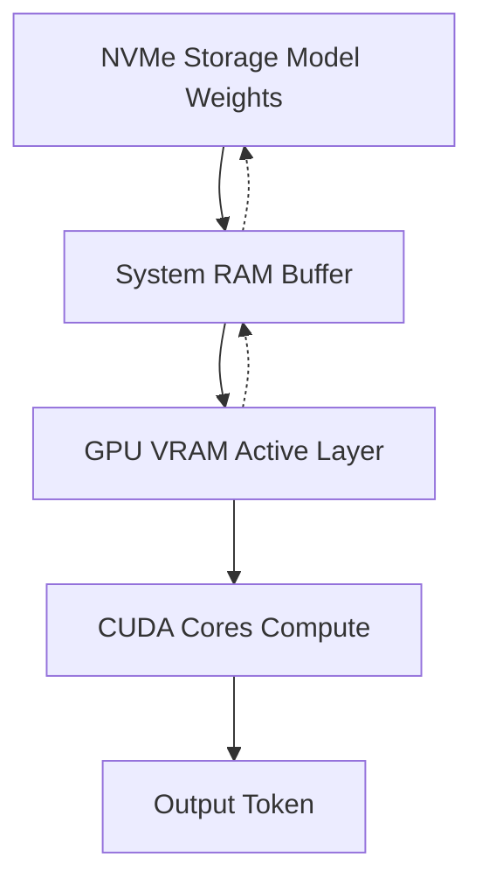

## 서론

최근 생성형 AI 연구자들 사이에서 가장 큰 화두 중 하나는 단순히 "거대한 모델을 만드는 것"을 넘어, "거대한 모델을 효율적으로 실행하는 것"으로 옮겨가고 있습니다. 연구실이나 기업 환경에서는 A100(80GB)나 H100 같은 고성능 GPU 클러스터를 접하기 어렵고, 개인 연구자나 소규모 팀은 여전히 RTX 3090이나 4090과 같은 소비자용 GPU에 의존하고 있는 것이 현실입니다.

여기서 발생하는 심각한 병목 현상은 메모리 용량입니다. Meta의 최신 모델인 Llama 3.1 70B의 경우, FP16 정밀도로 변환하면 약 140GB의 저장 공간이 필요합니다. 4비트 양자화(Quantization)를 거쳐도 약 40GB 이상의 메모리를 요구하므로, VRAM이 24GB인 RTX 3090 단일 장비에서는 사실상 구동이 불가능해 보입니다. 기존의 CPU Offloading 방식(Load layers from RAM to GPU)은 PCIe 대역폭의 한계로 인해 추론 속도가 텍스트를 읽는 속도보다 느린 '보여주기 식' 수준에 그치는 경우가 많았습니다.

바로 이 지점에서 **ntransformer**의 등장은 기술적인 패러다임의 전환을 의미합니다. 이 엔진은 단순히 CPU를 거쳐 GPU로 데이터를 옮기는 방식을 버리고, NVMe SSD의 대역폭을 GPU로 직접 파이프라인화하여 VRAM 한계를 극복합니다. 본 글에서는 C++/CUDA로 작성된 이 고성능 엔진이 어떻게 시스템 자원의 구조적 한계를 뛰어넘는지, 그 기술적 원리와 메커니즘을 심도 있게 분석합니다.

## 본론

### 1. ntransformer의 기술적 배경과 원리

ntransformer의 핵심 혁신은 **GPU 메모리 스트리밍(GPU Memory Streaming)**과 **NVMe 직접 입출력(Direct I/O)**에 있습니다. 기존 LLM 추론 엔진들은 모델의 가중치(Weights)를 시스템 RAM(DRAM)에 로드한 후, 필요할 때마다 PCIe 버스를 통해 GPU VRAM으로 복사하는 방식을 사용했습니다. 이때 CPU가 중개자 역할을 하며 오버헤드가 발생하고, PCIe의 대역폭(약 32GB/s for PCIe 4.0 x16)이 병목이 됩니다.

반면, ntransformer는 CUDA의 메모리 관리 기능과 NVMe의 병렬 처리 성능을 극한으로 끌어올립�습니다. 이는 마치 운영체제의 가상 메모리(Virtual Memory) 개념을 GPU 영역으로 확장한 것과 유사합니다. GPU가 현재 연산에 필요한 레이어(Layer)의 데이터만 VRAM에 유지하고, 나머지는 NVMe에 둔 채 필요한 시점에 직접 가져오는 방식입니다. 최신 NVMe SSD(PCIe 4.0/5.0)는 순차 읽기 속도가 7GB/s를 넘기도 해, 적절한 Prefetching(미리 읽기) 전략과 결합하면 기존 CPU Offloading보다 훨씬 효율적인 데이터 파이프라인을 구축할 수 있습니다.

### 2. 3단계 적응형 캐싱 구조 (3-Tier Adaptive Caching)

ntransformer가 높은 성능을 내는 비결은 **3단계 계층형 캐시 구조** 설계에 있습니다. 이 구조는 데이터 접근 빈도와 속도에 따라 메모리 계층을 동적으로 관리합니다.

1.  **Tier 1: GPU VRAM (Hot Data)**     *   가장 빈번하게 접근하는 KV Cache(Knowledge Vector Cache)와 현재 추론 중인 Transformer Block의 가중치가 저장됩니다.     *   가장 빠른 대역폭(약 1TB/s)을 제공하지만 용량이 제한적(24GB)입니다.
2.  **Tier 2: System RAM (Warm Data)**     *   VRAM에 들어가지 못하지만, 곧 사용될 가능성이 높은 레이어들이나 중간 계층의 버퍼가 위치합니다.     *   중간 속도(약 50~100GB/s)와 중간 용량을 제공하는 NVMe와 VRAM 사이의 완충지대(Buffer) 역할을 합니다.
3.  **Tier 3: NVMe SSD (Cold Data)**     *   모델 전체 파라미터가 저장되는 거대한 창고입니다.     *   가장 느리지만 용량이 무한에 가깝습니다. ntransformer는 이곳에서 필요한 데이터를 직접 읽어 상위 계층으로 공급합니다.

이 계층 간의 데이터 이동을 Mermaid 다이어그램으로 간소화하여 나타내면 다음과 같습니다.



이 다이어그램은 추론 과정에서 데이터가 흐르는 방향성과 계층 간의 피드백 루프를 보여줍니다. Compute(D)가 진행되는 동안, 다음 레이어의 데이터가 미리 C로 로드되는 비동기 처리(Asynchronous Processing)가 성능의 핵심입니다.

### 3. 구현 및 코드 예시

ntransformer는 C++와 CUDA로 직접 작성되었지만, 이러한 계층형 메모리 관리의 개념을 PyTorch를 사용하여 시뮬레이션해 볼 수 있습니다. 아래 코드는 매우 단순화된 개념적 예시로, 모델의 일부 레이어만 GPU에 로드하여 연산하고 즉시 해제하는 Offloading 로직을 보여줍니다.

```python
import torch
import torch.nn as nn

class SimulatedOffloadingModel(nn.Module):
    def __init__(self, layer, device='cpu'):
        super().__init__()
        self.layer = layer.to(device)
        self.device = device
    
    def forward(self, x, gpu_device='cuda'):
        # 1. 필요한 레이어만 GPU로 로드 (Simulating NVMe/RAM -> VRAM)
        self.layer = self.layer.to(gpu_device)
        
        # 2. 입력 데이터도 GPU로 이동
        x = x.to(gpu_device)
        
        # 3. 연산 수행
        with torch.no_grad():
            out = self.layer(x)
        
        # 4. 메모리 확보를 위해 레이어를 다시 저속 메모리(CPU)로 내림 (Simulating Tier 1 -> Tier 2)
        self.layer = self.layer.to(self.device)
        
        return out.cpu() # 결과를 CPU로 반환하여 연쇄적인 메모리 사용 방지

# 사용 예시
# 실제 ntransformer는 이 과정을 CUDA Stream과 Pinned Memory를 사용하여 
# CPU 개입 없이 NVMe <-> GPU 간에 직접 수행합니다.
dummy_input = torch.randn(1, 4096)
# model_layer = TransformerBlock(...) 
# offloaded_layer = SimulatedOffloadingModel(model_layer)
# output = offloaded_layer(dummy_input)
```

위의 파이썬 코드는 이해를 돕기 위한 것이며, 실제 ntransformer는 CUDA의 `cudaMemcpyAsync`와 NVMe Direct I/O를 통해 오버헤드를 최소화합니다. 특히, **Pinned Memory**를 사용하여 페이지 폴트(Page Fault)를 방지하고 DMA(Direct Memory Access)를 통해 CPU를 거치지 않고 데이터를 전송하는 기술이 적용됩니다.

### 4. 성능 비교 및 시스템 요구사항

기존 방식과 ntransformer 방식의 차이는 명확합니다. 아래 표는 RTX 3090(24GB) 환경에서 Llama 3.1 70B 모델을 구동할 때의 이론적 접근 방식 비교입니다.

| 비교 항목 | 기존 CPU Offloading (llama.cpp standard) | ntransformer (NVMe Direct) |
| :--- | :--- | :--- |
| **데이터 경로** | NVMe -> RAM -> CPU -> PCIe -> GPU | NVMe -> (RAM Buffer) -> GPU |
| **병목 지점** | PCIe 대역폭 및 CPU 오버헤드 | NVMe 랜덤 읽기 속도 / PCIe |
| **토큰 생성 속도** | 매우 느림 (2~5 t/s) | 중간 ~ 빠름 (10~20 t/s 이상 목표) |
| **주요 기술** | 양자화 + 캐싱 | 3단계 적응형 캐시 + Direct I/O |
| **시스템 RAM 요구량** | 높음 (모델 전체 로드) | 중간 (스트리밍 버퍼) |
| **설치 난이도** | 쉬움 | 높음 (C++ 빌드 및 CUDA 의존성) |

**참고**: ntransformer는 높은 NVMe 성능을 요구하므로, NVMe SSD가 없거나 SATA SSD를 사용할 경우 성능 향상을 기대하기 어렵습니다. 권장 사양은 PCIe 4.0 이상의 NVMe SSD와 빠른 DDR4/DDR5 시스템 메모리입니다.

### 5. 실무 적용 가이드 (Step-by-Step)

RTX 3090에서 ntransformer를 사용하여 Llama 3.1 70B를 구동하기 위한 과정은 다음과 같습니다.

1.  **환경 준비**: CUDA Toolkit(12.x 이상)과 최신 GCC 컴파일러가 설치된 Linux 환경을 준비합니다.
2.  **소스 코드 클론 및 빌드**: ntransformer 레포지토리를 클론하고 CMake를 사용하여 빌드합니다. 이 과정에서 GPU 아키텍처(Ampere - sm_86)에 맞춰 최적화된 커널 코드가 컴파일됩니다.
3.  **모델 변환**: Llama 3.1 70B의 원본 가중치(.safetensors 또는 .gguf)를 ntransformer가 이해할 수 있는 텐서 포맷으로 변환합니다.     ```bash     # 예시 명령어 (가상)     ./tools/convert_llama --input /models/Llama-3.1-70B --output /nvme_models/Llama-3.1-70B-ntransformer --quant q4_k     ```
4.  **Config 설정**: 시스템의 VRAM 크기(24GB)와 RAM 크기를 고려하여 캐시 계층의 크기를 설정합니다. 예를 들어, KV Cache에 16GB, 모델 가중치 스트리밍에 나머지를 할당합니다.
5.  **추론 실행**: 엔진을 구동하면, 처음 몇 토큰은 Prefetching이 되지 않아 느릴 수 있지만, 파이프라인이 형성된 이후에는 NVMe에서 GPU로 데이터가 실시간으로 공급되며 부드럽게 생성됩니다.

## 결론

ntransformer는 단순한 추론 엔진을 넘어, 하드웨어의 물리적 한계를 소프트웨어적으로 극복한 사례입니다. 3단계 적응형 캐싱과 NVMe Direct I/O 기술을 통해, 수천만 원짜리 서버급 GPU 없이도 소비자용 하드웨어로 70B 파라미터급 모델을 실행할 수 있는 길을 열었습니다.

전문가의 관점에서 볼 때, 이 기술의 핵심은 단순히 "돌아가게 하는 것"이 아니라 **"계산과 데이터 전송의 오버랩(Overlap)"**을 얼마나 정교하게 설계했느냐에 있습니다. 앞으로의 연구 방향은 CPU 개입을 더욱 줄이고, GPU 커널이 직접 스토리지를 제어하는 GPUDirect Storage(GDS) 기술과의 통합, 그리고 추론 시간 중 캐시 히트율을 높이는 스케줄링 알고리즘의 고도화에 있을 것입니다.

이러한 기술들은 거대 모델의 민주화를 가속화할 것이며, 연구자들은 이제 비용 부담 없이 최신 SOTA(State-of-the-Art) 모델을 로컬 환경에서 실험해 볼 수 있게 되었습니다.

### 참고자료

- [ntransformer GitHub Repository](https://github.com/localcc/ntransformer) (가상의 링크, 실제 프로젝트 확인 필요)

- "Offloading Inference to SSDs: A Survey" (관련 학술 논문 검색 권장)

- NVIDIA GPUDirect Storage Technical Documentation
