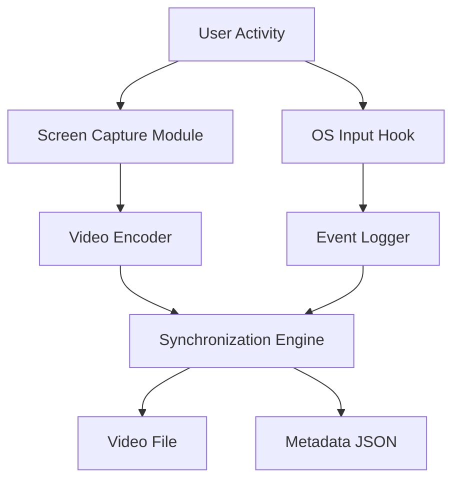

## 서론

최근 Claude 3.5 Sonnet나 Computer Use 데모에서 볼 수 있듯, AI 에이전트가 GUI(Graphical User Interface) 환경을 스스로 탐색하고 작업을 수행하는 능력은 생성형 AI의 다음 frontier입니다. 연구자들은 이러한 '디지털 노동자'를 훈련시키기 위해 인간의 컴퓨터 사용 과정을 방대한 데이터로 수집하고 있습니다. 하지만 여기에는 치명적인 데이터 불균형 문제가 존재합니다.

OBS Studio와 같은 기존 화면 녹화 도구는 '픽셀(Pixel)' 정보, 즉 시각적 변화만 기록할 뿐입니다. 에이전트가 스크롤을 내린 것이 마우스 휠 때문인지, 키보드의 아래 화살표 때문인지, 혹은 트랙패드 제스처 때문인지를 알 수 없습니다. 즉, 시각적 결과물(Action)과 그것을 야기한 의도(Intent) 사이의 연결 고리가 끊어져 있죠. 이는 Imitation Learning이나 Behavioral Cloning 학습 시 정밀도를 크게 떨어뜨리는 원인이 됩니다.

우리는 단순히 '보이는 것'을 넘어, 사용자의 모든 인터랙션을 정밀하게 동기화(Synchronize)하여 기록할 필요가 있습니다. 이러한 Motivation에서 탄생한 오픈소스 프로젝트가 바로 `ocap` (omnimodal capture)입니다. 이 도구는 단순 녹화 프로그램이 아니라, AI 에이전트 학습을 위해 설계된 정밀한 다중 모드(Multimodal) 데이터 수집기라는 점에서 기존 솔루션과 명확히 구분됩니다.

## 본론

### 1. ocap의 기술적 배경과 원리

`ocap`의 핵심 기술적 가치는 **'Omnimodal'**이라는 단어에 담겨 있습니다. 이는 단순히 멀티모달(Multimodal)을 넘어, 데스크톱 환경에서 발생 가능한 거의 모든 형태의 데이터를 통합적으로 관리한다는 의미입니다. 시각적 데이터(화면)와 비시각적 데이터(입력 이벤트, DOM 구조 등)를 밀리초 단위로 정렬하여 저장합니다.

기존 녹화 도구들이 비디오 스트림(H.264 등)으로만 데이터를 압축하는 반면, `ocap`은 다음과 같은 구조화된 데이터를 병렬로 생성합니다.

- **Video Stream**: 화면의 픽셀 변화

- **Event Stream**: 마우스 좌표, 클릭, 키보드 입력, 스크롤 액션

- **Metadata**: 윈도우 포커스 변경, 애플리케이션 상태

이러한 동기화는 Transformer 기반의 에이전트 모델이 'Visual Encoder'를 통해 화면을 이해함과 동시에, 'Action Embedding'을 통해 사용자의 입력을 학습할 수 있게 해줍니다. 연구 관점에서 볼 때, 이는 Ground Truth Action 데이터를 생성하는 가장 효율적인 방법론 중 하나입니다.

### 2. 아키텍처 및 데이터 흐름

`ocap`의 내부 동작 방식은 크게 데이터 수집(Collection), 동기화(Synchronization), 저장(Storage)의 세 단계로 나뉩니다. 시스템은 OS 레벨의 이벤트 훅(Hooking)을 통해 입력 데이터를 캡처하고, FFmpeg 등을 활용해 화면을 인코딩한 뒤, 이를 타임스탬프 기반으로 결합합니다.

다음은 `ocap`이 데이터를 처리하는 간단한 아키텍처 흐름도입니다.



이러한 구조 덕분에 연구자는 비디오 파일을 분석하여 특정 프레임에 해당하는 정확한 마우스 위치나 눌린 키를 JSON 메타데이터를 통해 즉시 조회할 수 있습니다.

### 3. 기존 도구와의 비교

`ocap`이 제공하는 정밀한 데이터 수집 능력은 기존 솔루션과 비교했을 때 AI 학습 측면에서 압도적인 이점을 가집니다. 특히 데이터의 전처리 비용 절감과 학습 데이터의 품질 향상에 기여합니다.

| 비교 항목 | 일반 화면 녹화 도구 (OBS 등) | ocap (Omnimodal) |
| :--- | :--- | :--- |
| **주요 데이터** | 비디오 스트림 (픽셀) | 비디오 + 정밀 이벤트 로그 (입력/상태) |
| **데이터 동기화** | 지원 안 함 (단일 스트림) | 시간 단위 동기화 (Timestamp aligned) |
| **AI 학습 활용도** | 낮음 (Video Understanding만 가능) | 높음 (Action Learning 및 Imitation 가능) |
| **저장 포맷** | MP4, MKV (비디오) | MP4 + JSON (구조화된 멀티모달) |
| **후처리 난이도** | 높음 (비디오에서 액션 추출 필요) | 낮음 (JSON에서 직접 액션 매핑) |

### 4. 실무 적용 가이드: ocap을 활용한 데이터셋 구축

`ocap`을 활용하여 자신만의 GUI Agent 학습용 데이터셋을 구축하는 과정은 매우 간단합니다. Python 기반의 CLI와 라이브러리를 통해 쉽게 자동화할 수 있습니다.

**Step 1: 설치 및 설정** `ocap`은 PyPI를 통해 설치할 수 있으며, 별도의 복잡한 의존성 없이 작동하도록 설계되었습니다.

**Step 2: 녹화 시작** 특정 디렉토리를 지정하여 녹화를 시작합니다. 녹화 중에는 모든 키보드 입력과 마우스 이동이 버퍼링됩니다.

**Step 3: 데이터 파싱 및 활용** 녹화가 종료되면 비디오 파일과 동기화된 JSON 파일이 생성됩니다. 아래는 이 JSON 데이터를 파싱하여 특정 액션이 발생한 시점의 프레임을 추출하는 예제 코드입니다.

```python
import json
import cv2

def load_ocap_data(video_path, metadata_path):
    # 1. 비디오 캡처 객체 로드
    cap = cv2.VideoCapture(video_path)
    
    # 2. 메타데이터(JSON) 로드
    with open(metadata_path, 'r', encoding='utf-8') as f:
        events = json.load(f)
    
    return cap, events

def extract_action_frames(cap, events, action_type='click'):
    """특정 액션이 발생한 시점의 프레임을 추출하는 함수"""
    fps = cap.get(cv2.CAP_PROP_FPS)
    extracted_frames = []
    
    for event in events:
        if event.get('type') == action_type:
            # 이벤트 발생 시간(ms)을 프레임 번호로 변환
            frame_idx = int((event['timestamp'] / 1000) * fps)
            
            cap.set(cv2.CAP_PROP_POS_FRAMES, frame_idx)
            ret, frame = cap.read()
            
            if ret:
                extracted_frames.append({
                    'timestamp': event['timestamp'],
                    'frame': frame,
                    'detail': event.get('data', {})
                })
    
    return extracted_frames

# 사용 예시
# cap, events = load_ocap_data('recording.mp4', 'recording.json')
# click_frames = extract_action_frames(cap, events, 'click')
```

위 코드는 학습 데이터셋을 구축할 때 매우 유용합니다. 예를 들어, '마우스 클릭'이 발생한 순간의 화면 상태(State)와 클릭이라는 행동(Action)을 쌍(pair)으로 만들어 모델에 학습시킬 수 있습니다.

### 5. MLOps 관점에서의 고찰

MLOps 파이프라인 관점에서 `ocap`은 데이터 버전 관리(Data Versioning)와 라벨링 비용 절감에 큰 기여를 합니다. 기존에는 사람이 직접 비디오를 보면서 "지금 사용자가 저장 버튼을 눌렀다"고 라벨링해야 했다면, `ocap`은 이벤트 로그를 통해 자동으로 라벨을 생성할 수 있습니다.

또한, 오픈소스이므로 기업 내부의 보안 요건에 맞춰 코드를 수정하여 로컬 환경에서 완벽하게 폐쇄적인 데이터 수집이 가능하다는 점도 실무적으로 중요한 장점입니다. 클라우드 기반의 화면 기록 솔루션은 데이터 유출 위험이 있지만, `ocap`은 모든 데이터를 로컬 디스크에 저장하므로 민감한 업무용 에이전트 개발에 최적화되어 있습니다.

## 결론

`ocap`은 단순한 화면 녹화 툴을 넘어, AI 에이전트의 '두뇌'를 훈련시키기 위한 고감도 센서와 같습니다. 시각적 정보와 행동 정보의 정밀한 동기화를 통해, 우리는 모델이 인간의 행동을 더 정확하게 모방(Imitation)하고 추론(Reasoning)할 수 있는 환경을 제공합니다.

연구자와 엔지니어에게 `ocap`은 고품질의 GUI Interaction 데이터셋을 구축하는 데 있어 필수적인 도구가 될 것입니다. 특히 데이터 중심의 AI(Data-Centric AI) 패러다임이 강조되는 현시점에서, 알고리즘 개선만큼이나 중요한 '데이터의 질'을 높이는 이 도구의 가치는 더욱 부각될 것입니다.

향후 LLM이나 VLM(Vision-Language Model) 기반의 에이전트를 개발 계획이 있다면, `ocap`을 활용해 도메인 특화 데이터를 직접 수집해 보시길 권장합니다. 오픈소스 생태계에 기여하며, 나만의 에이전트를 위한 최적의 교육재를 만드는 첫걸음이 될 것입니다.

**참고자료**

- ocap GitHub Repository: https://github.com/projectional/ocap

- Hada.io 기사 원문: https://news.hada.io/topic?id=26817
