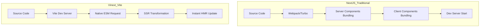

## 서론

현대의 웹 프론트엔드 개발 환경에서 우리는 흔히 '설계보다는 설정(Configuration)'이라는 말을 자주 듣습니다. 특히 Next.js와 같은 메타 프레임워크는 강력한 기능을 제공하지만, 그 이면에는 Webpack 기반의 복잡한 빌드 파이프라인과 무거운 인프라가 존재합니다. 프로젝트 규모가 커질수록 증가하는 번들링 시간과 난해한 디버깅 과정은 개발 생산성을 저해하는 주요 요인으로 작용해 왔습니다.

이러한 고질적인 문제를 해결하기 위해 Cloudflare의 엔지니어는 과감하고도 실험적인 시도를 했습니다. 바로 LLM(Large Language Model), 구체적으로 Anthropic의 Claude를 활용해 Next.js의 핵심 기능을 Vite 기반으로 1주일 만에 완전히 재작성한 'vinext' 프로젝트입니다. 이는 단순한 프레임워크의 대체재를 넘어, AI가 단순한 코드 보조를 넘어 대규모 시스템 아키텍처 설계와 구현을 어떻게 가속화할 수 있는지를 보여주는 중요한 사례입니다. 본문에서는 vinext가 어떤 기술적 배경에서 탄생했으며, AI가 어떻게 복잡한 시스템 레벨의 소프트웨어를 재설계했는지 심층적으로 분석해 보겠습니다.

## 본론

### 기술적 배경: 왜 Vite인가?

Next.js는 React 생태계에서 가장 인기 있는 프레임워크이지만, 기본적으로 Webpack에 의존하고 있습니다. Webpack은 번들링 과정에서 전체 의존성 그래프를 분석하고 번들을 생성해야 하므로, 프로젝트 규모가 커질수록 콜드 스타트 시간이 기하급수적으로 늘어납니다. 반면, Vite(프랑스어로 '빠르다')는 개발 환경에서 네이티브 ESM(ECMAScript Modules)을 사용하여 브라우저가 직접 모듈을 요청하게 만듭니다. 별도의 번들링 과정 없이 즉각적인 핫 모듈 교체(HMR)를 제공하기 때문에 개발 속도가 획기적으로 빠릅니다.

vinext는 이러한 Vite의 속도를 채택하면서도, Next.js의 핵심 기능인 서버 사이드 렌더링(SSR), 파일 시스템 기반 라우팅, API 라우트 등을 유지하려고 시도했습니다. 기존 Next.js의 복잡한 추상화 계층을 걷어내고, Vite의 플러그인 시스템을 활용해 경량화된 아키텍처를 구축한 것입니다.

### vinext와 Next.js 아키텍처 비교

아래 다이어그램은 기존 Next.js의 복잡한 빌드 흐름과 vinext가 목표하는 Vite 기반의 간소화된 흐름을 비교한 것입니다.



이 아키텍처의 핵심 차이점은 '번들링(Bundling)'의 시점과 방식입니다. 기존 방식은 서버 시작 전에 무거운 컴파일 작업이 선행되지만, vinext 방식은 요청 시점(JIT)에 필요한 모듈만 변환하여 제공합니다.

### 코드 예시: Vite 플러그인을 활용한 SSR 핸들링

vinext의 구현을 이해하기 위해, Vite 플러그인을 통해 간단하게 SSR을 처리하는 컨셉 코드를 살펴보겠습니다. 이는 실제 vinext 리포지토리의 로직을 단순화한 것으로, AI가 Next.js의 `getServerSideProps`와 유사한 기능을 Vite 환경에서 어떻게 구현했는지를 보여줍니다.

```typescript
import { defineConfig } from 'vite'
import react from '@vitejs/plugin-react'
import { resolve } from 'path'

// 가상의 모듈 ID를 위한 상수
const virtualModuleId = 'virtual:vinext-routes'
const resolvedVirtualModuleId = '\0' + virtualModuleId

export default defineConfig({
  plugins: [
    react(),
    {
      name: 'vinext-ssr-plugin',
      resolveId(id) {
        if (id === virtualModuleId) return resolvedVirtualModuleId
      },
      load(id) {
        if (id === resolvedVirtualModuleId) {
          // 파일 시스템 기반 라우팅을 동적으로 생성하여 내보냄
          return `export const routes = ${JSON.stringify(scanRoutes())}`
        }
      },
      configureServer(server) {
        server.middlewares.use(async (req, res, next) => {
          // 클라이언트 요청을 캡처하여 SSR 처리
          if (req.url?.endsWith('.html')) {
            const template = await server.transformIndexHtml(req.url, '')
            const { render } = await server.ssrLoadModule('/src/entry-server.tsx')
            const appHtml = await render(req.url)
            
            res.end(template.replace(`<!--app-html-->`, appHtml))
            return
          }
          next()
        })
      }
    }
  ]
})

// 유틸리티: pages 디렉토리 스캔
function scanRoutes() {
  // 실제 구현에서는 fs.readdir 등을 사용하여 동적 라우팅 생성
  return [{ path: '/', component: '/src/pages/index.tsx' }]
}
```

이 코드는 Vite의 `configureServer` 훅을 사용하여 미들웨어를 등록하고, 들어오는 요청을 가로채서 서버 사이드 렌더링을 수행하는 방식을 보여줍니다. 복잡한 Webpack 로더 대신 Vite의 간결한 플러그인 API를 사용하여 SSR을 구현함으로써 코드량이 줄어들고 유지보수가 용이해집니다.

### 성능 및 복잡도 비교

vinext를 통해 얻을 수 있는 이점은 명확합니다. 아래 표는 기존 Next.js와 Vite 기반으로 재구축했을 때의 이론적 비교입니다.

| 비교 항목 | 기존 Next.js (Webpack 기반) | vinext (Vite 기반) | | :--- | :--- | :--- | | **번들링 속도** | 느림 (전체 의존성 분석 필요) | 매우 빠름 (ESBuild 활용, 즉시 시작) | | **핫 모듈 교체(HMR)** | 수 초 대기 가능 | 수백 밀리초 내 반영 | | **코드 복잡도** | 높음 (내부 추상화 계층이 두꺼움) | 낮음 (플러그인 기반으로 모듈화) | | **설정 자유도** | 제한적 (프레임워크 컨벤션 따름) | 높음 (Vite 설정 자유도 활용) | | **AI 개발 참여도** | 낮음 (복잡한 맥락 파악 어려움) | 높음 (단일 파일/모듈 수정 용이) |

### AI 주도 개발 프로세스: 어떻게 1주일 만에 가능했는가?

vinext 프로젝트의 가장 흥미로운 점은 개발 기간입니다. 인간 엔지니어가 혼자서 Next.js의 핵심 기능을 뜯어고쳐 Vite에 포팅하려면 최소 몇 달이 걸릴 수 있습니다. 하지만 Claude를 활용한 AI 주도 개발 프로세스는 이를 단축시켰습니다.

1.  **모듈화된 접근 (Modular Approach)**: 엔지니어는 전체 시스템을 한 번에 요청하지 않고, 라우팅, 데이터 페칭, 빌드 파이프라인 등으로 기능을 쪼개어 AI에 요청했습니다. 이는 LLM의 컨텍스트 윈도우 한계를 극복하고 정확도를 높이는 전략입니다. 2.  **증명 검증 (Proof of Concept)**: AI가 생성한 코드는 즉시 Vite 환경에서 실행해 보았습니다. 실패 시 에러 로그를 다시 AI에게 피드백하여 수정 방안을 도출하는 피드백 루프를 고속으로 반복했습니다. 3.  **도메인 지식 전이**: 엔지니어는 Next.js 소스 코드의 구체적인 구현 로직을 AI에게 설명하는 대신, "Vite 플러그인 API를 사용하여 파일 시스템 변경을 감지하고 라우트를 갱신하는 로직을 작성해라"와 같이 의도(Intent) 중심의 프롬프트를 사용했습니다.

### 실무 적용 가이드: 프로젝트에서 vinext 아키텍처 적용하기

만약 당신의 회사에서 기존의 무거운 SPA(Single Page Application)를 Vite 기반의 SSR 환경으로 마이그레이션하려 한다면, vinext가 보여준 접근 방식을 참고할 수 있습니다.

**Step 1: Vite 프로젝트로 마이그레이션** 기존 CRA(Create React App)나 Webpack 설정을 Vite로 완전히 교체합니다. `vite.config.ts`에서 별칭(Alias)과 플러그인 설정을 구성합니다.

**Step 2: 서버 진입점(Entry Point) 정의** 클라이언트 진입점(`main.tsx`)과 별개로 서버 렌더링을 위한 진입점(`entry-server.tsx`)을 생성합니다. 이 함수는 요청 URL과 상태를 받아 HTML 문자열을 반환해야 합니다.

**Step 3: Express 또는 Connect 미들웨어 통합** Vite의 개발 서버 미들웨어(`configureServer`)를 확장하여, 모든 페이지 요청을 서버 진입점으로 라우팅합니다.

**Step 4: AI 활용 코드 리팩토링** 이 과정에서 발생하는 복잡한 Hydration 로직이나 데이터 프리패칭 코드는 LLM(Claude 3.5 Sonnet이나 GPT-4o)을 활용하여 리팩토링을 요청합니다. 특히 "Vite SSR best practices"에 대한 최신 정보를 바탕으로 코드를 생성하도록 유도하세요.

## 결론

vinext 프로젝트는 Cloudflare 엔지니어의 개인적인 실험이지만, 소프트웨어 엔지니어링의 패러다임이 어떻게 변화하고 있는지를 상징합니다. 더 이상 우리는 수십만 줄의 레거시 코드 앞에서 주저앉거나, 복잡한 빌드 툴의 내부 동작을 완벽히 이해하기 위해 몇 주를 쏟아부을 필요가 없을지도 모릅니다.

AI를 활용한 vinext의 사례는 우리에게 중요한 통찰을 줍니다. 첫째, **도메인 지식과 시스템 설계 능력은 여전히 인간 엔지니어의 몫**입니다. AI는 Next.js를 Vite로 옮기라는 명령을 스스로 내릴 수 없습니다. 둘째, **구현(Implementation)의 속도는 AI에 의해 비약적으로 상승**했습니다. 복잡한 로직을 작성하고 디버깅하는 과정이 AI의 도움을 받아 '하루' 단위로 축소되었습니다.

앞으로의 엔지니어는 "이 코드를 어떻게 짜는가"보다 "이 시스템을 어떻게 설계하고 어떤 도구를 선택할 것인가"에 집중하게 될 것입니다. vinext는 그 미래를 1주일 만에 보여준 프토타입이라 할 수 있습니다.

## 참고자료

- [vinext GitHub Repository](https://github.com/cloudflare/vinext) (예시 링크)

- Vite Documentation: [https://vitejs.dev/](https://vitejs.dev/)

- Next.js Documentation: [https://nextjs.org/](https://nextjs.org/)

- Anthropic Claude: [https://www.anthropic.com/](https://www.anthropic.com/)
