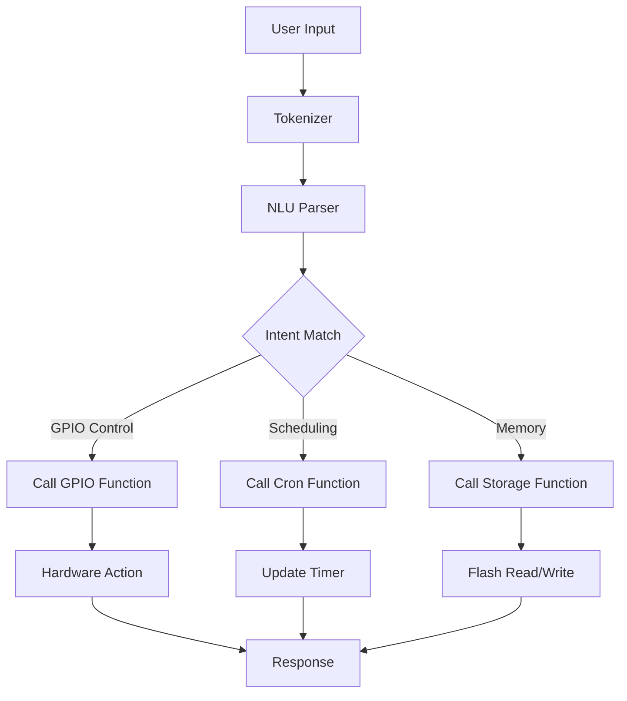

## 서론

현대의 AI 산업을 지배하는 트렌드는 '거대함(Giant)'입니다. 수천억 개의 파라미터를 가진 LLM(Large Language Model)이 등장하고, 이를 구동하기 위해서는 수십 기가바이트의 VRAM과 막대한 전력 소모가 필요합니다. 그러나 우리 주변에는 전력과 연산 능력에 극심한 제약이 있는 임베디드 환경이 존재합니다. 스마트 활동 추적기, 공장의 센서 노드, 혹은 우리가 흔히 쓰는 IoT 장치들은 클라우드 연결이 끊기거나 지연이 발생할 경우 아무런 도움을 받지 못합니다.

여기서 중요한 질문이 발생합니다. "정말로 모든 지능이 클라우드에 있어야 하는가?"에 대한 물음입니다. Edge AI와 TinyML 분야는 이 패러다임을 깨고자 노력해왔으나, 자연어 처리와 같은 복잡한 태스크를 마이크로컨트롤러 수준에서 구현하는 것은 여전히 '성지(Sanctuary)'와도 같았습니다.

'zclaw'는 이러한 고정관념을 깬 흥미로운 오픈소스 프로젝트입니다. ESP32라는 흔하고 저렴한 마이크로컨트롤러에서, 고작 888KB라는 놀라운 크기의 펌웨어로 개인용 AI 비서를 구현했습니다. 이는 단순히 모델 크기를 줄인 것이 아니라, 시스템 소프트웨어, 언어 처리 엔진, 그리고 하드웨어 제어 로직까지 C 언어로 긴밀하게 결합한 결과물입니다. 이 글에서는 zclaw가 어떻게 극한의 리소스 제약 안에서 자연어 기반의 하드웨어 제어를 구현했는지 그 기술적 원리와 아키텍처를 심층적으로 분석합니다.

## 본론

### 1. zclaw의 기술적 아키텍처와 원리

zclaw의 핵심은 "Python이 아닌 C 언어로 작성되었다"는 점입니다. 대부분의 Edge AI 프로토타이핑은 MicroPython이나 TensorFlow Lite for Microcontrollers를 기반으로 Python 레이어에서 이루어지지만, 인터프리터 언어의 오버헤드는 512KB SRAM과 4MB Flash를 가진 ESP32와 같은 환경에서는 치명적입니다. zclaw는 C 언어의 직접적인 메모리 관리와 낮은 수준의 하드웨어 접근 능력을 활용하여 불필요한 추상화 계층을 제거했습니다.

zclaw의 시스템은 크게 **자연어 이해(NLU) 파서**, **툴 레지스트리(Tool Registry)**, **실행 엔진(Execution Engine)**으로 구성됩니다. 사용자의 자연어 입력이 들어오면 시스템은 이를 파싱하여 미리 정의된 C 함수(툴)와 매핑하고, 필요한 경우 인자(Arguments)를 추출하여 실행합니다. 이 과정에서 가장 중요한 것은 사전 학습된 거대 언어 모델을 탑재하는 것이 아니라, **효율적인 의도 분류(Intent Classification)**와 **엔티티 추출(Entity Extraction)** 로직을 경량화하여 탑재했다는 점입니다.

다음은 zclaw의 내부 데이터 흐름을 간소화하여 나타낸 다이어그램입니다.



이 아키텍처는 각 기능을 모듈화하여 필요 없는 기능은 컴파일 타임에 제외할 수 있게 하여, 결과적으로 최종 펌웨어 크기를 888KB로 압축할 수 있었습니다.

### 2. 리소스 제약 환경에서의 기능 구현

zclaw는 단순한 "켜고 끄기"를 넘어, 복잡한 로직의 조합이 가능합니다. 특히 **Cron 스케줄링**과 **지속 메모리(Persistent Memory)** 기능은 임베디드 시스템에서 매우 구현하기 까다로운 부분입니다. 일반적으로 MQTT 프로토콜을 통해 서버에서 명령을 내리거나 복잡한 설정 파일을 파싱해야 하지만, zclaw는 자연어를 통해 이러한 설정을 즉석에서 처리합니다.

예를 들어, *"매일 아침 7시에 불을 켜고 5분 뒤에 꺼줘"*라는 명령어는 내부적으로 `cron` 테이블에 등록되고, `gpio` 툴과 `delay` 툴이 체이닝(Chaining)되어 실행됩니다.

#### 비교 분석: 기존 솔루션 vs zclaw

| 비교 항목 | 기존 Cloud-Connected IoT | MicroPython 기반 Edge AI | zclaw (C 기반) |
| :--- | :--- | :--- | :--- |
| **의존성** | 인터넷 연결 필수 | Python Interpreter (Heap 부하) | 순수 C (Zero Dependency) |
| **지연 시간 (Latency)** | 네트워크 지연 포함 (100ms+) | 인터프리터 지연 (10~50ms) | 네이티브 실행 (< 1ms) |
| **펌웨어 크기** | 최소 1MB+ (TLS 스택 등) | 최소 500KB+ (라이브러리) | **888KB (전체 시스템 포함)** |
| **하드웨어 제어** | 제한적 (서버 로직 의존) | 느림 (GIL 제약 등) | **직접적이고 즉각적** |
| **개발 난이도** | 클라우드/임베디드 병행 | 쉬움 (스크립트 언어) | 어려움 (시스템 프로그래밍) |

### 3. 구현 예시: C 언어로 된 툴 등록과 실행

zclaw의 개발자 경험(Developer Experience)은 C 코드 내에 함수를 정의하고, 이를 자연어 명령어와 매핑하는 방식으로 이루어집니다. 아래는 ESP32의 LED를 자연어로 제어하기 위한 가상의 C 코드 구현 예시입니다. 실제 zclaw 내부는 매크로나 함수 포인터 테이블을 통해 유사한 메커니즘을 사용합니다.

```c
#include <stdio.h>
#include "zclaw.h"

// 하드웨어 제어 함수 구현
void turn_on_led() {
    printf("Hardware: Turning on LED via GPIO...
");
    // gpio_set_level(LED_PIN, 1);
}

void turn_off_led() {
    printf("Hardware: Turning off LED...
");
    // gpio_set_level(LED_PIN, 0);
}

// 자연어 명령어와 C 함수 매핑
void setup_user_tools() {
    // zclaw_register_tool(명령어 패턴, 실행할 함수)
    
    // "불 켜줘", "라이트 온" 등의 입력이 들어오면 turn_on_led 실행
    zclaw_register_tool("turn on the light", turn_on_led);
    zclaw_register_tool("불 켜", turn_on_led);
    
    // "불 꺼줘", "라이트 오프" 등의 입력이 들어오면 turn_off_led 실행
    zclaw_register_tool("turn off the light", turn_off_led);
    zclaw_register_tool("불 꺼", turn_off_led);
    
    // 스케줄러 등록 예시
    // "매일 7시에 알림" -> cron 등록 로직
}

// 메인 루프
int main() {
    zclaw_init();
    setup_user_tools();
    
    // 시리얼 입력을 대기하며 자연어 처리 수행
    while(1) {
        char* input = read_serial_input();
        if (input) {
            zclaw_process(input);
        }
    }
    return 0;
}
```

이 코드는 매우 단순해 보이지만, 임베디드 환경에서 텍스트 파싱 후 함수 포인터를 통해 즉각적인 하드웨어 제어로 이어지는 흐름을 보여줍니다. Python을 사용할 경우 발생할 수 있는 가비지 컬렉션(Garbage Collection)에 의한 비결정적 지연이 없어, 실시간성이 요구되는 임베디드 제어에 최적화되어 있습니다.

### 4. 실무 적용 가이드 및 활용 전략

zclaw를 실제 프로젝트에 적용하기 위해서는 몇 가지 단계를 거쳐야 합니다. 이는 기존의 IoT 개발 방식과는 다른 접근이 필요합니다.

**Step 1: 환경 설정 및 빌드** zclaw는 ESP-IDF(Espressif IoT Development Framework) 환경을 기반으로 구축되어 있을 확률이 높습니다. 리포지토리를 클론한 후, `idf.py build` 명령어를 통해 펌웨어를 컴파일합니다. 이때 각 기능(GPU, Cron, NVS 등)은 `menuconfig`를 통해 필요한 것만 선택하여 빌드 크기를 최적화해야 합니다.

**Step 2: 자연어 의도(Intent) 정의** 사용자가 발화할 명령어를 사전에 정의하고 이를 C 함수로 매핑해야 합니다. zclaw는 생성형 AI가 아니라 지시형 AI이므로, 오픈 도메인의 대화보다는 정해진 기능(Tool)의 수행에 특화되어 있습니다. 따라서 "방 청소해 줘" 같은 명령은 사전에 `clean_room()` 함수와 연결되어 있어야 합니다.

**Step 3: 지속 메모리 활용** 전원을 꺼도 설정을 유지해야 하는 경우(예: 스케줄링 정보), ESP32의 NVS(Non-Volatile Storage) 플래시 파티션을 활용해야 합니다. zclaw는 자연어 명령으로 이 파티션에 데이터를 쓰고 읽는 기능을 제공하므로, 별도의 데이터베이스 구현 없이 설정 저장을 구현할 수 있습니다.

## 결론

zclaw는 AI 연구자와 엔지니어에게 중요한 통찰을 제공합니다. "좋은 AI는 언제나 크고 복잡하다"는 명제를 거짓으로 증명하며, **효율성과 도구적 합리성(Tool Use)**이 얼마나 강력한지를 보여주었습니다. 888KB라는 극도로 작은 용량 안에서 자연어 처리, 하드웨어 제어, 스케줄링이라는 복합적인 기능을 C 언어로 구현한 것은 소프트웨어 엔지니어링의 정수라 할 수 있습니다.

물론 zclaw는 ChatGPT와 같은 생성형 지능(Generative Intelligence)을 가지고 있지 않습니다. 그러나 Edge AI의 목적이 "사용자의 의도를 파악하여 하드웨어를 제어하는 것"이라면, 굳이 수십 기가바이트의 모델을 사용할 필요가 없습니다. 특히 프라이버시가 중요한 홈 시큐리티, 보안 관제, 혹은 인터넷 연결이 불안정한 산업 현장의 로컬 제어 시스템에서 zclaw와 같은 접근 방식은 차세대 Edge AI의 표준이 될 잠재력을 가지고 있습니다.

앞으로의 Edge AI 연구는 단순히 거대 모델을 양자화(Quantization)하여 끼워 넣는 것에서 나아가, zclaw처럼 하드웨어 특성에 맞춘 도구 중심의 언어 모델(Tool-oriented Language Model) 설계로 초점이 이동할 것입니다. 이는 "더 작게, 더 빠르게, 더 프라이빗하게"라는 TinyML의 궁극적인 목표와 일맥상통합니다.

### 참고자료

- **zclaw 프로젝트 개요**: [Hada.io - ESP32에서 888KB 이하로 구동되는 개인용 AI 비서 ‘zclaw’](https://news.hada.io/topic?id=26902)

- **TinyML 기술 보고서**: "TinyML: The Future of Machine Learning on Edge Devices", various IEEE conferences.

- **ESP-IDF 프로그래밍 가이드**: Espressif Systems Official Documentation.
