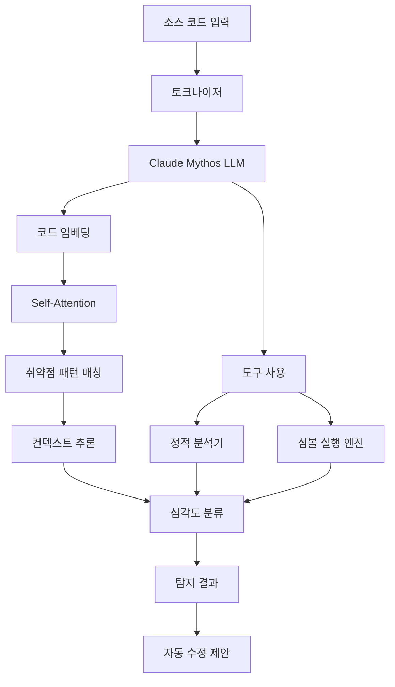
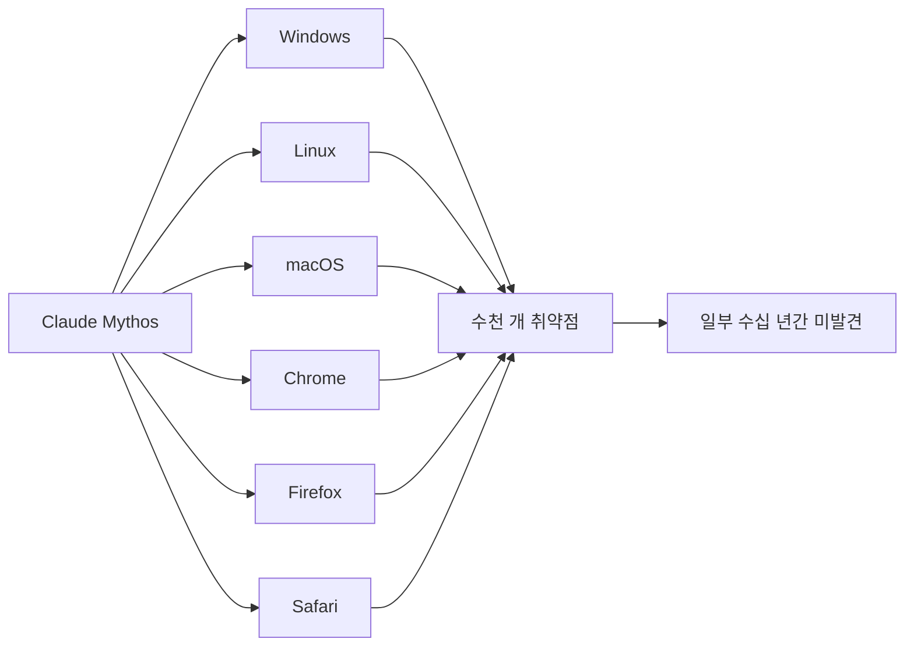

## 서론

2024년 12월, 보안 연구자 한 명이 Linux 커널의 메모리 관리 코드에서 이상한 패턴을 발견했다. 단순한 버그처럼 보였지만, 공격자가 커널 권한을 탈취할 수 있는 치명적인 취약점이었다. 놀랍게도 이 코드는 **15년 이상** 방치되어 있었다.

이것이 Zero-day 취약점의 현실이다. 현대 소프트웨어는 수천만 줄의 코드로 구성되어 있으며, 인간 분석가가 모든 경로를 검사하는 것은 불가능에 가깝다. 정적 분석 도구들이 존재하지만, 여전히 탐지하지 못하는 취약점들이 매년 수천 개씩 발견된다.

Anthropic이 최근 공개한 **Claude Mythos Preview**는 이 패러다임을 뒤집을 잠재력을 보여주었다. 단일 AI 모델이 모든 주요 운영체제와 웹 브라우저에서 "수천 개의 Zero-day 취약점"을 식별했다는 것이다. 이 글에서는 LLM이 어떻게 코드의 보안 취약점을 탐지하는지, 그 기술적 원리와 실무 적용 방안을 깊이 있게 분석한다.

## Zero-day 취약점과 기존 탐지 기법의 한계

### Zero-day 취약점이란?

Zero-day 취약점은 개발자나 보안 커뮤니티에 알려지지 않은 상태에서 공격자가 악용할 수 있는 소프트웨어 결함이다. 'Zero-day'라는 명칭은 개발사가 패치를 준비할 시간이 '0일'이라는 의미에서 유래했다.


### 기존 정적 분석 도구의 한계

전통적인 정적 분석(Static Application Security Testing, SAST) 도구들은 패턴 매칭과 데이터 플로우 분석에 의존한다. 하지만 다음과 같은 근본적 한계가 존재한다.

| 한계 유형 | 설명 | 영향 |
| :--- | :--- | :--- |
| **False Positive** | 정상 코드를 취약점으로 오탐 | 개발자 피로, 무시 관습 |
| **False Negative** | 실제 취약점 미탐지 | 보안 사고 직결 |
| **복잡한 제어 흐름** | 간접 호출, 동적 디스패치 분석 불가 | 대규모 프로젝트 한계 |
| **컨텍스트 이해 부족** | 비즈니스 로직 고려 못함 | 인증/인가 취약점 누락 |
| **난독화/패킹** | 변형된 코드 패턴 인식 실패 | 악성코드 탐지 한계 |

Coverity, Fortify, SonarQube 같은 도구들은 각각 10-30%의 False Positive율을 보이며, 복잡한 취약점 탐지율은 40-60%에 그친다. 이는 인간 전문가의 리뷰가 여전히 필수적임을 의미한다.

## LLM 기반 취약점 탐지의 원리

### Transformer의 코드 이해 능력

LLM이 코드를 이해할 수 있는 이유는 프로그래밍 언어도 결국 형식 문법을 가진 언어이기 때문이다. GPT-4, Claude 같은 대규모 언어 모델들은 수십억 줄의 오픈소스 코드를 학습하여 다음 능력을 획득했다.

1. **구문적 이해**: AST(Abstract Syntax Tree) 수준의 구조 파악
2. **의미적 이해**: 변수, 함수, 클래스의 역할과 관계 추론
3. **제어 흐름 분석**: 조건문, 반복문, 예외 처리 경로 추적
4. **데이터 흐름 분석**: 변수의 생명주기와 전파 경로 파악

### Claude Mythos의 추정 아키텍처

Anthropic은 Claude Mythos의 구체적 아키텍처를 공개하지 않았지만, 최신 연구 동향과 성능 특성을 바탕으로 다음과 같은 구조를 추정할 수 있다.



핵심은 LLM이 단순히 패턴을 매칭하는 것이 아니라, **코드의 의도와 실행 흐름을 이해**한다는 점이다. 예를 들어 다음과 같은 미묘한 취약점도 탐지할 수 있다.

```python
# 위험해 보이지 않지만 취약점이 있는 코드
def process_user_data(user_id: str, data: dict):
    cache_key = f"user:{user_id}"
    
    # 캐시에서 조회
    if cached := redis.get(cache_key):
        return json.loads(cached)
    
    # 데이터베이스 조회 (SQL Injection 위험)
    query = f"SELECT * FROM users WHERE id = '{user_id}'"
    result = db.execute(query)
    
    # Redis에 저장 (Redis Lua 스크립트 인젝션 위험)
    redis.set(cache_key, json.dumps(result))
    return result

# Claude Mythos가 탐지할 수 있는 취약점들:
# 1. SQL Injection (user_id 검증 없음)
# 2. Redis Lua Injection (JSON 직렬화 우회)
# 3. TOCTOU (Time-of-check to Time-of-use)
# 4. 메모리 누수 (대용량 결과 캐싱)
```

기존 SAST 도구는 SQL Injection 패턴은 탐지할 수 있지만, Redis Lua 인젝션이나 TOCTOU 같은 미묘한 취약점은 놓치기 쉽다. LLM은 컨텍스트를 종합적으로 이해하여 이러한 복합적 취약점을 탐지할 수 있다.

## 실제 취약점 탐지 예시

### Case Study: 메모리 안전 취약점 탐지

다음은 Claude Mythos가 탐지할 수 있는 메모리 안전 취약점의 예시다.

```c
// C 언어 버퍼 오버플로우 취약점
#include <string.h>
#include <stdlib.h>

typedef struct {
    char name[32];
    int age;
    char* bio;
} UserProfile;

int parse_profile(const char* input, UserProfile* profile) {
    char buffer[64];
    char* delim = strchr(input, '|');
    
    if (!delim) return -1;
    
    // 취약점 1: 경계 검사 없는 복사
    size_t name_len = delim - input;
    memcpy(profile->name, input, name_len);  // Buffer Overflow!
    profile->name[name_len] = '\0';
    
    // 취약점 2: 정수 오버플로우 가능성
    int bio_len = strlen(delim + 1);
    profile->bio = (char*)malloc(bio_len + 1);
    
    // 취약점 3: malloc 실패 체크 없음
    strcpy(profile->bio, delim + 1);
    
    // 취약점 4: Use-After-Free 위험
    free(buffer);  // 지역 변수 free (Undefined Behavior)
    
    return 0;
}
```

다음 C 코드의 위험 신호는 사람이 원본 코드와 실행 경로를 확인해 분석해야 합니다. [Project Glasswing 발표](https://www.anthropic.com/glasswing)에 따르면 Mythos Preview는 미출시 모델이며 참여 기관에 한정해 제공되었습니다. 따라서 공개 Claude API에서 호출 가능한 모델 ID나 재현 가능한 분석 결과로 제시할 수 없습니다.

일반적인 방어적 검토에서는 입력 길이 검사, 동적 메모리 수명, NULL 검사 여부를 점검하고 확인된 문제만 보고서에 기록합니다.

### 탐지 결과 해석

위 C 조각의 예시 취약점을 실제 모델의 탐지 출력이나 검증된 행 번호로 오해해서는 안 됩니다. 분석 결과는 빌드·테스트 및 사람이 확인한 근거에 따라 별도로 작성해야 합니다.

## Claude Mythos의 대규모 탐지 성과

### 탐지 규모와 범위

Tom's Hardware 보도에 따르면, Claude Mythos Preview는 다음 환경에서 취약점을 탐지했다.



특히 주목할 점은 **"일부 취약점이 수십 년간 패치되지 않은 상태로 방치되어 있었다"**는 것이다. 이는 기존 정적 분석 도구와 인간 코드 리뷰어가 놓친 취약점을 LLM이 발견했음을 의미한다.

### Zero-day 탐지의 기술적 난제

Zero-day 취약점 탐지는 기계학습 관점에서 다음과 같은 어려움이 있다.

1. **데이터 불균형**: 취약점이 있는 코드는 전체 코드의 극히 일부
2. **패턴 다양성**: 동일한 취약점도 다양한 형태로 나타남
3. **복잡한 인과관계**: 버그와 취약점의 경계가 모호함
4. **진화하는 공격 기법**: 새로운 익스플로잇 패턴 지속 등장

Claude Mythos는 이러한 난제를 **대규모 사전학습**과 ** chain-of-thought 추론**으로 극복한 것으로 보인다.

## 실무 적용: LLM 기반 취약점 탐지 구축 가이드

### Step 1: 환경 설정

```bash
# 필요한 패키지 설치
pip install anthropic tree-sitter tree-sitter-languages

# 프로젝트 클론
git clone https://github.com/your-org/vuln-detector
cd vuln-detector
```

### Step 2: 코드 파싱 및 전처리

Tree-sitter로 소스 파일을 구문 트리로 변환한 뒤 함수·클래스·import 노드를 순회해 분석 대상을 추출할 수 있습니다. 언어별 노드 유형과 바이트 오프셋을 확인하고, 추출한 코드의 위치를 원본 파일의 행 번호와 함께 보관해야 합니다.

---

**출처**: [https://news.google.com/rss/articles/CBMilwNBVV95cUxNeVNxbjUyYXItSDBNbzRLbHR1OVE4RlFOai1ybUJQWnlPRzhaM1R0eDUxWmd3SW1rbnBqbmR6UVdTQkhpRTdCOUY0aWRwNXAybWYwcDVscFNma3BlZzB4ajFUdEdPcDJQWmNYZFA5aW9xZGt3eUZCYW9qa3A1Q1VaczZWM3NJQUc4RUd4RlZLLWtORzdoOWdYd2Q5bXlObzRSdGxGd1FSYXNEczRZMHdUZ1BfbEZuc3M2c01LZXk2OTJLVkppQmd4ZW5uc3JzMGEyUlB3c0wyallma2VIX3ljQ2d0TzR0Wk9kNHd4WUFFdlZLRXZzNTkxU0dManE3RGlnVThmWXlybmo2RmlkbWZtd2ZhdXBOMWRHMTNXM3gzVW0wSzdpN1BGRVdITlhxOXREaHd3TDRCS3VjTkIxXzZaSmJoQnBKdUZRLXc2MTN1M0VpUFM2MGhmM2NidVBJb1R3OW43U1FrbkoxU0QzRE5HblhTN3EyN0FfY2FJRDRwc3JGTHEwaExtbGlpWjdtTHJNa0N0cFkwOA?oc=5](https://news.google.com/rss/articles/CBMilwNBVV95cUxNeVNxbjUyYXItSDBNbzRLbHR1OVE4RlFOai1ybUJQWnlPRzhaM1R0eDUxWmd3SW1rbnBqbmR6UVdTQkhpRTdCOUY0aWRwNXAybWYwcDVscFNma3BlZzB4ajFUdEdPcDJQWmNYZFA5aW9xZGt3eUZCYW9qa3A1Q1VaczZWM3NJQUc4RUd4RlZLLWtORzdoOWdYd2Q5bXlObzRSdGxGd1FSYXNEczRZMHdUZ1BfbEZuc3M2c01LZXk2OTJLVkppQmd4ZW5uc3JzMGEyUlB3c0wyallma2VIX3ljQ2d0TzR0Wk9kNHd4WUFFdlZLRXZzNTkxU0dManE3RGlnVThmWXlybmo2RmlkbWZtd2ZhdXBOMWRHMTNXM3gzVW0wSzdpN1BGRVdITlhxOXREaHd3TDRCS3VjTkIxXzZaSmJoQnBKdUZRLXc2MTN1M0VpUFM2MGhmM2NidVBJb1R3OW43U1FrbkoxU0QzRE5HblhTN3EyN0FfY2FJRDRwc3JGTHEwaExtbGlpWjdtTHJNa0N0cFkwOA?oc=5)