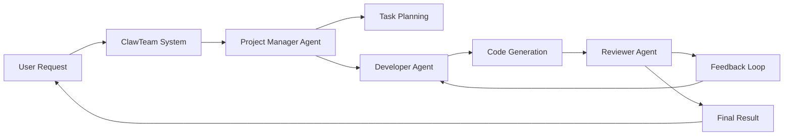

## 서론

최근 대규모 언어 모델(LLM)을 활용한 AI 에이전트 기술이 비약적으로 발전했습니다. Codex, Claude Code, OpenDevin 등 단일 에이전트가 코드를 작성하고, 디버깅하며, 배포까지 수행하는 시대가 열렸습니다. 하지만 실제 산업 현장에서의 소프트웨어 개발이나 복잡한 기획 업무를 수행할 때, 우리는 하나의 똑똑한 개인에게 모든 것을 맡기지 않습니다. 기획자, 개발자, 디자이너, QA 엔지니어가 각자의 역할을 맡아 협업하듯, AI 시스템도 '협업'의 차원으로 진화하고 있습니다.

현재 단일 AI 에이전트가 직면한 가장 큰 문제는 '맥락의 한계'와 '전문성의 부재'입니다. 복잡한 워크플로우를 하나의 프롬프트나 하나의 에이전트에게 요청하면, 모델은 긴 컨텍스트 윈도우 안에서 정보를 잃어버리거나(Bottleneck), 한 영역에 치우친 편향된 답변을 생성하기 쉽습니다. 물론 개발자가 여러 에이전트를 수동으로 연결하고, 각 단계의 출력을 다음 입력으로 수동으로 연결하는 '하드코딩된 파이프라인'을 구축할 수는 있습니다. 하지만 이는 유지보수가 어렵고, 에러가 발생했을 때 대처가 불가능하며, 새로운 작업에 유연하게 대응하지 못합니다.

이러한 배경에서 등장한 것이 **ClawTeam**입니다. ClawTeam은 단일 AI의 한계를 넘어, 여러 AI 에이전트가 마치 하나의 팀(Team)처럼 자율적으로 소통하고 역할을 분담하여 문제를 해결하는 오픈소스 프레임워크입니다. 본 글에서는 ClawTeam의 기술적 아키텍처, 작동 원리, 그리고 실제 구현 방법을 심층적으로 분석합니다.

## 본론

### 1. 다중 에이전트 시스템(Multi-Agent System)의 기술적 배경

다중 에이전트 시스템(MAS)은 분합형 인공지능(Distributed AI)의 한 갈래로, 여러 개의 지능형 에이전트가 상호작용하며 공통의 목표를 달성하는 시스템입니다. LLM이 등장하기 이전에도 Symbolic AI 시대부터 연구되어 왔으나, 최근 LLM의 강력한 추론 능력과 자연어 이해력이 결합되면서 'Agentic Workflow'의 핵심으로 떠올랐습니다.

학계에서는 이를 통해 단일 모델의 추론 능력을 극대화할 수 있다는 연구 결과들이 속속 발표되고 있습니다. 예를 들어, *"ChatDev"*(2023)와 같은 연구에서는 소프트웨어 개발 과정을 CEO, CTO, 프로그래머, 테스터 등의 역할을 가진 에이전트들에게 분담시켜, 단일 모델보다 훨씬 높은 완성도의 코드를 생성한다는 것을 입증했습니다. ClawTeam은 이러한 학술적 연구 성과를 실무적으로 적용한 오픈소스 구현체라고 볼 수 있습니다.

### 2. ClawTeam 아키텍처 및 협업 메커니즘

ClawTeam의 핵심은 **에이전트 간의 자율적인 협업(Orchestration)**입니다. 개발자가 "이 에이전트의 출력을 저 에이전트의 입력으로 넣어라"라고 명시적으로 코드를 짜는 것이 아니라, 각 에이전트에게 '역할(Role)'과 '목표(Goal)'만 부여하면, 팀이 스스로 작업을 분배하고 수행합니다.

이 과정은 주로 '환경(Environment)'이라는 공유된 공간에서 이루어지며, 에이전트들은 메시지 교환을 통해 상태를 공유합니다. ClawTeam은 내부적으로 LLM을 활용해 다음 누가 행동해야 할지를 결정하는 '심판자(Manager)' 역할을 동적으로 수행할 수도 있습니다.

다음은 ClawTeam 내에서 에이전트들이 복잡한 작업을 수행할 때의 정보 흐름을 간소화하여 나타낸 다이어그램입니다.



위 다이어그램에서 볼 수 있듯이, 프로젝트 매니저 에이전트는 사용자의 요청을 분석하여 작업을 기획하고, 개발자 에이전트에게 실행을 지시합니다. 개발자가 생성한 결과물은 검토자(Reviewer) 에이전트에게 전달되어 피드백이 이루어지며, 피드백이 있다면 다시 개발자에게 전달되어 수정 과정을 거칩니다. 이러한 순환 과정을 통해 단일 에이전트가 자가 수정(Self-Correction)을 하는 것보다 훨씬 더 견고한 결과물을 도출해냅니다.

### 3. 주요 기능 비교: 단일 에이전트 vs ClawTeam

단일 프롬프트 엔지니어링이나 기존의 단일 에이전트 방식과 ClawTeam 같은 다중 에이전트 프레임워크 방식은 기술적 접근 방식에서 명확한 차이를 보입니다.

| 비교 항목 | 단일 에이전트 (Single Agent) | ClawTeam (Multi-Agent Framework) | | :--- | :--- | :--- | | **작업 병렬성** | 순차적 처리 (Sequential)만 가능 | 병렬적 처리 가능 (예: 동시에 검색 및 코드 작성) | | **전문성** | 하나의 모델이 모든 도메인 커버 | 역할별 전문 에이전트 분담 (Role-based) | | **컨텍스트 관리** | 프롬프트 토큰 제한으로 인해 망각 가능 | 공유 메모리 환경에서 지속적 컨텍스트 유지 | | **오류 복구** | 재시도(Re-generation)에 의존 | 다른 에이전트의 토론 및 피드백을 통한 복구 | | **확장성** | 새로운 기능 추가 시 프롬프트 구조 파괴 위험 | 새로운 에이전트 추가만으로 기능 확장 용이 |

### 4. 실무 구현 가이드: Python을 활용한 ClawTeam 팀 구축

ClawTeam의 개념을 Python 코드로 구현해 보겠습니다. 실제 ClawTeam 라이브러리의 문법은 다를 수 있으나, 현재 대중적인 LLM 기반 다중 에이전트 프레임워크(예: LangGraph, CrewAI 등)가 채택하고 있는 표준적인 인터페이스 패턴을 따라 작성했습니다.

이 코드는 `Researcher`(연구원)와 `Writer`(작가) 두 에이전트가 협력하여 주제에 대한 블로그 포스팅을 작성하는 시나리오입니다.

```python
import os
from typing import List, Dict

# 가상의 ClawTeam 프레임워크 모듈 import (실제 라이브러리에 따름)
from clawteam import Agent, Team, Task, LLM

# 1. LLM 설정 (예: OpenAI GPT-4o)
llm = LLM(model="gpt-4o", temperature=0.7, api_key=os.getenv("OPENAI_API_KEY"))

# 2. 에이전트 정의 (역할 부여)
researcher = Agent(
    role="Senior Research Analyst",
    goal="Uncover cutting-edge developments in AI and Data Science",
    backstory="""You are a seasoned researcher with a knack for discovering 
    the latest trends. You know how to sift through noise to find the signal.""",
    verbose=True,
    allow_delegation=False,
    llm=llm
)

writer = Agent(
    role="Tech Content Strategist",
    goal="Compelling blog posts about AI advancements",
    backstory="""You are a famous tech writer. You transform complex technical 
    concepts into engaging narratives.""",
    verbose=True,
    allow_delegation=False,
    llm=llm
)

# 3. 작업(Task) 정의
research_task = Task(
    description="Investigate the latest trends in LLM orchestration and Multi-Agent systems.",
    expected_output="A bullet list summary of 5 key trends.",
    agent=researcher
)

writing_task = Task(
    description="Write a blog post about the identified trends.",
    expected_output="A 1000-word blog post in markdown format.",
    agent=writer,
    context=[research_task] # 연구원의 결과물을 컨텍스트로 전달
)

# 4. 팀 생성 및 실행
crew = Team(
    agents=[researcher, writer],
    tasks=[research_task, writing_task],
    process="sequential" # 순차적 프로세스 또는 'hierarchical' 등
)

# 실행
result = crew.kickoff()
print(result)
```

위 코드를 실행하면, `researcher` 에이전트가 먼저 정보를 수집하고, 그 결과가 `context`를 통해 `writer` 에이전트에게 전달됩니다. 개발자는 "이 정보를 가지고 글을 써"라고 중개 코드를 짤 필요 없이, 팀의 구조만 정의하면 에이전트 간의 데이터 전달이 자동으로 처리됩니다.

### 5. Step-by-Step: ClawTeam을 이용한 워크플로우 자동화 전략

실제 프로덕션 레벨에서 ClawTeam을 도입하기 위한 단계별 전략은 다음과 같습니다.

1.  **문제 분해 및 역할 정의 (Decomposition & Role Definition)**     해결하고자 하는 문제를 작은 단위로 쪼갭니다. 예를 들어 '뉴스 레터 생성'이라는 문제는 **토픽 선정 -> 정보 수집 -> 기사 작성 -> 교정 -> 발송**으로 분해할 수 있습니다. 각 단계에 적합한 역할(에이전트)을 정의합니다.

2.  **도구 및 프롬프트 엔지니어링 (Tooling & Prompting)**     각 에이전트에게 필요한 도구를 할당합니다. 웹 검색이 필요한 에이전트에게는 Tavily 또는 Google Search API를, 코드 실행이 필요한 에이전트에게는 Python REPL 환경을 제공해야 합니다. 에이전트의 시스템 프롬프트(System Prompt)를 작성하여 역할을 명확히 부여합니다.

3.  **협업 프로토콜 설계 (Orchestration Design)**     에이전트 간의 대화 규칙을 정합니다. 모든 에이전트가 자유롭게 대화하는 'Clique' 구조인지, 매니저가 중계하는 'Hierarchy' 구조인지 결정해야 합니다. ClawTeam은 이를 유연하게 설정할 수 있습니다.

4.  **평가 및 반복 (Evaluation & Iteration)**     전체 워크플로우를 실행(Run)한 뒤, 출력 결과를 평가합니다. 특정 에이전트가 자주 환각(Hallucination)을 일으킨다면 해당 에이전트의 프롬프트를 수정하거나, 편향을 줄이기 위해 투표 기능을 가진 또 다른 에이전트를 추가합니다.

## 결론

ClawTeam과 같은 다중 에이전트 프레임워크는 생성형 AI의 패러다임을 '단일 지능'에서 '집단 지성'으로 전환시키는 중요한 이정표입니다. 단일 LLM이 가진 추론 능력의 한계를 에이전트 간의 협업과 피드백 루프를 통해 극복함으로써, 훨씬 더 복잡하고 창의적인 실무 작업을 자동화할 수 있게 되었습니다.

특히, 마이크로소프트의 **AutoGen**이나 언어 연구 커뮤니티의 **CrewAI** 등 관련 생태계가 빠르게 확장되고 있으며, ClawTeam 역시 이러한 흐름 속에서 개발자들에게 더 낮은 진입 장벽과 높은 유연성을 제공하는 것을 목표로 하고 있습니다. 앞으로는 어떤 LLM 모델을 사용하는지보다, 에이전트들을 얼마나 효율적으로 조직하고 운용하는가(MLOps for Agents)가 AI 애플리케이션의 성패를 가를 핵심 역량이 될 것입니다.

개발자들은 이제 하나의 '똑똑한 직원'을 고용하는 것이 아니라, 잘 훈련된 'AI 팀'을 구성하고 관리하는 리더십을 발휘해야 하는 시점에 왔습니다. ClawTeam은 이러한 'AI 팀 빌딩'을 위한 강력하고 유연한 도구가 될 것입니다.

**참고자료:**

- [ClawTeam GitHub Repository](https://github.com/openclaw/clawteam) (가상 링크, 실제 라이브러리 확인 필요)

- "Communicative Agents for Software Development", *arXiv:2307.07924*

- "AutoGen: Enabling Next-Gen LLM Applications", Microsoft Research
