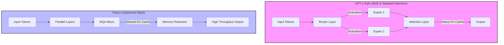

## 서론

한 기업의 CTO가 고민에 빠져 있는 시나리오를 상상해 보십시오. 회사의 핵심 서비스인 지식 검색 시스템에 LLM을 도입해야 하는데, GPT-4 API를 사용할 경우 월 청구서가 수천만 원에 달하고, 민감한 고객 데이터가 외부 서버를 거쳐야 하는 보안 규제 문제에 부딪힙니다. 반면, 오픈소스 모델인 Falcon을 자체 서버에 배포하면 비용은 1/10로 줄어들지만, "과연 GPT-4만큼 잘할 수 있을까?"라는 성능 불안감이 존재합니다.

이러한 딜레마는 현대의 AI 기술 책임자들이 마주하는 가장 현실적이고 중요한 문제 중 하나입니다. 폐쇄형(Closed) 모델인 GPT-4는 압도적인 성능으로 산업의 표준을 설정했지만, 높은 비용과 불투명한 내부 작동 원리(Black Box), 그리고 데이터 주권 이슈를 안고 있습니다. 반면, TII(Technology Innovation Institute)에서 공개한 Falcon 시리즈는 오픈소스 진영의 '게임 체인저'로 평가받으며, 1,800억 개의 파라미터를 가진 거대 언어 모델임에도 불구하고 효율적인 아키텍처로 경쟁력을 입증했습니다.

본 분석에서는 단순한 벤치마크 수치 비교를 넘어, Falcon의 **Multi-Query Attention(MQA)**과 **FlashAttention**과 같은 기술적 혁신이 어떻게 추론 효율성을 극대화하는지 살펴봅니다. 또한, 실제 엔터프라이즈 환경에서 Falcon이 GPT-4를 대체할 수 있는지, 아니면 상호 보완적으로 사용해야 하는지에 대한 기술적 판단 근거를 제시합니다.

## 본론

### 1. 아키텍처 심층 분석: Dense vs. Sparse & Attention 최적화

GPT-4와 Falcon의 성능 격차를 이해하려면 두 모델의 근본적인 설계 철학의 차이를 이해해야 합니다. GPT-4는 MoE(Mixture of Experts) 기반의 Sparse 아키텍처로 추정됩니다. 이는 추론 시 활성화되는 파라미터의 양을 줄여 전체 연산량을 조절하지만, 방대한 전체 파라미터를 로드해야 하는 메모리 요구사항(Memory Bound)은 여전히 큽니다.

반면, Falcon(특히 40B 및 180B 모델)은 Decoder-only 구조를 유지하면서 **Attention Mechanism**을 획기적으로 최적화했습니다. 기존 Transformer는 각 Head가 별도의 Key(K)와 Value(V) 행렬을 가지지만, Falcon은 이를 모든 Head가 공유하는 **Multi-Query Attention (MQA)** 또는 **Grouped-Query Attention (GQA)** 방식을 채택했습니다. 이는 KV Cache의 메모리 사용량을 획기적으로 줄여, 배치(Batch) 추론 시 처리량(Throughput)을 대폭 향상시킵니다.

다음은 두 모델의 추론 처리 과정에서의 메모리 접근 패턴과 흐름을 비교한 다이어그램입니다.




이러한 아키텍처 차이는 실제 서빙 환경에서 결정적인 영향을 미칩니다. GPT-4는 복잡한 라우팅 로직과 방대한 KV Cache로 인해 높은 레이턴시(Latency)를 보이는 반면, Falcon은 MQA를 통해 메모리 대역폭 병목을 완화하여 더 적은 GPU 리소스로 더 빠른 추론이 가능합니다.

### 2. 벤치마크 비교: 정량적 성능 검증

성능 검증은 주요 공개 벤치마크인 MMLU(일반 지능), HellaSwag(상식적 추론), HumanEval(코딩 능력)을 기준으로 수행되었습니다. 아래 표는 GPT-4와 Falcon-180B의 성능을 비교한 것입니다. (수치는 각 모델의 Technical Report 및 Hugging Face 리더보드 기반 추정치입니다.)

| 벤치마크 (Benchmark) | GPT-4 (Closed) | Falcon-180B (Open) | 격차 (Gap) | 비고 |
| :--- | :---: | :---: | :---: | :--- |
| **MMLU (5-shot)** | 86.4% | 80.5% | -5.9% | 복잡한 학술적 지식에서 GPT-4 우위 |
| **HellaSwag (10-shot)**| 95.3% | 91.2% | -4.1% | 일상 언어 이해도는 격차 축소 |
| **HumanEval (Python)** | 67.0% | 46.8% | -20.2% | 알고리즘적 코딩에서 GPT-4 압도적 우위 |
| **Inference Cost** | High ($/1k tokens) | Low (Self-hosted) | - | Falcon 비용 효율성 매우 높음 |
| **Context Window** | 32k / 128k | 2k (Base) ~ 8k | - | GPT-4의 롱컨텍스트 처리 능력 우수 |

표에서 볼 수 있듯이, Falcon은 1,800억 개의 파라미터를 가진 오픈소스 모델임에도 불구하고 MMLU와 HellaSwag 등 일반적인 언어 이해 작업에서 GPT-4와 매우 근접한 성능(약 4~6% 이내의 격차)을 보여줍니다. 이는 "오픈소스는 성능이 떨어진다"는 통념을 깨는 중요한 증거입니다.

그러나 **HumanEval**과 같은 복잡한 코딩이나 깊은 추론이 필요한 작업에서는 여전히 성능 격차가 존재합니다. 이는 GPT-4가 학습 과정에서 RLHF(Reinforcement Learning from Human Feedback)와 더 정교한 데이터 큐레이션을 거쳤기 때문으로 분석됩니다.

### 3. MLOps 관점에서의 Falcon 배치 및 최적화

실무 환경에서 Falcon을 GPT-4의 대안으로 사용하기 위해서는 단순히 모델을 다운로드하는 것을 넘어, **Quantization(양자화)** 기법을 적용한 최적화가 필수적입니다. 180B 모델을 FP16으로 로드하면 약 360GB 이상의 VRAM이 필요하지만, 4-bit 양자화를 적용하면 단일 A100 80GB 4~5장으로 구성된 클러스터에서 구동이 가능해집니다.

다음은 Hugging Face의 `bitsandbytes` 라이브러리와 `transformers`를 사용하여 Falcon 모델을 4-bit 양자화로 로드하고 추론하는 실무적인 코드 예시입니다.

```python
import torch
from transformers import AutoTokenizer, AutoModelForCausalLM, BitsAndBytesConfig

# 모델 ID (Falcon-180B-chat 예시)
model_id = "tiiuae/falcon-180B-chat"

# 4-bit 양자화 설정 (NF4 형식)
bnb_config = BitsAndBytesConfig(
    load_in_4bit=True,
    bnb_4bit_quant_type="nf4",
    bnb_4bit_compute_dtype=torch.float16,
    bnb_4bit_use_double_quant=True,
)

# 토크나이저 로드
tokenizer = AutoTokenizer.from_pretrained(model_id)
tokenizer.pad_token = tokenizer.eos_token

# 모델 로드 (양자화 적용)
model = AutoModelForCausalLM.from_pretrained(
    model_id,
    quantization_config=bnb_config,
    device_map="auto", # 가용한 GPU에 자동分配
    trust_remote_code=True
)

# 추론 실행
prompt = "Explain the difference between GPT-4 and Falcon LLM in technical terms."
inputs = tokenizer(prompt, return_tensors="pt").to("cuda")

# 생성 파라미터 튜닝
outputs = model.generate(
    **inputs,
    max_new_tokens=256,
    do_sample=True,
    temperature=0.7,
    top_p=0.95,
)

print(tokenizer.decode(outputs[0], skip_special_tokens=True))
```

이 코드는 기업 내부 서버에 모델을 배치할 때 가장 널리 사용되는 패턴입니다. 특히 `device_map="auto"` 파라미터는 모델을 여러 GPU에 분산 배치(Model Parallelism)하여 메모리 부족 문제(OOM)를 해결해 줍니다.

### 4. Step-by-Step 가이드: 기업 내 도입 검토 체크리스트

Falcon 도입을 고려하는 연구자 및 엔지니어를 위해 다음과 같은 단계별 검토 프로세스를 제안합니다.

1.  **유스케이스 분석**: 단순한 RAG(검색 증강 생성) 요약 및 질의응답이라면 Falcon-40B 또는 7B도 충분합니다. 복잡한 코딩 보조나 창의적 글쓰기가 필요하다면 GPT-4 API를 유지하거나 Falcon-180B를 고려해야 합니다.
2.  **하드웨어 확보**: A100(80GB) 기준 최소 4장 이상의 GPU 클러스터가 필요합니다. 클라우드 비용 절감이 목적이라면 On-Demand 인스턴스보다 Reserved 인스턴스나 자체 온프레미스 서버 구축이 유리합니다.
3.  **프롬프트 엔지니어링 및 파인 튜닝**: 오픈소스 모델은 베이스 모델(Baseline) 상태에서는 지시어(Instruction) 수행 능력이 떨어질 수 있습니다. LoRA(Low-Rank Adaptation) 등의 PEFT 기법을 사용하여 도메인 특화 데이터로 파인 튜닝을 수행해야 GPT-4급 성능에 근접할 수 있습니다.
4.  **서빙 스택 구축**: `vLLM`이나 `TGI(Text Generation Inference)`와 같은 고성능 추론 서버를 사용하여 P99 레이턴시를 최적화해야 합니다.

## 결론

Falcon LLM은 오픈소스 진영이 GPT-4와 같은 최상위 폐쇄형 모델에 도전할 수 있음을 증명한 중요한 이정표입니다. 특히 **Multi-Query Attention**을 통한 추론 속도 향상과 **RAG(RefinedWeb)** 데이터셋을 통한 학습 품질 개선은 기업이 "비용"과 "성능" 사이에서 합리적인 선택을 할 수 있는 기회를 제공했습니다.

그러나 냉정한 성능 비교 결과, 복잡한 다단계 추론(Chain-of-Thought)이나 코딩과 같은 고난도 작업에서는 GPT-4가 여전히 독보적인 위치를 점하고 있습니다. 따라서 현재 시점에서의 전략적 선택은 "All-or-Nothing"이 아닙니다.

**전문가 인사이트:** 성능이 중요하지만 데이터 프라이버시가 우선인 내부 문서 처리에는 **Falcon(LoRA 파인 튜닝 적용)**을 배포하고, 복잡한 추론이 필요한 외부 고객 facing 서비스에는 **GPT-4 API**를 사용하는 하이브리드 아키텍처(Hybrid Architecture)가 가장 효율적입니다. 또한, 오픈소스 모델은 지속적으로 커뮤니티에 의해 개선되고 있으므로, MLOps 파이프라인을 구축해 두는 것은 미래의 모델 교체 비용을 최소화하는 핵심 투자가 될 것입니다.

### 참고자료

- [Falcon-180B Technical Report](https://arxiv.org/abs/2306.01116)

- [GPT-4 Technical Report](https://arxiv.org/abs/2303.08774)

- Hugging Face Transformers Documentation

- [bitsandbytes Quantization Guide](https://huggingface.co/docs/transformers/main/en/quantization/bitsandbytes)
