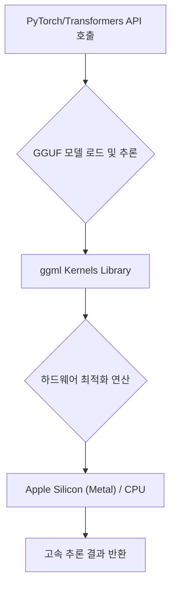

최근 LLM의 급격한 발전은 엄청난 잠재력을 보여주었지만, 동시에 치명적인 단점도 안고 있습니다. 바로 '모델 크기'와 '추론 복잡성'입니다. 수십억 개의 파라미터로 구성된 최신 모델들은 GPU 메모리(VRAM)를 대량으로 소모하며, 이를 로컬 환경에서 구동하려면 복잡한 빌드 과정과 환경 설정이 필수적입니다. 특히, Apple Silicon과 같은 고효율 통합 메모리 아키텍처를 가진 기기에서 최고의 성능을 끌어내기란 쉽지 않은 과제였습니다.

이러한 배경 속에서, `llama.cpp`는 로컬 AI 생태계를 혁신적으로 변화시킨 핵심 엔진으로 자리 잡았습니다. `llama.cpp`가 개발한 GGUF(GPT-GEneration Unified Format)는 모델 가중치와 토크나이저 정보, 심지어 채팅 템플릿까지 단일 파일에 압축하여 모델 배포의 장벽을 획기적으로 낮췄습니다. 이제 Hugging Face의 Transformers 라이브러리가 GGUF 지원을 공식화하면서, 우리는 복잡한 설정 없이도 표준 PyTorch API를 통해 이 강력한 로컬 추론 성능을 손쉽게 활용할 수 있게 되었습니다. 이는 단순히 모델을 로드하는 것을 넘어, LLM을 개인 기기에서 '마법처럼' 구동할 수 있는 시대를 열었음을 의미합니다.

## GGUF와 ggml: 로컬 추론의 근간 원리

GGUF의 핵심 가치는 **압축된 저장 형식**과 **재사용 가능한 커널(Kernel) 구조**에 있습니다.

### 1. GGUF 파일 포맷의 이해

GGUF는 모델의 모든 구성 요소를 하나의 파일로 패키징합니다. 여기서 중요한 것은 '양자화(Quantization)'입니다. 양자화는 모델의 가중치(Weights)를 높은 정밀도(예: BF16, FP32)에서 낮은 정밀도(예: 4-bit, 5-bit)로 변환하는 과정입니다. 이 과정을 통해 모델의 메모리 풋프린트(Memory Footprint)를 크게 줄이면서도, 허용 가능한 수준의 정밀도 손실(Quality Tradeoff)을 유지할 수 있습니다.

예를 들어, Q4\_K\_M과 같은 변형은 대부분의 텐서에 4비트 정밀도를 사용하면서도, 민감한(Sensitive) 텐서에는 더 높은 정밀도를 유지하여 성능 저하를 최소화하는 실용적인 접근 방식을 취합니다.

### 2. ggml 커널의 재활용 (Kernel Reuse)

Transformers가 GGUF를 효율적으로 처리할 수 있는 비결은 `llama.cpp`의 핵심 엔진인 `ggml` 커널을 재사용한다는 점입니다. Transformers는 내부적으로 `kernels` 라이브러리를 통해 `ggml`의 저수준 연산(Low-level Operations)을 호출합니다.

이는 다음과 같은 흐름으로 작동합니다:
1. **사용자 요청**: PyTorch/Transformers API를 통해 GGUF 모델 로드 및 추론 요청.
2. **Transformers**: GGUF 파일 구조를 파싱하고, 메모리에 모델을 로드.
3. **Kernel Dispatch**: 로드된 가중치와 연산(Attention, Matrix Multiplication 등)을 `ggml` 커널로 전달.
4. **Hardware Acceleration**: `ggml`은 해당 하드웨어(예: Apple Silicon의 Metal 백엔드)에 최적화된 연산을 실행하여 메모리 오버헤드를 최소화하고 고속 추론을 달성합니다.



## Transformers를 활용한 GGUF 통합 실무 가이드

GGUF 지원은 단순한 기능 추가가 아니라, 개발 워크플로우 자체를 표준화합니다. 사용자는 더 이상 복잡한 `ggml` 파라미터나 커스텀 로더를 신경 쓸 필요 없이, 기존의 `from_pretrained` 메소드를 사용하면 됩니다.

### 1. GGUF 로드 및 추론 코드 예시

GGUF 모델을 로드할 때는 `gguf_file` 인자만 추가해주면 됩니다. Transformers는 자동으로 해당 모델에 맞는 `ggml/Metal` 레이어 커널을 찾아 사용합니다.

```python
import torch
from transformers import AutoModelForCausalLM, AutoTokenizer

# GGUF 모델 ID 및 파일명 지정
model_id = "unsloth/Qwen3.5-4B-GGUF" 
filename = "Qwen3.5-4B-Q4_K_M.gguf" 

# 1. 토크나이저 로드 (GGUF 파일 지정)
tokenizer = AutoTokenizer.from_pretrained(model_id, gguf_file=filename)

# 2. 모델 로드 (GGUF 파일 지정)
model = AutoModelForCausalLM.from_pretrained(
    model_id,
    gguf_file=filename
)

# 3. 표준 Transformers API를 이용한 추론
messages = [{ "role" : "user" , "content" : "왜 하늘은 파란가요? 몇 문장으로 설명해주세요." }]
inputs = tokenizer.apply_chat_template(
    messages,
    tokenize= True ,
    add_generation_prompt= True ,
    return_dict= True ,
    return_tensors= "pt" ,
).to(model.device)

with torch.inference_mode():
    outputs = model.generate(**inputs, max_new_tokens= 256 )
    
print (tokenizer.decode(outputs[ 0 ], skip_special_tokens= True ))
```

### 2. 양자화 레벨별 트레이드오프 비교

어떤 GGUF 파일을 선택할지는 사용자의 하드웨어 제약과 요구되는 정밀도에 따라 달라집니다. 다음 표는 Unsloth의 Qwen3.5-4B 모델을 기준으로 한 주요 양자화 레벨의 트레이드오프를 보여줍니다.

| GGUF Variant | 파일 크기 (Tradeoff) | 정밀도 수준 | 실무 적용 권장 사항 |
| :--- | :--- | :--- | :--- |
| **BF16** | 8.42 GB (Unquantized 기준) | 가장 높음 (Full Precision) | VRAM이 충분하고 최고 품질이 필요할 때 |
| **Q6\_K** | 3.53 GB | 높음 | 메모리 제약이 있으나 품질 저하를 최소화하고 싶을 때 |
| **Q5\_K\_M** | 3.14 GB | 중간 | 크기와 품질의 균형이 필요할 때 (가장 일반적) |
| **Q4\_K\_M** | 2.74 GB | 실용적 (Practical) | 로컬 기기에서 빠른 추론을 목표로 할 때 (시작점 추천) |

## 결론 및 확장 전망: Beyond GGUF

### 핵심 요약 및 전문가 인사이트

GGUF와 Transformers의 통합은 로컬 LLM 추론의 패러다임을 근본적으로 변화시켰습니다. 개발자는 이제 `llama.cpp`가 제공하는 극한의 로컬 추론 효율성(특히 Apple Silicon 환경에서)을 표준 PyTorch API를 통해 손쉽게 누릴 수 있습니다.

가장 큰 실무적 이점은 **배포 용이성(Deployment Ease)**입니다. `transformers serve`를 사용하면 해당 GGUF 체크포인트를 단 몇 줄의 명령어로 OpenAI 호환 API 엔드포인트로 노출할 수 있습니다. 이는 LLM을 로컬 환경에 격리된 상태로 유지하면서도, Jan, Pi와 같은 다양한 클라이언트 애플리케이션이 표준 프로토콜을 통해 접근할 수 있게 만듭니다.

### 미래 확장 전망: 커널의 범용화

현재의 통합은 GGUF 포맷에 국한되어 있지만, 더 거대한 잠재력은 **GGUF를 넘어선 커널의 범용화**에 있습니다. 현재 `ggml` 커널은 텍스트 생성에 특화된 연산(Attention, Matrix Multiplication)을 담당하고 있습니다. 향후 이 커널들을 PyTorch 구현체로 가져와, GGUF가 아닌 다른 아키텍처(예: 새로운 연구 모델, 커스텀 변형 모델)에 통합할 수 있습니다.

이는 LLM뿐만 아니라 컴퓨터 비전(CV), 오디오, 멀티모달 모델 등 다른 모달리티의 모델들이 GGUF 없이도 `ggml`의 고효율 연산을 재사용하며 성능을 가속화할 수 있는 길을 열어줍니다. 이는 LLM을 넘어 AI 전반의 로컬 추론 성능을 극대화하는 핵심 동인이 될 것입니다.

--- **참고 자료**
- Hugging Face Blog: Transformers now runs llama.cpp quants

    *   [https://huggingface.co/blog/transformers-llama-cpp-quants](https://huggingface.co/blog/transformers-llama-cpp-quants)

---

**출처**: [https://huggingface.co/blog/transformers-llama-cpp-quants](https://huggingface.co/blog/transformers-llama-cpp-quants)