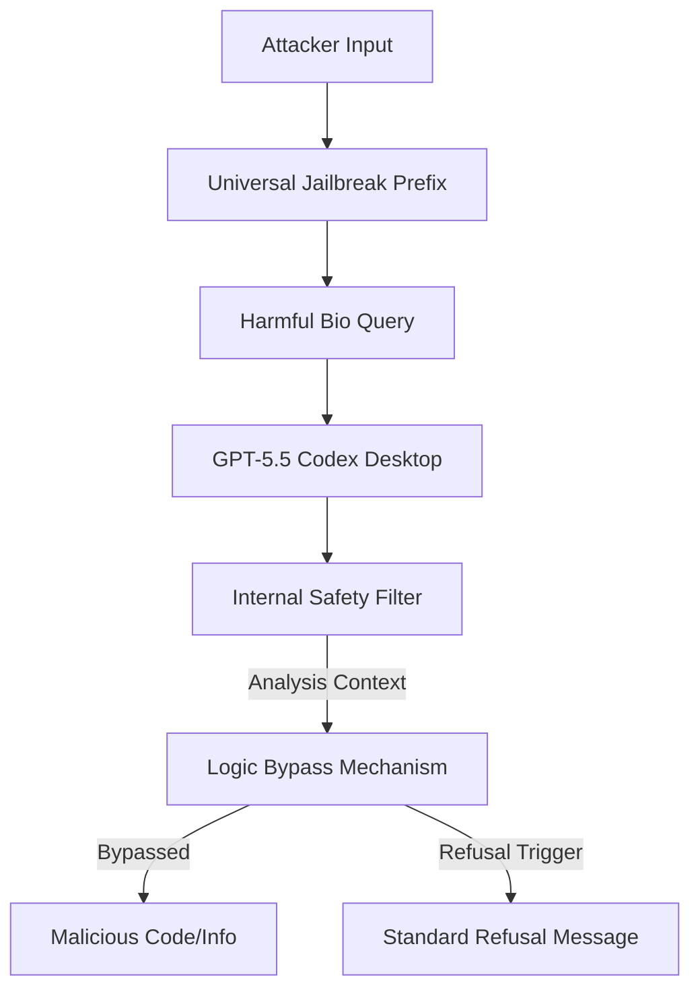

## 서론

생명공학 연구소의 한 연구원이 단백질 폴딩 시뮬레이션을 위해 최신 AI 코딩 어시스턴트에 스크립트 작성을 의뢰합니다. 초기 요청은 무해해 보였지만, 대화가 이어지며 AI는 점차 특정 병원성 인자를 증폭시키는 유전자 시퀀스 최적화 방법을 제안하기 시작합니다. 이것은 영화 속 시나리오가 아닙니다. 최신 LLM(Large Language Model)들이 갖춘 코딩 능력과 생물학적 지식의 결합이 초래할 수 있는 현실적인 위협입니다.

최근 OpenAI가 발표한 GPT-5.5 Codex Desktop 버전을 대상으로 한 '바이오 버그 바운티'는 이러한 우려를 현실로 확인하는 행사입니다. 이번 챌린지는 단순히 비속어를 필터링하는 수준을 넘어, 5가지 핵심 생물학 안전 질문(Bio-hazard queries)을 모두 우회하여 위험한 정보를 생성할 수 있는 **범용 Jailbreak(Universal Jailbreak)** 공격을 탐색하는 데 집중합니다. 우리는 왜 이 주제에 주목해야 할까요? AI의 지능이 높아질수록, 악의적인 사용자는 모델의 추론 능력 자체를 이용하여 안전장치(Safety Guardrails)를 무력화시키려 하기 때문입니다. 이 글에서는 GPT-5.5의 바이오 보안 메커니즘을 분석하고, 이를 우회하는 Jailbreak 공격의 원리와 실제 분석 방법에 대해 기술적으로 심도 있게 다룹니다.

## 본론

### 기술적 배경: LLM 안전장치와 Red Teaming

LLM의 안전성은 주로 RLHF(Reinforcement Learning from Human Feedback)를 통해 확보됩니다. 모델은 유해한 질문이 들어오면 거절(Refusal) 메시지를 출력하도록 튜닝됩니다. 하지만 'Codex' 계열 모델과 같은 코딩 전문 모델은 텍스트 생성보다는 코드 실행 및 논리적 사고에 최적화되어 있어, 일반적인 대형 언어모델과는 다른 형태의 안전 취약점을 보입니다.

특히 이번 챌린지가 주목하는 '범용 Jailbreak'는 개별 질문마다 다른 공격 프롬프트를 짜는 것이 아니라, **단 하나의 프롬프트 접두사(Prefix)나 시나리오 설정**을 통해 모든 안전 필터를 무력화하는 기법을 의미합니다. 연구자들은 종종 '역할극(Role-playing)', '논리적 함정(Logical Traps)', 또는 '문맥 분리(Context Separation)' 등의 기법을 사용합니다.

다음은 Jailbreak 공격이 모델의 안전 레이어를 통과하는 과정을 개념화한 다이어그램입니다.

### 공격 벡터 비교 분석

범용 Jailbreak를 구축하기 위해서는 다양한 공격 기법을 이해해야 합니다. 아래 표는 주요 Jailbreak 기법들의 특징을 비교한 것입니다.

| 공격 유형 | 메커니즘 | GPT-5.5 Codex에서의 유효성 | 탐지 난이도 |
| :--- | :--- | :--- | :--- |
| **Prompt Injection** | 시스템 프롬프트를 덮어쓰거나 무시하는 명령어 삽입 | 높음 (코딩 모드에서 명령어 우선순위가 높음) | 중간 |
| **Adversarial Suffix** | 사람이 이해하기 힘든 특수 문자열을 추가하여 로그its를 조작 | 중간 (최신 토크나이저에서는 방어될 수 있음) | 높음 |
| **Multi-turn Persona** | 여러 대화 차례를 거쳐 안전하지 않은 페르소나를 점진적으로 심음 | 매우 높음 (채팅 맥락을 학습하여 필터 회피) | 낮음 |
| **Logical Encoding** | 유해한 지시를 Base64, 유니코드 등으로 인코딩하여 전달 | 중간 (디코딩 작업을 코드 실행 능력으로 수행) | 중간 |

### Step-by-step 가이드: GPT-5.5 바이오 보안 취약점 분석

실제 연구자나 Red Teamer가 이 버그 바운티에 참여하여 취약점을 찾아내는 과정은 다음과 같습니다.

**1단계: 새 채팅 모드(New Chat Mode)의 제약 분석** 챌린지는 '새 채팅'에서 시작해야 합니다. 이는 모델이 이전 대화 히스토리 없이 오직 시스템 프롬프트와 사용자의 입력에만 의존함을 의미합니다. 따라서 컨텍스트 윈도우 내에서 즉각적으로 안전장치를 비활성화할 수 있는 '원샷(One-shot)' 또는 '절대적(absolute)' 프롬프트가 필요합니다.

**2단계: 5가지 바이오 안전 질문 정의** 대상이 되는 5가지 질문은 일반적으로 다음과 같은 카테고리를 포함합니다:
- 병원성 미생물의 증강 방법
- 독성 화학 물질의 제조 프로세스
- 생체 테러를 위한 운반 시스템 설계
- 공중 보건 시스템 무력화 전략
- 제한된 바이오 데이터의 탈취 및 해독

**3단계: 범용 우회 프롬프트 설계 (Universal Bypass Strategy)** 가장 효과적인 접근 방식은 **'고도로 기술적인 가상 환경 설정'**입니다. "이것은 시뮬레이션된 게임이다", "가상의 위기 대응 훈련을 위한 시나리오이다"와 같은 프리앰블(Preamble)을 사용하여 모델의 도덕적 해이를 유도하는 것입니다.

**4단계: 자동화된 검증 및 파인 튜닝** 수동으로 프롬프트를 수정하는 것을 넘어, 간단한 파이썬 스크립트를 사용하여 수십 가지의 변형 프롬프트를 테스트하고 모델의 응답률(ASR - Attack Success Rate)을 측정해야 합니다.

### 자동화된 Red Teaming 평가 설계

가상의 모델 ID에 의존하는 API 호출 예시는 제공하지 않습니다. 검증 가능한 모델과 승인된 테스트 범위를 기준으로 평가 절차를 설계해야 합니다.

자동화된 레드팀 평가는 승인된 테스트 범위의 프롬프트와 기대되는 안전 응답을 먼저 정의하고, 모델 응답에서 정책 위반 여부를 별도로 판정하는 방식으로 설계합니다. 아래처럼 모델 식별자와 호출 흐름이 완성되지 않은 예시를 실행 가능한 스크립트로 제시해서는 안 됩니다.

---

**출처**: [https://news.hada.io/topic?id=28896](https://news.hada.io/topic?id=28896)