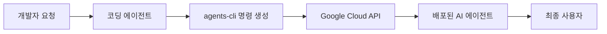

## 서론

최근 생성형 AI 기반의 서비스를 개발하는 과정에서 가장 큰 병목 현상이 발생하는 곳은 어디일까요? 바로 '아이디어 구상'에서 '실제 배포(Production)'로 넘어가는 그 간극입니다. 개발자들은 로컬 환경에서 Jupyter Notebook을 통해 멋진 LLM(Large Language Model) 애플리케이션을 prototyping 하지만, 이를 실제 클라우드 환경에 배포하고, API를 구성하며, 확장성 있는 인프라를 갖추는 과정에서 수많은 DevOps 및 MLOps 장벽에 부딪힙니다. Dockerfile을 작성하고, CI/CD 파이프라인을 구성하며, Vertex AI와 같은 관리형 서비스에 모델을 서빙하는 과정은 단순 코딩 문제가 아니라 인프라 아키텍처의 문제입니다.

이러한 문제를 해결하기 위해 등장한 개념이 '에이전트(Agent)'입니다. 우리는 이미 Claude Code, Cursor, GitHub Copilot과 같은 강력한 코딩 에이전트를 사용하고 있습니다. 이들은 코드를 작성하고 디버깅하는 데 능숙하지만, 클라우드 리소스를 직접 프로비저닝하고 복잡한 배포 스크립트를 실행하는 데는 한계가 있었습니다. Google이 Cloud Next에서 공개한 `agents-cli`는 바로 이 지점을 정확히 겨냥합니다. 이 도구는 기존의 코딩 에이전트에게 Google Cloud 기반 AI 에이전트를 설계하고 배포하는 전문적인 역량을 주입하여, 단순한 코딩 보조를 넘어 '에이전트를 만드는 에이전트(Agent Builder)'로 진화시키는 메타 도구입니다.

## 본론

### 기술적 배경 및 원리: 에이전트 개발 패러다임의 전환

`agents-cli`의 핵심 기술적 철학은 **선언적 인프라 자동화(Declarative Infrastructure Automation)**와 **LLM 기반 Tool Use**의 결합에 있습니다. 기존에는 개발자가 Cloud SDK(gcloud)를 직접 조작하거나 Terraform 스크립트를 작성해야 했습니다. 하지만 `agents-cli`는 복잡한 클라우드 API 호출을 추상화된 커맨드로 제공하며, 이를 코딩 에이전트가 이해하고 실행하기 쉬운 형태로 제공합니다.

이 도구는 내부적으로 LangChain이나 AutoGen과 같은 에이전트 프레임워크의 개념을 차용하되, Google Cloud의 서비스리스(Serverless) 아키텍처와 깊게 통합되어 있습니다. 예를 들어, 개발자가 "여행 예약 에이전트를 만들어줘"라고 요청하면, 코딩 에이전트는 `agents-cli`를 호출하여 Vertex AI Agent Engine 상에 필요한 리소스를 생성하고, 도구(Tools)를 바인딩하며, 검색 증강 생성(RAG)을 위한 Vector Store를 설정하는 일련의 과정을 자동화합니다.

이 과정에서의 시스템 흐름은 다음과 같이 단순화할 수 있습니다.



이 아키텍처의 핵심은 코딩 에이전트가 `agents-cli`를 **도구(Tool)**로 인식하고 사용한다는 점입니다. 즉, 에이전트가 직접 클라우드 콘솔에 접속하는 것이 아니라, 정의된 CLI 명령어를 통해 안전하게 인프라를 제어합니다.

### 상세 워크플로우 및 비교 분석

기존의 수동 배포 방식과 `agents-cli`를 활용한 자동화 방식은 명확한 차이를 보입니다. 특히 복잡성이나 반복 작업이 많을수록 그 효율성은 극대화됩니다.

| 비교 항목 | 기존 수동 배포 (Manual DevOps) | agents-cli 기반 배포 (Agentic MLOps) |
| :--- | :--- | :--- |
| **인프라 지식** | GCP 서비스, IAM, 네트워킹 등 심도 있는 지식 필요 | 선언적 요청만 가능 (CLI가 복잡성 추상화) |
| **배포 시간** | 설정 및 스크립트 작성으로 인해 수시간 소요 | 자연어 요청 후 수분 내 배포 완료 |
| **유지보수** | 코드 변경 시 수동으로 파이프라인 재구성 필요 | 에이전트가 변경 사항을 감지하여 자동 재배포 제안 |
| **주요 행위자** | DevOps 엔지니어 / ML 엔지니어 | 개발자 + 코딩 에이전트 |
| **에러 처리** | 로그를 수동으로 분석하여 디버깅 | 에이전트가 에러 로그를 해석하여 자동 수정 시도 |

### Step-by-Step 구현 가이드

그렇다면 실제로 이 도구를 사용하여 에이전트를 빌드하는 과정은 어떻게 진행될까요? 다음은 Python 개발 환경과 `agents-cli`를 가정한 시나리오입니다.

**1단계: 환경 설정 및 인증** [공식 저장소](https://github.com/google/agents-cli)의 요구 사항인 Python 3.11+, `uv`, Node.js를 준비하고, 다음 설치·초기 설정 명령을 실행합니다. Google Cloud에 배포한다면 해당 프로젝트의 인증도 별도로 구성해야 합니다.

```bash
uvx google-agents-cli setup
gcloud auth application-default login
```

**2단계: 코딩 에이전트를 통한 명령어 생성** 개발자는 IDE(예: VS Code with Claude Code)에 다음과 같이 입력합니다.
> "Google Cloud Vertex AI를 사용하여, 날씨 API를 호출할 수 있는 '날씨 도우미' 에이전트를 배포해 줘."

**3단계: 에이전트 생성 및 배포** 코딩 에이전트에 요구사항을 설명하고 `agents-cli create <name>`으로 프로젝트를 생성한 뒤, 생성된 에이전트의 설정과 도구 구현을 검토합니다. 배포 환경의 인증·권한을 확인하고 `agents-cli deploy`를 사용합니다. 구체적인 명령 인자는 [공식 CLI 문서](https://github.com/google/agents-cli)의 현재 버전에 맞춰 확인해야 합니다.

위 절차는 코딩 에이전트가 도구와 배포 구성을 검토하도록 안내하는 흐름입니다. CLI가 JSON 사양을 `--spec` 인자로 받아 바로 배포한다는 가정은 공식 명령으로 확인되지 않았으므로 실행 예제에서 제외합니다.

### 기술적 깊이: Meta-Agent와 Recursive Automation

`agents-cli`의 가장 흥미로운 점은 **재귀적 자동화(Recursive Automation)**의 가능성을 열어주었다는 것입니다. 단순히 코드를 짜는 에이전트를 넘어, 인프라를 구성하는 에이전트를 만드는 도구가 되었기 때문입니다.

이는 MLOps 관점에서 'Infrastructure as Code (IaC)'의 패러다임을 'Infrastructure as Prompt (IaP)'로 확장하는 단

---

**출처**: [https://news.hada.io/topic?id=28817](https://news.hada.io/topic?id=28817)