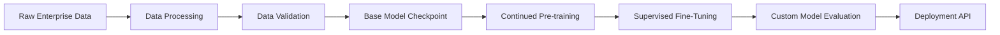

## 서론

대규모 언어 모델(LLM)을 도입하려는 기업들이 직면하는 가장 큰 딜레마는 '성능'과 '보안', 그리고 '도메인 특화' 사이의 줄타기입니다. 글로벌 IT 기업의 AI 연구원이었던 A는 최근 회사의 내부 기술 문서를 기반으로 한 챗봇을 구축하는 프로젝트를 맡았습니다. 그는 GPT-4와 같은 범용 모델을 사용했지만, 모델은 회사 고유의 약어와 최근 변경된 라이선스 정책을 끊임없이 헛갈렸습니다. RAG(검색 증강 생성)를 적용해 보았지만, 여전히 모델은 문맥을 완전히 파악하지 못했고, 중요한 내부 데이터를 외부 API로 전송해야 하는 보안 리스크는 여전히 남아 있었습니다.

이러한 문제의 근원은 공공 데이터(Common Crawl, Wikipedia 등)로 사전학습된 범용 모델이 기업의 폐쇄적인 지식 공간을 이해하기에는 구조적 한계가 있기 때문입니다. Mistral AI가 발표한 'Forge'는 이러한 간극을 메우기 위해 탄생했습니다. 단순히 API를 호출하는 것을 넘어, 기업의 내부 문서, 코드베이스, 운영 로그 등을 활용해 모델 자체의 가중치(Weights)를 업데이트하는 시스템입니다. 이 글에서는 Mistral AI Forge의 기술적 메커니즘과 이를 활용해 진정한 도메인 특화 LLM을 구축하는 방법을 심층적으로 분석합니다.

## 본론

### 1. Mistral AI Forge의 기술적 아키텍처

Mistral AI Forge는 크게 데이터 파이프라인, 학습 관리, 추론 최적화의 세 계층으로 구성됩니다. 핵심은 기업의 비정형 데이터를 모델이 이해할 수 있는 형태로 변환하고, 이를 기존의 강력한 기반 모델(Base Model, 예: Mistral 7B, Mixtral 8x7B)에 지식을 주입하는 과정입니다.

기존의 범용 모델은 '사전 학습(Pre-training)' 단계에서 방대한 텍스트를 압축하여 학습합니다. Forge는 이 과정을 기업 데이터에 대해 '지속적 사전 학습(Continued Pre-training)' 혹은 '도메인 적응(Domain Adaptation)'이라는 형태로 재현합니다. 이는 모델이 새로운 도메인의 어휘와 문맥에 익숙해지도록 만듭니다. 이어지는 '지도 학습(Supervised Fine-Tuning, SFT)' 단계에서는 모델이 질문과 답변의 형식을 학습하도록 유도하여, 단순한 텍스트 완성이 아닌 유용한 어시스턴트로서의 역할을 수행하게 합니다.

이 과정을 시각화하면 다음과 같습니다.



### 2. 단계별 구현 가이드

Forge를 활용해 커스텀 모델을 만드는 과정은 데이터 수집부터 배포까지 정교한 단계를 거칩니다.

#### 1단계: 데이터 전처리 (ETL) 가장 중요한 단계입니다. 내부 Wiki, Confluence, PDF 보고서, Jira 티켓 등을 수집합니다. 이때 단순히 텍스트를 추출하는 것을 넘어, PII(개인 식별 정보)를 제거하고, 중복 데이터를 삭제하는 과정이 필수적입니다. 잘못된 데이터(Garbage In)는 모델의 성능을 저하시키는 주원인이 됩니다.

#### 2단계: 지속적 사전 학습 (CPT) Mistral의 기반 모델이 우리 회사의 전문 용어를 이해하도록 학습시킵니다. 이 단계에서는 모델의 파라미터 전반을 업데이트하여 '지식'을 확장합니다. 예를 들어, 의료 분야라면 환자의 진료 기록 데이터를 통해 특정 질병 코드와 용어의 확률 분포를 조정합니다.

#### 3단계: 지도 학습 (SFT) CPT를 통해 지식을 습득한 모델에게 '대화 방식'을 가르칩니다. `(질문, 답변)` 쌍으로 구성된 데이터셋을 사용하여 모델이 instruction을 잘 따르도록 미세 조정(Fine-tuning)합니다.

### 3. 코드 예시: Mistral SDK를 활용한 파인튜닝

아래는 Mistral의 Python SDK를 사용하여 간단한 파인튜닝 Job을 생성하는 예시 코드입니다. 실제 환경에서는 내부 데이터를 JSONL 형식으로 준비해야 합니다.

```python
import os
from mistralai.client import MistralClient
from mistralai.models.jobs import TrainingParameters

# API 키 설정 (환경 변수 관리 권장)
api_key = os.environ.get("MISTRAL_API_KEY")
client = MistralClient(api_key=api_key)

# 1. 학습할 파일 업로드 (내부 Q&A 데이터셋)
with open("internal_qa.jsonl", "rb") as f:
    uploaded_file = client.files.create(file=(f.name, f))
    
print(f"File ID: {uploaded_file.id}")

# 2. 파인튜닝 작업 생성
# 기반 모델로 open-mistral-7b 선택 (효율성과 성능의 밸런스)
created_job = client.jobs.create(
    model="open-mistral-7b",
    training_files=[uploaded_file.id],
    hyperparameters=TrainingParameters(
        training_steps=100,      # 학습 스텝 수
        learning_rate=0.0001,    # 학습률
        batch_size=4             # 배치 사이즈
    )
)

print(f"Fine-tuning Job started with ID: {created_job.id}")
print("Status:", client.jobs.retrieve(created_job.id).status)

# 3. (실제 운영시) 완료된 모델 ID로 추론 수행
# fine_tuned_model = "ft:job-id..."
```

### 4. 범용 모델 vs Forge 커스텀 모델 비교

Forge를 통해 구축한 모델이 기존 범용 모델과 어떻게 다른지 구체적으로 비교해 보겠습니다.

| 비교 항목 | 범용 모델 (GPT-4, Claude 등) | Mistral AI Forge 커스텀 모델 |
| :--- | :--- | :--- |
| **지식 범위** | 인터넷 상의 공개 데이터에 편중됨 | 기업 내부 문서, 코드, 로그 포함 |
| **도메인 특화 성능** | 일반적이지만 전문 용어 사용 시 부정확함 | 전문 용어, 약어, 사내 프로세스 정확 이해 |
| **데이터 보안** | 외부 API 전송 필수 (보안 정책 위배 가능) | 온프레미스 또는 VPC 내부 학습 및 배포 가능 |
| **비용 효율성** | 토큰 수 과금, 높은 추론 비용 | 한 번 학습 후 낮은 비용의 오픈소스 모델로 추론 |
| **지연 시간 (Latency)** | API 호출에 따른 네트워크 지연 발생 | 로컬 또는 엣지 디바이스에서 초저지연 추론 가능 |

### 5. MLOps 관점에서의 고려사항

모델을 단순히 학습하는 것만으로는 충분하지 않습니다. 실제 서비스 환경에 안정적으로 통합하기 위해서는 MLOps 파이프라인이 필수적입니다.

- **모델 카드(Model Card) 관리**: 학습에 사용된 데이터의 성격, 모델의 한계점, 성능 벤치마크를 문서화하여 이해관계자에게 투명하게 제공해야 합니다.

- **모니터링(Monitoring)**: 배포 후 모델의 답변 품질이 저하되는 '드리프트(Drift)' 현상을 감지해야 합니다. 사용자의 피드백(Thumbs up/down)을 수집하여 지속적으로 SFT 데이터셋을 업데이트하는 순환 구조가 필요합니다.

- **양자화(Quantization) 최적화**: Mistral 모델은 경량화에 강점이 있습니다. AWQ(Activation-aware Weight Quantization)나 GPTQ와 같은 기법을 사용하여 4-bit 양자화를 진행하면, 성능 저하를 최소화하면서 메모리 사용량을 획기적으로 줄일 수 있습니다.

## 결론

Mistral AI Forge는 단순한 모델 커스터마이징 툴을 넘어, 기업의 '데이터 자산'을 '생산적인 AI 모델'로 전환하는 전략적 인프라입니다. 공공 데이터에 한정된 범용 모델의 시대는 저물고, 기업만의 고유한 지식을 내재한 소유형 AI(Sovereign AI)의 시대가 도래하고 있습니다.

전문가 관점에서 Forge의 가장 큰 가치는 '성능의 최적화'와 '운영의 통제권' 확보에 있습니다. 비록 처음에는 고품질의 데이터 정비와 학습 과정에 리소스가 투입되지만, 일단 도메인에 최적화된 모델이 구축되면 외부 의존도를 낮추고 보안을 강화하며 장기적으로 훨씬 효율적인 비용 구조를 확보할 수 있습니다.

향후 LLM 시장은 더 작고(Smaller), 더 특화된(Specialized) 모델들의 경쟁이 될 것입니다. Forge는 이러한 흐름 속에서 기업이 자체 경쟁력을 AI에 녹여낼 수 있는 가장 강력한 도구 중 하나가 될 것입니다.

**참고자료:**

- [Mistral AI Documentation](https://docs.mistral.ai/)

- "Mistral 7B" arXiv Paper (2309.16676)

- "Mixtral of Experts" arXiv Paper (2401.04088)
