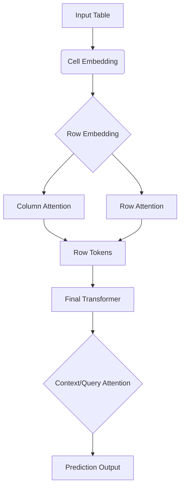

기업 환경에서 데이터는 곧 자산이며, 그 대부분은 테이블(Tabular) 형태의 구조화된 데이터로 존재합니다. 고객 거래 기록, 센서 로그, 재무 데이터, 주문 목록 등 모든 것이 테이블 안에 담겨 있으며, 이 데이터를 활용해 이탈 예측(Churn Prediction), 수요 예측(Demand Forecasting), 가격 결정(Pricing) 등의 핵심 비즈니스 문제를 해결하는 것이 머신러닝의 주된 역할이었습니다.

하지만 전통적인 ML 파이프라인은 근본적인 비효율성을 안고 있었습니다. 새로운 비즈니스 질문이 발생할 때마다, 데이터 과학자는 레이블 수집 $\rightarrow$ 복잡한 Feature Engineering $\rightarrow$ 하이퍼파라미터 튜닝 $\rightarrow$ 검증 $\rightarrow$ 배포라는 긴 라이프사이클을 거쳐야 했습니다. 게다가 대부분의 모델들은 테이블의 구조적 특성(예: 특정 컬럼의 분포, 행 간의 상호작용)을 일반화된 방식으로 이해하지 못하고, 각 태스크마다 처음부터 학습하는 경향이 있었습니다.

최근 대규모 언어 모델(LLM)이 프롬프트 내 몇 가지 예시(In-context Learning)만으로도 새로운 태스크를 수행하는 혁신을 보여주면서, 이 패러다임은 테이블 데이터에도 적용될 수 있다는 기대감이 커졌습니다. NVIDIA Kumo Tabular는 바로 이 지점을 공략하며, 테이블 데이터 예측을 위한 오픈 기반의 **Foundation Model**로서 새로운 기준을 제시합니다. Kumo Tabular는 복잡한 전처리 과정을 생략하고, 단일 순방향 전달(Single Forward Pass)만으로 분류 및 회귀 예측을 수행할 수 있게 함으로써, 정확도와 효율성의 새로운 경계(Pareto Frontier)를 재정립했습니다.

## 본론: Kumo Tabular의 혁신적인 작동 원리

Kumo Tabular의 핵심은 테이블 데이터를 단순한 행렬로 보는 것이 아니라, **구조화된 컨텍스트**를 가진 객체로 취급하는 Transformer 구조에 있습니다. 이는 TabICL이나 TabPFN에서 도입된 아이디어를 발전시킨 것으로, 테이블의 구조적 특성을 깊이 이해하는 세 단계의 메커니즘을 통해 예측을 수행합니다.

### 1. 테이블 구조 이해를 위한 3단계 메커니즘

Kumo Tabular가 예측을 수행하는 과정은 다음과 같이 단계적으로 진행됩니다.

**① Cell Embedding (셀 임베딩):** 테이블의 개별 셀(Cell)이 하나의 토큰으로 변환됩니다. 수치형 및 범주형 값은 학습된 주파수(learned frequencies)의 사인 및 코사인 변환(Fourier features)을 거치며 임베딩됩니다. 특히 주목할 점은, 이 구조가 결측값(Missing Values)을 별도로 대체(Imputation)할 필요 없이 특별하게 처리한다는 것입니다.

**② Row Embedding (행 임베딩):** 셀 임베딩된 토큰들은 행 단위로 압축됩니다. 이 과정에서 두 가지 종류의 어텐션이 교차적으로 작동합니다.
- **Column Attention:** 단일 컬럼을 따라 아래로 시선을 던지며 해당 셀 값이 컬럼 분포 내에서 얼마나 '대표적인지' 또는 '극단적인지'를 학습합니다.
- **Row Attention:** 단일 행의 모든 토큰을 가로질러 상호작용을 학습하며, Rotational Position을 사용하여 각 컬럼의 위치 정보를 인코딩합니다.
- 각 행은 최종적으로 4개의 학습 가능한 `[CLS]` 토큰을 통해 압축되어 행의 최종 표현(Row Embedding)이 됩니다.

**③ In-context Learning (컨텍스트 학습):** 최종 Transformer 레이어는 행 임베딩을 입력받아 작동합니다. 이 단계에서 컨텍스트 행(Context Rows, 레이블이 알려진 행)과 쿼리 행(Query Rows, 예측할 행) 간의 관계가 설정됩니다. 쿼리 행은 컨텍스트 행들만을 참조하며, 컨텍스트 행들은 서로 간의 관계를 학습합니다. 이 덕분에 예측은 특정 행과 그 주변 컨텍스트에만 의존하며, 다른 행들과의 배치(Batch) 관계에 덜 민감해집니다.



### 2. 기술적 심화 분석: 효율성과 확장성의 비밀

원문이 설명한 효율 개선 설계를 살펴봅니다. NVIDIA의 벤치마크 결과와 실제 업무 데이터에서의 성능은 구분해서 검증해야 합니다.

**A. Length-aware Attention Temperature:** 테이블의 크기가 커질수록 (특히 행의 수가 많아질수록) 소프트맥스 어텐션의 집중도가 분산되어(Dissolve) 예측력이 떨어지는 문제가 발생합니다. Kumo Tabular는 이 문제를 해결하기 위해 각 쿼리 행에 테이블 크기(Keys의 개수)에 비례하여 증가하는 **온도(Temperature)**를 적용합니다. 이 온도는 각 어텐션 헤드마다 별도로 학습되므로, 테이블이 길어지거나 넓어져도 어텐션의 집중도를 날카롭게(Sharp) 유지할 수 있습니다.

**B. 계산 효율성:** 행 임베딩 단계에서 컬럼 어텐션은 행 수에 선형적으로 비례하며, 행 어텐션은 컬럼 수에 비례합니다. 중요한 것은, 최종 Transformer 단계에서 행 압축이 이루어졌기 때문에 **최종 단계의 계산 비용은 컬럼 수에 의존하지 않게 된다**는 점입니다. 또한, 쿼리 행은 Test-GQA를 활용하여 캐시 사용량을 줄여 추론 속도를 극대화합니다.

### 3. 실무 적용 및 성능 검증

Kumo Tabular는 NVIDIA의 오픈소스 라이브러리 `structured-data-models`를 통해 쉽게 접근하고 활용할 수 있습니다.

#### 📊 성능 비교 (Accuracy-Efficiency Pareto Frontier)

비교를 읽을 때는 정확도와 추론 시간뿐 아니라 GPU, 데이터 분할, 튜닝 범위를 함께 확인해야 합니다. 원문에 있는 성능 비교 표현은 수치의 단위가 추출 과정에서 보존되지 않아 여기에는 옮기지 않았습니다. 조직 데이터의 보류 집합에서 기존 모델과 직접 비교하는 편이 안전합니다.

NVIDIA는 TabArena, BeyondArena, TALENT, ScoringBench 평가에서 Kumo Tabular가 높은 순위를 기록했다고 보고합니다. 이는 제작사가 제시한 평가 조건의 결과이며 모든 업무 데이터에서 동일한 우위를 보장하지 않습니다.

#### 💻 실무 사용 가이드 (Step-by-step)

Kumo Tabular를 활용하는 과정은 매우 직관적입니다. Pandas DataFrame을 GPU 메모리에 올리고, 컨텍스트 행과 쿼리 행을 구분한 뒤, 단일 모델 호출로 결과를 얻습니다.

```plain text
실행 가능하다고 검증되지 않은 예시 코드를 싣지 않습니다. 최신 사용 방법은 원문의 Model Code 링크를 따라 공식 저장소에서 확인하세요.
```

## 결론

Kumo Tabular는 레이블이 있는 문맥 행을 이용해 새 표 데이터의 분류와 회귀를 수행하는 사전학습 모델입니다. 새 문제마다 가중치를 다시 학습하지 않는 방식이 특징이지만, 문맥에 사용할 레이블과 자체 검증 데이터는 여전히 필요합니다. 원문의 성능 결과를 운영 환경에 그대로 적용하기보다 데이터 분포·정확도·보정 상태를 확인해야 합니다.

실무에서는 기존 트리 기반 모델과 같은 데이터 조건으로 비교하는 것이 출발점입니다. 모델 선택은 제작사의 벤치마크 순위뿐 아니라 데이터 변화, 추론 비용과 오류의 영향까지 평가한 뒤 결정해야 합니다.

--- **참고 자료:**
- **출처**: NVIDIA Kumo Tabular Sets a New Accuracy-Efficiency Frontier for Tabular Prediction
- **URL**: https://huggingface.co/blog/nvidia/kumo-tabular

---

**출처**: [https://huggingface.co/blog/nvidia/kumo-tabular](https://huggingface.co/blog/nvidia/kumo-tabular)