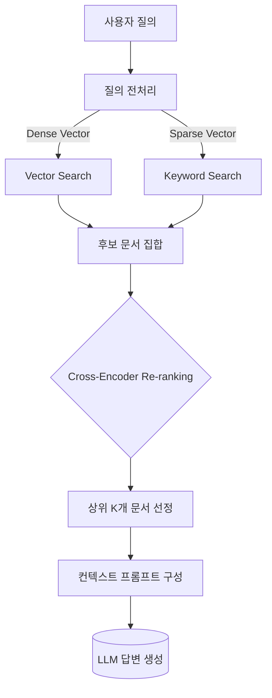

## 서론

"우리 내부망의 방화벽 규칙을 위반하지 않고, 이 특정 CVE에 대한 패치를 적용할 수 있는가?"

SOC 보안 센터의 모니터링 화면 앞에서 주니어 분석가가 LLM 챗봇에게 던진 질문입니다. 챗봇은 즉시 "네, 가능합니다"라고 답변했고, 분석가는 그 조언을 신뢰하여 변경 작업을 수행했습니다. 결과는 어떨까요? 방화벽 규칙과 충돌하여 핵심 서비스가 마비되는 사고가 발생했습니다.

왜 이런 일이 일어났을까요? LLM이 멍청했기 때문일까요? 아닙니다. LLM에게 제공된 **검색된 컨텍스트(Retrieved Context)**가 불완전했기 때문입니다. 방화벽 정책 문서가 길이 제한으로 인해 잘려서 전달되었고, LLM은 눈앞에 보이는 정보만을 근거로 "확신 있게" 거짓말을 한 것입니다.

이것이 단순한 "성능 저하" 문제가 아닙니다. 보안과 운영 안정성이 걸린 **신뢰도의 문제**입니다. RAG(Retrieval-Augmented Generation) 시스템을 구축할 때 단순히 "동작하게" 만드는 것은 시작에 불과합니다. 검색 정확도(Relevance)와 응답 신뢰도(Faithfulness)를 극대화하는 **최적화(Optimization)** 없이는 RAG는 "정보를 쏘아붙이는 랜덤 박스" 그 이상이 될 수 없습니다. 이 글에서는 보안 관점에서 RAG 시스템의 신뢰성을 담보하기 위한 구체적인 튜닝 전략을 다룹니다.

> **⚠️ 윤리적 경고**: 본 문서에서 설명하는 기술과 코드는 RAG 시스템의 취약점을 분석하고 방어 태세를 강화하기 위한 목적으로 작성되었습니다. 악의적인 목적으로 시스템을 공략하거나 정보를 조작하는 데 사용해서는 안 됩니다.

## 본론

### 1. RAG의 취약점: 왜 검색이 실패하는가?

RAG 시스템의 가장 큰 취약점은 **"의미(Semantic)의 매칭 실패"**와 **"정보의 파편화"**입니다.

기본적인 RAG는 벡터 임베딩(Vector Embedding)을 기반으로 유사도 검색을 수행합니다. 하지만 이 방식은 치명적인 단점이 있습니다. 예를 들어, 공격자가 "SQL Injection" 대신 "SQL 데이터 삽입 공격"이라는 표현을 사용하거나, 특정 보안 장비의 모델명 대신 별칭을 사용하면 벡터 유사도가 급격히 떨어질 수 있습니다. 이를 **"어휘 불일치(Vocabulary Mismatch)"** 문제라고 합니다.

또한, 문서를 무작위로 잘라서 저장하는(Fixed-size Chunking) 방식은 하나의 보안 정책이나 공격 기술 설명이 두 개의 청크에 걸쳐 쪼개질 경우, LLM이 맥락을 완전히 잃어버리게 만듭니다.

### 2. 공격 흐름 및 최적화 아키텍처

RAG 시스템을 단순한 검색 도구가 아닌, 방어 체계의 일부로 격상하기 위해 우리는 **"Hybrid Search"**와 **"Re-ranking"**이라는 두 가지 강력한 무기를 도입해야 합니다.

다음은 최적화된 RAG 파이프라인의 데이터 처리 흐름입니다.



이 아키텍처의 핵심은 두 가지 검색 엔진의 결과를 합쳐 후보군을 늘린 뒤(Candidate set), **Re-ranking 모델(Cross-Encoder)**을 통해 정밀도를 높이는 것입니다. 마치 보안 탐지 시스템에서 방화벽(1차 필터링)과 IDS/IPS(심분 분석)를 거치는 것과 유사한 원리입니다.

### 3. 전략 1: 지능형 청킹(Chunking)과 하이브리드 검색

단순히 500자 단위로 문서를 자르는 것은 위험합니다. 우리는 문서의 의미 단위(Structure-aware Chunking)를 파악해야 합니다. 또한, 벡터 검색의 "퍼지(Fuzzy)"한 특성을 보완하기 위해 키워드 검색(BM25)을 결합해야 합니다. 이를 **Hybrid Search**라고 합니다.

아래는 `LangChain`을 활용하여 하이브리드 검색과 Re-ranking을 구현하는 PoC(개념 증명) 코드입니다.

> **⚠️ 주의**: 아래 코드는 학습 및 테스트 환경에서만 실행하세요. 프로덕션 환경 적용 전 반드시 검증이 필요합니다.

```python
from langchain_community.retrievers import BM25Retriever
from langchain_community.vectorstores import FAISS
from langchain_openai import OpenAIEmbeddings
from langchain.retrievers import EnsembleRetriever
from langchain.schema import Document

# 1. 가상의 보안 가이드 문서 (실제 시나리오에서는 PDF/DB에서 로드)
documents = [
    Document(page_content="SQL Injection은 사용자 입력이 SQL 쿼리로 인식되어 발생하는 취약점입니다. 방어를 위해 입력 검증이 필수입니다.", metadata={"source": "security_guide.pdf"}),
    Document(page_content="XSS(Cross-Site Scripting)는 클라이언트 사이드 스크립트가 악의적으로 실행되는 공격입니다.", metadata={"source": "security_guide.pdf"}),
    Document(page_content="방화벽 규칙 변경 시 반드시 변경 관리 위원회의 승인을 받아야 합니다.", metadata={"source": "policy.pdf"}),
    Document(page_content="패치 관리: CVE-2024-1234는 긴급급으로 처리되어야 하며, 서비스 재기동이 필요합니다.", metadata={"source": "patch_mngt.pdf"}),
]

# 2. 벡터화 및 BM25 retriever 초기화
embeddings = OpenAIEmbeddings()
vectorstore = FAISS.from_documents(documents, embeddings)
vector_retriever = vectorstore.as_retriever(search_kwargs={"k": 5}) # 1차 후보군 5개 추출

bm25_retriever = BM25Retriever.from_documents(documents)
bm25_retriever.k = 5 

# 3. 하이브리드 리트리버 설정 (가중치 조절)
# 0.5는 벡터와 키워드 검색의 중요도가 동일함을 의미합니다.
ensemble_retriever = EnsembleRetriever(
    retrievers=[bm25_retriever, vector_retriever], weights=[0.5, 0.5]
)

# 4. 질의 수행
query = "보안 패치 승인 규칙은?"
docs = ensemble_retriever.get_relevant_documents(query)

# 5. Re-ranking 과정 (가상의 CoT: 여기서 별도의 Cross-Encoder 모델을 통해 점수를 재매깅함)
print("--- 검색된 문서 (Re-ranking 전) ---")
for i, doc in enumerate(docs):
    print(f"{i+1}. {doc.page_content} (Source: {doc.metadata['source']})")

# 실제 운영 시 여기서 'Cohere Rerank'나 'BGE Reranker' 등을 통해 최종 Top K를 선별합니다.
```

이 코드는 단순 검색을 넘어, 키워드(예: "승인", "규칙")와 의미(예: "패치 프로세스")를 동시에 고려하여 문서를 찾아냅니다. 이는 공격자가 은어를 사용하거나 오타를 내더라도 검색 로버스트니스(Robustness)를 크게 높여줍니다.

### 4. 검색 전략 비교 분석

어떤 검색 방식을 채택할지 결정할 때, 아래의 표를 참조하여 운영 환경에 맞는 최적의 조합을 선택해야 합니다.

| 검색 전략 | 원리 (Mechanism) | 장점 (Pros) | 단점 (Cons) | 추천 상황 | | --- | --- | --- | --- | --- | | **Vector Search** | Dense Embedding 유사도 계산 | 의미적 맥락 이해 (예: "해킹" vs "공격") | 구체적인 키워드(모델명, CVE 번호) 검색 시 약함 | 일반적인 질의 응답, 요약 | | **Keyword Search (BM25)** | 단어 빈도 기반 정확 매칭 | 고유명사, 특정 용어 검색에 정확함 | 의미적 유의어(예: "지갑" vs "비트코인") 처리 불가 | 로그 검색, 기술 매뉴얼 탐색 | | **Hybrid Search** | Vector + Keyword 가중 평균 | 정확도와 재현율(Recall)의 균형 | 리트리버 튜닝(Weight 설정)이 복잡함 | 대부분의 엔터프라이즈 RAG 시스템 | | **Re-ranking** | 검색된 후보군을 Deep Learning으로 재정렬 | 최종 결과물의 정밀도(Precision) 극대화 | 추가적인 Latency(지연 시간) 발생 | 높은 정확도가 요구되는 보안/법률 상담 |

### 5. 실무 적용 가이드: 단계별 최적화 방어법

RAG 시스템의 성능을 극대화하기 위한 구체적인 단계별 가이드입니다.

#### 1단계: 데이터 사전 준비 (Data Hygiene)

- **구조 파악**: 마크다운 제목(`#`, `##`)이나 문단 단위로 문서를 분리합니다.

- **청킹 전략**:

  - `RecursiveCharacterTextSplitter`를 활용하되, `separators=["

", " ", " ", ""]` 순서로 설정하여 문장을 중간에 끊는 위험을 최소화하세요.   - 청크 크기는 LLM의 컨텍스트 윈도우를 고려하여 512~1024 토큰 사이로 설정하는 것이 일반적입니다.

#### 2단계: 하이브리드 검색 도입

- 기존 벡터 DB에 BM25 인덱스를 추가합니다. (예: Elasticsearch, Pinecone, Weaviate 등 최신 DB는 하이브리드 검색을 네이티브 지원합니다.)

- 가중치(Weights) 테스트: 보안 로그 검색이 많다면 키워드 가중치를 0.7로 올리고, 일반적인 정책 질의가 많다면 벡터 가중치를 0.6으로 조정하며 A/B 테스트를 수행하세요.

#### 3단계: Re-ranker 배포 (핵심)

- 검색된 Top 20개 문서를 Re-ranker 모델(예: `BAAI/bge-reranker-base`)에 통과시켜 최종 Top 5개만 추출합니다.

- **완화 조치**: Re-ranker는 연산 비용이 비쌉니다. 캐싱 전략을 도입하여 동일한 질의에 대한 재연산을 방지하세요.

#### 4단계: 평가 및 피드백 루프

- RAGAS(RAG Assessment) 프레임워크를 사용하여 `Faithfulness`(답변이 검색된 문서에 기반하는가)와 `Answer Relevance` 지표를 모니터링하세요.

## 결론

RAG 시스템의 최적화는 기술적인 "성능 튜닝"을 넘어, 정보의 **"무결성(Integrity)"**을 지키는 방어 활동입니다. 단순히 벡터 데이터베이스를 구축하는 것으로는 LLM이 "할루시네이션(Hallucination)"이라는 보안 허점을 노출할 수 있습니다. 우리는 **Hybrid Search**로 검색의 "망"을 넓히고, **Re-ranking**으로 정확도의 "창"을 좁혀야 합니다.

전문가로서의 조언을 덧붙입니다: RAG는 살아있는 유기체입니다. 새로운 공격 기법이나 보안 정책이 추가될 때마다 데이터베이스를 업데이트하고, Re-ranking 모델을 튜닝하는 지속적인 사후 관리(Post-management)가 없다면, 아무리 비싼 GPU와 LLM을 사용해도 "쓰레기를 투입해 쓰레기를 출력(Garbage In, Garbage Out)"하는 결과를 막을 수 없습니다.

지금 당신의 RAG 파이프라인을 점검하세요. 단순한 검색 엔진이 아닌, 신뢰할 수 있는 보안 지식 파트너가 되어 있는지 확인하는 것이 필수적입니다.

### 참고자료

- [LangChain Documentation: Hybrid Search](https://python.langchain.com/docs/modules/data_connection/retrievers/ensemble/)

- [RAGAS: Evaluation Framework for RAG](https://docs.ragas.io/)

- [BGE Re-ranker on Hugging Face](https://huggingface.co/BAAI/bge-reranker-base)
