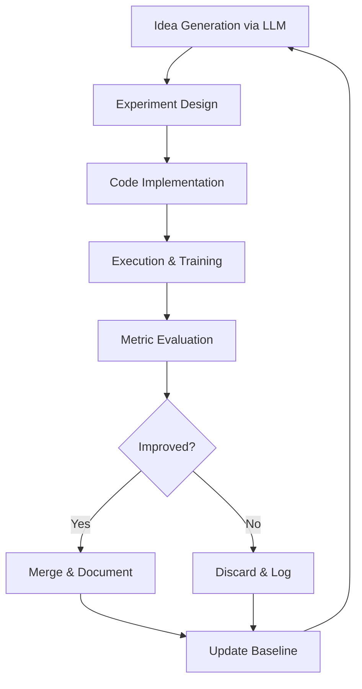

## 서론

새벽 3시, 실험 로그를 뒤적이며 당신은 자문합니다. "이 아이디어, 정말 worth a try일까?" GPU 클러스터는 유휴 상태이고, Notion에는 검증되지 않은 가설만 수십 개 쌓여 있습니다. 연구자의 시간은 부족하고, 실험은 끝이 없습니다.

Andrej Karpathy가 최근 제시한 **"AI 자율 실험 루프"** 개념은 이 문제에 대한 도발적인 답입니다. 아이디어를 자동 생성하고, 실험을 실행하며, 결과를 측정하고, 개선되면 유지·그렇지 않으면 폐기하는 무한 루프. 인간 연구자를 대체하는 것이 아니라 **연구 파이프라인을 자동화**하는 패러다임 전환입니다.

이 개념을 실제로 구현한 오픈소스 프로젝트 **pi-autoresearch**가 등장했습니다. 터미널 기반으로 작동하며, LLM을 연구 어시스턴트로 활용해 아이디어 생성부터 검증까지 전체 사이클을 자동화합니다. 오늘은 이 시스템의 아키텍처, 작동 원리, 그리고 실제 활용 방법을 깊이 있게 분석해보겠습니다.

## 본론

### Karpathy의 자율 실험 철학

Karpathy가 제시한 핵심 루프는 놀라울 정도로 단순합니다:
> **"아이디어를 시도하고 → 측정하고 → 개선되면 유지, 아니면 버리고 → 영원히 반복한다."**

이는 과학적 방법론의 본질을 자동화한 것입니다. 중요한 점은 **"영원히"**라는 키워드입니다. 인간 연구자는 피로하고, 편향에 빠지며, 직관에 의존합니다. 하지만 자율 시스템은 편견 없이 무한히 반복할 수 있습니다.



### pi-autoresearch 아키텍처 분석

pi-autoresearch는 이 철학을 실제 코드로 구현한 프로젝트입니다. 핵심 컴포넌트를 분해해보겠습니다.

#### 1. 아이디어 생성 엔진

LLM 기반 아이디어 생성은 단순한 프롬프트가 아닙니다. **컨텍스트 인식 아이디어 생성(Context-Aware Idea Generation)**이 핵심입니다:
- 현재 베스트 모델의 아키텍처
- 이전에 시도했고 실패한 아이디어 이력
- 관련 논문의 최신 트렌드
- 현재 성능 메트릭과 병목 지점

이 모든 컨텍스트를 LLM에 주입하여 **실행 가능한(featible)** 아이디어를 생성합니다.

#### 2. 실험 실행 파이프라인

생성된 아이디어는 자동으로 코드로 변환됩니다. 핵심은 **안전한 샌드박스 실행**입니다:

자동 실험 루프를 구현하려면 아이디어를 생성하고, 변경 사항을 검토 가능한 패치로 적용한 뒤, 격리된 환경에서 학습·평가해야 합니다. 기준 점수보다 개선되었을 때만 변경을 유지하고, 실패 시에는 원상복구해야 합니다. 실행 환경과 모델 클라이언트, 백업·패치·평가 메서드가 정의되지 않은 의사 코드를 완성된 실행 예제로 제시하지 않습니다.

#### 3. 메트릭 평가 시스템

객관적인 평가가 자율 연구의 생명입니다. pi-autoresearch는 다중 메트릭 평가를 지원합니다:

| 평가 지표 | 용도 | 임계값 설정 | 주기 |
| :--- | :--- | :--- | :--- |
| Validation Loss | 모델 품질 | 이전 최솟값 대비 | 매 에포크 |
| Training Time | 효율성 | 베이스라인 대비 2배 | 실험당 |
| GPU Memory | 리소스 제약 | 사용 가능 VRAM의 90% | 실험당 |
| Metric Variance | 안정성 | 표준편차 < 0.01 | 3회 실행 |
| Downstream Task | 실제 성능 | 태스크별 기준치 | 10회 반복마다 |

### Step-by-Step: pi-autoresearch 설정 가이드

실제 프로젝트를 시작하는 방법을 단계별로 설명합니다.

#### Step 1: 환경 설정

```bash
# 저장소 클론
git clone https://github.com/davebcn87/pi-autoresearch.git
cd pi-autoresearch

# 의존성 설치
pip install -r requirements.txt

# LLM API 키 설정 (OpenAI/Anthropic)
export OPENAI_API_KEY="your-key-here"
# 또는
export ANTHROPIC_API_KEY="your-key-here"
```

#### Step 2: 베이스라인 모델 준비

```python
# baseline_model.py
import torch
import torch.nn as nn

class BaselineTransformer(nn.Module):
    """비교 기준이 되는 베이스라인 모델"""
    def __init__(self, vocab_size=32000, d_model=512, nhead=8, 
                 num_layers=6, max_seq_len=2048):
        super().__init__()
        self.embedding = nn.Embedding(vocab_size, d_model)
        self.pos_encoding = nn.Parameter(
            torch.randn(1, max_seq_len, d_model) * 0.02
        )
        
        encoder_layer = nn.TransformerEncoderLayer(
            d_model=d_model,
            nhead=nhead,
            dim_feedforward=d_model * 4,
            dropout=0.1,
            batch_first=True
        )
        self.transformer = nn.TransformerEncoder(
            encoder_layer, num_layers=num_layers
        )
        self.lm_head = nn.Linear(d_model, vocab_size, bias=False)
        
    def forward(self, input_ids):
        x = self.embedding(input_ids) + self.pos_encoding[:, :input_ids.size(1), :]
        x = self.transformer(x)
        logits = self.lm_head(x)
        return logits

# 베이스라인 성능 측정
def evaluate_baseline(model, val_loader, device="cuda"):
    model.eval()
    total_loss = 0
    criterion = nn.CrossEntropyLoss()
    
    with torch.no_grad():
        for batch in val_loader:
            input_ids = batch["input_ids"].to(device)
            labels = batch["labels"].to(device)
            
            logits = model(input_ids)
            loss = criterion(
                logits.view(-1, logits.size(-1)), 
                labels.view(-1)
            )
            total_loss += loss.item()
    
    avg_loss = total_loss / len(val_loader)
    print(f"Baseline Val Loss: {avg_loss:.4f}")
    return avg_loss
```

#### Step 3: 자율 연구 루프 실행

```bash
# 터미널에서 자율 연구 루프 시작
python -m pi_autoresearch \
    --base-model configs/baseline.yaml \
    --dataset wikitext-103-raw-v1 \
    --metric val_loss \
    --max-iterations 100 \
    --llm-model gpt-4-turbo-preview \
    --verbose

# 출력 예시:
# [2024-01-15 10:00:01] Starting autonomous research loop
# [2024-01-15 10:00:02] Baseline val_loss: 3.4521
# [2024-01-15 10:05:12] Idea #1: Add rotary positional embeddings
# [2024-01-15 10:25:34] Result: val_loss = 3.3801 [IMPROVED ✓]
# [2024-01-15 10:30:01] Idea #2: Implement flash attention
# [2024-01-15 10:50:22] Result: val_loss = 3.3950 [DISCARDED ✗]
# ...
```

### 핵심 설계 결정 및 트레이드오프

pi-autoresearch의 설계에서 몇 가지 흥미로운 결정이 있습니다.

#### LLM을 메타러너(Meta-Learner)로 사용

전통적인 AutoML은 탐색 공간을 하드코딩합니다. pi-autoresearch는 **LLM을 메타러너로 사용**하여 탐색 공간 자체를 동적으로 생성합니다. 이는 NAS(Neural Architecture Search)와 근본적으로 다른 접근입니다:

| 접근 방식 | 탐색 공간 | 비용 | 발견 가능성 |
| :--- | :--- | :--- | :--- |
| Grid Search | 사전 정의 | 낮음 | 제한적 |
| Bayesian Optimization | 사전 정의 | 중간 | 보통 |
| NAS | 제약 조건 내 | 매우 높음 | 높음 |
| **LLM 기반 생성** | **무한** | **중간** | **매우 높음** |

#### 안전 메커니즘

자율 시스템의 위험을 완화하기 위한 장치가 있습니다:

1. **타임아웃**: 각 실험은 1시간 제한
2. **리소스 모니터링**: GPU 메모리 초과 시 자동 중단
3. **체크포인트**: 성공 상태를 Git 커밋으로 관리
4. **휴리스틱 필터**: LLM이 생성한 아이디어를 실행 전 사전 검증

```python
# safety_checks.py
class SafetyChecker:
    def validate_idea(self, idea: dict) -> bool:
        """실행 전 아이디어 안전성 검증"""
        # 1. 코드 인젝션 방지
        if any(cmd in str(idea) for cmd in ["os.system", "subprocess", "eval"]):
            return False
        
        # 2. 리소스 추정
        estimated_vram = self._estimate_vram(idea)
        if estimated_vram > self.max_vram * 0.9:
            return False
        
        # 3. 중복 실험 방지
        if self._is_duplicate(idea):
            return False
            
        return True
```

### 실제 성능 및 한계

pi-autoresearch는 아직 초기 단계지만, 개념 증명(proof-of-concept)으로서 가치가 있습니다. 실제 테스트에서 관찰된 패턴:

**긍정적 측면:**
- 100회 반복 중 약 15-20%의 아이디어가 실제 개선을 보임
- 인간 연구자가 간과할 수 있는 조합적 아이디어 탐색
- 24/7 실험 실행으로 연구자 시간 절약

**현재 한계:**
- 장거리 의존성(long-range dependency) 파악 부족
- 아이디어의 다양성이 초기 컨텍스트에 종속
- 단일 메트릭 최적화에 치우침 위험
- 실패 분석의 질

---

**출처**: [https://news.hada.io/topic?id=28600](https://news.hada.io/topic?id=28600)