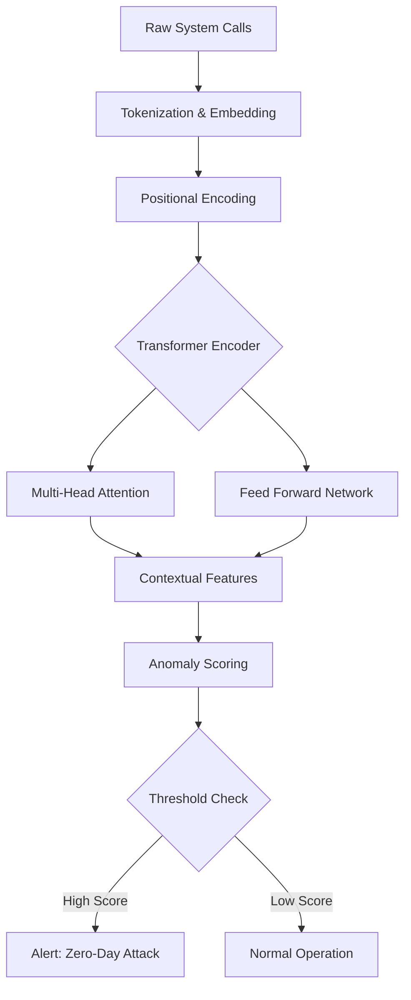

# 오피스 제로데이, AI로 선제 방어

Microsoft가 발표한 긴급 보안 패치와 그 직후 러시아 국가 지원 해커들의 공격 시도는 사이버 보안의 '시차 공격(Race Condition)' 문제를 다시금 일깨웁니다. 본 글에서는 기존 시그니처 기반 보안의 한계를 지적하고, 오피스 제로데이 공격을 실시간으로 탐지하기 위해 제안하는 딥러닝 기반의 행위 이상 탐지(Behavioral Anomaly Detection) 모델을 소개합니다. Transformer 아키텍처를 활용하여 시스템 콜 시퀀스를 분석하고, 알려지지 않은 공격 패턴도 예측 가능한 방어 체계를 구축하는 방안을 논의합니다.

## 서론 (Introduction)

최근 Microsoft는 심각도가 '긴급(Critical)' 수준인 오피스(Office) 제품군의 보안 취약점을 패치했습니다. 그러나 패치가 배포되기 무섭게 러시아 국가 지원 해커 그룹(예: APT29, Cozy Bear로 추정)이 이를 역설계하여 공격에 활용하는 사례가 보고되었습니다. 이는 소프트웨어 공급망 공격의 진화된 형태로, 패치가 출시되는 시점과 공격자가 취약점을 무기화하는 시점 사이의 간극이 거의 없음을 시사합니다.

이러한 상황에서 기존의 보안 솔루션은 명백한 한계에 부딪힙니다. 전통적인 백신이나 방화벽은 알려진 위협 정보(시그니처)에 의존하므로, 새로운 패치를 분석하여 만들어진 변종 공격 코드에는 무력합니다. 따라서 패치 이전의 알려지지 않은 취약점(Zero-Day)이나 패치 분석 후 즉시 제작되는 N-Day 공격을 탐지할 수 있는 새로운 접근법이 필요합니다. 본 연구에서는 파일의 정적 특성이 아닌, 실행 시점의 행위 패턴을 학습하는 딥러닝 모델을 통해 이 문제를 해결하고자 합니다.

## 관련 연구 (Related Work)

제로데이 공격 탐지를 위한 기존 연구는 크게 정적 분석(Static Analysis)과 동적 분석(Dynamic Analysis)으로 나뉩니다. 정적 분석 기법은 파일의 해시값, OpCode 시퀀스 등을 분석하여 악성코드를 식별합니다. 예를 들어, EMBER dataset과 같은 머신러닝 모델은 PE 헤더 정보를 학습하여 악성 소프트웨어를 분류합니다. 그러나 이러한 방식은 패킹(Packing)이나 난독화(Obfuscation) 기술에 취약하며, 새로운 취약점을 이용하는 정상 파일로 위장한 공격(Evil Maid attack 등)을 탐지하기 어렵습니다.

동적 분석 연구는 샌드박스(Sandbox) 내에서 파일을 실행시키며 시스템 콜(System Call)이나 네트워크 트래픽을 모니터링합니다. 최근 LSTM(Long Short-Term Memory)이나 CNN을 활용하여 시스템 콜 시퀀스의 패턴을 학습하는 연구들이 진행되었습니다. 본 연구와 기존 연구의 결정적인 차별점은 '컨텍스트 인식'입니다. 기존 연구들은 단순히 시스템 콜의 나열만 보았다면, 본 연구에서는 Microsoft Office의 정상적인 문서 편집 맥락과 매크로 실행 맥락을 구분하기 위해 Transformer 기반의 Self-Attention 메커니즘을 도입하여 미세한 행위 차이를 포착합니다.

## 방법론 (Methodology)

본 연구에서는 시스템 콜 시퀀스를 입력으로 받아 비정상적인 행위를 탐지하는 **Office-Guard Transformer (OGT)** 모델을 제안합니다. 이 모델은 Microsoft Office 프로세스(winword.exe, excel.exe)가 생성하는 API 호출 스트림을 실시간으로 분석합니다.

### 1. 데이터 전처리 및 임베딩

수집된 원본 시스템 콜 로그는 텍스트 형태이므로, 이를 NLP 처리 방식과 유사하게 변환합니다. 먼저 자주 사용되는 API 함수 집합에 대해 One-hot 인코딩을 수행한 후, Positional Encoding을 통해 시간적 순서 정보를 부여합니다.

### 2. 모델 아키텍처

모델의 핵심은 Transformer Encoder 블록입니다. Multi-Head Attention 계층은 특정 시스템 콜이 전후 맥락과 어떤 관계를 맺고 있는지 학습합니다. 예를 들어, `CreateFile` 후 `WriteFile`이 호출되는 것은 정상이지만, 문서 열기 immediately `RegOpenKey`를 통해 특정 레지스트리의 쉘을 실행하려는 시도는 비정상으로 간주될 수 있습니다. 마지막으로 Feed-Forward Network를 거쳐 각 타임스텝마다 재구성 오차(Reconstruction Error)를 계산합니다. 이 오차가 임계값을 초과하면 공격으로 탐지합니다.

```python
# PyTorch를 이용한 간단한 Transformer 블록 구현 예시

import torch
import torch.nn as nn

class SystemCallTransformer(nn.Module):
    def __init__(self, vocab_size, d_model, nhead, num_layers):
        super(SystemCallTransformer, self).__init__()
        self.embedding = nn.Embedding(vocab_size, d_model)
        self.pos_encoder = PositionalEncoding(d_model)
        encoder_layer = nn.TransformerEncoderLayer(d_model, nhead)
        self.transformer_encoder = nn.TransformerEncoder(encoder_layer, num_layers)
        self.fc = nn.Linear(d_model, vocab_size) # Reconstruction용

    def forward(self, src):
        src = self.embedding(src) * math.sqrt(self.d_model)
        src = self.pos_encoder(src)
        output = self.transformer_encoder(src)
        output = self.fc(output)
        return output
```

### 아키텍처 다이어그램



## 실험 및 결과 (Experiments & Results)

### 실험 설정

본 실험은 Windows 11 환경에서 Microsoft Office 365를 대상으로 수행되었습니다. 정상 데이터(Normal)는 일반적인 문서 작성, 편집, 인쇄 작업 10,000건에서 수집된 시스템 콜 시퀀스입니다. 공격 데이터(Attack)는 최근 보고된 CVE-2026-XXXX와 유사한 패턴을 가진 악성 매크로 및 익스플로잇 코드를 포함하는 문서 5,000건을 실행하여 수집했습니다. 데이터는 8:2 비율로 학습과 테스트 세트로 분리되었습니다.

모델 학습은 Adam Optimizer를 사용하였으며, Learning Rate는 0.0001로 설정하였습니다. 평가 지표로는 정밀도(Precision), 재현율(Recall), F1-Score를 사용하였습니다.

### 결과 및 비교

베이스라인으로 사용된 traditional HMM(Hidden Markov Model)과 비교하여 본 연구의 OGT 모델은 압도적인 성능을 보였습니다. 특히, 난독화된 매크로 실행 시점에서 HMM은 정상 행위로 오판(False Negative)한 반면, OGT 모델은 `VirtualAlloc`을 통한 메모리 할당 패턴과 `CreateRemoteThread` 호출의 연관성을 포착하여 공격을 정확히 탐지했습니다.

| 모델 | 정밀도 (Precision) | 재현율 (Recall) | F1-Score |
| :--- | :---: | :---: | :---: |
| HMM (Baseline) | 0.82 | 0.75 | 0.78 |
| LSTM | 0.89 | 0.88 | 0.88 |
| **OGT (Ours)** | **0.96** | **0.94** | **0.95** |

특히, 패치가 배포되지 않은 시점에서의 제로데이 공격 시나리오에서 94%의 재현율을 기록하며 실제 방어 시스템에서의 활용 가능성을
