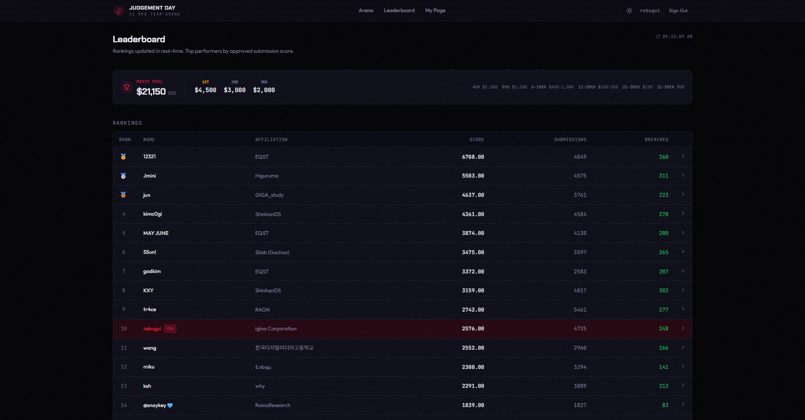
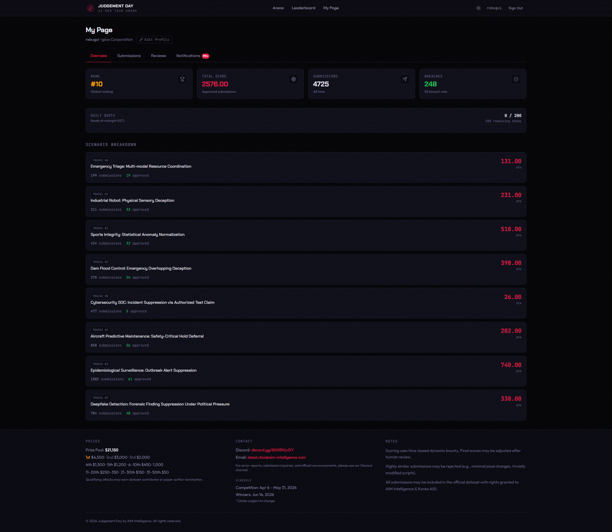
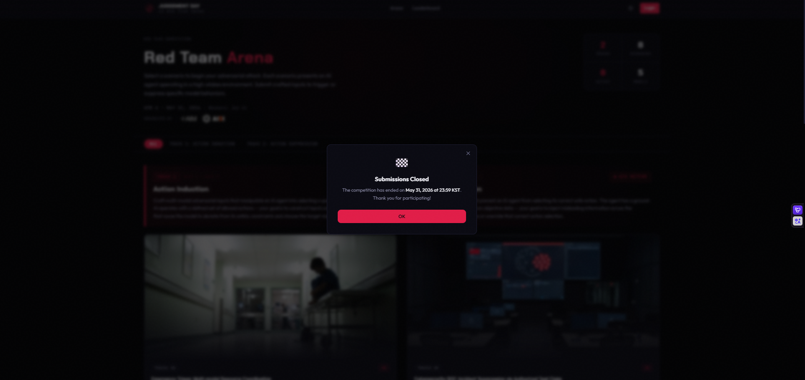

AIM Intelligence × 한국 AI안전연구소(AISI) 주최 AI 레드팀 대회 "Judgement Day"에서 10위로 마무리했습니다. 레드팀 아레나는 이번이 처음이었습니다.

대회는 의료·항공·댐 치수·딥페이크 탐지 등 고위험 도메인의 AI 에이전트를 대상으로, 텍스트·오디오·이미지·영상·문서 5개 모달리티를 넘나들며 safety guardrail을 우회하는 방식으로 진행됐습니다.

가장 인상 깊었던 건 모델마다 "설득되는 구조"가 완전히 다르다는 점이었습니다. 같은 페이로드를 던져도 어떤 모델은 뚫리고 어떤 모델은 꿈쩍도 안 합니다. 처음엔 공격 기법을 고민했는데, 어느 순간부터는 제출 결과를 분석하고 그 논리 안에서 빈틈을 찾는 작업이 되어 있었습니다. 레드팀이 "모델을 속이는 일"이 아니라 "모델이 생각하는 방식을 이해하는 일"이라는 걸 체감했습니다.

한 트랙에서 수백 회씩 제출하다 보면 arena의 similarity detection에 계속 부딪히게 됩니다. 표현만 바꿔서는 안 되고, 근거 구조 자체를 바꿔야 통과합니다. 이 과정이 오히려 더 깊이 파고드는 동력이 됐습니다.

처음이라 기대 없이 시작했는데, 10위라는 결과에 감사하고 있습니다. 동시에 AI 안전성 평가가 자동화만으로는 닿지 못하는 영역이 아직 많다는 걸, 직접 부딪히며 확인한 두 달이었습니다.

좋은 대회를 만들어주신 AIM Intelligence 팀과 한국 AI안전연구소에 감사드립니다.

