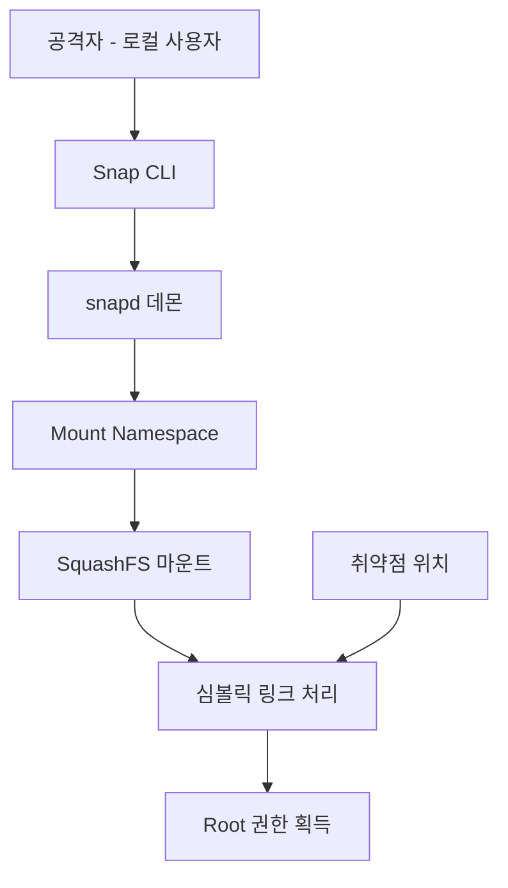
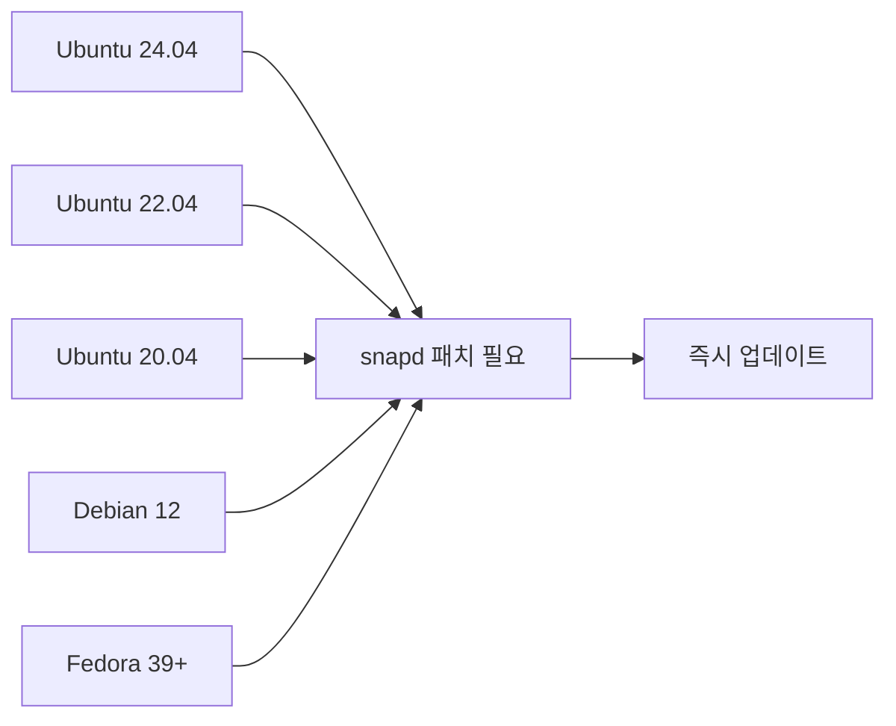
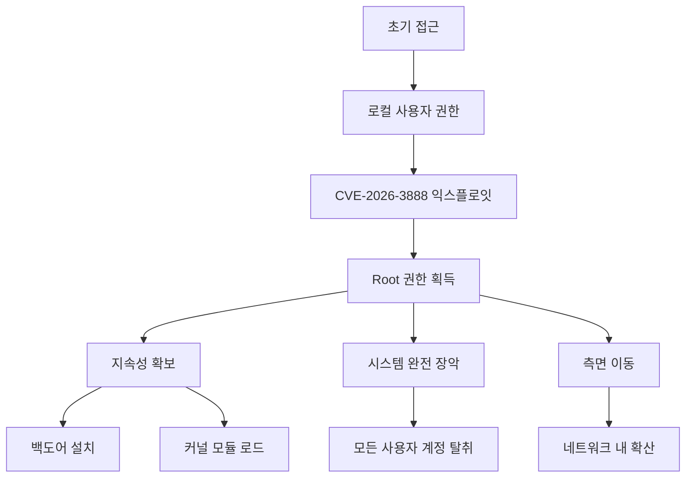

## 서론

개발자 노트북 한 대가 공격자에게 완전히 장악당했다. 루트 권한 탈취. 이것은 시나리오가 아니라 CVE-2026-3888이 현실화했을 때 벌어질 상황이다.

대부분의 리눅스 보안 담당자는 원격 공격에 집중한다. SSH 무차별 대입, 웹 취약점, 열린 포트 스캔. 하지만 로컬 권한 상승(LPE) 취약점은 사각지대에 놓이기 쉽다. "어차피 로컬 접속이 있어야 하는데?"라는 잘못된 가정 때문이다.

현실은 다르다. 피싱으로 계정 하나 뚫리면, 컨테이너 탈출 한 번이면, 혹은 웹 쉘 하나 올리면 공격자는 이미 로컬 사용자다. 그 다음은 CVE-2026-3888 같은 LPE 취약점이 책임진다. 일반 사용자에서 루트로, 단 몇 초 만에.

Qualys가 발견한 이 취약점은 Snap 패키지 관리자를 노린다. Ubuntu를 비롯한 주요 배포판이 기본으로 설치하는 그 Snap이다. Important 등급 분류가 오히려 과소평가일 수 있다. 영향 범위와 공격 난이도를 고려하면 Critical 수준의 위협이다.

## CVE-2026-3888 기술적 분석

### Snap 아키텍처와 공격 표면

Snap은 Canonical이 개발한 범용 리눅스 패키징 시스템이다. 의존성 문제를 해결하고 샌드박싱을 통해 보안을 강화한다는 게 설계 목표였다. 아이러니하게도 이 샌드박싱 메커니즘 자체가 공격 표면이 됐다.



Snap의 핵심 구성요소:

| 구성요소 | 권한 레벨 | 역할 |
| :--- | :--- | :--- |
| snap | 사용자 | CLI 도구, 사용자 명령 처리 |
| snapd | Root | 데몬, 실제 패키지 관리 수행 |
| snap-confine | Root | 샌드박싱, 네임스페이스 설정 |
| mount-helper | Root | 파일시스템 마운트 작업 |

취약점은 권한이 상승하는 과정의 특정 검증 로직 부재에서 발생한다. 사용자 권한으로 시작된 요청이 Root 권한의 snapd 데몬에서 처리될 때, 입력값 검증이 충분하지 않았던 것이다.

### 취약점 상세 메커니즘

CVE-2026-3888의 핵심은 심볼릭 링크(symlink) 경쟁 조건(race condition)과 부적절한 경로 검증의 조합이다.

```c
// 취약한 코드 패턴 (개념적 표현)
int mount_snap_package(const char *snap_path) {
    char resolved_path[PATH_MAX];
    
    // 문제 1: 검증과 사용 사이의 시간차
    if (!is_safe_path(snap_path)) {
        return -1;
    }
    
    // 이 시점에서 공격자가 심볼릭 링크 변경 가능
    // TOCTOU (Time-of-Check to Time-of-Use)
    
    realpath(snap_path, resolved_path);
    
    // 문제 2: Root 권한으로 악의적 경로 마운트
    return mount(resolved_path, target, "squashfs", 0, NULL);
}
```

공격 흐름:

1. 공격자는 악의적인 Snap 패키지 구조를 생성
2. 심볼릭 링크를 정상 경로로 설정
3. snapd가 경로 검증 수행 (통과)
4. 검증 후 마운트 전, 링크를 민감한 시스템 파일로 변경
5. snapd가 Root 권한으로 공격자 제어 경로 마운트
6. 권한 상승 완료

### PoC 개념 검증

다음은 취약점 exploitation의 개념적 흐름이다. 실제 공격 코드는 윤리적 이유로 완전한 형태를 제공하지 않는다.

```bash
#!/bin/bash
# CVE-2026-3888 개념 검증 (연구 목적)

# 1. 공격 준비 - 악성 Snap 구조 생성
mkdir -p /tmp/malicious_snap/{meta,hooks}
cd /tmp/malicious_snap

# 2. 심볼릭 링크 경쟁 조건 악용 준비
ln -s /usr/bin/snap target_link

# 3. 후킹 스크립트 (실제 공격에서는 더 정교함)
cat > meta/snap.yaml << EOF
name: malicious
version: 1.0
architectures:
  - all
EOF

# 4. 경쟁 조건 트리거
# (실제 PoC에서는 멀티스레드 race trigger 사용)
while true; do
    ln -sf /etc/passwd target_link 2>/dev/null
    ln -sf /usr/bin/snap target_link 2>/dev/null
done &

# 5. Snap 작업 트리거
snap install --dangerous ./malicious.snap

# 정리
kill %1 2>/dev/null
```

### 영향받는 버전 및 배포판

| 배포판 | 영향받는 Snap 버전 | 패치된 버전 |
| :--- | :--- | :--- |
| Ubuntu 24.04 LTS | snapd 2.61 ~ 2.63 | snapd 2.64 이상 |
| Ubuntu 22.04 LTS | snapd 2.58 ~ 2.62 | snapd 2.63 이상 |
| Ubuntu 20.04 LTS | snapd 2.55 ~ 2.60 | snapd 2.61 이상 |
| Debian 12 | snapd 2.57 ~ 2.61 | snapd 2.62 이상 |
| Fedora 39+ | snapd 2.60 ~ 2.62 | snapd 2.63 이상 |
| Arch Linux | snapd 2.61 ~ 2.62 | snapd 2.63 이상 |



## 대응 및 완화 조치

### 1단계: 현재 버전 확인

시스템 관리자가 가장 먼저 해야 할 일은 현재 설치된 Snap 버전을 확인하는 것이다.

```bash
# Snap 버전 확인
snap --version

# 출력 예시
# snap    2.63.1
# snapd   2.63.1
# series  16
# ubuntu  24.04
# kernel  6.8.0-41-generic
```

### 2단계: 패치 적용

영향받는 버전이 확인되면 즉시 업데이트를 수행한다.

```bash
# Ubuntu/Debian의 경우
sudo apt update
sudo apt install --only-upgrade snapd

# Fedora의 경우
sudo dnf update snapd

# Arch Linux의 경우
sudo pacman -Syu snapd

# 패치 적용 확인
snap --version
```

### 3단계: 서비스 재시작

패치 후 snapd 데몬 재시작이 필요하다.

```bash
# snapd 서비스 재시작
sudo systemctl restart snapd

# 서비스 상태 확인
sudo systemctl status snapd

# 관련 소켓도 확인
sudo systemctl status snapd.socket
```

### 4단계: 일시적 완화 조치 (패치 불가능한 경우)

즉시 패치가 불가능한 레거시 시스템의 경우, 다음 완화 조치를 적용한다.

```bash
# 방법 1: 일반 사용자의 Snap 사용 제한
# snap 실행 권한 제거
sudo chmod 750 /usr/bin/snap
sudo chown root:snap /usr/bin/snap

# 특정 사용자만 snap 그룹에 추가
sudo usermod -aG snap trusted_user

# 방법 2: AppArmor 프로필 강화
sudo aa-enforce /etc/apparmor.d/usr.lib.snapd.snap-confine

# 방법 3: 감사 로깅 활성화
sudo auditctl -w /usr/bin/snap -p x -k snap_execution
sudo auditctl -w /var/lib/snapd -p wa -k snap_modification
```

### 5단계: 침해 탐지

이미 익스플로잇이 시도되었는지 확인한다.

```bash
#!/bin/bash
# CVE-2026-3888 익스플로잇 탐지 스크립트

echo "=== Snap LPE 취약점 탐지 ==="

# 의심스러운 Snap 설치 시도 확인
echo "[1] 비정상 Snap 설치 로그 확인"
journalctl -u snapd | grep -E "dangerous|devmode|jailmode" | tail -20

# 심볼릭 링크 이상 확인
echo -e "
[2] Snap 관련 심볼릭 링크 이상 확인"
find /snap -type l -ls 2>/dev/null | grep -v "^l.*snap -> /var/lib/snapd"
find /var/lib/snapd/snap -type l -ls 2>/dev/null | grep -v "^l.*snap -> /var/lib/snapd"

# 최근 Root 권한 획득 로그
echo -e "
[3] 비정상 권한 상승 로그"
grep -E "COMMAND=snap|USER=root" /var/log/auth.log | tail -20

# 실행 중인 의심스러운 Snap 프로세스
echo -e "
[4] 실행 중인 Snap 관련 프로세스"
ps aux | grep -E "snap|snapd" | grep -v grep
```

## 심층 분석: 왜 이 취약점이 위험한가

### 공격 시나리오 확장



LPE 취약점은 단독으로 존재하지 않는다. 공격 킬체인의 연결 고리로 작동한다.

| 공격 단계 | LPE 없이 | LPE 있이 |
| :--- | :--- | :--- |
| 초기 접근 | 제한된 사용자 권한 | 동일 |
| 권한 상승 | 불가능 | **Root 획득** |
| 지속성 | 사용자 레벨만 | 시스템 레벨 |
| 탐지 회피 | 제한적 | 완전한 로그 조작 가능 |
| 측면 이동 | 매우 제한적 | 전체 네트워크 위협 |

### 실제 위협 시나리오

**시나리오 1: 클라우드 인스턴스 탈취** 공격자가 SSRF나 메타데이터 서비스 악용으로 클라우드 인스턴스에 로컬 접근 획득. CVE-2026-3888로 Root 권한 획득 후, 클라우드 메타데이터 API를 통한 다른 리소스 접근.

**시나리오 2: 컨테이너 탈출 확장** 이미 컨테이너를 탈출한 공격자가 호스트의 일반 사용자 권한 획득. Snap LPE로 호스트 Root 권한 획득. 전체 클러스터 장악.

**시나리오 3: 내부 위협 확대** 낮은 권한을 가진 내부 공격자가 Snap LPE 활용. 보안 솔루션 무력화 후 데이터 유출.

### Qualys의 탐지 및 방어 도구

Qualys는 이 취약점 발견과 함께 탐지 규칙도 공개했다.

| Qualys 제품 | 기능 | 규칙 ID |
| :--- | :--- | :--- |
| Vulnerability Management | 취약점 스캔 | QID-38888-26 |
| Policy Compliance | 설정 점검 | PC-SNAP-001 |
| Threat Protection | 익스플로잇 탐지 | EID-2026-3888 |

## 결론

CVE-2026-3888은 단순한 버그가 아니다. 리눅스 보안 모델의 근간을 흔드는 취약점이다. 로컬 권한 상승은 공격 킬체인에서 "game changer"다. 공격자가 일반 사용자에서 Root로 바뀌는 순간, 게임은 끝난다.

핵심 대응 사항 정리:

1. **즉시 패치**: `sudo apt install --only-upgrade snapd`
2. **버전 확인**: snapd 2.64 이상인지 확인
3. **로그 점검**: 비정상적인 snap 실행 이력 확인
4. **접근 제어**: 불필요한 사용자의 snap 접근 제한

이 취약점이 특히 우려스러운 이유는 Snap의 보편성이다. Ubuntu는 클라우드와 데스크톱 시장에서 압도적인 점유율을 가진다. 기본 설치되는 패키지 관리자에 이런 취약점이 있다는 건, 수많은 시스템이 이미 노출되어 있음을 의미한다.

보안 담당자들이 명심해야 할 점: 로컬 공격 표면을 무시하지 말라. 방화벽이 완벽해도, 내부에서 무너지면 끝이다. 정기적인 패치 관리와 함께, 로컬 권한 상승 벡터에 대한 지속적인 모니터링이 필수다.

**참고 자료**

- [Qualys Security Advisory - CVE-2026-3888](https://www.qualys.com/)

- [Canonical Security Notice](https://ubuntu.com/security/notices)

- [NVD - CVE-2026-3888](https://nvd.nist.gov/)

- [Snapd GitHub Security Advisories](https://github.com/snapcore/snapd/security/advisories)
