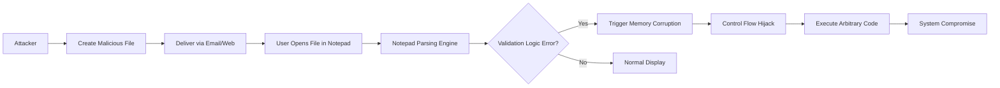

## 서론

포렌식 조사를 위해 확보된 로그 파일이나, 동료가 보낸 간단한 메모장 파일을 더블 클릭하는 순간, 당신의 시스템은 공격자의 완벽한 통제 하에 놓일 수 있습니다. 우리는 종일 복잡한 이메일 첨부파일이나 실행 파일(exe)만을 경계하지만, 운영체제에서 가장 기본적이고 무해해 보이는 애플리케이션인 **Windows 메모장(Notepad)**이 이번 2월 패치 튜스데이의 핵심 타겟이 되었습니다.

Microsoft가 발표한 **CVE-2026-20841**은 Windows 메모장에서 원격 코드 실행(RCE)이 가능한 치명적인 취약점입니다. 이 취약점의 중요성은 단순히 소프트웨어의 버그를 넘어, '신뢰할 수 있는 기본 도구'가 악용될 때 발생하는 보안 관성의 위험성을 보여줍니다. 공격자는 별도의 권한 상격 이상(Elevation of Privilege) 없이도, 사용자의 단순한 파일 오픈 행위를 통해 시스템 전체를 장악할 수 있습니다. 이 글에서는 CVE-2026-20841의 기술적 원인, 공격 메커니즘, 그리고 시스템을 보호하기 위한 실질적인 대응 전략을 분석합니다.

## 기술적 배경 및 원인 분석

CVE-2026-20841은 Windows 메모장이 특수하게 조작된 파일을 처리하는 과정에서 발생하는 메모리 손상 취약점입니다. 일반적으로 메모장은 텍스트 데이터를 렌더링하고 인코딩을 변환하는 역할을 수행합니다. 이때 공격자는 파일의 포맷이나 인코딩 헤더와 같은 메타데이터를 비정상적으로 조작하여, 메모장의 파싱 로직이 메모리 할당과 해제 과정에서 오류를 일으키도록 유도합니다.

이러한 유형의 취약점은 주로 **Heap Corruption(힙 손상)** 형태를 띠며, 잘못된 메모리 참조를 통해 프로그램의 흐름을 제어할 수 있는 취약점(Corruption)으로 이어집니다. 공격자가 이 취약점을 성공적으로 exploit하면, 메모장 프로세스의 권한으로 임의의 코드를 실행할 수 있습니다. 특히 메모장은 기본적으로 사용자 권한으로 실행되지만, 최근 윈도우 환경에서는 파일 시스템 접근이나 다른 프로세스와의 상호작용이 용이하기 때문에, 이를 발판으로 랜섬웨어 배포나 탈취된 데이터의 외부 유출(C2 통신)로 이어질 가능성이 매우 높습니다.

## 공격 시나리오 및 메커니즘

이 취약점을 악용한 공격은 사용자의 상호작용을 최소화로 만드는 것이 핵심입니다. 아래 다이어그램은 악의적인 파일이 생성되어 최종적으로 시스템이 침해되기까지의 공격 사이클을 도식화한 것입니다.



공격자는 피해자가 파일을 열기만 하면 되도록 설계합니다. 파일이 열리는 순간 `Notepad Parsing Engine`이 악의적인 데이터를 처리하며, 검증 로직의 부재 혹은 오류로 인해 메모리 구조가 깨집니다(Corruption). 이 순간 공격자는 준비해� shellcode를 실행하여 제어권을 가져옵니다.

## 취약점 재현 및 탐지 시뮬레이션 (PoC)

*⚠️ 경고: 아래 코드는 연구 및 방어 목적으로만 제공됩니다. 승인되지 않은 시스템에서 실행하는 것은 불법입니다.*

실제 공격 코드는 메모리 레이아웃을 정밀하게 조작해야 하지만, 개념 증명(PoC) 수준에서는 파싱 오류를 유발하는 패턴을 생성하여 애플리케이션의 안정성을 테스트할 수 있습니다. 예를 들어, 특정 인코딩 전환을 유발하는 비정상적인 유니코드 시퀀스를 삽입하여 크래시를 유도하는 Python 스크립트는 다음과 같습니다.

```python
import struct

def generate_malicious_file(filename):
    # 일반적인 텍스트 헤더
    header = b"Normal Log File:\r
"
    
    # 취약점을 트리거할 수 있는 비정상적인 유니코드/UTF-8 시퀀스 시뮬레이션
    # 실제 Exploit은 힙 레이아웃을 맞추기 위한 정교한 패딩이 필요함
    crash_pattern = b"\xFE\xFF" + b"A" * 1000 + b"\x00\x00"
    
    # 반복적인 패턴으로 버퍼 오버플로우 시도 시뮬레이션
    payload = crash_pattern * 50
    
    try:
        with open(filename, "wb") as f:
            f.write(header + payload)
        print(f"[+] File generated: {filename}")
        print(f"[!] Opening this file in an unpatched Notepad may trigger the vulnerability.")
    except Exception as e:
        print(f"[-] Error: {e}")

if __name__ == "__main__":
    # 테스트용 파일명 생성
    generate_malicious_file("crash_test.txt")
```

위 스크립트는 `crash_test.txt`라는 파일을 생성합니다. 패치가 적용되지 않은 시스템에서 이 파일을 열면, 메모장은 긴 패턴과 잘못된 인코딩 시퀀스를 처리하려 시도하다가 비정상 종료(Crash)될 수 있습니다. 방어자 입장에서는 이러한 비정상적인 종료 로그나 특정 패턴을 가진 파일을 탐지 규칙(Sigma Rule 등)으로 설정하여 미차단 할 수 있습니다.

## 영향도 분석 및 비교

이번 CVE-2026-20841은 일반적인 문서 편집기 취약점과는 달리 윈도우 OS 자체에 내장된 핵심 유틸리티라는 점에서 파급력이 큽니다. 다음은 일반적인 제3자 텍스트 에디터 취약점과 Windows 메모장 취약점의 위험도를 비교한 표입니다.

| 비교 항목 | 일반 제3자 텍스트 에디터 (예: Editor X) | Windows 메모장 (CVE-2026-20841) | | :--- | :--- | :--- | | **설치율** | 특정 사용자군에 국한됨 | 윈도우 사용자 100% 기본 설치 | | **신뢰 수준(Trust)** | 사용자가 다운로드하여 설치 (상대적으로 낮음) | OS 기본 구성요소 (상대적으로 높음) | | **기본 연결 프로그램** | 수동 설정 필요 | .txt, .log, .ini 등 기본 연결 | | **네트워크 공격면** | 내부 네트워크 트래픽 제한될 수 있음 | 표준 프로토콜/파일 형식 사용, 탐지 회피 용이 | | **패치 적용 난이도** | 자동 업데이트 지원 여부에 따라 다름 | Windows Update (WSUS/SCCM)로 대규모 관리 가능 | | **공격 성공 확률** | 사용자가 해당 프로그램을 사용 중이어야 함 | 누구나 파일을 여는 순간 공격 가능 |

이 표에서 볼 수 있듯이, 메모장은 사용자가 별도의 조치를 취하지 않아도 기본적으로 모든 파일 형식과 연결되어 있어 공격의 진입점(Attack Vector)으로서 매우 매력적인 대상입니다.

## 대응 가이드

CVE-2026-20841로부터 시스템을 보호하기 위해서는 신속한 패치 적용과 임시 완화 조치가 병행되어야 합니다.

### Step 1: 영향 받는 시스템 확인

대부분의 최신 Windows 10 및 Windows 11 버전이 영향을 받습니다. 특히 2월 패치 튜스데이 이전의 빌드(Build)를 사용하는 모든 시스템은 취약합니다.

### Step 2: 보안 업데이트 적용 (중요)

Microsoft는 이 문제를 해결하기 위해 보안 업데이트를 릴리스했습니다. Windows Update를 통해 즉시 최신 누적 업데이트를 설치해야 합니다.

**PowerShell을 이용한 업데이트 확인 스크립트:**

```text
# 현재 시스템의 핫픽스(HotFix) 목록에서 2월 패치 관련 KB ID 확인
# 실제 KB ID는 Microsoft 공식 보안 공지를 참고해야 합니다 (예: KB503xxxx)

Get-HotFix | Where-Object {
    $_.InstalledOn -gt (Get-Date).AddDays(-30) -and 
    $_.Description -eq "Security Update"
} | Format-Table -AutoSize

# 최신 업데이트 강제 검사 (관리자 권한 필요)
Install-Module PSWindowsUpdate -Force
Import-Module PSWindowsUpdate
Get-WindowsUpdate -AcceptAll -Install -AutoReboot
```

### Step 3: 레지스트리 기반 완화 조치 (권장)

패치를 즉시 적용할 수 없는 상황에서는, 신뢰할 수 없는 파일을 열 때 '메모장' 대신 다른 안전한 뷰어를 사용하도록 파일 연결 프로그램을 변경하거나, Microsoft Defender Application Control(WDAC)을 통해 메모장의 실행을 제한할 수 있습니다. 하지만 이는 사용자 경험에 큰 영향을 주므로, 긴급한 상황이 아니라면 **패치 적용이 최우선**입니다.

## 결론

CVE-2026-20841은 가장 평범해 보이는 도구가 가장 치명적인 무기가 될 수 있음을 상기시키는 케이스입니다. 공격자들은 항상 보안 팀이 방심하고 있는 '기본값'을 노립니다. 이번 사건을 통해 우리는 단순한 텍스트 파일조차도 잠재적인 위협일 수 있음을 인지해야 하며, 모든 파일 확장자에 대해 경계해야 합니다.

전문가의 관점에서 볼 때, 이번 취약점의 핵심 교훈은 **'신뢰의 전파(Transitive Trust)'** 차단입니다. 사용자가 파일 발송자를 신뢑하더라도, 발송자의 시스템이 감염되어 있었다면 해당 파일은 악성일 수 있습니다. 따라서 EDR(Endpoint Detection and Response) 솔루션에서 메모장 프로세스(`notepad.exe`)의 비정상적인 자식 프로세스 생성(Cmd, PowerShell 등)을 탐지하는 룰을 활성화하는 것과 같은 방어적 깊이 전략이 필수적입니다.

### 참고자료

- [Microsoft Security Update Guide - February 2025](https://msrc.microsoft.com/update-guide)

- [CVE-2026-20841 - NVD (National Vulnerability Database)](https://nvd.nist.gov/vuln/detail/CVE-2026-20841)

- [SOC Prime Advisory on Windows Notepad RCE](https://socprime.com)
