## 서론

우리는 종종 보안 경계를 설정할 때 화려한 네트워크 장비나 복잡한 백엔드 서비스에만 집중하는 경향이 있습니다. 그러나 공격자는 항상 가장 약한 고리, 즉 가장 평범하고 신뢰하는 애플리케이션을 노립니다. 만약 당신이 이메일로 받은 간단한 텍스트 로그 파일을 더블 클릭하는 순간, 시스템 전체의 관리자 권한을 탈취당한다면 상상이나 해보셨나요?

바로 이 시나리오가 현실이 되었습니다. Microsoft Windows의 상징적인 텍스트 편집기인 메모장(Notepad)에서 원격 코드 실행(RCE) 취약점(CVE-2026-20841)이 발견되었습니다. 이 취약점은 단순한 텍스트 뷰어라는 인식 때문에 오히려 더 위험합니다. 사용자는 메모장을 열 때 '안전하다'는 막연한 믿음을 가지기 때문입니다. 이번 분석에서는 "무해한 앱"으로 보이는 메모장이 어떻게 치명적인 공격 경로가 될 수 있는지, 그 기술적 원리와 대응책을 깊이 있게 다루겠습니다.

## 본론

### 기술적 배경 및 취약점 원리

CVE-2026-20841은 핵심적으로 메모장이 특수하게 조작된 파일을 처리할 때 발생하는 메모리 손상(Memory Corruption) 취약점입니다. 메모장은 단순히 텍스트를 보여주는 것처럼 보이지만, 실제로는 다양한 인코딩(UTF-8, UTF-16 등)을 자동으로 감지하고 변환하며, 긴 줄바꿈을 처리하는 등 복잡한 파싱 로직을 내포하고 있습니다.

공격자는 이러한 파싱 로직의 예외 처리 경로를 공략합니다. 예를 들어, 특정 시퀀스의 문자열이나 비정상적인 파일 헤더를 포함한 텍스트 파일을 메모장이 열도록 유도하면, 버퍼 오버플로우(Heap Overflow)나 Use-After-Free와 같은 메모리 오류를 유발할 수 있습니다. 이때 취약점이 트리거되면, 공격자는 메모리상의 특정 위치에 악성 코드(Shellcode)를 삽입하고 실행 흐름을 조작하여 임의의 코드를 실행할 수 있게 됩니다. 더욱이, 메모장은 일반적으로 사용자 권한으로 실행되지만, 특정 환경이나 UAC 우회 기법과 결합될 경우 시스템 권한(System Privilege)으로까지 상승할 수 있는 잠재력을 가집니다.

### 공격 시나리오 흐름

이 공격이 실제로 어떻게 수행되는지 간단한 다이어그램으로 확인해 보겠습니다.

```mermaid
graph LR
    A[Attacker] -->|Creates malicious .txt/.log| B[Malicious File]
    B -->|Email download / Web link| C[Victim User]
    C -->|Double click / Open with Notepad| D[Windows Notepad]
    D -->|Parsing specific encoding| E[Memory Corruption Trigger]
    E -->|Overwrite Return Address| F[Arbitrary Code Execution]
    F -->|Reverse Shell / Malware| G[System Compromise]
```



위 다이어그램에서 볼 수 있듯이, 사용자의 개입은 단순히 파일을 여는 행동뿐입니다. 별도의 스크립트 실행이나 권한 상승 확인 절차 없이도 공격 체인이 완성될 수 있어 위험도가 매우 높습니다.

### 취약점 재현 및 탐지 (개념 증명)

**주의**: 아래 코드는 연구 및 방어 목적으로만 제공됩니다. 악의적인 목적으로 사용하는 것은 엄격히 금지됩니다.

이 취약점은 주로 특정 길이의 문자열이나 잘못된 형식의 유니코드 문자를 처리할 때 발생합니다. 연구원들은 퍼징(Fuzzing) 기법을 통해 이러한 크래시 유발 패턴을 찾아냅니다. 다음은 파이썬을 사용하여 취약점 분석용으로 비정상적인 패턴을 생성하는 간단한 예시 코드입니다.

```python
import struct

def generate_malicious_file(filename):
    """
    CVE-2026-20841 분석용 테스트 파일 생성기
    특정 인코딩 처리 시 버퍼 오버플로우 유발 가능성 있는 패턴 생성
    """
    
    # 일반적인 텍스트 헤더
    header = b"LOG_FILE_START\x0a"
    
    # 취약점 트리거 시나리오: 비정상적으로 긴 유니코드 시퀀스 또는
    # 인코딩 변환 경계에서의 잘못된 길이 계산 유도
    # 여기서는 예시로 10,000개의 'A' 문자를 생성하여 버퍼 경계 테스트
    crash_pattern = b"A" * 10000
    
    # 특정 오프셋에 가상의 반환 주소 덮어쓰기 시도 (개념적)
    # 실제 공격에서는 정확한 오프셋과 ROP 가젯이 필요함
    payload = crash_pattern + b"\x00\x00\x00\x00"

    try:
        with open(filename, 'wb') as f:
            f.write(header + payload)
        print(f"[+] 파일 생성 완료: {filename}")
        print(f"[+] 파일 크기: {len(header) + len(payload)} 바이트")
        print("[!] 경고: 이 파일을 취약한 버전의 메모장에서 열면 크래시가 발생할 수 있습니다.")
    except IOError as e:
        print(f"[-] 파일 생성 실패: {e}")

if __name__ == "__main__":
    # 테스트 파일 이름 지정
    generate_malicious_file("crash_test.txt")
```

위 코드는 단순한 버퍼 오버플로우를 유발하는 기본적인 구조입니다. 실제 공격(PoC)에서는 DEP(Data Execution Prevention)나 ASLR(Address Space Layout Randomization) 우회 기술이 포함된 정교한 페이로드가 필요합니다. 하지만 이 코드조차도 방어자 입장에서는 시스템이 예외적으로 종료되는지 확인하여 패치 전 여부를 테스트하는 데 사용할 수 있습니다.

### 영향 받는 시스템 및 완화 조치 비교

CVE-2026-20841의 영향은 광범위합니다. 메모장은 Windows OS에 내장된 기본 앱이므로, 최신 패치가 적용되지 않은 다양한 버전의 Windows 시스템이 취약할 수 있습니다.

| 비교 항목 | 취약한 시스템 (Patch 전) | 패치된 시스템 (Patch 후) |
| :--- | :--- | :--- |
| **영향 받는 버전** | Windows 10 (21H2 이전), Windows 11 초기 빌드 | 최신 2026년 3월 누적 업데이트 설치 시 |
| **파싱 로직** | 특수 유니코드 시퀀스 검증 누락 | 강화된 입력 검증 및 길이 제한 적용 |
| **권한 영향** | 사용자 컨텍스트 실행 (LPE 가능성 있음) | 취약점 자체가 차단되어 실행 불가 |
| **대응 상태** | 공격 시 시스템 장애 또는 악성 코드 실행 | 예외 처리로 인해 앱이 안전하게 종료됨 |

### 단계별 대응 가이드

시스템 관리자 및 사용자는 다음 절차에 따라 즉시 상황을 점검하고 조치해야 합니다.

#### Step 1: 영향 여부 확인 시스템에 설치된 Windows 버전과 업데이트 내역을 확인합니다.
1. `설정(Settings)` > `업데이트 및 보안(Update & Security)`으로 이동합니다.
2. `업데이트 기록(View update history)`을 확인합니다.
3. **2026년 3월 또는 그 이후**에 발표된 보안 업데이트(KBxxxxxx)가 설치되어 있는지 확인합니다. CVE-2026-20841에 대한 패치가 포함되어 있어야 합니다.

#### Step 2: 보안 패치 적용 가장 확실한 대응은 Microsoft에서 제공하는 공식 패치를 적용하는 것입니다.

```bash
# PowerShell을 관리자 권한으로 실행하여 최신 업데이트 강제 확인
Install-Module PSWindowsUpdate
Import-Module PSWindowsUpdate
Get-WindowsUpdate -Install -AcceptAll -Kb "KB[Relevant_Patch_ID]"
```

*(참고: 실제 운영 환경에서는 WSUS 또는 기존 패치 관리 도구를 통해 배포하세요.)*

#### Step 3: 임시 완화 조치 (패치 적용 전 불가피한 경우) 패치를 즉시 적용할 수 없는 상황이라면 다음과 같은 임시 조치를 취합니다.

- **파일 연결 프로그램 변경**: 기본 `.txt` 파일 열기를 메모장이 아닌 다른 안전한 텍스트 편집기(예: VS Code, Notepad++)로 변경합니다.

    *   `.txt` 파일 우클릭 -> `연결 프로그램(Open with)` -> `다른 앱 선택` -> 신뢰할 수 있는 에디터 선택.

- **특이한 출처의 파일 차단**: 알 수 없는 발신자로부터 온 `.txt`나 `.log` 파일을 직접 열지 않습니다. 특히 이메일 첨부파일은 웹 브라우저의 샌드박스 환경이나 격리된 머신에서 먼저 확인해야 합니다.

## 결론

CVE-2026-20841은 우리에게 중요한 교훈을 줍니다. "기본 앱"이라고 해서 "안전한 앱"은 아닙니다. 가장 대중적이고 널리 사용되는 소프트웨어일수록 공격자의 주 타겟이 되며, 그 파급력 또한 막대합니다. 이번 메모장 RCE 취약점은 단순한 텍스트 뷰어가 시스템 전체를 장악할 수 있는 박스(Backdoor)가 될 수 있음을 시사합니다.

전문가로서의 제 인사이트는 이렇습니다. 이제 보안 전략은 특정 애플리케이션의 신뢰도를 기준으로 삼아서는 안 됩니다. "Zero Trust(신뢰하지 않음)"의 원칙은 OS 수준의 기본 구성 요소에도 동일하게 적용되어야 합니다. 다행히 Microsoft는 신속하게 패치를 배포했을 것이며, 사용자의 즉각적인 업데이트만이 이 공격 사슬을 끊을 수 있는 유일한 해결책입니다.

### 참고자료

- [CVE Record - CVE-2026-20841](https://www.cve.org/CVERecord?id=CVE-2026-20841)

- [Microsoft Security Bulletin](https://msrc.microsoft.com/)

- NIST National Vulnerability Database
