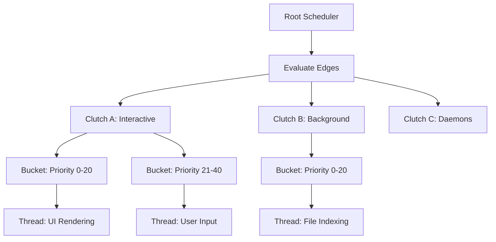

## 서론

최근 M1, M2, M3 칩과 같은 Apple Silicon의 등장으로 macOS와 iOS는 단순한 모바일 운영체제를 넘어, 데스크탑급 성능과 모바일급 전력 효율을 동시에 요구하는 복잡한 환경으로 진화했습니다. 이러한 하드웨어의 변화는 소프트웨어, 특히 운영체제 커널의 스케줄러 설계에 근본적인 도전을 안겨주었습니다. 성능 코어(Performance Cores)와 효율 코어(Efficiency Cores)로 구성된 비대칭 멀티 프로세싱(Asymmetric Multiprocessing, AMP) 환경에서, 단순히 "실행 큐의 순서대로" 스레드를 할당하는 것은 더 이상 유효하지 않습니다. 배터리 수명을 희생하면서까지 성능만을 쫓거나, 반대로 사용자 경험을 저해하면서까지 전력을 아끼는 것은 올바른 접근이 아닙니다.

바로 이 지점에서 Apple XNU 커널의 **Clutch Scheduler**가 주목받고 있습니다. Clutch Scheduler는 기존의 스케줄링 방식을 획기적으로 개선하여, 다양한 워크로드의 계산 비용(Cost)과 계층적 우선순위를 동시에 고려하는 '엣지(Edge) 기반' 결정 메커니즘을 도입했습니다. 이 글에서는 Apple이 오픈 소스로 공개한 XNU 커널 문서와 최신 연구 동향을 바탕으로, Clutch Scheduler가 어떻게 복잡한 스레드 관리 문제를 해결하고 시스템 반응성을 극대화하는지 기술적으로 심층 분석하고자 합니다.

## 본론

### 1. Clutch Scheduler의 기술적 배경과 원리

기존의 리눅스 CFS(Completely Fair Scheduler)나 macOS의 이전 스케줄러는 주로 실행 시간(runtime)이나 가상 실행 시간(vruntime)을 기준으로公平성을 추구했습니다. 하지만 Apple Silicon처럼 성능 특성이 다른 코어가 섞여 있는 환경에서는 '얼마나 오래 실행했는가'보다 '얼마나 중요한 작업인가'와 '어떤 코어가 적합한가'가 훨씬 중요한 결정 변수가 됩니다.

Clutch Scheduler는 스레드를 **Clutch(클러치)**라는 논리적 그룹으로 묶어 관리합니다. 각 Clutch는 특정한 스케줄링 속성(예: 백그라운드, 포그라운드, 실시간 등)을 공유하며, 이를 다시 **Bucket(버킷)**이라는 하위 우선순위 계층으로 세분화합니다.

여기서 핵심 개념은 **Edge(엣지)**입니다. Edge는 단순한 우선순위 숫자가 아니라, 해당 스레드 그룹이 현재 CPU 자원을 얼마나 절실하게 필요로 하는지를 나타내는 '비용 함수'와 유사합니다. 스케줄러는 이 Edge 값을 계산하여, 현재 가장 높은 비용(urgency)을 가진 Clutch를 선택하고, 그 안에서 가장 적합한 스레드를 실행 코어(P-core 또는 E-core)에 할당합니다. 이러한 계층적 접근 방식은 불필요한 문맥 교환(Context Switch)을 줄이고, 캐시 지역성(Locality)을 높이는 데 기여합니다.

### 2. 스케줄링 의사결정 구조 (Mermaid 다이어그램)

아래 다이어그램은 Clutch Scheduler가 루트(Root)에서부터 최종 스레드(Thread)를 선택하기까지의 계층적 의사결정 과정을 시각화한 것입니다. 파란색으로 강조된 부분이 스케줄러의 핵심 로직인 'Edge 비교 및 선택' 단계입니다.



이 구조에서 스케줄러는 최상위 레벨에서 `Clutch A`, `Clutch B`, `Clutch C`의 Edge 점수를 비교합니다. 예를 들어, 사용자가 터치스크린을 조작하는 순간 `Interactive` Clutch의 Edge 점수가 급격히 상승하여 선택됩니다. 이후 내부의 Bucket을 순회하며 가장 높은 우선순위의 스레드를 꺼내 실행합니다.

### 3. 기존 스케줄러와의 비교 분석

Clutch Scheduler가 기존 방식과 어떻게 다른지 명확히 이해하기 위해, macOS의 이전 방식과 주요 특징을 비교해 보겠습니다.

| 특징 | 기존 스케줄러 (Traditional) | XNU Clutch Scheduler | | --- | --- | --- | | **기본 단위** | 개별 스레드 (Thread) | Clutch (그룹) 및 Bucket | | **우선순위** | 고정된 Static Priority 또는 Simple Decay | 계층적 우선순위 및 동적 Edge 계산 | | **코어 할당** | 주로 부하(Load) 기반 분배 | 성능 특성(QoS, Energy) 기반 지능형 할당 | | **반응성** | 선점(Preemption)에 의존 | 우선순위 계층구조를 통한 즉각적 그룹 선점 | | **전력 효율** | 유휴 상태(Idle) 진입 위주 | 워크로드 특성에 따른 E-core/P-core 적극적 분리 |

Clutch Scheduler는 특히 'Quality of Service(QoS)' 클래스를 반영하여 Edge를 계산합니다. 사용자 인터랙션과 직결된 작업은 높은 QoS를 부여받아 P-core로의 배치가 유리하게 계산되는 반면, 백그라운드 다운로드는 낮은 QoS로 인해 E-core에서 처리되도록 유도합니다.

### 4. Edge 계산 메커니즘 구현 (Python 시뮬레이션)

실제 XNU 커널 코드는 C와 어셈블리로 작성되어 있어 매우 복잡하지만, Clutch Scheduler의 핵심인 **Edge 계산 알고리즘**을 파이썬으로 단순화하여 구현해 보겠습니다. 이 코드는 우선순위와 대기 시간을 기반으로 Edge 점수를 산출하는 로직을 시뮬레이션합니다.

```python
import dataclasses

@dataclasses.dataclass
class Thread:
    id: int
    priority: int  # 0-127, Higher is better
    wait_time: int # Time spent waiting in queue
    qos_class: int # Quality of Service class weight

class Clutch:
    def __init__(self, name, base_priority):
        self.name = name
        self.base_priority = base_priority
        self.threads = []
    
    def add_thread(self, thread):
        self.threads.append(thread)

    def calculate_edge(self):
        """
        Calculates the 'Edge' score for this Clutch.
        Formula: Base + Max(Thread Priority + Wait Factor + QoS)
        """
        if not self.threads:
            return 0
        
        # 가장 높은 점수를 가진 스레드를 찾아 Clutch의 Edge로 결정
        # 실제 XNU에서는 더 복잡한 비용 함수와 이동 평균을 사용합니다.
        max_score = 0
        for t in self.threads:
            # 대기 시간이 길어질수록 우선순위가 상승하는 효과(Aging)
            urgency_boost = (t.wait_time ** 1.2) * 0.1
            current_score = t.priority + urgency_boost + t.qos_class
            
            if current_score > max_score:
                max_score = current_score
        
        return self.base_priority + max_score

# 시나리오 설정: Foreground App vs Background Task
interactive_clutch = Clutch("Interactive", 100)
bg_clutch = Clutch("Background", 50)

# 스레드 추가 (UI 렌더링, 사용자 입력)
t1 = Thread(id=1, priority=80, wait_time=5, qos_class=20) 
t2 = Thread(id=2, priority=90, wait_time=10, qos_class=20) # 대기 시간이 김
interactive_clutch.add_thread(t1)
interactive_clutch.add_thread(t2)

# 스레드 추가 (파일 인덱싱)
t3 = Thread(id=3, priority=40, wait_time=50, qos_class=0)
bg_clutch.add_thread(t3)

# Edge 비교 및 스케줄링 결정
edge_interactive = interactive_clutch.calculate_edge()
edge_bg = bg_clutch.calculate_edge()

print(f"Interactive Clutch Edge: {edge_interactive}")
print(f"Background Clutch Edge:    {edge_bg}")

if edge_interactive > edge_bg:
    print(f"Scheduler selects: {interactive_clutch.name} (Run on P-Core)")
else:
    print(f"Scheduler selects: {bg_clutch.name} (Run on E-Core)")
```

이 코드는 스케줄러가 실제로 어떤 로직을 통해 "지금 이 순간 어떤 그룹에게 CPU를 할당할 것인가"를 판단하는지 보여줍니다. `wait_time`과 `qos_class`가 결합되어 단순한 우선순위 넘버가 아닌, 동적인 상황에 대처할 수 있는 **Edge 점수**를 생성합니다.

### 5. 실무 적용을 위한 가이드: 시스템 성능 튜닝

연구자나 엔지니어 관점에서 Clutch Scheduler의 동작을 이해하는 것은 성능 프로파일링에 큰 도움이 됩니다.

1.  **QoS 클래스 명시적 사용**: 애플리케이션을 개발할 때, 백그라운드 작업에는 반드시 `QOS_CLASS_BACKGROUND`나 `QOS_CLASS_UTILITY`를 사용하여 Clutch가 이를 적절한 E-cores로 보내도록 유도해야 합니다. 반대로 메인 스레드 작업은 `QOS_CLASS_USER_INTERACTIVE`를 보장받아야 합니다. 2.  **스레드 우선순위 관리**: 너무 많은 스레드가 높은 우선순위를 선점하면 'Priority Inversion'이나 스레래싱(Thrashing)이 발생할 수 있습니다. Clutch 내의 Bucket 구조를 이해하고 적절한 계층을 할당해야 합니다. 3.  **모니터링 도구 활용**: `xnu`의 `sched` 명령어나 Instruments의 "System Trace"를 통해 현재 어떤 Clutch가 CPU 시간을 점유하고 있는지 확인할 수 있습니다.

## 결론

Apple XNU 커널의 Clutch Scheduler는 단순한 스케줄링 알고리즘을 넘어, 하드웨어의 이질성(Heterogeneity)을 소프트웨어적으로 극복한 정교한 설계의 산물입니다. **엣지(Edge) 기반 스케줄링**과 **계층적 스레드 관리**는 iOS와 macOS가 사용자에게 "터치 즉시 반응하는" 느낌을 제공하면서도 막대한 연산량을 배터리 효율적으로 처리할 수 있게 하는 원동력입니다.

특히 최근 AI 연산이 엣지 디바이스로 내려오는 추세(NPU 활용 등)를 고려할 때, 단순한 배치 작업이 아닌 실시간 반응이 필요한 추론 작업(Inference)을 어떻게 시스템 레벨에서 최적화할지에 대한 통찰을 제공합니다. 연구자는 단순히 모델의 정확도만 볼 것이 아니라, 모델이 실행되는 환경의 스케줄링 특성을 고려하여 MLOps 파이프라인을 구축해야 합니다.

**전문가 인사이트**: 앞으로의 OS 스케줄러는 AI 기반 예측을 도입하여 워크로드 패턴을 학습하고, 미리 코어 자원을 할당하는 "예측형 스케줄링"으로 진화할 가능성이 높습니다. Apple의 현재 Clutch 구조는 그러한 미래 확장성을 염두에 둔 유연한 기반을 갖추고 있습니다.

### 참고자료

- [Apple Open Source - xnu: sched_clutch_edge.md](https://github.com/apple-oss-distributions/xnu/blob/main/doc/scheduler/sched_clutch_edge.md)

- [Apple Developer Documentation - Energy Efficiency Guide for Mac Apps](https://developer.apple.com/documentation/xcode/energy-efficiency)

- [Hacker News Discussion on XNU Scheduler](https://news.ycombinator.com/item?id=46938280)
