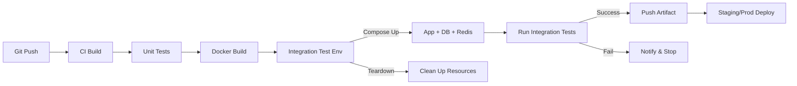

## 서론

금요일 오후, 늦은 시간에 진행된 긴급 배포. 개발 환경과 스테이징 환경에서 모두 "녹색불(성공)"이었던 파이프라인은 프로덕션 환경 배포 직후, 애플리케이션이 죽어가는 것을 목격하게 만들었습니다. 원인은 데이터베이스 마이그레이션 스크립트와 애플리케이션 코드 간의 호환성 문제였습니다. 단위 테스트(Unit Test)는 모든 함수를 개별적으로 통과했고, 테스트 환경에서도 모킹(Mocking)된 API 응답은 정상 작동했습니다.

하지만 실제 서비스는 절대 고립되어 있지 않습니다. 데이터베이스, 외부 API, 메시지 큐 등 수많은 외부 의존성과 상호작용합니다. "내 컴퓨터에서는 되는데?"라는 말은 DevOps 엔지니어에게 가장 듣기 싫은 말이자, 시스템의 취약점을 보여주는 신호입니다.

우리는 이러한 '통합 관점'의 결함을 조기에 발견하기 위해 CI/CD 파이프라인 내에 **통합 테스트(Integration Test)**를 강력하게 결합해야 합니다. 이 글에서는 단순히 빌드가 성공하는지 넘어, 실제 운영 환경과 유사한 조건에서 전체 플로우(Full Flow)가 유효한지를 자동으로 검증하는 방법을 실무 관점에서 기술합니다.

## 본론

### 통합 테스트의 정의와 파이프라인 내 위치

통합 테스트는 모듈 개별 기능이 아닌, 모듈 간의 인터페이스와 상호작용을 검증하는 테스트입니다. CI/CD 파이프라인 관점에서 볼 때, 이는 단위 테스트 직후 혹은 배포 전 단계에서 운영 환경과 유사한 "에페머랄(Ephemeral)"한 환경을 구성하여 실제 연동을 수행하는 단계를 의미합니다.



위 다이어그램과 같이 통합 테스트는 컨테이너화된 의존성(DB, Redis 등)을 임시로 실행시키고, 실제 애플리케이션을 구동한 뒤 API 요청을 보내 실제 라운드트립(Round-trip)을 확인하는 과정입니다.

### 전략 비교: 단위 테스트 vs 통합 테스트

통합 테스트의 중요성을 이해하기 위해 기존 테스트 전략과 비교해 보겠습니다.

| 구분 | 단위 테스트 (Unit Test) | 통합 테스트 (Integration Test) | | :--- | :--- | :--- | | **검증 대상** | 개별 함수, 클래스, 모듈 | 모듈 간 인터페이스, DB 연동, 외부 API | | **실행 속도** | 매우 빠름 (ms 단위) | 상대적으로 느림 (초~분 단위) | | **의존성** | 없음 (Mocking 사용) | 실제 의존성 필요 (Docker, Test Container) | | **파이프라인 위치** | 초기 단계 (Build 시) | 중후반 단계 (Deploy 전) | | **운영 환경 모사도** | 낮음 (로직만 검증) | 높음 (네트워크, 데이터 플로우 검증) | | **유지보수 비용** | 낮음 | 높음 (테스트 데이터 관리 등) |

### Step-by-Step: Docker Compose를 활용한 통합 테스트 구축

실무에서 가장 효율적인 방식 중 하나는 `docker-compose.test.yml`을 별도로 관리하여 CI 파이프라인에서 이를 실행하는 것입니다.

#### Step 1: 테스트용 Docker Compose 작성

테스트 환경에서는 불필요한 부수 기능을 제외하고, 핵심 의존성만 정의합니다. 테스트 컨테이너가 종료될 때 자원이 정리되도록 설정합니다.

```yaml
# docker-compose.test.yml
version: '3.8'

services:
  app:
    build: .
    environment:
      - DATABASE_URL=postgres://user:pass@db:5432/testdb
      - REDIS_URL=redis://redis:6379
    depends_on:
      - db
      - redis
    command: python -m pytest tests/integration/

  db:
    image: postgres:15-alpine
    environment:
      POSTGRES_USER: user
      POSTGRES_PASSWORD: pass
      POSTGRES_DB: testdb
    healthcheck:
      test: ["CMD-SHELL", "pg_isready -U user"]
      interval: 5s
      timeout: 5s
      retries: 5

  redis:
    image: redis:7-alpine
    healthcheck:
      test: ["CMD", "redis-cli", "ping"]
      interval: 5s
      timeout: 3s
      retries: 5
```

#### Step 2: CI/CD 파이프라인 설정 (GitHub Actions 예시)

실제 파이프라인 코드는 다음과 같습니다. 여기서 중요한 점은 `docker compose`를 사용하여 환경을 띄우고 테스트가 끝나면 무조건 `down` 시켜 CI 서버의 리소스를 반환하는 것입니다.

```yaml
# .github/workflows/integration-test.yml
name: Integration Test Pipeline

on:
  pull_request:
    branches: [ "main" ]

jobs:
  integration-test:
    runs-on: ubuntu-latest
    steps:
    - name: Checkout code
      uses: actions/checkout@v3

    - name: Set up Docker Buildx
      uses: docker/setup-buildx-action@v2

    - name: Run Integration Test Environment
      run: |
        docker compose -f docker-compose.test.yml up -d
        docker compose -f docker-compose.test.yml ps

    - name: Wait for DB
      run: |
        # DB가 완전히 준비될 때까지 대기하는 스크립트
        timeout 60s bash -c 'until docker compose -f docker-compose.test.yml exec -T db pg_isready; do sleep 2; done'

    - name: Run Tests
      run: docker compose -f docker-compose.test.yml run --rm app

    - name: Archive Test Results
      if: always()
      uses: actions/upload-artifact@v3
      with:
        name: test-reports
        path: tests/report/

    - name: Cleanup
      if: always()
      run: docker compose -f docker-compose.test.yml down -v
```

#### Step 3: 실제 테스트 코드 작성 (Python 예시)

테스트 코드는 실제 애플리케이션을 통과하여 데이터가 DB에 저장되고, 캐시에 기록되는지 확인해야 합니다.

```python
# tests/integration/test_full_flow.py
import requests
import os
import pytest

BASE_URL = os.getenv("APP_URL", "http://app:8000")

def test_user_registration_and_retrieval():
    # 1. 사용자 생성 요청
    payload = {"username": "sre_engineer", "email": "devops@test.local"}
    create_resp = requests.post(f"{BASE_URL}/users", json=payload)
    
    assert create_resp.status_code == 201
    user_id = create_resp.json()["id"]

    # 2. 사용자 정보 조회 검증 (DB 연동 확인)
    get_resp = requests.get(f"{BASE_URL}/users/{user_id}")
    assert get_resp.status_code == 200
    assert get_resp.json()["username"] == "sre_engineer"

    # 3. 캐시 기능 검증 (Redis 연동 확인)
    # 같은 요청을 보내 응답 시간이나 헤더(X-Cache: HIT)를 확인하여 캐시 적용 여부 판단
    headers = {"X-Cache-Check": "true"}
    cached_resp = requests.get(f"{BASE_URL}/users/{user_id}", headers=headers)
    assert cached_resp.headers.get("X-Cache") == "HIT"
```

### 운영 환경 관점의 고려사항 (Production Readiness)

CI 환경에서의 통합 테스트가 안정적으로 작동하려면 다음과 같은 운영상의 문제를 해결해야 합니다.

1.  **데이터 격리 (Data Isolation)**:     테스트가 실행될 때마다 깨끗한 상태에서 시작해야 합니다. `docker-compose`의 `down -v` 옵션은 볼륨까지 삭제하여 완벽한 격리를 보장합니다. 혹은 테스트 코드 내에서 `pytest.fixture`를 사용하여 트랜잭션을 롤백하는 방식도 권장됩니다.

2.  **외부 API Mocking**:     결제 게이트웨이(PG사)나 AWS S3 같은 외부 서비스를 실제로 호출하는 것은 비용 발생과 속도 저하를 유발합니다. 이러한 외부 의존성은 `WireMock`이나 `MockServer` 컨테이너를 파이프라인에 추가하여 모킹 처리해야 합니다.

3.  **Flaky Test(불안정한 테스트) 방지**:     통합 테스트는 네트워크나 병렬 실행에 따라 가끔 실패할 수 있습니다. 이는 개발자들의 신뢰를 떨어뜨립니다. 재시도(Retry) 로직을 코드에 적용하거나, 네트워크 대기 시간을 충분히 부여하여 안정성을 확보해야 합니다.

### 테스트 결과 모니터링 (Prometheus & Grafana)

테스트 결과를 단순히 로그로만 남기지 말고, 시계열 데이터로 수집하여 테스트 커버리지나 성능 저하를 추적할 수 있습니다.

```yaml
# prometheus.yml 예시 (스크랩 대상 추가)
scrape_configs:
  - job_name: 'integration_tests'
    static_configs:
      - targets: ['pytest-exporter:9090']
```

테스트가 실행될 때마다 결과를 Pushgateway로 보내거나, 별도의 Exporter를 통해 테스트 성공/실패 횟수와 실행 시간을 메트릭으로 기록합니다. 이를 통해 "최근 1주일간 통합 테스트 평균 실행 시간이 20% 증가했다"는 인사이트를 얻어 병목 구간을 찾을 수 있습니다.

## 결론

DevOps의 핵심은 '속도'와 '안정성'의 균형을 맞추는 것입니다. 단위 테스트로 코드의 논리적 오류를 잡는 것만으로는 부족하며, CI/CD 파이프라인 내에 통합 테스트를 도입하여 서비스가 가진 전체 플로우를 검증하는 것은 선택이 아닌 필수입니다.

이 글에서 소개한 Docker Compose 기반의 통합 테스트 환경은 복잡한 설정 없이도 높은 신뢰성을 제공합니다. "테스트 코드를 작성하는 시간이 아깝다"고 생각할 때, 그것은 향후 발생할 장애 복구 시간의 빙산의 일각일 뿐입니다.

이제 여러분의 파이프라인에 'Full Flow Verification'을 추가하여, 코드가 머지(Merge)되는 순간 운영 환경에서도 안정할 것이라는 확신을 가지십시오.

### 참고자료

- [Pytest Documentation](https://docs.pytest.org/)

- [Testcontainers for Python](https://testcontainers-python.readthedocs.io/)

- [Google SRE Book: Testing Reliability](https://sre.google/sre-book/testing-reliability/)
