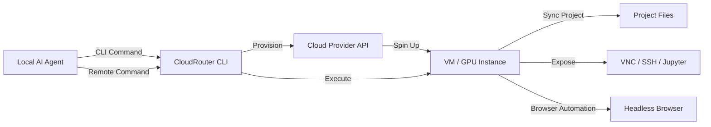

## 서론

최근 AI 코딩 에이전트를 활용한 개발이 일상화되면서, 데스크탑 환경은 예상치 못한 병목 구간에 직면했습니다. 로컬 머신에서 Claude Code나 Codex와 같은 에이전트를 통해 코드를 생성하고 테스트하다 보면, 단순히 LLM과의 대화를 넘어 에이전트가 직접 개발 서버를 띄우고, 브라우저를 열어 동작을 검증하는 과정을 거치게 됩니다. 문제는 이 모든 작업이 나의 로컬 리소스(RAM, CPU, 포트)를 독점한다는 점입니다.

단일 에이전트를 돌릴 때는 견딜 수 있지만, 여러 에이전트를 병렬로 실행하거나 GPU가 필요한 무거운 작업을 수행할 때는 팬 소음이 커지고 시스템 응답 속도가 느려지는 '혼란(Chaos)'이 발생합니다. Docker를 통한 격리가 도움이 되긴 하지만, 결국 물리적 자원의 한계는 명확합니다. 특히 브라우저 자동화나 GUI 기반 테스트가 필요한 경우, 헤드리스 환경의 제약은 여전히 존재합니다.

DevOps 관점에서 이는 **'에이전트의 인프라 프리미티브(Infrastructure Primitive) 부재'** 문제로 귀결됩니다. 에이전트가 스스로 필요한 컴퓨팅 파워를 확보하고 작업을 수행한 뒤 정리할 수 있는 권한이 필요합니다. CloudRouter는 바로 이 문제를 해결하기 위해 설계되었습니다. 이 도구는 에이전트에게 클라우드 VM과 GPU를 직접 제어할 수 있는 손(Hand)을 제공하여, 로컬 리소스 경합을 없애고 실제 프로덕션 환경에 가까운 샌드박스에서 작업하게 만듭니다.

## 본론

### 1. CloudRouter의 아키텍처: "Inverted Workflow"

기존의 클라우드 개발 도구가 대개 "클라우드(원격)에서 작성하고 로컬에서 테스트"하거나 "로컬에서 작성하여 배포"하는 흐름을 가졌다면, CloudRouter는 **"로컬 에이전트가 두뇌 역할을 하고, 클라우드가 근육 역할을 하는"** 반전된 워크플로우(Inverted Workflow)를 제공합니다. 에이전트는 여전히 사용자의 로컬 머신에 상주하며 코드를 작성하고 생각하지만, 실제 실행 환경(서버 실행, 브라우저 열기, GPU 연산)은 클라우드 VM으로 분리됩니다.

이 과정은 다음과 같은 흐름으로 이루어집니다.



### 2. 핵심 기능 및 기술적 깊이

CloudRouter는 단순한 SSH 클라이언트가 아닙니다. 에이전트가 작업을 완료하기 위해 필요한 모든 레이어를 추상화합니다.

- **동적 프로비저닝**: 에이전트가 필요할 때 즉시 VM을 생성하고, 작업 종료 시 `cloudrouter stop`을 통해 자원을 즉시 해제합니다. 이는 비용 최적화에 필수적입니다.

- **이미지 사전 구성 (Pre-baked Images)**: 생성되는 VM에는 기본적으로 VNC 데스크톱, VS Code, Jupyter Lab이 설치되어 있어, 추가적인 셋업 시간 없이 즉시 개발 환경으로 사용 가능합니다.

- **보안된 터널링**: 모든 서비스(VNC, SSH)는 인증이 보호된 URL을 통해 노출되므로, 방화벽 설정 없이 안전하게 접근할 수 있습니다.

아래는 로컬 프로젝트 디렉토리를 기반으로 GPU 인스턴스를 생성하는 예제입니다.

```bash
# 프로젝트 디렉토리와 함께 GPU 인스턴스(B200) 시작
cloudrouter start --gpu B200 ./my-project

# 생성된 VM ID(crb_abc123)를 사용하여 원격에서 명령 실행
cloudrouter ssh crb_abc123 "pip install -r requirements.txt && python train.py"

# 작업 종료 후 VM 삭제 및 비용 절감
cloudrouter stop crb_abc123
```

### 3. 로컬 실행 환경 vs CloudRouter 환경

DevOps 엔지니어가 환경을 선택할 때 고려해야 할 주요 차이점은 다음과 같습니다.

| 비교 항목 | 로컬 Docker 실행 | CloudRouter (Cloud VM) |
| :--- | :--- | :--- |
| **자원 격리** | 커널 레벨 공유 (컨테이너) | 하이퍼바이저 레벨 (완전 격리) |
| **하드웨어 유연성** | 로컬 사양에 종속 (GPU 없음 등) | 클라우드 인벤토리에 따라 유연 (H100, B200 등) |
| **네트워크** | 로컬 포트 포워딩 필요 | 공개 URL 자동 생성 (NAT/트래픽 관리 내장) |
| **GUI 지원** | VNC 설정 복잡 | 기본 제공 (VNC, VS Code Web) |
| **비용 모델** | 고정 자산 비용 (전기, 장비 감가상각) | 종량제 (사용한 만큼만 지불) |

### 4. 실무 적용 가이드: 브라우저 자동화 및 E2E 테스트

AI 에이전트의 강력한 기능 중 하나는 스스로 코드를 검증하기 위해 브라우저를 제어하는 능력입니다. CloudRouter는 `vercel-labs/agent-browser`를 래핑하여, VM 내에서 실행되는 브라우저를 로컬 터미널에서 제어할 수 있게 합니다.

#### Step 1: 개발 서버 구동 먼저 테스트할 웹 애플리케이션이 구동된 VM을 시작합니다.

```bash
cloudrouter start ./my-web-app
# 출력 예시: VM ID 'cr_xyz789' started
```

#### Step 2: 에이전트 기반 브라우저 제어 VM 내에서 서버를 실행한 뒤, CloudRouter의 브라우저 기능을 통해 원격 페이지를 조작합니다. 에이전트는 이 기능을 사용하여 로그인 흐름을 테스트하거나 스크린샷을 찍을 수 있습니다.

```bash
# 1. VM에서 개발 서버 시작
cloudrouter ssh cr_xyz789 "npm run dev &"

# 2. 원격 브라우저 열기 (포트 3000)
cloudrouter browser open cr_xyz789 "http://localhost:3000"

# 3. 페이지 스냅샷 캡처 및 엘리먼트 추론
# 에이전트는 스냅샷을 분석하여 다음 행동을 결정합니다.
cloudrouter browser snapshot -i cr_xyz789
# 출력: @e1 [link] Home  @e2 [link] Settings  @e3 [button] Logout

# 4. 특정 엘리먼트 클릭 및 스크린샷 저장
cloudrouter browser click cr_xyz789 @e2
cloudrouter browser screenshot cr_xyz789 settings_view.png
```

이 과정에서 개발자는 별도의 화면 공유 소프트웨어 없이, CloudRouter가 제공하는 VNC 링크를 통해 실시간으로 에이전트가 브라우저를 클릭하고 이동하는 것을 지켜볼 수 있습니다. 이는 디버깅 과정에서 투명성을 확보하는 데 큰 도움이 됩니다.

### 5. CI/CD 파이프라인 통합 (GitHub Actions 예시)

DevOps 관점에서 CloudRouter는 AI 에이전트가 CI/CD 파이프라인 내에서 자체적으로 테스트 환경을 구축하도록 만들 수 있습니다. 다음은 GitHub Actions 워크플로우 예시입니다.

```yaml
name: Agent-Driven E2E Test
on: [push]

jobs:
  test-with-agent:
    runs-on: ubuntu-latest
    steps:
      - name: Checkout Code
        uses: actions/checkout@v3

      - name: Install CloudRouter
        run: npm install -g @cloudrouter/cli

      - name: Agent spins up GPU VM
        # 에이전트 스크립트가 CloudRouter CLI를 호출하여 VM 생성
        run: |
          VM_ID=$(cloudrouter start --gpu T4 ./app --json | jq -r '.vmId')
          echo "VM_ID=$VM_ID" >> $GITHUB_ENV

      - name: Run Automated Tests via Agent
        run: |
          cloudrouter ssh $VM_ID "npm install && npm run test:e2e"
          cloudrouter browser screenshot $VM_ID result.png
          
      - name: Cleanup
        if: always()
        run: cloudrouter stop $VM_ID
```

이 접근 방식은 인프라를 코드로 관리(IaC)하는 것을 넘어, **"인프라를 에이전트가 관리(Infrastructure by Agent)"** 하는 단계로 나아갑니다.

## 결론

CloudRouter는 로컬 개발 환경의 한계를 넘어 AI 에이전트의 생산성을 극대화하는 핵심 인프라 프리미티브입니다. 단순히 클라우드 VM을 생성하는 것을 넘어, 에이전트가 필요한 순간에 GPU를 탑재한 격리된 환경을 확보하고, 작업을 마치면 깔끔하게 정리하는 "생애주기 자동화"를 가능하게 했습니다.

특히, 워크플로우의 반전(Local Brain, Cloud Muscle)은 개발자가 자신의 로컬 머신을 보호하면서도, 에이전트에게는 마치 자신의 고사양 PC를 사용하는 것 같은 경험을 제공합니다. GPU 자원 프로비저닝의 수동 단계를 자동화함으로써, ML 실험이나 추론 작업을 병렬적으로 수행하는 속도를 획기적으로 높일 것입니다.

DevOps 엔지니어 입장에서 CloudRouter는 AI 에이전트를 위한 또 하나의 컨테이너 기술(Docker)과 같습니다. 앞으로 에이전트가 단순히 코드를 짜는 것을 넘어 실제 운영 환경을 스스로 배포하고 테스트하는 'Autonomous DevOps' 시대에 필수적인 도구가 될 것입니다.

### 참고자료

- [CloudRouter GitHub Repository](https://github.com/manaflow-ai/manaflow)

- [Vercel Agent Browser](https://github.com/vercel-labs/agent-browser)

- [CloudRouter Official Site](https://cloudrouter.dev/)
