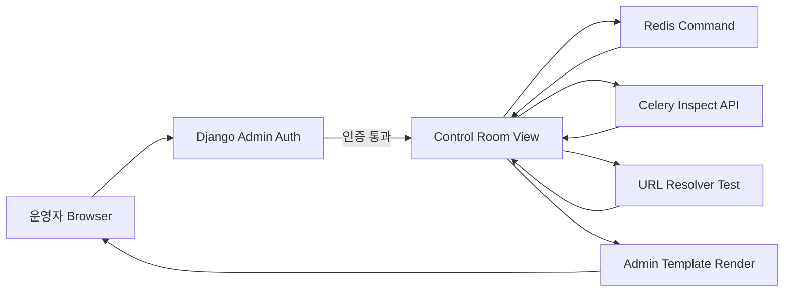

## 서론

새벽 2시, 당신의 휴대폰에서 PagerDuty 알림이 울립니다. 장애 발생입니다. 당신은 침대에서 튀어나와 노트북을 엽니다. 장애의 원인을 파악해야 하는데, 여기저기 흩어진 도구들 사이를 오가야 합니다. Celery 작업이 쌓이고 있는지 확인하려면 별도의 포트로 띄워둔 Flower에 접속해야 하고, Redis 키 값의 상태를 보려면 서버에 SSH로 접속해 `redis-cli`를 쳐야 합니다. API 동작을 테스트하려면 Swagger 문서 페이지로 넘어가야 합니다.

이때 가장 큰 보안적 위협과 운영적 낭비는 바로 **'문맥 전환(Context Switching)'**과 **'노출된 공격 표면'**입니다. 각 도구마다 별도의 인증(Authentication)과 권한(Permissions) 시스템을 관리하는 것은 실수를 유발합니다. Flower의 기본 인증을 껴두는 실수로 인해 민감한 작업 정보가 인터넷에 노출된 사례는 허다합니다.

우리는 이미 Django Admin이라는 강력하고 검증된 요새를 가지고 있습니다. 사용자 인증, 그룹 기반 권한 제어, CSRF 보안, 로깅 시스템이 모두 갖춰진 곳입니다. 왜 굳이 이 안전한 요새 밖으로 나가 불안전한 오두막들을 따로 짓고 있을까요? **Django Control Room**은 바로 이 질문에서 시작되었습니다. 운영에 필요한 핵심 도구들을 Django Admin 안으로 끌어들여, 하나의 인증 시스템 아래 통합 관리함으로써 보안과 효율성을 동시에 잡는 현명한 접근법입니다.

## 본론

### 기술적 배경 및 아키텍처: Django Admin의 확장

Django Control Room의 핵심 철학은 "재발명이 아니라 통합"입니다. Django Admin은 단순한 CRUD(Create, Read, Update, Delete) 인터페이스가 아닙니다. 이는 완벽한 MVC(Model-View-Controller) 프레임워크를 제공하며, `ModelAdmin` 클래스를 확장하여 어떤 형태의 데이터든 시각화하고 제어할 수 있는 강력한 플러그인 시스템입니다.

기존의 운영 도구들은 보통 웹 서버(WEB)와 별개로 독립적인 마이크로 서비스 형태로 실행됩니다. 예를 들어 Celery 모니터링 툴인 Flower는 별도의 포트(예: 5555)를 열고 동작합니다. 이는 방화벽 설정을 복잡하게 만들고, Nginx 리버스 프록시 설정을 추가로 해야 하므로 설정 실수로 인한 보안 구멍이 발생할 가능성을 높입니다.

Django Control Room은 이러한 외부 의존성을 Django 앱 내부로 흡수합니다. Redis의 `INFO` 명령을 직접 실행하거나 Celery의 `inspect` 기능을 백엔드에서 호출하여 그 결과를 Django Admin의 템플릿 렌더링 엔진을 통해 보여줍니다. 이 과정에서 Django의 미들웨어(Middleware)가 모든 요청을 가로채기 때문에, 기존의 세션 기반 인증과 CSRF 토큰 검증이 자동으로 적용됩니다.

아래는 통합된 환경에서의 요청 흐름을 간소화한 다이어그램입니다.



이 아키텍처의 가장 큰 보안 이점은 **'인증 계층의 일원화'**입니다. 별도의 도구에 대한 접근 제어 목록(ACL)을 관리하는 대신, Django의 기존 `User`와 `Group` 테이블을 활용하여 "staff 권한이 있는 사용자만 Redis 패널에 접근 가능"하도록 손쉽게 제어할 수 있습니다.

### 주요 기능 비교: 기존 도구 vs Django Control Room

운영 환경에서 흔히 사용되는 도구들의 조합과 Django Control Room을 통합했을 때의 차이점을 분석해 보겠습니다. 보안 관점에서 볼 때, 관리해야 할 자격 증명(Credential)의 개수와 노출되는 네트워크 인터페이스의 개수가 줄어드는 것은 치명적인 차이입니다.

| 비교 항목 | 기존 조합 (Flower + redis-cli + Swagger) | Django Control Room (통합형) | | :--- | :--- | :--- | | **인증 방식** | 각 도구별 Basic Auth / Token 별도 관리 | Django 통합 Session Based Auth | | **권한 관리** | 각각의 설정 파일에서 제어 (설정 복잡도 높음) | Django User/Group 시스템 활용 (미세한 권한 제어 가능) | | **네트워크 노출** | 여러 개의 포트 개방 (예: :5555, :8000) 필요 | Django 포트(:8000, :443) 하나만 개방 | | **SSL/TLS** | 각 도구별 Reverse Proxy 설정 필요 | Django 웹 서버 설정(Nginx 등)을 그대로 따름 | | **감사 로그** | 도구별로 로그 포맷이 다르고 통합 어려움 | Django의 통합 로깅 시스템에 자동 기록 | | **접근성** | 여러 탭/창 전환 (Context Switching) | Admin 내 하나의 사이드바에서 접근 |

### 실무 적용 가이드: 설치부터 보안 설정까지

이제 실제로 Django Control Room을 프로젝트에 적용하여 운영 효율성과 보안을 강화하는 방법을 단계별로 살펴보겠습니다. 이 가이드는 방어적 목적을 가진 시스템 관리자를 대상으로 합니다.

#### 1. 설치 및 기본 설정

먼저 PyPI를 통해 패키지를 설치하고 `settings.py`에 앱을 등록합니다.

```python
# requirements.txt
django-control-room

# settings.py
INSTALLED_APPS = [
    # ... 기존 앱들
    'django.contrib.admin',
    'django.contrib.auth',
    'django.contrib.contenttypes',
    'django.contrib.sessions',
    'django.contrib.messages',
    'django.contrib.staticfiles',
    
    # Django Control Room 및 의존성
    'control_room',
    'import_export', # 데이터 내보내기 기능 등에 종종 사용됨
]

# Control Room 설정 (예시)
CONTROL_ROOM_PANELS = [
    'control_room.panels.redis.RedisPanel',
    'control_room.panels.celery.CeleryPanel',
    'control_room.panels.urls.URLPanel',
]
```

#### 2. URL conf 및 통합

`urls.py`에 Admin URL 패턴을 추가합니다. Control Room은 Admin 내에서 동작하므로 별도의 복잡한 라우팅이 필요 없습니다.

```python
# urls.py
from django.contrib import admin
from django.urls import path, include

urlpatterns = [
    path('admin/', admin.site.urls),
    # 필요한 경우 API 엔드포인트를 추가할 수도 있으나,
    # 기본적으로는 Admin 내부 뷰를 사용합니다.
]
```

#### 3. 보안 강화: 커스텀 패널 제작 (PoC)

여기서 우리는 "보안 전문가"로서의 역량을 발휘해야 합니다. 단순히 패널을 보는 것을 넘어, **'보안 감사용 패널'**을 직접 만들어 Admin에 추가해 보겠습니다. 예를 들어, Redis에 저장된 특정 패턴의 세션 키나 의심스러운 캐시 데이터를 즉시 모니터링하는 패널입니다.

이 코드는 학습 및 방어 목적으로 작성되었습니다.

```python
# admin_security_panel.py
from django.contrib import admin
from django.shortcuts import render
from django.core.cache import cache
import redis

# Redis 연결 정보는 settings.py에서 가져오는 것이 안전합니다.
from django.conf import settings

class SecurityAuditPanel(admin.ModelAdmin):
    def get_urls(self):
        from django.urls import path
        urls = super().get_urls()
        custom_urls = [
            path('security-audit/', self.admin_site.admin_view(self.audit_view),
                 name='security_audit'),
        ]
        return custom_urls + urls

    def audit_view(self, request):
        # 방어적 목적: Redis 내의 의심스러운 키 스캔
        # 주의: 운영 환경에서 KEYS * 명령은 성능 저하를 유발할 수 있으므로
        # SCAN 명령을 사용하거나 특정 패턴을 사용해야 합니다.
        
        r = redis.from_url(settings.CACHES['default']['LOCATION'])
        suspicious_keys = []
        
        # 예시: 'failed_login' 또는 'suspicious' 패턴이 포함된 키 검색
        # 실제 환경에서는 SCAN을 사용하세요.
        for key in r.scan_iter(match="*failed*"):
            key_type = r.type(key).decode('utf-8')
            ttl = r.ttl(key)
            suspicious_keys.append({
                'key': key.decode('utf-8'),
                'type': key_type,
                'ttl': ttl
            })

        context = dict(
            self.admin_site.each_context(request),
            title="Security Audit Log",
            suspicious_keys=suspicious_keys,
            opts=self.model._meta,
        )
        return render(request, 'admin/security_audit.html', context)

# Admin site에 등록 (가상의 모델에 연결하거나 덮어쓰기)
admin.site.register(SecurityAuditPanel)
```

위 코드는 Admin 내에 `Security Audit`이라는 전용 메뉴를 생성하여, 운영자가 별도의 CLI 접속 없이 Redis 내부의 보안 관련 데이터를 즉시 확인할 수 있게 해줍니다. 이는 외부에 Redis 포트를 열어두지 않고도 내부적으로 효과적으로 모니터링하는 방법입니다.

### 확장성과 기술적 메커니즘

Django Control Room의 패널들은 기본적으로 'Plain Old Django Views'입니다. 즉, 복잡한 프론트엔드 프레임워크(React/Vue)의 의존성 없이, Django의 강력한 템플릿 상속 시스템을 사용하여 Admin UI와 완벽하게 어울리는 디자인을 유지합니다.

확장성의 핵심은 **'데이터 소스의 분리'**입니다. 패널은 단순히 데이터를 시각화하는 역할만 하며, 실제 데이터는 Redis, Celery Broker, 혹은 Django ORM 등 어디서든 가져올 수 있습니다. 이 덕분에 개발자는 비즈니스 로직에 집중할 수 있고, 보안 담당자는 Admin의 접근 권한 설정만으로 모든 도구에 대한 접근 통제를 완료할 수 있습니다.

## 결론

Django Control Room은 단순한 편리한 도구 그 이상입니다. 이는 **'보안 경계(Security Perimeter)의 단순화'**를 실현하는 전략적 선택입니다. 흩어진 운영 도구들을 Django Admin이라는 검증된 인증 계층 뒤로 숨김으로써, 우리는 노출 공격 표면을 줄이고 권한 관리의 복잡성을 해소할 수 있습니다.

DevOps와 보안의 경계가 모호해지는 현대 시스템에서, 개발자가 익숙한 코드 베이스 내에서 시스템의 건강 상태를 진단하고, 보안 담당자가 중앙 집중식 로그와 권한 시스템을 통해 이를 감시할 수 있는 환경은 필수적입니다.

더 이상 Flower의 기본 인증을 걱정하거나, Redis 포트를 닫았는지 확인하기 위해 서버 설정을 뒤지지 마십시오. Django Admin 안으로 당신의 운영 도구들을 귀환시키십시오. 안전하고 효율적인 개발 환경은 이미 당신의 Admin 페이지 안에 있습니다.

### 참고자료

- [Django Control Room GitHub Repository](https://github.com/yassi/dj-control-room)

- [Django Official Documentation - The Django Admin Site](https://docs.djangoproject.com/en/stable/ref/contrib/admin/)

- [Celery Documentation - Monitoring and Management Guide](https://docs.celeryproject.org/en/stable/userguide/monitoring.html)

- [OWASP - Authentication Cheat Sheet](https://cheatsheetseries.owasp.org/cheatsheets/Authentication_Cheat_Sheet.html)
