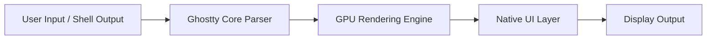
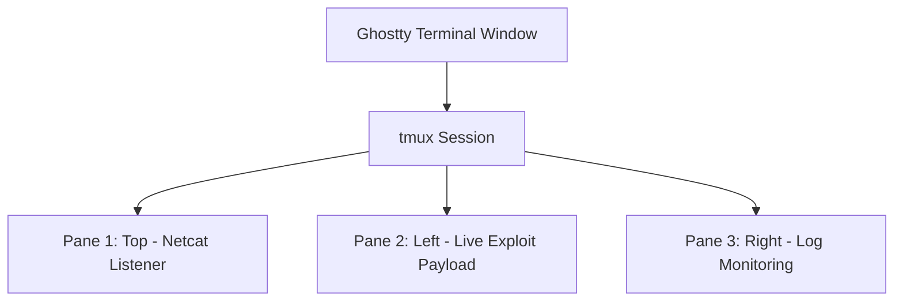

## 서론

복잡한 네트워크 트래픽을 실시간으로 분석하거나, 대규모 취약점 스캔 결과를 터미널 창에서 `grep`과 `awk`로 파이핑하며 열심히 데이터를 추려내던 순간을 떠올려 보십시오. 스크롤을 조금만 빠르게 내려도 화면이 버벅거리고, 텍스트 렌더링이 따라가지 못해 명령어 프롬프트가 멈추는 경험을 해보셨을 겁니다.

보안 전문가나 DevOps 엔지니어에게 터미널은 단순한 입력 도구가 아니라, 생산성의 핵심인 전장입니다. 수천 줄의 로그가 쏟아지는 와중에 발생하는 미세한 레이턴시나 화면 티어링(Tearing)은 집중력을 깨고, 분석의 흐름을 끊는 치명적인 방해 요소가 됩니다. 기존의 터미널 에뮬레이터들은 오랜 기간 사용되어 왔지만, 막대한 양의 텍스트를 실시간으로 처리해야 하는 현대의 개발 환경에서는 한계가 명확했습니다. 이러한 성능 병목 현상을 해결하기 위해 등장한 것이 바로 **Ghostty**입니다. 이 도구는 단순한 외장제가 아닌, 하드웨어의 성능을 극대화하여 터미널 환경의 패러다임을 바꾸려 합니다.

## 본론

### Ghostty의 기술적 아키텍처와 GPU 가속 원리

Ghostty가 기존 터미널과 차별화되는 가장 큰 기술적 특징은 **GPU 가속(GPU Acceleration)**을 핵심 설계 원리로 채택했다는 점입니다. 전통적인 터미널 에뮬레이터들은 텍스트 렌더링을 주로 CPU에서 처리합니다. 이는 복잡한 폰트나 라이게처(Ligature, 글자 조합), 이모지가 많아질수록 CPU 부하를 가중시킵니다. 반면, Ghostty는 OpenGL을 활용하여 텍스트 렌더링 파이프라인을 GPU로 옮깁니다.

또한, Ghostty는 macOS에서는 AppKit을, Linux에서는 GTK를 사용하여 각 운영체제의 **네이티브 UI(Native UI)**를 그대로 활용합니다. 이는 Electron과 같은 무거운 크로스플랫폼 프레임워크를 사용하는 다른 터미널들(예: Hyper)과 대조됩니다. 네이티브 위젯을 사용함으로써 불필요한 리소스 낭비를 줄이고 운영체제가 제공하는 접근성(Accessibility) 기능과 완벽하게 호환됩니다.

다음은 Ghostty의 데이터 처리 및 렌더링 흐름을 간소화하여 나타낸 다이어그램입니다.



이 구조를 통해 CPU는 터미널의 논리적 상태(이스케이프 시퀀스 파싱 등)를 제어하는 데 집중하고, GPU는 복잡한 비트맵 렌더링과 합성(Compositing)을 담당하여 병렬 처리 효율을 극대화합니다.

### 경쟁 터미널 에뮬레이터와의 비교

시장에는 이미 iTerm2, Alacritty, WezTerm 등 강력한 터미널이 존재합니다. Ghostty가 이들 사이에서 선택될 수 있는 이유는 '설정 없는 경험(Zero-config)'과 '순수 성능'의 균형 때문입니다. 아래 표는 주요 터미널 에뮬레이터의 특징을 비교한 것입니다.

| 비교 항목 | Ghostty | iTerm2 | Alacritty | WezTerm | | :--- | :--- | :--- | :--- | :--- | | **가속 방식** | GPU (OpenGL) | CPU (일부 GPU) | GPU (OpenGL) | GPU | | **코드베이스** | C (심플함) | Obj-C (무거움) | Rust | Rust & Lua | | **설정 난이도** | 매우 낮음 (Zero-config) | 높음 (GUI 제공) | 높음 (YAML 수동) | 중간 (Lua 스크립트) | | **플랫폼** | macOS, Linux | macOS | Cross-platform | Cross-platform | | **네이티브 UI** | 지원 (Native) | 자체 구현 | 자체 구현 | 자체 구현 | | **초기 로딩 속도** | 극도로 빠름 | 느림 | 매우 빠름 | 보통 |

Ghostty는 복잡한 설정 파일을 수정하지 않아도 설치 직전부터 최적의 폰트 렌더링과 색상 테마를 제공합니다. 보안 작업 중에는 도구 설정에 시간을 쓰는 것 자체가 손실이므로, 이러한 '즉시 사용 가능성(Ready-to-use)'은 큰 장점입니다.

### 보안 전문가를 위한 실무 적용 가이드

터미널의 성능은 공격 시나리오 수행이나 방어 로그 분석 시 체감 속도에 직결됩니다. 이제 실무 환경에서 Ghostty를 효율적으로 설정하고 활용하는 방법을 단계별로 설명하겠습니다.

#### 1. 설치 및 기본 설정 (Step-by-step)

Ghostty는 각 운영체제의 패키지 매니저를 통해 매우 간단히 설치할 수 있습니다.

**macOS (Homebrew)**:

```bash
brew install --cask ghostty
```

**Linux (Ubuntu/Debian)**:

```bash
sudo apt install ghostty
```

설치 후 실행하면 별도의 설정 없이도 시스템 기본 테마가 적용된 상태로 실행됩니다. 하지만 보안 업무 특성상 눈의 피로를 줄이고 가독성을 높이기 위해 폰트 설정은 필수적입니다.

#### 2. 고급 설정 및 커스터마이징

Ghostty는 설정 파일(`~/.config/ghostty/config`)을 통해 강력한 커스터마이징을 지원합니다. 특히 보안 작업자가 선호하는 JetBrains Mono나 Fira Code와 같은 프로그래밍 폰트와 라이게처(Ligature) 지원을 설정하는 예제입니다.

**코드 예시: `~/.config/ghostty/config`**

```text
# 기본 폰트 설정 (가독성 높은 Nerd Font 사용 권장)
font-family = JetBrains Mono NF
font-size = 13

# 터미널 테마 설정 (어두운 배경이 눈이 덜 피로함)
theme = dark

# 커서 스타일 (I-Beam 형태가 정밀한 위치 파악에 유리)
cursor-style = bar

# 복사 클립보드 자동 복사 (선택 시 즉시 복사됨)
copy-on-select = true

# 단어 선택 경계 설정 (URL이나 IP 주소 복사 시 유용)
word-char-exceptions = -,./?@&=%~

# 단축키 설정 (새 탭 단축키: Cmd+T)
keybind = cmd+t=new_tab
```

이 설정은 로그 분석 중 특정 IP나 해시값을 빠르게 복사하거나, 긴 명령어를 입력할 때 커서의 위치를 정확히 파악하는 데 도움을 줍니다.

#### 3. 실전 시나리오: 레드 팀 운영 환경에서의 효율성

방어 목적의 침투 테스트 상황을 가정해 봅시다. 공격자는 리버스 쉘을 획득한 후 대량의 내부 네트워크 스캔(`nmap`)을 수행하고 그 결과를 실시간으로 모니터링해야 합니다.

```bash
# 예시: 대규모 서브넷 스캔 및 결과 필터링
nmap -sV -p- 192.168.1.0/24 | tee scan_result.txt | grep "open"
```

CPU 기반 터미널에서는 `tee` 명령어로 파일로 저장하면서 동시에 화면에 출력될 때, 초당 수백 줄 이상의 텍스트가 출력되면 스크롤 멈춤 현상이 발생하거나 중요한 "open" 포트 정보를 놓칠 수 있습니다. 하지만 Ghostty의 GPU 렌더링은 이러한 버퍼 오버플로우 상황에서도 60fps 이상의 부드러운 화면 갱신을 유지합니다.

또한, `tmux`나 `zellij`와 같은 터미널 멀티플렉서와 결합할 때 진가가 발휘됩니다. 아래는 Ghostty 위에서 tmux를 사용하여 세션을 분할하는 시나리오입니다.



이처럼 단일 창에서 네트워크 리스너, 익스플로잇 코드 실행, 로그 모니터링을 동시에 수행할 때, 각 창의 렌더링 속도가 떨어지면 전체 작업 흐름이 꼬입니다. Ghostty는 각 Pane의 렌더링을 독립적이고 효율적으로 처리하여 멀티태스킹 환경에서의 생산성을 보장합니다.

### 윤리적 고찰 및 방어적 관점

Ghostty와 같은 고성능 도구는 공격자에게는 빠른 공격 수행을, 방어자에게는 빠른 위협 탐지를 가능하게 합니다. **중요한 점은 이 도구를 사용하는 목적입니다.** 우리는 터미널의 성능 향상을 통해 시스템의 취약점을 더 빨리 찾아내고 패치하여 보안 태세를 강화하는 데 집중해야 합니다. 효율적인 도구 사용은 윤리적인 해커가 시스템을 안전하게 만드는 데 필수적인 과정입니다.

## 결론

Ghostty는 단순히 "빠른" 터미널을 넘어, 현대적인 하드웨어 아키텍처에 최적화된 차세대 터미널 에뮬레이터입니다. CPU 중심의 레거시 렌더링 방식에서 벗어나 GPU 가속과 네이티브 UI를 결합하여, 사이버 보안 전문가와 개발자들이 겪는 성능 저하 문제를 근본적으로 해결했습니다.

특히 "설정 없이 즉시 사용"할 수 있으면서도, 필요시 깊이 있는 커스터마이징이 가능하다는 점은 DevOps 환경에서 큰 매력입니다. 대용량 로그 분석이나 실시간 네트워크 모니터링과 같이 고성능 입출력이 요구되는 작업 환경이라면, Ghostty를 도입하여 워크플로우의 병목을 제거해 보기를 강력히 권장합니다.

터미널은 우리가 시스템과 대화하는 창구입니다. 그 창구가 맑고 빠를수록, 우리는 시스템의 내부를 더 명확히 들여다보고 위협에 대처할 수 있습니다.

**참고자료**:

- [Ghostty GitHub Repository](https://github.com/mitchellh/ghostty)

- [Ghostty Official Website](https://ghostty.org/)
