## 서론

보안 컨설플턴트로서 수년간 수많은 침투 테스트 보고서를 작성해 왔지만, 가장 곤혹스러웠던 순간은 복잡한 공격 경로를 설명하는 과정에서 다이어그램이 렌더링되지 않았을 때입니다. 상황은 이렇습니다. 당신이 내부 네트워크의 핵심 취약점을 발견하여 APT(지속적 위협) 공격의 시나리오를 시각화한 보고서를 긴급하게 배포하려 합니다. Git 기반의 자동화 파이프라인(Git Publisher)을 통해 블로그나 위키에 즉시 게시되어야 하지만, 정작 포스팅이 열리면 중요한 Mermaid 다이어그램 자리에 깨진 이미지 아이콘만 덩그러니 있습니다.

단순한 "그림 안 보임" 문제로 치부하기엔 그 파장은 큽니다. 보안 현장에서 시각적 자료는 공격의 흐름(Chain of Attack)을 이해하는 데 있어 필수적입니다. 이러한 시각화 도구가 작동하지 않는다는 것은, 정보 전달의 실패를 넘어 인프라의 안정성을 신뢰할 수 없음을 의미합니다. 더 심각한 것은, Mermaid와 같은 클라이언트 사이드 렌더링 도구가 제대로 샌드박싱되지 않을 경우 발생할 수 있는 보안 위협입니다.

우리가 이 글을 통해 Git Publisher와 Mermaid 다이어그램의 렌더링을 테스트하는 것은 단순히 "기능 확인"이 아닙니다. 이는 **"보안 커뮤니케이션 채널의 무결성 검증"**이자, **"잠재적인 클라이언트 사이드 공격 벡터 점검"** 과정입니다. 안정적인 문서화 파이프라인은 보안 팀의 신뢰도를 좌우하므로, 이를 검증하는 과정은 매우 엄격하게 이루어져야 합니다.

> **⚠️ 윤리적 경고**: 본 문서에 포함된 모든 기술적 검증 및 시나리오는 방어 목적과 시스템 안정성 확보를 위한 것이며, 악의적인 목적으로 활용될 수 없습니다.

## 본론

### 1. 기술적 배경: Mermaid 렌더링 메커니즘과 보안 리스크

Mermaid는 텍스트를 정의하여 다이어그램을 그리는 JavaScript 기반의 도구입니다. 브라우저(클라이언트)에서 텍스트를 파싱하여 SVG나 PNG로 변환하기 때문에, 서버 부하가 적다는 장점이 있습니다. 하지만 보안 관점에서 볼 때, **"사용자가 입력한 텍스트가 브라우저에서 실행 가능한 코드(SVG)로 변환된다"**는 점은 주의 깊게 살펴봐야 할 부분입니다.

만약 공격자가 Mermaid 문법 내에 악성 스크립트를 주입하고, 이가 렌더링 엔진에 의해 필터링되지 않는다면 Stored XSS(저장형 크로스 사이트 스크립팅) 공격이 가능해질 수 있습니다. Git Publisher는 Markdown 파일을 변환하는데, 이 과정에서 HTML 태그나 SVG 내의 `foreignObject` 등이 어떻게 처리되는지 확인해야 합니다.

### 2. 공격 시나리오: 다이어그램 렌더링을 악용한 공격 흐름

상황을 가정해 보겠습니다. 공격자가 내부 보안 블로그에 "공격 트리 분석"이라는 제목으로 악성 Mermaid 코드가 포함된 문서를 업로드합니다. 관리자가 이를 검토 없이 게시 승인(Publish) 버튼을 누르면, 해당 글을 읽는 모든 내부 직원의 브라우저에서 악성 스크립트가 실행됩니다.

다음은 이러한 공격이 Git Publisher 파이프라인을 통해 어떻게 전파되는지 보여주는 흐름도입니다.

```mermaid
graph LR
    A[공격자] -->|Markdown + Injection| B(Git Repository)
    B --> C[CI/CD Pipeline]
    C -->|Build & Deploy| D[Web Server]
    D -->|Serve Page| E[Victim Browser]
    E -->|Render Mermaid| F[Execute Malicious JS]
    F --> G[Session Hijacking]
    
    style A fill:#f9f,stroke:#333,stroke-width:2px
    style F fill:#f99,stroke:#333,stroke-width:2px
    style G fill:#f00,stroke:#333,stroke-width:4px,color:#fff
```




위 다이어그램이 정상적으로 렌더링된다면, 우리는 시각적으로 위협의 경로를 식별할 수 있습니다. 하지만 렌더링이 실패하거나 코드가 노출된다면, 그 자체로 정보 노출(Information Disclosure) 위험이 발생합니다.

### 3. PoC (Proof of Concept): 렌더링 및 필터링 테스트

Git Publisher가 Mermaid 코드를 어떻게 처리하는지 테스트하기 위해 다음과 같은 코드를 작성해 보았습니다. 이 코드는 다이어그램이 정상적으로 그려지는지 확인하는 기능적 테스트입니다.

```python
import requests
import re

def test_mermaid_rendering(target_url, mermaid_code):
    """
    Git Publisher로 게시된 페이지에서 Mermaid 다이어그램이 
    정상적으로 렌더링되는지 검증하는 함수
    """
    headers = {'User-Agent': 'Security-Scanner/1.0'}
    
    try:
        response = requests.get(target_url, headers=headers, timeout=5)
        if response.status_code == 200:
            # 렌더링된 SVG가 존재하는지 확인 (클래스명 또는 태그 확인)
            if "mermaid" in response.text or "svg" in response.text:
                print("[+] Success: Mermaid content detected in response.")
                # 개행 문자나 특수문자 처리 확인
                clean_code = re.sub(r'[
\r\t]', '', mermaid_code)
                if clean_code in response.text:
                    print("[+] Warning: Raw code exposed (Potential Source Leak).")
                else:
                    print("[+] Safe: Code seems processed/rendered.")
            else:
                print("[-] Fail: No diagram rendered or found.")
        else:
            print(f"[-] Error: HTTP {response.status_code}")
    except Exception as e:
        print(f"[-] Exception: {e}")

# 테스트용 Mermaid 코드
poc_diagram = """
graph LR
    A[Start] --> B[End]
"""

# 실제 테스트 실행 시 타겟 URL을 입력하세요
# test_mermaid_rendering("https://test.local/mermaid-test", poc_diagram)
```

이 코드는 실제 브라우저 렌더링까지 검증하지는 못하지만, 서버 응답에 다이어그램 관련 데이터가 포함되어 있는지 확인하는 초기 점검(Ping Test) 용도로 사용할 수 있습니다.

### 4. 렌더링 엔진별 보안 비교

모든 렌더링 엔진이 동일하게 생성되는 것은 아닙니다. 사용하는 라이브러리와 설정(Sanitization 여부)에 따라 보안 수준이 크게 달라집니다. Git Publisher를 구성할 때 다음 표를 참고하여 설정을 점검해야 합니다.

| 구분 | Server-side Rendering (SSR) | Client-side Rendering (CSR) | | :--- | :--- | :--- | | **메커니즘** | 서버에서 이미지(SVG/PNG)로 변환하여 전송 | 브라우저에서 JS를 통해 렌더링 | | **성능** | 서버 리소스 소모 높음, 로딩 빠름 | 서버 부하 적음, 초기 로딩 지연 가능 | | **보안 위협 (XSS)** | **낮음** (서버에서 필터링 가능) | **높음** (사용자 브라우저에서 JS 실행 위험) | | **권장 사항** | 공개되지 않은 내부 문서 시스템 | 공개 블로그 (CSP 정책 필수 적용) | | **Git Publisher 호환** | 빌드 타임 생성 필요 | Markdown 그대로 전달 가능 (간편) |

### 5. 방어 가이드: 안전한 Git Publisher 구성

Git Publisher와 Mermaid를 통합하여 운영할 때 보안 사고를 예방하기 위한 구체적인 단계별 가이드입니다.

#### Step 1: 의존성 고정 (Dependency Pinning) Mermaid.js 라이브러리는 자주 업데이트되며, 종종 취약점이修补(fix)됩니다. 하지만 최신 버전이 호환성 문제를 일으킬 수 있으므로, 보안 패치가 확인된 특정 버전을 명시적으로 고정해야 합니다.

```json
// package.json 예시
"dependencies": {
  "mermaid": "^10.6.1" // 취약점이 없는 검증된 버전 사용
}
```

#### Step 2: 콘텐츠 보안 정책 (CSP) 설정 클라이언트 사이드 렌더링을 사용하는 경우, 반드시 HTTP 헤더에 CSP(Content Security Policy)를 적용하여 인라인 스크립트 실행을 차단해야 합니다.

```text
Content-Security-Policy: default-src 'self'; script-src 'self' 'unsafe-inline' https://cdn.jsdelivr.net; img-src 'self' data: https:;
```

*`unsafe-inline`은 Mermaid 작동을 위해 최소한으로 허용하되, `script-src`는 신뢰할 수 있는 CDN으로 제한해야 합니다.*

#### Step 3: 입력값 검증 및 샌드박싱 사용자가 제출하는 Markdown 파일 내의 Mermaid 블록을 파싱하기 전에 허용된 키워드(`graph`, `sequenceDiagram` 등)만 포함되어 있는지 정규 표현식으로 검증합니다. `classDef` 등을 악용한 CSS 삽입을 차단해야 합니다.

## 결론

이번 글을 통해 Git Publisher 환경에서 Mermaid 다이어그램이 정상적으로 렌더링되는지 검증하는 과정을 살펴보았습니다. 단순히 "그림이 그려지는가"를 넘어, 그 렌더링 과정이 **시스템의 무결성을 해치지 않는가**, **악성 스크립트 삽입의 경로가 되지 않는가**라는 보안적 관점에서 접근했습니다.

보안 전문가로서 강조하고 싶은 것은 **"가시화(Visualization)"는 곧 "통제(Control)"**라는 점입니다. 우리가 보이는 다이어그램 하나하나가 정확하게 렌더링되고, 그 배후의 파이프라인이 안전하게 구축되어 있을 때 비로소 신뢰할 수 있는 보안 커뮤니케이션이 가능해집니다. 앞으로도 CI/CD 파이프라인의 변화에는 항상 보안 검증 단계를 동반하여, 편리함이 보안의 구멍이 되지 않도록 만들어야 합니다.

**참고자료**:

- [OWASP XSS Prevention Cheat Sheet](https://cheatsheetseries.owasp.org/cheatsheets/Cross_Site_Scripting_Prevention_Cheat_Sheet.html)

- [Mermaid.js Security Documentation](https://mermaid.js.org/intro/security.html)

- [Content Security Policy (CSP) - MDN Web Docs](https://developer.mozilla.org/ko/docs/Web/HTTP/CSP)
