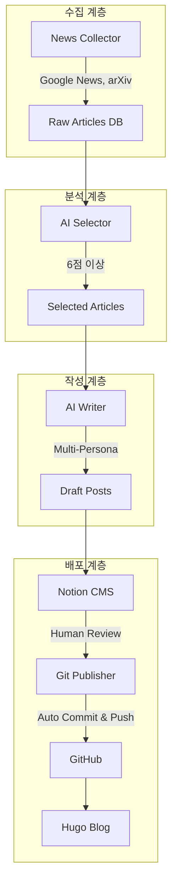

> **정정 (2026-09-23):** Notion의 Mermaid 저장 방식과 데이터베이스 속성 예시를 현재 구현에 맞게 고쳤고, 깨진 코드 펜스를 복구했습니다. 아래의 구축기 본문과 당시 성과 수치는 작성 시점의 기록입니다.

## 서론

블로그 운영은 단순한 글쓰기가 아닙니다. 최신 기술 동향을 파악하고, 독자들에게 가치 있는 정보를 제공하며, 지속적으로 콘텐츠를 생산하는 것이 중요합니다. 하지만 매일 기사를 검색하고, 분석하고, 글을 쓰는 것은 시간이 많이 걸리는 반복적인 작업입니다.

이러한 문제를 해결하기 위해 우리는 **Intelligence Agent**라는 AI 기반 자동화 시스템을 구축했습니다. 이 시스템은 뉴스 수집, 기사 선별, 글 작성, Notion 검토, Git 배포까지 모든 과정을 자동화합니다.

이 문서에서는 Intelligence Agent의 전체 아키텍처와 구현 방법, 그리고 운영하며 겪은 문제들과 해결 과정을 상세히 설명합니다.

## 시스템 아키텍처

Intelligence Agent는 4단계 파이프라인으로 구성됩니다.



### 1단계: 뉴스 수집 (News Collector)

여러 소스에서 기사를 수집하고 중복을 제거합니다.

**지원 소스**:

- Google News (보안, AI, DevOps)

- arXiv (최신 논문)

- HackerNews (커뮤니티 토론)

- Hada.io (기술 블로그)

**기술 구현**:

```python
class NewsCollector:
    def __init__(self):
        self.db = SQLite('intelligence.db')
        self.sources = [
            GoogleNewsSource(),
            ArxivSource(),
            HackerNewsSource(),
            HadaSource()
        ]
    
    async def collect_all(self):
        tasks = [source.fetch() for source in self.sources]
        results = await asyncio.gather(*tasks)
        return self.deduplicate(results)
```

### 2단계: AI 기사 선별 (AI Selector)

LLM을 사용하여 기사의 기술적 가치를 평가합니다.

**평가 기준**:

- 기술적 깊이 (10점)

- 독창성 (10점)

- 실무 적용 가능성 (10점)

- 총점 6점 미만 자동 제외

```python
class AISelector:
    async def score_article(self, article):
        prompt = f"""
        평가: {article['title']}
        본문: {article['content'][:500]}
        
        기준:
        1. 기술적 깊이 (1-10)
        2. 독창성 (1-10)
        3. 실무 적용 가능성 (1-10)
        
        JSON 출력: {{"score": int, "reason": str}}
        """
        return await llm.evaluate(prompt)
```

### 3단계: 다중 페르소나 작가 (AI Writer)

기사 주제에 따라 최적의 전문가 persona로 글을 작성합니다.

**페르소나 시스템**:

```python
PERSONAS = {
    'SECURITY': {
        'name': '보안 전문가',
        'tone': '실용적이고 전문적',
        'expertise': '취약점 분석, 공격 시나리오',
        'structure': '서론 → 취약점 분석 → PoC → 대응 방안'
    },
    'AI_ML': {
        'name': 'AI 연구자',
        'tone': '학술적이고 이해하기 쉬움',
        'expertise': '딥러닝, 논문, 수식',
        'structure': '서론 → 관련 연구 → 핵심 아이디어 → 실험 → 결론'
    },
    'DEVOPS': {
        'name': 'DevOps 엔지니어',
        'tone': '실무 중심',
        'expertise': 'CI/CD, 쿠버네티스, 인프라',
        'structure': '문제 분석 → 솔루션 → 구현 가이드 → 베스트 프랙티스'
    }
}
```

### 4단계: Notion Publisher & Git Publisher

작성된 글을 Notion에 업로드하고, 검토 완료 시 자동으로 Git에 배포합니다.

## 해결한 핵심 문제

### 문제 1: Mermaid 다이어그램 렌더링

**현상**: Hugo 블로그에서 Mermaid 다이어그램이 다크모드에서 보이지 않음

**원인**:

```javascript
// 문제의 코드
mermaid.initialize({
    theme: 'default'  // 항상 라이트 모드
});
```

**해결**:

```javascript
// 개선된 코드
const isDark = document.documentElement.dataset.scheme === 'dark';
const theme = isDark ? 'dark' : 'default';

mermaid.initialize({
    theme: theme,
    themeVariables: {
        darkMode: true,
        primaryColor: '#81D4FA',
        primaryTextColor: '#e0e0e0'
    }
});
```

### 문제 2: Notion API에서의 Mermaid 처리

**현상**: Notion은 Mermaid 코드 블록을 저장할 수 있지만, 블로그 발행 단계에서는 코드 블록의 언어와 원문을 다시 Markdown으로 복원해야 합니다.

**현재 구현**: 작성 단계에서 Notion 코드 블록의 `language`를 `mermaid`로 저장합니다. 검토가 끝난 글을 읽어올 때도 언어를 유지해 Hugo의 Mermaid 코드 펜스로 출력합니다. 예전에 JavaScript 블록에 다이어그램을 저장하던 글만 기존 변환 로직으로 읽습니다. 새 글에 JavaScript로 저장하는 우회 방식은 사용하지 않습니다.

### 문제 3: Notion 데이터베이스 속성 매핑

**현상**: Notion API 호출 시 데이터베이스에 없는 속성 이름이나 다른 속성 유형을 사용하면 요청이 거부됩니다.

**현재 구현**: 실제 데이터베이스의 `내용`(title), `카테고리`(select), `테그`(multi_select), `상태`(status), `작성 방식`(select)을 각각의 Notion 유형에 맞게 보냅니다. 화면에 보이는 표기와 API 속성 이름이 일치해야 하므로 `태그`로 임의 변경하지 않습니다.


## 성과물

### GitHub 리포지토리
- https://github.com/rebugui/intelligence-agent
- 27개 파일, 4,499줄 코드
- 완전한 문서와 테스트 포함

### 배포된 블로그 게시물
- 총 8개의 기술 블로그 게시
- Mermaid 다이어그램 포함
- 자동화된 파이프라인으로 생성

## 향후 개선 방향

1. **이미지 생성 파이프라인**: DALL-E 3로 썸네일 자동 생성
2. **주제 클러스터링**: 연관 기사를 그룹화하여 "주간 트렌드 리포트" 발행
3. **Slack 알림**: 배포 완료 시 알림 발송
4. **영문 블로그**: 다국어 지원 확장
