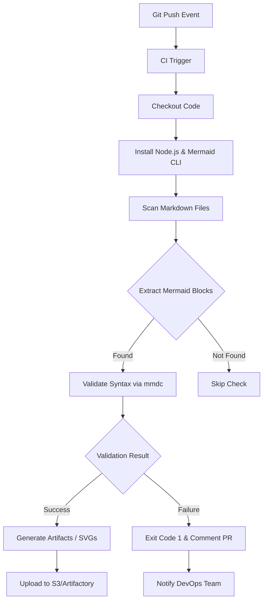

## 서론

새벽 2시, 긴급 배포가 진행되는 와중에 운영팀으로부터 다급한 리포트가 들어옵니다. "최신 배포된 아키텍처 문서의 다이어그램이 깨져서 보입니다." 개발팀은 로컬에서 잘 보였다고 호소하지만, production 문서 서버에서는 렌더링 오류로 빈 화면만 노출됩니다. 결국 급하게 SVG 이미지를 수동으로 생성하여 배포하는 임시변통으로 마무리하지만, 팀원들은 밤을 지새우게 됩니다.

이런 상황은 단순히 "문서화"의 문제가 아닙니다. 이는 **인프라의 상태를 코드로 관리한다는 IaC(Infrastructure as Code) 철학의 연장선**에서 발생한 신뢰도 문제입니다. 우리가 도커 이미지 빌드 오류를 CI에서 사전에 차단하듯, 다이어그램 코드 또한 '코드'로서의 품질 검증을 거쳐야 합니다. 텍스트로 작성된 Mermaid 다이어그램이 실제 렌더링 될 때 유효한지, CI/CD 파이프라인 내에서 기계적으로 검증하고 디버깅하는 프로세스를 구축하는 것이야말로 진정한 DevOps 엔지니어의 태도입니다.

## 본론

### 1. 다이어그램 검증 파이프라인 아키텍처

문서화를 단순 텍스트 편집이 아닌, 소프트웨어 빌드 프로세스의 일부로 통합해야 합니다. Mermaid 코드를 검증하는 파이프라인은 개발자가 코드를 푸시(Push)하는 순간 트리거되어, Markdown 파일 내의 Mermaid 문법을 파싱하고 실제 이미지로 변환 가능한지 확인한 뒤, 결과를 레포트하는 흐름을 가져야 합니다.

아래는 이 검증 프로세스의 논리적인 흐름을 나타낸 다이어그램입니다.



이 아키텍처의 핵심은 `mmdc` (Mermaid CLI) 툴을 CI 환경에 도입하는 것입니다. 브라우저 렌더링에 의존하는 기존 방식과 달리, CLI는 터미널 환경에서 즉각적인 Exit Code를 반환하기 때문에 파이프라인 차단이 가능합니다.

### 2. 검증 도구 비교: 수동 vs 자동화

많은 팀들이 여전히 로컬 PC에서 VS Code 플러그인을 통해 미리보기를 확인한 뒤 커밋합니다. 하지만 이는 휴먼 에러를 방지하기에 부족합니다. 다음은 전통적인 방식과 CI 기반 자동 검증 방식의 비교입니다.

| 특징 | 수동 검증 (VS Code Preview) | CI 파이프라인 자동 검증 |
| :--- | :--- | :--- |
| **검증 시점** | 커밋 전, 개발자의 의지에 따름 | 푸시/PR 시, 강제 실행 |
| **환경 의존성** | 로컬 OS, Node 버전 영향 받음 | 격리된 컨테이너 환경 (재현성 높음) |
| **복잡한 다이어그램 처리** | 로컬 리소스 제한으로 렌더링 타임아웃 가능 | 클라우드 리소스 사용 대용량 처리 가능 |
| **PR 피드백** | 불가능 (코드 리뷰 시 눈으로 확인) | 렌더링된 이미지를 PR 코멘트로 자동 전달 |
| **운영 효율성** | 낮음 (수동 리뷰 시간 소모) | 높음 (장애 조기 발견) |

### 3. Step-by-Step 구현 가이드

이제 실제로 GitHub Actions를 사용하여 Mermaid 코드를 검증하고, 오류 발생 시 디버깅 정보를 남기는 파이프라인을 구축해 보겠습니다.

#### Step 1: Mermaid CLI 설정 및 스크립트 작성

먼저, Mermaid 문법을 검증할 쉘 스크립트를 작성합니다. 이 스크립트는 `.md` 파일을 스캔하여 Mermaid 블록을 추출하고 `mmdc` 명령어로 유효성을 검사합니다.

```bash
#!/bin/bash
# scripts/validate-mermaid.sh

# 설치: npm install -g @mermaid-js/mermaid-cli
# 의존성: Puppeteer (헤드리스 크롬)

echo "Start Mermaid Validation..."

# 검증 대상 디렉토리 (예: docs/)
TARGET_DIR=${1:-./docs}
ERROR_FOUND=0

# 모든 마크다운 파일 찾기
find "$TARGET_DIR" -name '*.md' | while read -r file; do
  echo "Checking $file..."
  
  # 임시 파일 생성을 통한 검증 로직
  # awk를 사용하여 ```mermaid ... ``` 블록 추출 후 임시 파일로 저장
  awk '/```mermaid/,/```/' "$file" > /tmp/temp.mmd
  
  # 임시 파일이 비어있지 않다면 검증 수행
  if [ -s /tmp/temp.mmd ]; then
    # mmdc -i 입력 -o 출력 (출력을 /dev/null로 보내 렌더링만 테스트)
    if ! mmdc -i /tmp/temp.mmd -o /dev/null -b transparent 2>&1; then
      echo "[ERROR] Validation failed in $file"
      ERROR_FOUND=1
    fi
  fi
  
  rm -f /tmp/temp.mmd
done

if [ "$ERROR_FOUND" -ne 0 ]; then
  echo "Mermaid validation failed."
  exit 1
else
  echo "All diagrams are valid."
  exit 0
fi
```

#### Step 2: GitHub Actions 워크플로우 정의

작성한 스크립트를 CI 파이프라인에 통합합니다. 여기서 중요한 점은 단순히 성공/실패 뿐만 아니라, 실패 시 **어떤 부분이 문제인지 시각적으로 피드백**을 줘야 한다는 점입니다.

```yaml
name: Mermaid Diagram CI

on:
  pull_request:
    paths:
      - '**.md'
      - 'docs/**'

jobs:
  validate-diagrams:
    runs-on: ubuntu-latest
    steps:
      - name: Checkout code
        uses: actions/checkout@v3

      - name: Setup Node.js
        uses: actions/setup-node@v3
        with:
          node-version: '18'

      - name: Install Mermaid CLI
        run: npm install -g @mermaid-js/mermaid-cli

      - name: Run Validation Script
        id: validate
        continue-on-error: true
        run: |
          chmod +x scripts/validate-mermaid.sh
          ./scripts/validate-mermaid.sh ./docs

      - name: Generate Debug Artifacts on Failure
        if: steps.validate.outcome == 'failure'
        run: |
          echo "Detected rendering errors. Attempting to generate error logs..."
          # 실패한 다이어그램을 강제로 렌더링하여 에러 로그를 생성하거나
          # 문제가 있는 부분을 하이라이팅 하는 스크립트 실행
          mkdir -p artifacts
          # 에러 상세 내용을 artifacts/error.log 에 저장
          echo "Parse Error: Check Syntax" > artifacts/error.log

      - name: Upload Debug Results
        if: failure()
        uses: actions/upload-artifact@v3
        with:
          name: mermaid-error-logs
          path: artifacts/

      - name: Comment PR on Failure
        if: failure()
        uses: actions/github-script@v6
        with:
          script: |
            github.rest.issues.createComment({
              issue_number: context.issue.number,
              owner: context.repo.owner,
              repo: context.repo.repo,
              body: '⚠️ **Mermaid Validation Failed**

다이어그램 렌더링 중 문제가 발생했습니다. 로그를 확인해주세요.
- **Action Run**: ' + context.serverUrl + '/' + context.repo.owner + '/' + context.repo.repo + '/actions/runs/' + context.runId
            })
```

### 4. 모니터링 및 고급 디버깅

DevOps 관점에서 단순한 "빌드 실패"를 넘어, 왜 실패했는지에 대한 메트릭을 수집하는 것이 중요합니다. Mermaid CLI의 로그를 파싱하여 Prometheus에 전송하면, 문서화 품질의 추세를 모니터링할 수 있습니다.

예를 들어, 특정 복잡도(노드 수) 이상의 다이어그램이 자주 실패한다면, 이는 문서 가이드라인을 수정해야 한다는 신호일 수 있습니다.

```yaml
# prometheus-config.yml 예시 (간략화)
scrape_configs:
  - job_name: 'ci-docs'
    static_configs:
      - targets: ['ci-runner:9090']
```

**디버깅 팁**: 1.  **Puppeteer 타임아웃**: 복잡한 다이어그램은 렌더링 시간이 오래 걸립니다. CLI 실행 시 `-t` (timeout) 옵션을 충분히 늘려주세요 (기본값은 30초입니다). 2.  **폰트 깨짐 문제**: CI 환경(리눅스)에는 한글 폰트가 없을 수 있습니다. 렌더링 시 폰트가 깨진다면 Dockerfile 내부에 나눔고딕 등의 폰트를 사전에 설치해야 합니다.     ```dockerfile     RUN apt-get update && apt-get install -y fonts-nanum     ```

## 결론

결국 "보이는 대로 믿는(Seeing is believing)" 문서화 시대는 지났습니다. 우리는 "검증된 것만 믿는(Verified is believing)" 시대에 살고 있습니다. Mermaid와 같은 Diagram-as-Code 도구를 도입하는 것은 시작에 불과하며, 이를 CI/CD 파이프라인에 통합하여 **자동으로 검증(Validation)**하고 **장애를 조기에 탐지(Early Detection)**하는 것이 진정한 운영 효율성을 높이는 길입니다.

이 가이드를 통해 구축된 파이프라인은 개발자가 텍스트 한 줄 잘못 썼을 때 즉시 피드백을 주어, 문서가 인프라의 껍데기가 아니라 신뢰할 수 있는 지식 베이스로 거듭나게 할 것입니다. 이제 여러분의 레포지토리에 다이어그램 가드(Guard)를 설치하고, 안심하고 코드를 푸시하세요.

**참고자료**:

- [Mermaid CLI Official Documentation](https://github.com/mermaid-js/mermaid-cli)

- [GitHub Actions Documentation](https://docs.github.com/en/actions)

- [Diagram-as-Code Best Practices](https://www.infoq.com/articles/diagram-as-code/)
