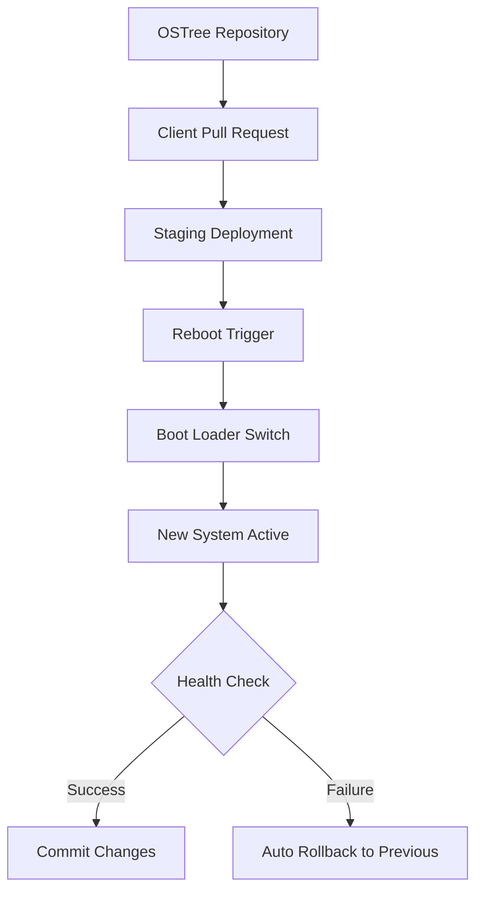

## 서론

모바일 기기의 생태계는 오랫동안 '잠긴 정원(Locked Garden)' 혹은 '파편화된 야생(Fragmented Wild)'이라는 두 가지 극단에서 갈등해왔습니다. 보안 전문가로서 현장에서 마주하는 가장 큰 고통 중 하나는, 제로데이 취약점이 발표되었을 때 스마트폰의 펌웨어 업데이트가 제조사의 일정이나 통신사의 인증 절차에 발목 잡혀 며칠, 혹은 몇 달씩 지연되는 현실입니다. 사용자는 최신 보안 패치가 적용되지 않은 기기를 들고 일상을 영위해야 하며, 이는 공격자들에게는 달콤한 먹잇감이 됩니다.

이러한 구조적 문제를 해결하기 위해 등장한 것이 **Pocketblue**입니다. 이 프로젝트는 단순히 리눅스를 스마트폰에 깔아보는 취미 차원의 포팅이 아닙니다. 이는 Fedora Atomic의 불변(Immutable) 아키텍처와 원자적(Atomic) 업데이트 메커니즘을 모바일 하드웨어에 그대로 이식하여, 데스크탑급의 보안성과 관리 효율성을 손바닥 위에서 실현하려는 시도입니다. 모바일 OS 패리티마를 깨고, 컨테이너 기반의 미래를 현재로 가져오는 Pocketblue의 기술적 깊이와 적용 가능성을 분석해 보겠습니다.

## 본론

### 기술적 배경과 원리: 모바일에서의 불변성(Immutability)

Pocketblue의 핵심은 Fedora Atomic의 철학을 그대로 계승한 **OSTree** 기반의 부팅 가능한 파일 시스템입니다. 기존의 모바일 OS(안드로이드 등)는 시스템 파티션에 직접 쓰기를 수행하여 구성 요소를 수정하는 방식을 사용합니다. 이는 파일 시스템 훼손(Filesystem Corruption)이나 설정 오류 시 복구를 어렵게 만듭니다. 반면, Pocketblue는 기본 OS 이미지를 읽기 전용(Read-Only)으로 마운트하여 시스템의 무결성을 보장합니다.

시스템 업데이트는 전체 파일 시스템 교체가 아닌, 깃(Git)과 유사한 방식으로 바뀐 파일들만 덮어씌우는 방식으로 이루어집니다. 이를 통해 다음과 같은 보안적 이점을 얻습니다.

1.  **원자적 업데이트(Atomic Updates)**: 업데이트 과정 중 전원이 차단되더라도 이전 상태로 안전하게 롤백(Rollback)됩니다. 부팅 불가 상태에 빠질 위험이 원천적으로 차단됩니다.
2.  **공격 면적 감소**: 공격자가 시스템 바이너리를 변조하려 해도 기본 파티션이 쓰기 금지 상태이므로 영구적인 백도어 설치가 현저히 어렵습니다.
3.  **재현성**: 동일한 이미지 해시를 사용하는 모든 기기는 완벽히 동일한 시스템 상태를 보장하므로, 포렌식 분석이나 취약점 스캐닝이 용이합니다.

다음은 Pocketblue의 업데이트 및 부팅 메커니즘을 간소화한 다이어그램입니다.



### 아키텍처 비교: 기존 모바일 OS vs Pocketblue

Pocketblue가 제공하는 환경이 기존 안드로이드 커스텀 롬이나 우분투 터치와 어떻게 다른지 명확히 이해할 필요가 있습니다. 특히 패키지 관리와 앱 격리 차원에서 구조적인 차이가 존재합니다.

| 비교 항목 | 기존 Android (AOSP) | Ubuntu Touch | Pocketblue (Fedora Atomic) |
| :--- | :--- | :--- | :--- |
| **기본 시스템** | 가변 (Mutable, root 쓰기 가능) | 가변 (Mutable, apt 사용) | **불변 (Immutable, ostree 기반)** |
| **패키지 관리** | APK / System Overlay | apt / deb | rpm-ostree (시스템) + Podman (앱) |
| **업데이트 메커니즘** | A/B 파티션 (제조사 구현 의존) | 전체 이미지 플래시 또는 apt | **원자적(Atomic) 커밋 기반** |
| **앱 격리** | Sandbox (Dalvik/ART VM) | Classic Linux Process (LXC) | **Container (Podman) 기반 강력 격리** |
| **개발자 경험** | Java/Kotlin NDK | Python/C/Deb tools | **RPM/DNF/Fedora 툴체인** |

### 실무 적용 가이드 및 코드 예시

Pocketblue 환경은 데스크탑 Fedora 사용자에게 매우 친숙합니다. 하지만 모바일 환경의 제약(배터리, 터치 인터페이스)을 고려하여 컨테이너를 관리하는 것이 중요합니다.

시스템 업데이트는 터미널(`KGX` 또는 `Terminal` 앱)을 통해 `rpm-ostree` 명령어로 수행합니다. 이 과정은 안드로이드의 OTA 업데이트보다 훨씬 투명하고 빠릅니다.

**시스템 업데이트 및 상태 확인**

```bash
# 원격 서버에서 최신 버전 확인
rpm-ostree upgrade

# 업데이트 내역 및 현재 부팅된 커밋 해시 확인
rpm-ostree status

# 변경 사항 적용을 위한 재부팅 (필수)
systemctl reboot
```

Pocketblue의 진정한 힘은 앱을 시스템 라이브러리에 의존하지 않고 컨테이너화하여 배포하는 데 있습니다. 예를 들어, 최신 버전의 개발 도구가 필요하다고 가정해 봅시다. 시스템을 오염시키지 않고 `toolbox` 또는 `podman`을 사용합니다.

**컨테이너화된 앱 실행 (Podman)**

```bash
# Fedora 최신 이미지를 기반으로 하는 컨테이너 실행
# --device 옵션은 모바일 하드웨어(GPU 등) 접근이 필요할 때 사용
podman run -it --rm --name dev-env \
    -v ~/Documents:/home/user/Documents:z \
    -e DISPLAY=$DISPLAY \
    registry.fedoraproject.org/fedora:latest

# 컨테이너 내부에서 패키지 설치 및 실행 (시스템에 영향 없음)
dnf install -y htop vim
htop
exit
```

위 코드는 시스템의 `/usr` 디렉토리를 건드리지 않고, 사용자 공간에서 격리된 환경을 구축하는 방법을 보여줍니다. 보안 관점에서 볼 때, 만약 해당 컨테이너가 악성코드에 감염되더라도 삭제(`podman rm`)만으로 완벽하게 격리된 채 시스템에서 제거됩니다.

### 단계별 구축 및 분석 프로세스

보안 연구원이나 개발자가 Pocketblue를 분석용 기기로 설정할 때 권장하는 워크플로우는 다음과 같습니다.

1.  **기기 준비 및 플래싱**: 지원되는 모바일 기기(주로 Pixel 시리즈 등 mainline 커널 지원 기기)에 U-Boot 및 Pocketblue 이미지를 플래싱합니다.
2.  **네트워크 보안 강화**: 초기 부팅 후 SSH 키 기반 인증을 활성화하고, 방화벽(`firewalld`)을 설정하여 불필요한 포트를 차단합니다.
3.  **툴박스(Toolbox) 배포**: 정적 분석 도구나 동적 분석 도구가 사전 설치된 컨테이너 이미지를 구축합니다.
4.  **감사 및 로깅**: `auditd`를 활성화하여 시스템 콜을 모니터링합니다. 불변 시스템이므로 로그 파일의 변조 여부 또한 쉽게 탐지할 수 있습니다.
5.  **패치 관리**: CVE 발생 시 `rpm-ostree upgrade`를 통해 즉시 패치를 테스트하고 배포합니다.

## 결론

Pocketblue는 단순한 리눅스 배포판 포팅을 넘어, 모바일 OS의 보안 패러다임을 '가변성'에서 '불변성'으로 전환하는 중요한 이정표입니다. OSTree를 통한 원자적 업데이트는 제로데이 취약점 대응 속도를 획기적으로 개선하며, 컨테이너 기반의 앱 격리는 모바일 환경에서도 데스크탑 수준의 보안 경계를 제공합니다.

CVE 분석가의 관점에서 볼 때, Pocketblue는 공격 표면(A Attack Surface)을 최소화하고 시스템 무결성을 수학적으로 보장하는 구조를 가지고 있어, 향후 모바일 포렌식 및 보안 연구용 표준 플랫폼으로 자리 잡을 가능성이 매우 높습니다. 다만, 현재 단계에서는 하드웨어 드라이버 호환성과 배터리 최적화 같은 실용적인 문제들이 남아 있으므로, 실무 적용 시에는 주요 기기의 드라이버 지원 범위를 면밀히 검토해야 합니다.

보안과 자유, 그리고 안정성까지 잡은 이 실험적인 프로젝트의 향후 행보가 주목됩니다.

**참고자료**:

- [Pocketblue GitHub Repository](https://github.com/pocketblue/pocketblue)

- [Fedora Atomic Documentation](https://docs.fedoraproject.org/en-US/fedora-silverblue/)

- [OSTree Project](https://ostreedev.github.io/ostree/)
