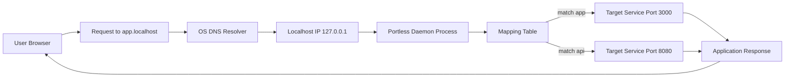

## 서론

사이버 보안 엔지니어나 백엔드 개발자라면 로컬 개발 환경에서 느끼는 그 짜증스러운 순간을 한 번쯤은 겪어봤을 것입니다. 마이크로서비스 아키텍처(MSA) 기반의 프로젝트를 로컬에서 띄우려면 인증 서버, 결제 서버, API 게이트웨이 등 수십 개의 컨테이너와 프로세스를 동시에 구동해야 합니다. 터미널 창이 10개 이상 켜지고, 브라우저 즐겨찾기는 `localhost:3000`, `localhost:8080`, `localhost:5000`으로 도배됩니다.

이때 가장 흔하게 발생하는 재앙이 바로 '포트 충돌(Port Collision)'입니다. 새로운 서비스를 띄우려고 `npm run dev`를 입력했더니, 자바스크립트 에러가 아닌 시스템 레벨의 `EADDRINUSE` 에러가 뜨면서 멘탈이 나가는 경험, 다들 있으실 겁니다. "어떤 놈이 3000번을 쓰고 있지?" 하며 `lsof`나 `netstat`를 치는 순간, 개발의 흐름은 끊기고 맙니다. 더군다나 보안 테스트를 위해 여러 버전의 환경을 격리해서 띄워야 할 때, 포트 번호 기반의 관리는 재앙이나 다름없습니다.

Vercel Labs에서 공개한 **Portless**는 바로 이 지옥 같은 '포트 관리' 문제를 근본적으로 해결하기 위해 탄생했습니다. 이 도구는 단순히 편리함을 넘어, 개발 환경의 구조적 안정성을 보장하는 유틸리티입니다. 오늘은 Portless가 어떻게 작동하며, 왜 보안 및 운영 관점에서 주목해야 할지 깊이 있게 분석해 보겠습니다.

## 본론

### 기술적 원리와 메커니즘

Portless의 핵심 매커니즘은 "포트 번호를 서브도메인 이름으로 치환"하는 것입니다. 기존에는 IP 주소와 포트 번호의 조합(`127.0.0.1:3000`)으로 소켓을 식별했다면, Portless는 도메인 네임 시스템(DNS)의 계층 구조를 활용해 `app.localhost`라는 이름을 통해 해당 포트로 매핑합니다.

여기서 중요한 기술적 배경 하나는 `.localhost`라는 최상위 도메인(TLD)의 성격입니다. IETF(인터넷 엔지니어링 태스크포스) 표준인 RFC 6761과 RFC 2606에 따르면, `.localhost`는 오직 로컬 루프백 주소로만 해석되도록 예약된 도메인입니다. 이는 DNS 캐시 포이즈닝과 같은 보안 위협으로부터 안전하며, 인터넷상의 외부 DNS 서버에 질의할 필요조차 없이 운영체제 레벨에서 즉시 차단되거나 로컬로 회귀됩니다. Portless는 이 보안적 특성을 활용하여 별도의 `/etc/hosts` 파일 수정 없이도 안전하게 로컬 라우팅을 구현합니다.

다음은 Portless가 요청을 처리하는 흐름을 간소화한 다이어그램입니다.



### 실무 적용 가이드 및 사용 예시

이제 실제로 Portless를 사용하여 로컬 개발 환경을 구성해 보겠습니다. 이 도구는 Node.js 기반으로 작성되었으며, npm을 통해 쉽게 설치할 수 있습니다.

#### 1. 설치 및 실행

먼저 전역으로 Portless를 설치합니다.

```bash
npm install -g @vercel/portless
```

설치 후, 기존에 포트 3000번에서 실행되던 웹 애플리케이션이 있다고 가정해 봅시다. Portless를 사용하여 이 애플리케이션에 `web.localhost`라는 도메인을 부여하는 과정은 다음과 같습니다.

```bash
# 기존 앱 실행 (백그라운드)
node app.js &

# Portless를 통해 도메인 매핑 및 터널링 시작
# 3000번 포트를 web.localhost로 노출
portless start --port 3000 --name web
```

위 명령어를 실행하면 터미널에 다음과 같은 메시지가 출력되며 서비스가 준비됩니다.

```text
> Preparing local environment...
> Mapping web.localhost -> 127.0.0.1:3000
> ✨ Ready! Access at http://web.localhost
```

이제 브라우저 주소창에 복잡한 `http://localhost:3000` 대신 `http://web.localhost`를 입력하면 동일한 페이지에 접속할 수 있습니다.

#### 2. 복수 서비스 관리 시나리오

실제 현업에서는 프론트엔드, 백엔드 API, 인증 서버 등을 동시에 띄워야 합니다. 각 서비스를 고유한 이름으로 관리하는 시나리오 코드는 다음과 같습니다.

```bash
# 1. 인증 서비스 (포트 4000)
portless start --port 4000 --name auth

# 2. 백엔드 API (포트 5000)
portless start --port 5000 --name api

# 3. 프론트엔드 (포트 3000)
portless start --port 3000 --name dashboard
```

이제 개발자는 포트 번호를 기억할 필요가 없습니다. 프론트엔드 코드에서 API를 호출할 때도 `http://localhost:5000/users` 대신 `http://api.localhost/users`를 사용하면 됩니다. 이는 코드의 가독성을 높일 뿐만 아니라, 환경별 설정(Local, Dev, Staging) 간의 전환을 매끄럽게 만들어 줍니다.

### 기존 방식 vs Portless 비교 분석

기존의 로컬 개발 방식과 Portless를 사용했을 때의 차이를 명확히 이해하기 위해, 보안 및 운영 관점에서 비교해 보았습니다.

| 비교 항목 | 기존 방식 (Port 기반) | Portless (Name 기반) |
| :--- | :--- | :--- |
| **식별자** | 숫자 (예: :3000, :8080) | 의미 있는 문자열 (예: app.localhost) |
| **포트 충돌 위험성** | 높음 (동일 포트 사용 시 에러 발생) | 낮음 (이름 충돌 시 이름만 변경하면 해결) |
| **설정 복잡도** | `/etc/hosts` 수정 필요 (도메인 사용 시) | 자동화된 DNS 라우팅 (수동 설정 불필요) |
| **보안성** | 방화벽 규칙 관리 복잡 | `.localhost` 표준 준수로 로컬 고립 보장 |
| **코드 이관(Deploy)** | 배포 시 `localhost` 제거 필요 | `.localhost`는 로컬 전용이므로 환경변수 처리 용이 |

### 보안 및 운영상의 고려사항 (Defensive Perspective)

보안 전문가로서 Portless를 사용할 때 몇 가지 주의해야 할 점이 있습니다. Portless는 내부적으로 로컬 프록시 서버처럼 동작하므로, 모든 트래픽이 Portless 데몬을 경유하게 됩니다.

1.  **인증서 처리**: 최신 브라우저는 민감한 기능(쿠키의 `Secure` 속성, Geolocation API 등)을 HTTPS가 아닌 환경에서 제한합니다. `.localhost` 도메인은 HTTPS 인증서 발급이 어렵거나 불가능할 수 있으므로(최근 Chrome 등에서는 `.localhost`에 대해 보안 완화를 적용하기도 함), 개발 단계에서의 기능 검증에 한계가 있을 수 있습니다. 이 경우 내부적으로 self-signed 인증서를 적용하는 설정이 필요할 수 있습니다.
2.  **의존성 관리**: Portless 데몬이 죽으면 모든 `*.localhost` 접속이 끊깁니다. 즉, SPOF(Single Point of Failure)가 될 수 있습니다. 이를 해결하기 위해 PM2 같은 프로세스 매니저와 함께 Portless를 관리하거나, 서비스로 등록하여 자동 재시작을 설정하는 것이 좋습니다.

## 결론

Portless는 단순한 개발자 편의 도구를 넘어, 로컬 개발 환경의 복잡도를 낮추고 운영 효율성을 높이는 유용한 유틸리티입니다. Vercel Labs가 오픈소스로 공개한 이 도구는 "포트 번호 기억"이라는 불필요한 인지 부하를 덜어주어, 개발자가 비즈니스 로직과 보안 검증에 집중할 수 있게 도와줍니다.

특히 `.localhost`라는 표준을 준수하여 외부 유출 가능성을 원천적으로 차단한 점은 보안 관점에서 매우 세련된 설계라 할 수 있습니다. 여러 서비스가 얽혀 돌아가는 현대의 웹 개발 환경에서, Portless는混乱(chaos)을 질서(order)로 바꾸는 작은 도구지만 그 효과는 결코 작지 않습니다.

지금 당장 터미널에 `npm install -g @vercel/portless`를 입력하고, 포트 번호의 노예에서 벗어나 직관적인 도메인 기반 개발을 시작해 보시기 바랍니다.

**참고자료**:

- [Vercel Labs - Portless GitHub Repository](https://github.com/vercel/portless)

- [RFC 6761: Special-Use Domain Names](https://datatracker.ietf.org/doc/html/rfc6761)

- [Hada.io 기술 소개](https://news.hada.io/topic?id=27116)
