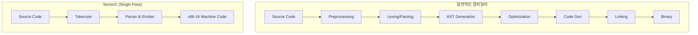

## 서론

디지털 포렌식 현장에서 수상한 시스템을 분석할 때, 가장 먼저 확인하는 곳 중 하나가 바로 부팅 섹터(MBR, VBR)입니다. 보통 이곳에는 부팅을 위한 기계어 코드만 들어있을 거라 기대하지만, 만약 그 틈을 파고든 것이 단순한 셸코드가 아니라 **'컴파일러'**라면 어떨까요? 최근 공개된 `SectorC`는 x86-16 아키텍처를 기반으로 단 512바이트, 즉 디스크의 첫 번째 섹터 하나에 딱 맞는 크기로 구현된 C 컴파일러입니다.

보안 전문가로서 이 기술은 단순한 기술적 유희가 아닙니다. 공격자가 악성코드를 하드디스크의 섹터에 숨겨두고, 실행 시점에 필요에 따라 새로운 코드를 컴파일하여 즉석에서 생성한다면, 기존의 시그니처 기반 백신이나 탐지 시스템은 무력화될 수 있습니다. 이 글에서는 극한의 최적화로 탄생한 SectorC의 작동 원리를 분석하고, 이러한 초소형 컴파일러 기술이 보안 관점에서 가지는 함의와 방어 전략을 살펴보겠습니다.

## 본론

### 1. x86-16과 512바이트의 제약: 왜 이것이 중요한가?

SectorC의 핵심은 x86 리얼 모드(Real Mode) 환경에서 512바이트라는 절대적인 공간 제약을 극복했다는 점입니다. BIOS는 부팅 시 디스크의 첫 섹터(512바이트)를 메모리 주소 `0x7C00`로 로드하여 실행합니다. 일반적인 현대 C 컴파일러(GCC, Clang 등)는 수십 메가바이트의 크기를 자랑하며, 복잡한 최적화 단계를 거치지만, SectorC는 렉서(Lexer), 파서(Parser), 코드 제너레이터(Code Generator)가 모두 하나의 tight loop 안에서 돌아가도록 설계되었습니다.

보안 관점에서 이는 **"Fileless Malware"**나 **"Bootkit"**의 진화 형태로 볼 수 있습니다. 512바이트 안에 펌웨어를 조작하거나 시스템을 로드밸런싱하는 데 필요한 논리를 담을 수 있다면, 공격자는 운영체제가 로드되기도 전에 완전히 제어권을 장악할 수 있습니다.

### 2. SectorC의 컴파일 파이프라인 분석

일반적인 컴파일러가 소스 코드를 토큰으로 분석하고 추상 구문 트리(AST)를构建한 뒤 최적화를 수행하는 다단계 과정을 거치는 반면, SectorC는 **Single-Pass Compiler**입니다. 코드를 읽는 즉시 기계어로 변환하여 메모리에 씁니다.

아래 다이어그램은 이러한 극한의 컴파일 과정이 기존 방식과 어떻게 다른지 시각적으로 보여줍니다.



이 다이어그램에서 볼 수 있듯이, SectorC는 중간 단계(AST 등) 없이 입력을 즉시 기계어(Danger Zone)로 변환합니다. 이는 메모리 공간을 획기적으로 아낄 수 있지만, 에러 처리나 복잡한 최적화가 불가능하다는 trade-off가 존재합니다.

### 3. 기능 비교 및 코드 예시

SectorC는 C 언어의 전체 기능을 지원하지는 않지만, 전역 변수, 함수, 포인터 연산, `if`/`while` 문과 같은 핵심적인 부분집합을 지원합니다. 이는 단순한 계산기가 아니라 실제 로직을 수행하는 프로그램을 작성할 수 있음을 의미합니다.

다음은 일반적인 C 환경과 SectorC 환경의 차이를 보여주는 표입니다.

| 특징 | GCC/Clang (Modern C) | SectorC (Restricted C) |
| --- | --- | --- |
| **아키텍처** | x86-64, ARM 등 다양 | x86-16 (Real Mode) | **코드 크기** | ~100 MB | 512 Bytes 
| **메모리 모델** | Protected/Long Mode | Real Mode (64KB Segment) | **지원 타입** | int, float, struct, double 등 | int (2 bytes), char, pointer 
| **최적화** | O1, O2, O3 등 고급 최적화 | 없음 (직접 매핑) |

SectorC를 사용하여 작성한 간단한 코드 예시는 다음과 같습니다.

```c
// SectorC 예시: 팩토리얼 계산
int main() {
    int n = 5;
    int r = 1;
    while (n > 0) {
        r = r * n;
        n = n - 1;
    }
    return r; // 결과값은 레지스터에 저장됨
}
```

이 코드는 SectorC에 의해 컴파일되어 16비트 어셈블리어로 변환되고, 최종적으로 기계어로 생성됩니다. 만약 공격자가 이 로직을 악용하여 부팅 과정에서 특정 메모리 영역을 덮어쓰거나, 키보드 입력 후킹 루틴을 컴파일한다면 시스템이 켜지는 순간부터 감청이 시작될 수 있습니다.

### 4. 실무적 적용: MBR 분석 및 방어 가이드

보안 엔지니어나 포렌식 전문가는 SectorC와 같은 기술이 악용될 가능성에 대비해야 합니다. 다음은 부팅 섹터 변조를 탐지하고 분석하는 단계별 가이드입니다.

#### 4단계 부팅 섹터 무결성 검증 절차

1.  **디스크 덤프 획득 (Disk Acquisition)**     *   물리적 디스크에 접근하여 첫 번째 섹터(512바이트)를 이미지 파일로 덤프합니다.     *   리눅스 환경 예시:         ```bash         dd if=/dev/sda of=mbr_dump.bin bs=512 count=1         ```

2.  **시그니처 분석 (Static Analysis)**     *   덤프된 파일을 16진수 에디터(HxD, hexdump)로 엽니다.     *   MBR의 끝부분(오프셋 510)에 `0x55AA` 시그니처가 있는지 확인합니다.     *   정상적인 부트로더 패턴이 아닌 임의의 코드 혹은 텍스트("SectorC", "C Compiler" 등의 문자열)가 포함되어 있는지 검색합니다.

3.  **동적 분석 (Emulation)**     *   실제 하드웨어에서 실행 시 악성코드 감염 위험이 있으므로 에뮬레이터(QEMU)를 사용합니다.     *   QEMU를 이용해 덤프 파일을 부팅하여 레지스터 상태 변화를 모니터링합니다.         ```bash         qemu-system-x86_64 -drive format=raw,file=mbr_dump.bin         ```     *   디버거(gdb)를 연결하여 `0x7C00` 주소부터 실행 흐름을 추적합니다.

4.  **무결성 복구 (Remediation)**     *   변조가 확인되면 윈도우 복구 콘솔이나 리눅스 Live CD를 부팅하여 표준 MBR을 다시 기록합니다.     *   예시 (리눅스):         ```bash         fdisk /dev/sda         # 명령어 모드에서 'x' (전문가 모드) -> 'z' (새로운 MBR/서명 작성) 또는         # ms-sys 또는 install-mbr 패키지 활용         ```

## 결론

SectorC는 단 512바이트라는 극한의 공간에서 C 컴파일러를 구현한 놀라운 기술적 업적입니다. 하지만 보안 전문가의 시각에서 볼 때, 이는 **"공격 표면(Access Vector)의 극소화"**와 **"변형 가능한 악성코드"**의 가능성을 보여주는 사례입니다.

이 프로젝트는 우리에게 시스템의 가장 낮은 레벨인 부트 섹터조차 얼마든지 지능적이고 유연한 코드로 대체될 수 있음을 시사합니다. 기존의 정적 분석 방식만으로는 이러한 자기 수정 코드나 즉석 컴파일 코드를 탐지하기 어렵습니다. 따라서 우리는 부트로더 무결성 확인(UEFI Secure Boot, TPM)과 같은 하드웨어적 신뢰 체인(Chain of Trust) 강화와 함께, 512바이트와 같은 작은 영역도 수시로 모니터링하는 행위 기반 탐지(Behavior-based Detection) 전략을 병행해야 합니다.

### 참고자료

- [SectorC GitHub Repository](https://github.com/nanochess/SectorC) (Original Project)

- [x86 Boot Sector Analysis Guide](https://thestarman.pcministry.com/asm/mbr/)

- [UEFI Secure Boot Specification](https://uefi.org/specifications)
