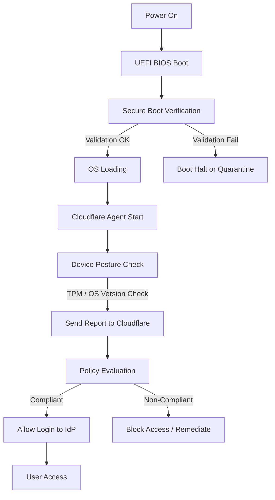

## 서론

새벽 2시, 온콜 엔지니어의 휴대폰이 울립니다. 인프라 장애가 발생했습니다. 급하게 노트북을 열어 콘솔에 접속하려는 순간, 정작 당황스러운 것은 네트워크 연결이 아니라 기기 자체의 상태일 때가 있습니다. 며칠 전, 동료가 자리를 비운 사이 USB 드라이브를 꽂아 랜섬웨어가 설치되었거나, 공용 와이파이를 사용하며 OS 커널 레벨의 키로거가 침투했을 수도 있습니다.

전통적인 보안 모델인 "경계 보안"이나 단순한 ID/Pwd, 심지어 MFA(다중 인증)만으로는 이 시나리오를 막을 수 없습니다. 사용자가 비밀번호를 입력하고 로그인하기 **직전까지**, 그리고 기기가 전원을 켜고 운영체제가 부팅되는 순간부터 보안의 공백(Trust Gap)이 존재하기 때문입니다. 해커는 사용자가 인증을 시도하기 전, 부팅 과정에서 이미 백도어를 심어놓을 수 있습니다.

DevOps 환경에서 개발자의 노트북이나 빌드 서버는 인프라의 가장 약한 고리입니다. 이 "부팅부터 로그인 전(Boot to Login)" 구간을 어떻게 확실하게 통제할 것인가는 더 이상 선택이 아닌 필수입니다. 이 글에서는 Cloudflare의 Zero Trust 툴킷을 활용해 장치의 전원이 켜지는 순간부터 최종 접속 권한이 부여되기까지의 보안 공백을 메우는 구체적인 아키텍처와 구현 방법을 다룹니다.

## 본론

### 부팅부터 로그인까지: 보안의 공백 메우기

Zero Trust의 핵심은 "신뢰할 수 있는 것이 없다"는 것입니다. 하지만 대부분의 구현은 사용자가 IdP(Identity Provider)에 인증을 요청하는 **순간**에만 집중합니다. Cloudflare의 새로운 접근 방식은 이 인증 시점을 부팅 시점으로 당겨, **지속적 장치 신뢰(Continuous Device Trust)**를 검증합니다.

이 기술의 핵심은 하드웨어 루트 오브 트러스트(Root of Trust)와 원격 증명(Remote Attestation)입니다. 기기의 BIOS/UEFI 단계에서 Secure Boot가 활성화되었는지, TPM(Trusted Platform Module) 칩이 무결성을 보장하는지를 OS가 완전히 로드되기 전에 확인하고, 이 상태를 Cloudflare의 에이전트가 중계합니다.

이 프로세스의 흐름을 간단히 도식화하면 다음과 같습니다.



위 다이어그램에서 볼 수 있듯이, 사용자 인증(J) 이전에 장치의 상태(F, G, H)가 먼저 필터링됩니다. 즉, 사용자가 아이디를 입력할 기회조차 주지 않고 장치가 비정상 상태임을 판단해 차단할 수 있습니다.

### 기존 VPN vs. Boot-to-Login Zero Trust

DevOps 관점에서 기존의 VPN 솔루션이나 단순 NAC(Network Access Control)와 비교했을 때, 이 새로운 접근 방식이 제공하는 이점은 명확합니다.

| 비교 항목 | 기존 VPN / NAC 솔루션 | Boot-to-Login Zero Trust (Cloudflare) |
| :--- | :--- | :--- |
| **검증 시점** | 로그인 후 인증, 네트워크 접속 후 | 전원 켜짐(부팅) 즉시, 로그인 전 |
| **신뢰 범위** | 네트워크 레벨(IP, 포트) | 디바이스 무결성(OS, Kernel, TPM) |
| **공격 노출면** | 로그인 이후 사용자 세션 하이재킹 가능 | 부팅 시점 악성코드 감지 및 격리 |
| **사용자 경험** | 연결될 때까지 대기, 인증 반복 | 백그라운드에서 자동 검증, 투명성 |
| **장치 분실 시** | 계정 탈취 시 접속 가능 | 장치 신뢰 상실 즉시 접속 불가 |

### 구현 가이드: Terraform으로 장치 신뢰 정책 구성하기

이제 실무에서 이를 어떻게 적용하는지 살펴보겠습니다. Cloudflare One과 Terraform을 사용하여, "장치가 최신 보안 패치가 적용되어 있지 않으면 내부 K8s 대시보드에 접속하지 못하게 하는" 시나리오를 구축해 보겠습니다.

#### 전제 조건
1. Cloudflare Account 및 Zero Trust 활성화
2. 대상 장치에 Cloudflare WARP Agent 설치
3. Terraform 설치 및 Cloudflare Provider 설정

#### Step 1: 장치 포스처(Device Posture) 규칙 생성

먼저, 어떤 상태를 "신뢰할 수 있다"고 정의할지 규칙을 만듭니다. 여기서는 macOS와 Windows의 OS 버전과 디스크 암호화(FileVault/BitLocker) 여부를 확인합니다.

```text
terraform {
  required_providers {
    cloudflare = {
      source  = "cloudflare/cloudflare"
      version = "~> 4.0"
    }
  }
}

provider "cloudflare" {
  api_token = var.cloudflare_api_token
}

# 1. 최신 OS 버전 여부 확인 (예: macOS Ventura 이상)
resource "cloudflare_zero_trust_access_device_posture_rule" "mac_os_version" {
  account_id = var.account_id
  name       = "Check macOS Version"
  type       = "os_version"
  schedule   = "1h" # 1시간마다 재확인
  match {
    platform = "mac"
    desktop   = true
  }
  input {
    operator = ">"
    value    = "13.0.0" # macOS Ventura
  }
}

# 2. 디스크 암호화 여부 확인 (Windows)
resource "cloudflare_zero_trust_access_device_posture_rule" "windows_encryption" {
  account_id = var.account_id
  name       = "Check Windows BitLocker"
  type       = "disk_encryption"
  schedule   = "1h"
  match {
    platform = "windows"
    desktop  = true
  }
}
```

#### Step 2: 액세스 정책(Access Policy)에 포스처 규칙 연결

생성한 포스처 규칙을 실제 리소스 접근 정책에 결합합니다. 이 정책은 GitLab Repository나 Kubernetes API Server 접근 Gateway에 적용할 수 있습니다.

```text
# 3. 애플리케이션 접근 정책 생성
resource "cloudflare_zero_trust_access_policy" "secure_app_policy" {
  account_id     = var.account_id
  name           = "DevOps Secure Access Policy"
  decision       = "allow"
  include {
    # 이메일 도메인이 example.com인 사용자
    email_domain = ["example.com"]
  }
  require {
    # 위에서 생성한 장치 포스처 규칙을 필수 조건으로 지정
    device_posture = [
      cloudflare_zero_trust_access_device_posture_rule.mac_os_version.id,
      cloudflare_zero_trust_access_device_posture_rule.windows_encryption.id
    ]
    # MFA 또한 필수
    mfa = ["one-time-pin"]
  }
}
```

이 코드를 배포하면, `example.com` 소속의 사용자가 로그인을 시도할 때 Cloudflare는 에이전트를 통해 해당 기기가 macOS 13.0 이상이거나, Windows라면 BitLocker가 활성화되어 있는지 즉시 확인합니다. 조건이 충족되지 않으면 로그인 화면조차 뜨지 않거나, 접속이 거부됩니다.

### Production 환경에서의 고려사항 (SRE 관점)

실제 운영 환경에 적용할 때는 다음 사항을 반드시 고려해야 합니다.

1.  **Fallback 및 예외 처리**: 긴급 상황이나 특정 레거시 장치를 위해 "일회용 액세스 코드(One-time code)"나 "예외 그룹"을 운영 정책에 포함하여 완전한 작업 중단(Lockout)을 방지해야 합니다.
2.  **그라데이션 적용(Rollout)**: 모든 사용자에게 한 번에 적용하지 마세요. DevOps 팀 → 인사팀 → 전사 순서로 단계적으로 적용하며 False Positive(오탐지)를 모니터링해야 합니다.
3.  **모니터링과 로깅**: 장치 신뢰성 검증 실패 로그는 SIEM(Splunk, Datadog 등)으로 전송해야 합니다. 특정 기기에서 반복적으로 검증이 실패한다면 이는 보안 사고의 징후일 수 있습니다.     ```hcl     # 로그 전송 예시 (Cloudflare Logpush)     resource "cloudflare_logpush_job" "access_logs" {       account_id     = var.account_id       enabled        = true       name           = "zero-trust-access-logs"       logpull_options = "fields=EventResult,DevicePosture,Action,Email"       destination_conf = "s3://my-s3-bucket/logs?region=us-east-1"     }     ```

## 결론

DevOps의 빠른 속도를 유지하면서 보안을 강화하는 것은 균형 잡힌 타협의 문제가 아닌, 엔지니어링의 문제입니다. "부팅부터 로그인까지" 연속되는 보안 검증은 단순히 로그인 화면 앞에 문을 하나 더 설치하는 것이 아니라, 기기라는 물리적 계층에서부터 신뢰를 쌓아 올리는 기반 작업입니다.

이 접근 방식은 컨테이너의 Immutable Infrastructure 개념을 개발자의 엔드포인트(노트북)로 확장하는 것입니다. OS 커널이 수정되었거나 암호화가 풀린 기기는 더 이상 신뢰할 수 있는 '인프라'가 아닙니다. Cloudflare의 Zero Trust 툴과 IaC를 활용하면 이러한 복잡한 신뢰 체인을 코드로 관리하고, 자동으로 시행할 수 있습니다.

보안의 미래는 방화벽 뒤에 숨는 것이 아니라, 우리가 사용하는 모든 비트와 바이트가 검증된 상태임을 보장하는 것입니다. 여러분의 인프라는 팀원이 로그인하기 훨씬 전부터 이미 안전해야 합니다.

### 참고자료

- [Cloudflare Blog: Mind the gap: new tools for continuous enforcement from boot to login](https://blog.cloudflare.com/boot-to-login)
