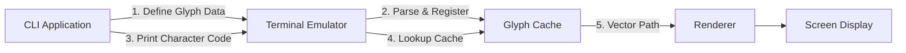

> **정정 (2026-09-23):** 이전 글의 `\e_G` 명령과 SVG 경로 전송 예시는 Glyph Protocol의 실제 명세가 아니며 실행도 불가능했습니다. 해당 예시를 제거하고 공식 명세의 APC 메시지 형식과 `glyf` 페이로드 요구사항으로 바로잡았습니다.

## 서론

새로운 서버에 접속하거나 동료의 개발 환경을 구축할 때마다 마주하는 가장 성가신 문제 중 하나는 바로 '깨진 폰트'입니다. 현대적인 CLI(Command Line Interface) 도구들은 파일 시스템 탐색기(lsd, exa), 상태 라인(starship), 그리고 텍스트 에디터(Neovim) 등에서 풍부한 정보를 전달하기 위해 아이콘을 적극 활용합니다. 하지만 이 아이콘이 제대로 표시되기 위해서는 사용자가 'Nerd Font'나 'Powerline' 같이 패치된 거대한 폰트 파일을 시스템에 설치해야 합니다.

로컬 터미널에 해당 글리프를 표시할 폰트가 없다면 원격 서버의 폰트 설치만으로 해결되지 않습니다. 출력은 SSH를 통해 전달되더라도 실제 글자를 렌더링하는 것은 사용자의 터미널이기 때문입니다.

이 문제의 근본적인 원인은 터미널이 애플리케이션에게 "이 코드포인트는 이 모양이야"라고 정의할 수 있는 권한을 주지 않고, 오래된 정적 폰트 시스템에만 의존하기 때문입니다. **Glyph Protocol**은 바로 이 고질적인 문제를 해결하기 위해 등장했습니다. 이 프로토콜은 애플리케이션이 런타임에 벡터 글리프(Glyph) 데이터를 터미널 에뮬레이터로 직접 전송하여 동적으로 등록하고 렌더링할 수 있게 함으로써, 별도의 폰트 설치 없이도 터미널 환경에서 그래픽 요소를 자유롭게 사용할 수 있는 혁신적인 패러다임을 제안합니다.

## 본론

### 기술적 배경: 정적 폰트의 한계와 동적 프로토콜의 필요성

기존 터미널 환경에서 그래픽 요소를 표현하는 방식은 전통적이었습니다. 터미널은 시스템에 설치된 글꼴 테이블을 참조하여, 애플리케이션이 보낸 유니코드 코드포인트(예: `U+E0A0`)를 시각적 문자로 매핑합니다. 여기서 Nerd Font는 유니코드의 '사용자 정의 영역(Private Use Area)'을 활용하여 수천 개의 아이콘을 강제로 심어놓은 거대한 폰트 파일입니다.

이 방식의 구조적 결함은 명확합니다. 첫째, **의존성(Dependency)**입니다. 애플리케이션이 예쁜 아이콘을 보여주고 싶다면, 사용자의 OS에 반드시 특정 폰트가 설치되어 있어야 합니다. 둘째, **확장성(Scalability)** 부재입니다. 폰트 파일 크기는 한정되어 있어 무한정 아이콘을 추가할 수 없으며, 새로운 디자인을 적용하려면 폰트 자체를 재배포해야 합니다.

Glyph Protocol은 애플리케이션이 PUA(Unicode Private Use Area) 코드포인트를 선택하고 OpenType `glyf` 아웃라인을 base64로 인코딩해 터미널로 전송하는 방식을 정의합니다. 이를 지원하는 터미널은 등록된 글리프를 현재 세션에서 렌더링할 수 있습니다. SVG 경로 문자열을 그대로 터미널에 보내는 프로토콜은 아닙니다.

### 작동 원리 및 데이터 흐름

Glyph Protocol의 핵심은 터미널 에뮬레이터와 CLI 애플리케이션 간의 새로운 핸드셰이크(Handshake)입니다. 기존의 텍스트 출력 스트림에 제어 시퀀스(ANSI Escape Sequence)를 섞어 글리프를 정의하고 호출합니다.

다음은 애플리케이션이 커스텀 아이콘을 정의하고 화면에 출력하는 과정을 보여주는 데이터 흐름도입니다.



1. **등록(Define)**: 애플리케이션은 APC 시퀀스로 PUA 코드포인트와 base64로 인코딩한 `glyf` 데이터를 터미널에 전송합니다.
2. **파싱 및 캐싱(Parse & Cache)**: 터미널은 동일한 출력 스트림에 실린 APC 제어 시퀀스를 해석해 현재 세션의 글리프 등록 목록에 저장합니다.
3. **호출(Print)**: 애플리케이션은 등록한 PUA 코드포인트에 해당하는 유니코드 문자를 일반 텍스트처럼 출력합니다.
4. **렌더링(Render)**: 지원 터미널은 해당 코드포인트를 만나면 등록된 아웃라인을 조회해 화면에 그립니다.

### 프로토콜 메시지 구조 (개념)

이전 글의 Python 코드는 실제 프로토콜 식별자·페이로드·종료 시퀀스가 모두 잘못돼 있었습니다. 공식 명세는 APC(Application Program Command)를 사용하며, 메시지 본문은 `25a1`로 시작합니다.

```text
ESC _ 25a1 ; s ESC \
ESC _ 25a1 ; r ; cp=<PUA 코드포인트> ; fmt=glyf ; <base64 glyf 데이터> ESC \
```

위 표기는 **와이어 형식 설명**이지 그대로 실행할 수 있는 명령이 아닙니다. `r` 등록에는 실제로 인코딩한 OpenType 단순 글리프 데이터가 필요하고, 대상 코드포인트는 PUA에 속해야 합니다. 먼저 `s` 응답으로 터미널의 지원 형식을 확인하세요. 구현과 응답 처리는 공식 [Glyph Protocol 명세](https://github.com/raphamorim/rio/blob/main/specs/glyph-protocol.md)를 기준으로 해야 합니다.

### 기존 방식(Nerd Font)과 Glyph Protocol 비교

이 두 접근 방식의 차이는 기술적 구현뿐만 아니라 사용자 경험과 유지보수 측면에서도 극명합니다.

| 비교 항목 | Nerd Font (기존 방식) | Glyph Protocol (제안 방식) |
| :--- | :--- | :--- |
| **설치 요구사항** | 사용자 터미널에 해당 글리프를 포함한 폰트 설치 필요 | 프로토콜을 구현한 터미널이라면 애플리케이션이 세션에 글리프를 등록 가능 |

---

**원문**: [Rio 터미널 Glyph Protocol 공식 명세](https://github.com/raphamorim/rio/blob/main/specs/glyph-protocol.md). 초기 소개를 요약한 [Hada.io 게시글](https://news.hada.io/topic?id=28934)은 보조 자료입니다. 터미널별 지원 여부와 메시지 형식은 공식 명세와 해당 구현을 다시 확인하세요.