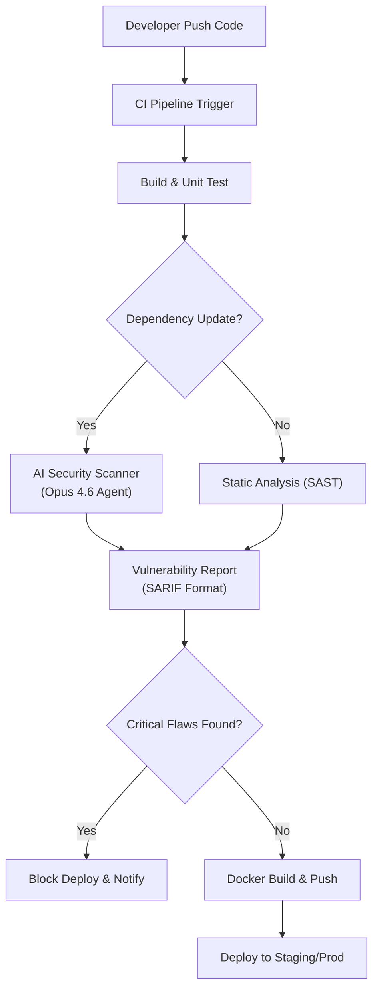

# CI/CD에 AI 보안 통합하기

Opus 4.6와 같은 최신 AI 모델을 CI/CD 파이프라인의 보안 단계에 통합하여, 기존 SCA 도구가 놓치는 오픈소스 코드의 제로데이 취약점을 자동으로 탐지하고 수정하는 방법을 다룹니다. 이를 통해 개발 속도를 저하시키지 않으면서도 프로덕션 환경의 잠재적 보안 리스크를 획기적으로 줄일 수 있습니다.

## 문제 상황: 보안과 속도의 딜레마

현대의 DevOps 환경에서 애플리케이션 개발은 수많은 오픈소스 라이브러리에 의존하고 있습니다. 기존의 SCA(Software Composition Analysis) 도구는 주로 CVE 데이터베이스에 이미 등록된 알려진 취약점을 탐지하는 데 집중합니다. 그러나 Axios의 최신 기사에서 언급된 것처럼, 오픈소스 저장소에는 여전히 수백 개의 제로데이(Zero-day) 결함이 존재할 수 있습니다.
기존 방식의 가장 큰 한계는 **"알려지지 않은 알려지지 않은 것(Unknown Unknowns)"**을 탐지할 수 없다는 점입니다. 정적 분석 도구(SAST)는 패턴 매칭에 의존하므로, 복잡한 로직 속에 숨어 있는 논리적 보안 허점을 찾아내지 못합니다. 또한, 수동으로 코드 리뷰를 통해 이러한 보안 이슈를 찾는 것은 현실적으로 불가능에 가깝습니다. 결과적으로 DevOps 팀은 "빠른 배포"와 "안전한 배포" 사이에서 끊임없는 갈등을 겪으며, 결국 보안 리스크를 안고 배포하거나 배포 속도를 희생해야 하는 딜레마에 빠지게 됩니다.

## 해결 방안: AI 기반 지능형 보안 스캐너 통합

이 문제를 해결하기 위해 **"AI-Native Security Gate"**를 CI/CD 파이프라인에 도입하는 아키텍처를 제안합니다. 이 아키텍처의 핵심은 단순한 패턴 매칭을 넘어, 코드를 이해하고 추론할 수 있는 고성능 AI 모델(예: Opus 4.6 수준의 추론 능력)을 빌드 프로세스 중간 단계에 배치하는 것입니다.
이 솔루션은 개발자가 코드를 푸시할 때, AI 에이전트가 변경된 코드와 종속성을 실시간으로 분석하여 잠재적인 보안 허점(예: SQL Injection, 권한 상승, 미사용된 민감 데이터 노출 등)을 찾아냅니다. 특히 오픈소스 라이브러리 내부의 소스 코드를 직접 분석하여, 아직 CVE로 등록되지 않은 논리적 결함을 사전에 예방할 수 있습니다.

### 아키텍처 다이어그램

다음은 제안하는 CI/CD 파이프라인에 AI 보안 검사 단계를 통합한 흐름도입니다.


### 사용 도구 및 기술

- **CI Platform**: GitHub Actions (혹은 GitLab CI)
- **AI Model**: 고성능 LLM API (코드 분석 특화)
- **Output Format**: SARIF (Static Analysis Results Interchange Format)
- **Container**: Docker for isolated scan environment

## 구현 가이드: GitHub Actions에 AI 스캐너 적용하기

실제 프로덕션 환경에서 GitHub Actions 워크플로우에 AI 기반 보안 검사 단계를 구축하는 방법을 단계별로 설명합니다. 여기서는 AI가 분석한 결과를 GitHub의 Security Tab에 자동으로 등록하여 시각화하는 과정을 포함합니다.

### 1. 스캐너 스크립트 작성 (`scan.py`)

먼저, 분석할 코드를 AI 모델에 전달하고 결과를 SARIF 형식으로 변환하는 Python 스크립트를 작성합니다. (실제 환경에서는 AI API 호출 로직이 포함되어야 합니다.)
```python
import json
import sys

# 간단한 SARIF 템플릿 생성 (실제로는 AI 응답을 파싱하여 결과를 채움)

def generate_sarif(results):
    sarif = {
        "version": "2.1.0",
        "$schema": "https://json.schemastore.org/sarif-2.1.0.json",
        "runs": [
            {
                "tool": {
                    "driver": {
                        "name": "AI-Security-Scanner",
                        "version": "1.0.0",
                        "informationUri": "https://example.com/ai-scanner"
                    }
                },
                "results": results
            }
        ]
    }
    return sarif
if __name__ == "__main__":
    # 예제: AI가 발견한 취약점 (시뮬레이션)
    ai_findings = [
        {
            "ruleId": "AI001",
            "level": "error",
            "message": {
                "text": "Potential SQL Injection vulnerability in user_input handling."
            },
            "locations": [
                {
                    "physicalLocation": {
                        "artifactLocation": {"uri": "src/auth/login.py"},
                        "region": {"startLine": 42}
                    }
                }
            ]
        }
    ]
    with open("ai-scan-results.sarif", "w") as f:
        json.dump(generate_sarif(ai_findings), f)
    print("AI Scan complete. Results saved to ai-scan-results.sarif")
```

### 2. GitHub Actions 워크플로우 구성 (`.github/workflows/security-scan.yml`)

다음은 파이썬 스크립트를 실행하고, 그 결과를 GitHub Security에 업로드하는 YAML 설정입니다.
```yaml
name: AI Security Scan
on:
  push:
    branches: [ "main", "develop" ]
  pull_request:
    branches: [ "main" ]
jobs:
  ai-security-scan:
    runs-on: ubuntu-latest
    permissions:
      contents: read
      security-events: write # Security Tab에 쓰기 권한 필요
    steps:
    - name: Checkout code
      uses: actions/checkout@v4
    - name: Set up Python
      uses: actions/setup-python@v5
      with:
        python-version: '3.11'
    - name: Install dependencies
      run: |
        python -m pip install --upgrade pip
        # AI 모델 호출을 위한 라이브러리 설치 (예: anthropic, openai 등)
        pip install anthropic
    - name: Run AI Vulnerability Scanner
      env:
        ANTHROPIC_API_KEY: ${{ secrets.ANTHROPIC_API_KEY }}
      run: |
        # 실제 환경에서는 Diff 파일이나 종속성 목록을 AI에 전달
        python scripts/scan.py
    - name: Upload SARIF file to GitHub
      uses: github/codeql-action/upload-sarif@v3
      with:
        sarif_file: ai-scan-results.sarif
        category: ai-scan
```

### 3. 실행 및 확인

위 설정을 저장하고 리포지토리에 푸시하면, GitHub Actions가 `ai-security-scan` 작업을 실행합니다. 완료되면 리포지토리의 **Security > Code scanning alerts** 탭에서 AI가 발견한 취약점을 확인할 수 있습니다.

## 베스트 프랙티스: 프로덕션 환경 고려사항

실제 운영 환경에 적용할 때 다음 사항들을 반드시 고려해야 합니다.
1.  **거짓 양성(False Positives) 관리**: AI 모델이 아무리 똑똑해도 코드의 컨텍스트를 100% 이해하지 못해 오류를 보고할 수 있습니다. 초기에는 "Soft Fail" 모드(리포트만 남기고 빌드는 막지 않음)로 운영하여 AI의 패턴을 파악하고, 점차 신뢰도가 높아지면 "Hard Fail" 모드로 전환하여 배포를 차단해야 합니다.
2.  **컨텍스트 윈도우 최적화**: 전체 레포지토리를 매번 스캔하면 비용이 많이 듭니다. `git diff` 명령어를 통해 변경된 파일만 추출하거나, 의존성 파일(`package.json`, `go.mod`)이 변경되었을 때만 심층 스캔을 수행하도록 트리거를 조정하세요.
3.  **비용 제어 및 캐싱**: AI API 호출은 비용이 발생합니다. 동일한 라이브러리 분석 결과는 캐싱하여 중복 호출을 방지하고, 사용량 제한(Rate Limit)을 설정하여 예기치 않은 비용 폭증을 막아야 합니다.
4.  **민감 정보 보호**: 소스 코드를 외부 API로 전송하기 때문에, API 키나 비밀번호와 같은 민감 정보가 포함되지 않도록 사전에 필터링(Pre-sanitization) 과정을 거쳐야 합니다.

## 트러블슈팅: 자주 발생하는 이슈 및 해결

-   **이슈 1: AI 스캔 단계에서 시간 초과(Timeout) 발생**
    *   *원인*: 분석 대상 코드 양이 너무 많아 AI 추론 시간이 길어짐.
    *   *해결*: GitHub Actions의 `timeout-minutes` 설정을 늘리거나, 스캔 대상을 특정 디렉토리나 파일로 한정하도록 스크립트를 수정합니다.
-   **이슈 2: SARIF 파일 업로드 시 "Resource not accessible" 에러**
    *   *원인*: 워크플로우에 `security-events: write` 권한이 부여되지 않음.
    *   *해결*: 워크플로우 YAML 파일의 `permissions` 섹션에 보안 쓰기 권한을 명시적으로 추가합니다.
-   **이슈 3: 너무 많은 경고로 인한 알림 피로(Alert Fatigue)**
    *   *원인*: 심각도(Severity) 구분 없이 모든 결과를 알림으로 보냄.
    *   *해결*: SARIF 결과에서 `level: error`인 경우에만 즉시 알림(Slack/Email)을 보내고, `warning`은 주간 리포트로 묶어서 전송하는 방식으로 알림 전략을 수정합니다.

## 참고자료

- [Anthropic Claude Opus 4.6 소개 (Axios)](https://www.axios.com/2026/02/05/anthropic-claude-opus-46-software-hunting)
- [GitHub Security - SARIF 지원](https://docs.github.com/en/code-security/code-scanning/integrating-with-code-scanning/sarif-support-for-code-scanning)
- [OWASP Top 10](https://owasp.org/www-project-top-ten/)
---
