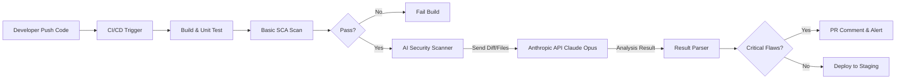

# Claude Opus 4.6 Finds 500+ High-Severity Flaws Across Major Open-Source Libraries - The Hacker News

최근 Claude Opus 4.6이 주요 오픈소스 라이브러리에서 500개 이상의 고위험 취약점을 발견한 사례는 기존 보안 도구의 한계를 보여줍니다. 이 글에서는 CI/CD 파이프라인에 AI 기반 정적 분석을 통합하여, 기존 스캐너가 놓치는 논리적 결함을 조기에 탐지하는 자동화 솔루션을 소개합니다. Anthropic API와 GitHub Actions를 활용한 실제 구현 코드와 프로덕션 환경에서의 운영 팁을 제공합니다.

## 문제 상황 (Problem)

최근 The Hacker News에서 보도된 바와 같이, Claude Opus 4.6은 수많은 주요 오픈소스 라이브러리에서 500개 이상의 심각한 보안 결함을 찾아냈습니다. 이는 우리가 믿고 사용하는 `npm`, `PyPI`, `Maven` 등의 생태계가 생각보다 취약할 수 있음을 시사합니다.
전통적인 DevOps 환경에서 우리는 Snyk, Trivy, SonarQube 같은 SAST(Static Application Security Testing) 및 SCA(Software Composition Analysis) 도구를 의존해 왔습니다. 하지만 이러한 도구들은 주로 알려진 CVE(Common Vulnerabilities and Exposures) 데이터베이스와 패턴 매칭에 의존합니다. 이는 "알려진" 위협에는 탁월하지만, 아직 보고되지 않은 제로데이 취약점이나 복잡한 비즈니스 로직 속에 숨어 있는 논리적 보안 허점(Logic Flaw)을 놓치기 십상입니다. 결국 코드가 프로덕션에 배포된 후에야 이러한 치명적인 버그를 발견하게 되어, 긴급 핫픽스와 서비스 중단을 강요받는 악순환이 반복됩니다.

## 해결 방안 (Solution)

이 문제를 해결하기 위해 CI/CD 파이프라인에 **LLM 기반의 심층 코드 분석(Augmented SAST)** 단계를 도입하는 아키텍처를 제안합니다. 단순히 패턴을 찾는 것을 넘어, 코드의 "맥락"과 "의도"를 이해하는 Claude와 같은 최신 AI 모델을 활용하여 인수 테스트 수준의 정적 분석을 자동화하는 것입니다.
제안하는 아키텍처는 개발자가 Pull Request를 생성하거나 코드를 Push할 때 트리거됩니다. 기존의 Linter 및 기본 SCA 도구가 통과된 후, 변경된 코드의 Diff나 주요 의존성 파일이 Anthropic API(Claude Opus 4.6)로 전송됩니다. AI는 해당 코드를 분석하여 잠재적인 보안 위협을 식별하고, 그 결과를 GitHub PR Comment나 CI Log의 형태로 즉시 피드백합니다. 이를 통해 "Shift Left" 전략을 실현하고, 배포 직전에 발생할 수 있는 보안 리스크를 개발 단계에서 미리 제거할 수 있습니다.

사용하는 주요 도구는 다음과 같습니다:
- **CI/CD**: GitHub Actions (또는 GitLab CI, Jenkins)
- **AI Model**: Anthropic Claude API (Opus 4.6)
- **Language**: Python 3.9+ (API 요청 스크립트용)
- **Container**: Docker (스캐너 실행 환경 격리)

## 구현 가이드 (Implementation)

이제 GitHub Actions를 사용하여 실제로 파이프라인에 AI 보안 스캔을 통합하는 방법을 단계별로 알아보겠습니다.

### 1. 사전 준비

먼저 Anthropic Console에서 API Key를 발급받아 GitHub Repository의 Settings > Secrets and variables > Actions에 `ANTHROPIC_API_KEY` 이름으로 등록해야 합니다.

### 2. 스캐너 스크립트 작성 (scanner.py)

아래는 변경된 파일들을 읽어 Claude에게 보안 분석을 요청하고 결과를 받아오는 간단한 Python 스크립트입니다.
import os
import sys
import anthropic
import json
```python
client = anthropic.Anthropic(api_key=os.environ.get("ANTHROPIC_API_KEY"))
def scan_code(file_path, content):
    prompt = f"""
    Analyze the following code for potential security vulnerabilities.
    Focus on SQL Injection, XSS, Dependency Issues, and Logic Flaws.
    If a flaw is found, provide the severity (High/Medium/Low) and a fix suggestion.
    File: {file_path}
    Code:
    {content}
    """
    try:
        message = client.messages.create(
            model="claude-3-opus-20240229",
            max_tokens=1024,
            messages=[
                {"role": "user", "content": prompt}
            ]
        )
        return message.content[0].text
    except Exception as e:
        return f"Error analyzing {file_path}: {str(e)}"
if __name__ == "__main__":
    # CI 환경에서 변경된 파일 리스트를 인자로 받거나 처리
    target_file = sys.argv[1] if len(sys.argv) > 1 else "src/main.py"
    if not os.path.exists(target_file):
        print(f"File {target_file} not found.")
        sys.exit(0)
    with open(target_file, 'r') as f:
        code_content = f.read()
    result = scan_code(target_file, code_content)
    print(f"Security Report for {target_file}:")
    print(result)
    # 심각한 취약점이 발견되면 비정상 종료 (예시)
    if "High Severity" in result:
        sys.exit(1)
```

### 3. GitHub Actions 워크플로우 구성 (.github/workflows/ai-security.yml)

이 워크플로우는 Pull Request 생성 시 자동으로 실행되며, AI 스캐너를 Docker 컨테이너 내에서 실행하여 환경을 격리합니다.
```yaml
name: AI Security Scan
on:
  pull_request:
    branches: [ "main", "develop" ]
  workflow_dispatch:
jobs:
  security-scan:
    runs-on: ubuntu-latest
    steps:
      - name: Checkout code
        uses: actions/checkout@v4
        with:
          fetch-depth: 0
      - name: Set up Python
        uses: actions/setup-python@v5
        with:
          python-version: '3.10'
      - name: Install dependencies
        run: |
          python -m pip install --upgrade pip
          pip install anthropic
      - name: Run AI Security Scanner
        env:
          ANTHROPIC_API_KEY: ${{ secrets.ANTHROPIC_API_KEY }}
        run: |
          # 변경된 파일 리스트를 가져와서 반복 (예시: src 디렉토리 내 py 파일만 스캔)
          CHANGED_FILES=$(git diff --name-only ${{ github.event.before }} ${{ github.sha }} | grep '\.py$' || true)
          if [ -z "$CHANGED_FILES" ]; then
            echo "No Python files changed to scan."
          else
            for file in $CHANGED_FILES; do
              if [ -f "$file" ]; then
                echo "Scanning $file..."
                python scanner.py "$file" >> security_report.txt
              fi
            done
          fi
      - name: Upload Security Report
        if: always()
        uses: actions/upload-artifact@v4
        with:
          name: security-scan-report
          path: security_report.txt
      - name: Comment PR with results
        if: github.event_name == 'pull_request'
        uses: actions/github-script@v7
        with:
          script: |
            const fs = require('fs');
            const report = fs.readFileSync('security_report.txt', 'utf8');
            github.rest.issues.createComment({
              issue_number: context.issue.number,
              owner: context.repo.owner,
              repo: context.repo.repo,
              body: `### 🤖 AI Security Scanner Report\n\n${report}`
            });
```

### 4. 실행

이제 개발자가 PR을 생성하면, AI가 코드를 분석하고 PR 댓글로 보안 리포트를 자동으로 남깁니다.

## 베스트 프랙티스 (Best Practices)

프로덕션 환경에 이 솔루션을 적용할 때 고려해야 할 핵심 사항들입니다.
**1. 비용 최적화 (Token Management)**
LLM API 호출은 비용이 발생합니다. 모든 코드를 매번 전체 스캔하는 것은 비효율적입니다. `git diff` 명령어를 사용하여 변경된 라인(Diff)만 추출하여 스캔하거나, 보안에 민감한 디렉토리(예: `src/auth`, `src/payment`)만 타겟팅하세요. 또한, 모델 선택 시 비용과 성능의 균형을 고려하여 복잡한 로직은 Opus, 단순한 문법 체크는 Haiku 모델을 사용하는 전략도 유효합니다.
**2. 개인정보 보호 및 데이터 필터링**
절대로 API Key, 비밀번호, 개인정보(PII)가 포함된 코드를 외부 API로 전송해서는 안 됩니다. 스크립트 실행 전 `grep` 등을 통해 민감 키워드가 포함된 라인을 마스킹(Masking)하거나 제거하는 전처리 과정이 반드시 필요합니다. 규제가 엄격한 환경이라면 Self-hosted LLM(Llama 3 등)을 내부 Kubernetes 클러스터에 구축하여 사용하는 것이 안전합니다.
**3. Hallucination(환각) 방지 및 Cross-Check**
AI는 가짜 정보를 사실인 것처럼 제시할 수 있습니다. AI의 보고서를 맹신하기보다, 기존의 Snyk이나 Trivy 결과와 교차 검증하는 Cross-Check 메커니즘을 두세요. AI가 "취약점이다"라고 하더라도, 실제로는 유효하지 않은 경우(False Positive)가 많을 수 있으므로, 초기에는 "Manual Review" 대상으로 분류하고 점진적으로 자동화 레벨을 높이는 것이 좋습니다.

## 트러블슈팅 (Troubleshooting)

자주 발생할 수 있는 이슈와 해결 방법입니다.
**이슈 1: API Rate Limit 초과**
*   **현상**: `anthropic.RateLimitError: Request rate limit exceeded` 에러 발생
*   **해결**: GitHub Actions가 동시에 여러 개 실행되거나 요청이 과다할 때 발생합니다. Python 스크립트에서 `tenacity` 라이브러리를 사용하여 Exponential Backoff(지수 백오프) 재시도 로직을 구현하세요.
**이슈 2: 과도한 False Positive로 인한 개발자 피로도**
*   **현상**: 사소한 스타일 이슈나 실제 위험이 없는 코드에 대해 "High Severity" 리포트가 계속 발생하여 PR이 막힘.
*   **해결**: 프롬프트 엔지니어링을 통해 심각도 판단 기준을 구체화하세요 (예: "Report only if it leads to RCE or data leak"). 또한, 특정 라인에 `# nosec` 주석을 달면 AI 스캐너가 해당 라인을 건너뛰도록 로직을 추가하여 개발자가 통제할 수 있게 합니다.
**이슈 3: Docker 컨테이너 내에서 파일 경로 찾기 실패**
*   **현상**: 로컬에서는 잘 되지만 Actions 내에서 `File not found` 에러 발생.
*   **해결**: GitHub Actions의 `working-directory` 옵션을 명시하거나, 스크립트 내에서 `os.getcwd()`를 출력하여 현재 경로를 확인하고 상대 경로를 정확히 맞춰야 합니다.

## 참고자료

- [Anthropic API Documentation](https://docs.anthropic.com/)
- [The Hacker News - Claude Opus 4.6 Finds 500+ High-Severity Flaws](https://thehackernews.com/2026/02/claude-opus-46-finds-500-high-severity.html)
- [GitHub Actions Security Hardening](https://securitylab.github.com/research/github-actions-preventing-pwn-requests/)
---
