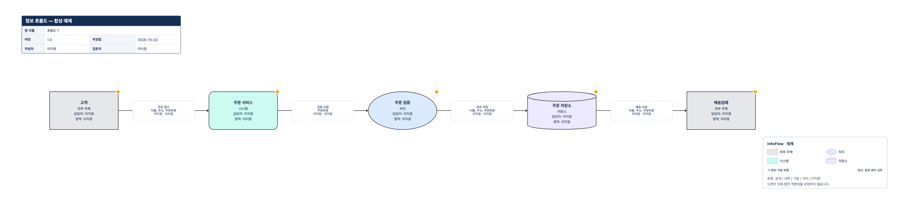

## 장비 연결도만으로 설명하기 어려운 질문

보안 검토 회의에서 필요한 그림이 항상 네트워크 구성도인 것은 아닙니다. 서버와 방화벽의 연결은 알고 있어도, 주문번호가 어떤 처리 과정을 거쳐 저장되고 외부 업체에는 어떤 항목이 전달되는지는 별도의 설명이 필요합니다. 선 하나에 “연동”이라고만 적으면 목적, 담당자, 정보 분류, 전송 보호조치를 다시 문서 곳곳에서 찾아야 합니다.

**InfoFlow는 구성 요소와 그 사이를 이동하는 정보를 구분해 기록하는 한국어 브라우저 편집기**입니다. 외부 주체·처리·시스템·저장소를 배치하고, 방향이 있는 흐름에 데이터 항목과 목적 등을 붙입니다. 완성된 그림뿐 아니라 검토에 필요한 속성을 함께 남기는 것이 핵심입니다.

[InfoFlow 실행하기](https://rebugui.github.io/infoflow/) · [소스 저장소](https://github.com/rebugui/infoflow)

업무 담당자와 인터뷰하며 정보 이동을 정리하거나, 시스템 연계 변경 전후를 비교하거나, 설명 자료와 상세 속성표를 함께 준비할 때 활용할 수 있습니다. 다만 실제 트래픽을 수집하거나 시스템 설정을 읽어 자동으로 도면을 만드는 도구는 아닙니다. **입력한 내용의 사실 여부와 보안상 적절성은 작성자가 확인해야 합니다.**

## NetGraph·InfoFlow·PrivacyFlow 중 무엇을 고를까

세 앱은 비슷한 편집 경험을 제공하지만 기록하는 대상이 다릅니다. 파일을 서로 바꾸어 여는 하나의 제품군이 아니라, 각각 독립된 저장소와 실행 앱입니다.

| 앱 | 중심 질문 | 주로 기록하는 대상 |
|---|---|---|
| NetGraph | 어떤 장비가 어떤 구간에서 연결되는가? | 장비, 세그먼트, 네트워크 연결 |
| InfoFlow | 어떤 정보가 어디에서 어디로 이동하는가? | 구성 요소와 방향별 정보 흐름 |
| PrivacyFlow | 개인정보가 어떤 처리 단계에 놓이는가? | 수집·이용·보관·제공·위탁·파기와 단계별 속성 |

IP나 네트워크 구간 중심의 그림이 필요하다면 [NetGraph의 네트워크 구성도 작성 방식](/netgraph-network-diagram-editor/)이 더 직접적입니다. 보유기간, 법적 근거, 위탁업무처럼 개인정보 처리 단계별 정보를 구분해야 한다면 [PrivacyFlow의 개인정보 처리 흐름도 안내](/privacyflow-personal-data-flow-editor/)를 참고할 수 있습니다.

InfoFlow에도 이름·주소 같은 **항목명**을 적을 수 있지만, 개인정보 전용 단계나 법적 판단 기능이 생기는 것은 아닙니다. 반대로 주문 상태, 정산 결과, 재고 정보처럼 개인정보에 한정되지 않는 업무 정보도 같은 모델로 표현할 수 있습니다.

## 네 가지 구성 요소와 흐름은 서로 다른 데이터다

왼쪽 패널에는 **구성 요소**와 **정보 흐름** 탭이 있습니다. 구성 요소는 정보를 보내거나 받고, 처리하거나 보관하는 지점입니다. 흐름은 두 지점 사이에서 무엇이 어떤 방향으로 이동하는지를 설명합니다.

| 구성 요소 종류 | 내부 값 | 도형·색 | 표현 예시 |
|---|---|---|---|
| 외부 주체 | `external` | 회색 사각형 | 고객, 외부 협력사 |
| 처리 | `process` | 파란색 타원 | 주문 검증, 집계 처리 |
| 시스템 | `system` | 청록색 둥근 사각형 | 주문 서비스, 업무 시스템 |
| 저장소 | `store` | 보라색 원통형 | 주문 저장소, 결과 보관소 |

종류는 이름에서 추정하지 않고 사용자가 선택합니다. 예를 들어 이름에 “DB”가 있어도 종류가 자동으로 저장소로 바뀌지 않습니다. 색뿐 아니라 종류 이름과 도형으로도 의미를 구분합니다.

구성 요소의 속성은 이름, 종류, 담당자, 보안영역, 설명입니다. 새 구성 요소 폼에서는 이름과 종류가 필수이고, 담당자와 보안영역은 비워 둘 수 있습니다. 담당자는 계정이나 권한 객체가 아닌 **자유 텍스트**입니다. 조직 내 역할명이나 합성 팀명으로 적어도 되며, 앱이 담당자에게 알림을 보내지는 않습니다.

보안영역 역시 문자열입니다. “외부”, “서비스 영역”, “저장 영역”이라고 적는다고 영역 상자나 네트워크 경계가 만들어지지 않습니다. 모든 노드는 독립적인 절대좌표를 가지며, 영역에 소속된 자식 노드로 이동하는 구조가 아닙니다. 같은 의미를 가진 영역명을 제각각 쓰면 문자열 비교 결과도 달라지므로, 작성 전에 용어를 정해 두는 편이 좋습니다.

흐름에는 출발·도착 구성 요소, 흐름명, 데이터 항목, 목적, 분류, 전송방식, 주기, 보호조치, 보호조치 설명, 메모가 들어갑니다. **담당자와 영역은 노드에, 분류와 전송 보호조치는 흐름에 기록한다**는 구분을 기억하면 편집이 쉬워집니다.

## ‘미지정’은 ‘문제없음’도 ‘없음’도 아니다

정보 분류는 `미지정 / 공개 / 내부 / 기밀 / 극비`, 보호조치는 `미지정 / 없음 / TLS / VPN / 기타` 중에서 선택합니다. 새 흐름의 분류와 보호조치는 모두 `unknown`, 즉 **미지정**으로 시작합니다. 기본값을 보안 설정이 확인된 상태처럼 보이게 만들지 않는 선택입니다.

보호조치에서 “없음”은 사용자가 보호조치가 없다고 기록한 값입니다. “미지정”은 아직 확인하거나 입력하지 않은 값입니다. 둘을 구별해야 검토자가 추가 확인이 필요한 지점과 실제로 보호되지 않는다고 기록된 지점을 나누어 볼 수 있습니다.

전송방식과 주기는 자유 텍스트입니다. “HTTPS API”를 적어도 TLS가 자동 선택되지는 않으며, TLS를 선택해도 실제 인증서나 암호화 구성이 검사되지는 않습니다. 정보 분류 역시 조직의 분류 기준을 대신하지 않습니다. 근거가 없는 값을 채워 경고만 없애기보다는, 확인 전에는 미지정으로 남기고 메모에 확인 대상을 적는 것이 낫습니다.

데이터 항목은 줄바꿈 또는 쉼표로 나누어 입력합니다. 앞뒤 공백과 빈 항목은 정리됩니다. 도면의 흐름 라벨에는 흐름명, **앞의 세 데이터 항목**, 분류, 전송방식이 표시됩니다. 네 번째 이후 항목과 목적·주기·상세 메모가 그림에 보이지 않는다고 삭제된 것은 아닙니다. 전체 내용은 선택 속성이나 JSON·PPTX 상세 출력에서 확인해야 합니다.

## 기본 합성 예제로 주문 정보 이동을 따라가기

처음 시작할 때 **기본 합성 예제**를 선택하면 구성 요소 5개와 방향 흐름 4개가 만들어집니다. 문서명은 `정보 흐름도 — 합성 예제`, 첫 장은 `흐름도 1`입니다. 실제 기본 연결은 다음과 같습니다.

| 출발 → 도착 | 흐름명 | 초기 데이터 항목 |
|---|---|---|
| 고객 → 주문 서비스 | 주문 접수 | 이름, 주소, 주문번호 |
| 주문 서비스 → 주문 검증 | 검증 요청 | 주문번호 |
| 주문 검증 → 주문 저장소 | 주문 저장 | 이름, 주소, 주문번호 |
| 주문 저장소 → 배송업체 | 배송 요청 | 이름, 주소, 주문번호 |



*기본 합성 예제의 연결과 속성은 그대로 두고, 흐름명과 화살표를 구분하기 쉽도록 구성 요소 사이의 간격을 수동으로 넓혀 내보냈습니다. 실제 고객 정보, 운영 인프라 또는 권장 연계 구조를 나타내지 않습니다.*

노드 설명과 흐름 메모에는 `합성 예시 — 실제 운영 설정이 아닙니다`가 들어 있습니다. 이름·주소도 개인의 실제 값이 아니라 필드 이름입니다. 특히 저장소에서 배송업체로 이어지는 마지막 화살표는 편집 방식을 보여 주기 위한 예제이지, 실제 데이터베이스가 외부 업체와 직접 연계되어야 한다는 설계 권고가 아닙니다.

### 구성 요소의 책임과 영역을 적는다

캔버스나 왼쪽 목록에서 **주문 서비스**를 선택합니다. 오른쪽 **선택 속성**에서 담당자를 `예시 주문운영팀`, 보안영역을 `예시 서비스 영역`으로 적고 **변경 적용**을 누릅니다. 주문 저장소에는 `예시 저장 영역`처럼 다른 이름을 사용할 수 있습니다. 이 값들은 연습용이며 실제 조직 구조를 추정한 것이 아닙니다.

노드를 새로 만들 때는 팔레트의 종류를 클릭하거나 캔버스로 드래그합니다. 왼쪽 **새 구성 요소** 폼에서 이름과 종류를 정하고 **구성 요소 추가**를 눌러도 됩니다. 클릭 추가는 종류명과 번호가 붙은 노드로 시작하므로, 선택 속성에서 업무 의미가 드러나는 이름으로 바꿉니다.

### 정보 흐름의 상세 내용을 적는다

왼쪽 **정보 흐름** 탭에서 **주문 접수**를 고릅니다. 목적에는 `합성 주문 접수 검토`, 주기에는 `예시: 요청 시`처럼 연습용 문구를 입력할 수 있습니다. 분류와 보호조치는 아직 확인하지 않았다면 그대로 미지정으로 둡니다. 변경 후에는 반드시 **변경 적용**을 눌러 저장 상태에 반영합니다.

같은 방식으로 **검증 요청**을 선택하면 초기 항목이 주문번호 하나라는 점을 확인할 수 있습니다. 검토 회의에서는 이 차이를 출발점으로 “검증에 이름이나 주소까지 필요한가?”를 질문할 수 있습니다. 앱이 최소 수집 여부를 판단하는 것은 아니지만, 흐름별 항목을 구분해 적으면 검토할 질문이 구체화됩니다.

### 경고를 통해 빠진 기록을 찾는다

기본 예제는 담당자·분류·보호조치 등을 확정하지 않았으므로 검토 경고가 나오는 것이 자연스럽습니다. 오른쪽 **검토 필요사항**에서 항목을 누르면 관련 노드나 흐름으로 이동합니다. 예제를 완성된 보안 설계로 오해하지 않고, 어떤 정보가 비어 있는지 살펴보는 과정으로 사용하면 됩니다.

### 수정 전후를 구분하고 백업한다

탭의 **복제**로 원본 예제를 남겨 두고, 복제 장에서 필드를 채워 비교할 수 있습니다. 이후 **내보내기 ▾ → JSON 백업 저장 (전체 원본)**으로 저장합니다. 재현 가능한 예제가 필요하면 저장소의 [information-flow-demo.json](https://github.com/rebugui/infoflow/blob/main/examples/information-flow-demo.json)을 내려받아 **JSON 불러오기**로 열 수도 있습니다.

## 방향, 연결점, 병렬 흐름과 자동 배치

흐름은 항상 `출발 → 도착`입니다. 노드의 위·아래·왼쪽·오른쪽 연결점을 드래그하면 시작점에서 종료점으로 향하는 초안 흐름이 생성됩니다. 이름 없는 초안은 오른쪽에서 속성을 채울 수 있습니다. 반면 폼의 **정보 흐름 추가**는 출발, 도착, 흐름명을 입력해야 합니다.

연결점은 TCP·UDP 포트가 아니라 **도형의 접속 위치**입니다. 연결점 정보가 없는 흐름은 기본적으로 출발 노드 오른쪽과 도착 노드 왼쪽을 사용합니다. 폼에서 끝점 노드를 바꾸면 바뀐 쪽 연결점은 초기화됩니다.

같은 두 노드 사이에 서로 다른 흐름을 여러 개 만들 수 있고, 역방향 흐름과 자기 자신으로 돌아오는 흐름도 허용합니다. 예를 들어 요청과 결과 회신은 독립된 두 흐름으로 기록합니다. 정방향 화살표 하나를 그렸다고 응답 정보까지 표현된 것은 아닙니다. 노드 이름을 수정해도 연결은 ID로 유지됩니다.

**자동 배치**는 방향 관계를 이용합니다. 서로 순환하는 노드들을 강연결요소(SCC)로 묶고, 묶음 사이의 선행 경로를 기준으로 열을 정합니다. 순환 내부 노드는 같은 열에 놓이며 같은 열에서는 기존 노드 배열 순서에 따라 위에서 아래로 배치됩니다. 그래서 순환이 있다고 배치가 끝나지 않는 방식은 아니지만, 모든 업무 흐름을 가장 보기 좋은 모양으로 바꾸는 것은 아닙니다.

자동 배치를 누르면 기존 수동 위치가 바뀐다는 확인창이 뜹니다. 노드를 추가할 때마다 전체를 다시 배치하지는 않습니다. 폼이나 팔레트 클릭으로 추가한 노드는 첫 열의 빈 위치를 찾고, 드래그 추가는 놓은 위치를 사용합니다.

기본 배치에서 노드 사이의 간격이 좁으면 흐름 라벨이 연결선이나 화살표를 가릴 수 있습니다. 이 글의 그림처럼 노드를 옆으로 옮겨 여유를 확보하고, 흐름 방향이 눈에 보이는지 확인한 뒤 내보내세요. 이후 자동 배치를 다시 실행하면 수동으로 조정한 간격도 바뀝니다.

화살표 경로도 한계가 있습니다. 직교 경로 계산에서 장애물로 고려하는 것은 **해당 흐름 양 끝 노드**입니다. 다른 노드, 제목 블록, 다른 선과 라벨까지 전역적으로 회피하거나 교차를 최소화하지 않습니다. 병렬·역방향·자기 흐름은 위쪽의 서로 다른 경로를 사용하지만, 주변 내용과 겹치면 수동 배치가 필요합니다. 끝점 노드가 겹치거나 경로를 구할 수 없을 때는 점선 경고 연결과 `끝점 노드 위치를 분리하세요` 안내가 나옵니다.

## 검토 경고가 알려 주는 것과 알려 주지 않는 것

InfoFlow의 규칙은 기록 누락과 일부 조합을 확인하는 보조 장치입니다. 모든 위험을 찾아내는 보안 분석기나 ISO 27001 적합성 판정기가 아닙니다.

| 조건 | 검토 내용 |
|---|---|
| 구성 요소의 이름 또는 담당자가 비어 있음 | 구성 요소 이름·담당자 미지정 |
| 흐름명 또는 데이터 항목이 비어 있음 | 정보 흐름명·데이터 항목 미지정 |
| 분류 또는 보호조치가 `unknown` | 정보 분류·전송 보호조치 미지정 |
| 양 끝 영역이 모두 입력되어 서로 다르고, 보호조치가 `none` | 영역 간 전송 보호조치 확인 필요 |
| 분류가 기밀·극비이고, 보호조치가 `none` | 중요 정보의 전송 보호조치 확인 필요 |

영역이 비어 있으면 영역 간 비교 조건은 성립하지 않습니다. 또한 목적·주기·전송방식·보호조치 설명이 비어 있다는 이유만으로 이 모든 항목의 경고가 생성되는 것은 아닙니다. 따라서 “경고 없음”을 “모든 속성이 충분히 작성됨”으로 해석해서도 안 됩니다.

경고가 없을 때 표시되는 문구는 **설정된 검토 규칙에서 누락을 찾지 못했습니다**입니다. TLS를 선택해 관련 경고가 사라져도 실제 TLS 적용, 적절한 인증, 접근권한, 계약상 전달 범위가 확인된 것은 아닙니다. 경고는 저장을 막지 않으므로, 미완성 작업도 JSON으로 백업하고 후속 검토를 이어갈 수 있습니다.

## 문서 정보, 여러 장, 변경이력과 실행 취소

상단 **문서 정보**에서 문서명, 버전, 작성일, 작성자, 검토자를 입력합니다. **이력 추가**로 버전·일자·작성자·변경 내용을 기록하고 **문서 정보 적용**으로 반영합니다. 이것은 작성자가 관리하는 문서 변경이력이지 모든 조작을 자동 수집하는 감사 로그가 아닙니다.

하나의 프로젝트에 여러 장을 둘 수 있습니다. 탭의 **이름**, **복제**, 삭제 버튼과 **흐름도 추가**를 사용하며 마지막 한 장은 삭제할 수 없습니다. 복제할 때는 노드와 흐름 ID, 흐름의 끝점 참조를 새로 만들어 원본 장과 독립적으로 편집합니다. 다만 문서 정보와 변경이력은 프로젝트 단위로 공유됩니다.

선택한 노드나 흐름은 **선택 항목 삭제** 또는 캔버스의 Delete로 지울 수 있습니다. 노드를 삭제하면 그 노드에 연결된 흐름도 제거됩니다. 여러 노드의 이동은 드래그가 끝날 때 함께 반영됩니다. 속성 폼은 **변경 적용** 방식이므로, 편집 중인 값을 반영하기 전에 다른 선택으로 이동하지 않도록 주의해야 합니다.

상단 **실행 취소 / 다시 실행**과 `Ctrl/Cmd+Z`, `Ctrl/Cmd+Y`, `Ctrl/Cmd+Shift+Z`를 지원합니다. 최근 100개 실행 취소 상태는 현재 세션에서 관리하며 새로고침 후까지 보존되는 장기 이력이 아닙니다. 입력창에 포커스가 있거나 모달이 열려 있을 때는 프로젝트 단축키가 개입하지 않습니다. 텍스트 수정 취소와 도면 작업 취소를 구분하기 위한 동작입니다.

## 배포용 그림과 편집 원본은 다른 파일이다

내보내기 형식은 용도에 맞추어 선택해야 합니다. 특히 “화면에 보이는 그림”과 “작성한 모든 상세 속성”은 같은 범위가 아닙니다.

| 형식 | 출력 범위 | 적합한 용도와 주의점 |
|---|---|---|
| JSON | 전체 프로젝트 | 앱에서 다시 여는 편집 원본. 모든 장·속성·좌표·문서 정보·변경이력 보존 |
| PPTX | 현재 장 또는 전체 장 | 편집 가능한 도형·텍스트·방향 선과 노드·흐름 상세 속성표 |
| PNG | 현재 장 | 흰 배경, 2배 픽셀 비율의 래스터 도면. 보고서 삽입용 |
| SVG | 현재 장 | `foreignObject` 기반 도면. 지원 뷰어가 필요하며 순수 벡터 도형만의 파일이 아님 |
| PDF | 전체 장 | A3 가로, 장당 한 페이지의 이미지 기반 도면 |

PPTX는 그림 한 장을 붙이는 방식이 아닙니다. 13.33×7.5인치 슬라이드에 네이티브 도형과 텍스트를 만들고, 꺾인 흐름은 선 구간들로 출력하며 마지막 구간에 화살표를 붙입니다. 다만 PowerPoint에서 개체를 옮겼을 때 앱처럼 경로를 자동 재계산하는 기능까지 전달되는 것은 아닙니다.

각 도면 뒤에는 **노드 속성**과 **흐름 속성** 표가 이어집니다. `참조 / 항목 / 값` 구조에 `N001`, `F001` 같은 짧은 참조번호를 사용하고, 전체 ID와 이름은 별도 값으로 남깁니다. 노드의 설명·좌표부터 흐름의 전체 데이터 항목·목적·주기·보호조치 설명·메모까지 포함합니다. 긴 값은 여러 행과 슬라이드로 나누며, 현재 장만 출력해도 프로젝트 변경이력은 뒤에 포함됩니다.

**PPTX는 상세 검토·후편집용이고, JSON은 InfoFlow 복원용**입니다. PPTX를 수정한 뒤 앱으로 역수입하는 기능은 없습니다. PNG·SVG·PDF에는 도면에 나타나지 않은 상세 속성 전체가 실리지 않으므로 원본 대체재로 삼으면 안 됩니다. 큰 도면은 출력 크기에 맞춰 축소되므로, 글자가 많다면 장을 나누고 배포 전 결과물을 확인하는 편이 좋습니다.

## 자동 저장, 백업 복원, 손상 데이터 대응

편집 상태는 브라우저 localStorage의 `infoflow-project-v1` 키에 자동 저장됩니다. 하지만 자동 저장은 외부 백업이 아닙니다. 브라우저 데이터 삭제나 프로필 변경에 대비해, 중요한 수정 전후에는 JSON을 별도로 보관해야 합니다.

**JSON 불러오기**는 파일을 파싱하고 구조를 검증한 다음 현재 프로젝트 교체 여부를 묻습니다. `app: "infoflow"`, `schema: 1`뿐 아니라 ID 중복, 좌표, 흐름 끝점, 활성 장 등을 확인합니다. 다른 앱의 백업은 `이 앱에서 만든 백업 파일이 아닙니다`로 거절됩니다. 형식이 틀렸다고 내용을 추측해 고치거나 NetGraph·PrivacyFlow 데이터로 자동 변환하지 않습니다. 지원하지 않는 임의 속성도 보존하는 범용 JSON 편집기는 아닙니다.

복원을 취소하거나 검증이 실패하면 현재 프로젝트는 바뀌지 않습니다. 복원에 성공한 뒤에는 같은 세션의 **실행 취소**로 이전 프로젝트로 돌아갈 수 있지만, 이것을 백업 대신 의존해서는 안 됩니다.

저장 실패는 두 경우를 구분하면 됩니다.

- **기존 저장 데이터가 손상되거나 지원되지 않는 경우:** 복구 화면에서 자동 덮어쓰기를 막습니다. 먼저 **원본 문자열 다운로드**로 보관하고, 교체해도 되는지 확인한 뒤 **새 프로젝트로 시작**을 누릅니다. 다운로드한 원본은 조사용 평문이며 정상 JSON 백업과 동일한 형식이라고 가정하면 안 됩니다. 앱이 손상을 자동 수선해 주는 기능은 아닙니다.
- **저장소 접근 거부나 용량 초과 등으로 저장에 실패한 경우:** `자동 저장 실패 — JSON 백업을 저장하세요` 배너가 표시됩니다. 현재 편집 상태는 메모리에 남지만 창을 닫으면 잃을 수 있으므로 먼저 JSON으로 내보내야 합니다. 이후 저장이 정상적으로 성공하면 실패 상태가 해제됩니다.

## 로컬 처리의 의미와 공개 사이트에서의 주의점

InfoFlow는 편집 데이터를 외부 API나 AI 서비스로 전송하지 않습니다. 그렇다고 “어디에 무엇을 적어도 안전하다”는 뜻은 아닙니다. 최초 앱 HTML·JavaScript·스타일 등 정적 자산을 가져오는 데는 네트워크가 필요하며, 설치형 PWA나 오프라인 캐시가 보장되는 제품으로 소개할 수는 없습니다.

로그인, 서버 동기화, 공동 편집, 암호화 저장은 제공하지 않습니다. **localStorage와 JSON은 평문**이고, 같은 브라우저 프로필의 동일 origin에서 실행되는 다른 스크립트가 저장소에 접근할 수 있습니다. `rebugui.github.io/infoflow/`와 다른 경로의 Pages 앱은 경로가 달라도 같은 origin을 공유합니다. 앱별 저장 키는 데이터 충돌을 줄이는 장치이지 접근통제 경계가 아닙니다.

공개 사이트에서는 실제 고객 값, 자격증명, 내부 기밀 구성이나 민감한 업무 세부정보를 입력하지 말고 합성 항목명과 예시를 사용하세요. 담당자·메모·보호조치 설명에도 민감한 내용이 들어갈 수 있습니다. JSON뿐 아니라 상세 속성을 포함하는 PPTX도 배포 전에 검토해야 합니다. 조직 자료를 다뤄야 한다면 자체 실행 환경과 브라우저 프로필, 파일 보관·배포 정책까지 조직 기준으로 별도 검토해야 합니다.

## 구현 구성과 로컬 실행

소스는 React 19, React Flow 12, Zustand 5, Vite 8, TypeScript 6을 사용합니다. React Flow가 캔버스 조작을 담당하고 Zustand가 프로젝트와 UI 상태를 관리합니다. 화면의 노드·흐름 모델은 `types.ts`, 입력 폼은 `Forms.tsx`, 검토 규칙은 `validate.ts`에 나뉘어 있습니다.

배치는 `layout.ts`, 연결 경로는 `flowGeometry.ts`에 있습니다. 화면과 PPTX가 경로 계산을 공유하며, 출력 영역은 도형뿐 아니라 흐름 경로·라벨·타이틀·범례를 포함해 계산합니다. 이미지 출력은 별도 장면에서 노드 측정과 폰트 준비를 기다려 캡처합니다. 라이브러리는 PPTX에 PptxGenJS 4, PNG·SVG에 html-to-image 1, PDF에 jsPDF 3을 사용합니다.

로컬에서는 Node.js 22.12 이상을 준비하고 다음과 같이 실행할 수 있습니다. 이미 같은 이름의 작업 폴더가 있다면 별도의 위치에서 시작하세요.

```bash
git clone https://github.com/rebugui/infoflow.git
cd infoflow
npm ci
npm run dev -- --host 127.0.0.1
```

터미널이 안내하는 로컬 주소를 브라우저로 엽니다. 정적 배포 산출물이 필요하면 `npm run build`, 생성 결과를 로컬에서 살펴보려면 `npm run preview -- --host 127.0.0.1`을 사용할 수 있습니다. 로컬 주소와 공개 Pages는 origin이 다르므로 저장된 프로젝트가 자동으로 따라오지 않습니다. 필요한 작업은 JSON으로 내보내 옮깁니다.

현재 CSV·TSV·Excel 붙여넣기나 `.xlsx` 통합문서 가져오기는 지원하지 않습니다. 엄격한 DFD 표기법의 연결 제한과 레벨 분해도 강제하지 않으며, 대규모 도면의 전역 자동 정리나 모바일 최적화를 전제로 선택하는 도구도 아닙니다. 공개 소스를 확인할 수 있다는 것과 특정 라이선스의 이용 권한은 별개이므로, 재배포·재사용 전에는 저장소의 라이선스 조건을 별도로 확인해야 합니다.

## 사용을 시작할 때 기억할 기준과 참고 자료

첫 작업은 간단하게 잡는 것이 좋습니다. 합성 예제로 네 가지 종류를 구분하고, 흐름별 항목을 확인한 뒤, 담당자와 확인되지 않은 값을 표시합니다. 작업 원본은 JSON, 상세 검토 자료는 PPTX, 본문 삽입용 도면은 PNG·SVG·PDF로 나누어 관리하면 출력 형식의 차이 때문에 정보가 빠지는 일을 줄일 수 있습니다.

InfoFlow가 대신하는 것은 업무 사실을 판단하는 일보다 **확인한 사실과 아직 확인하지 못한 부분을 같은 구조로 적는 일**입니다. 경고를 모두 없애는 것보다 미지정을 정직하게 남기고, 다음 검토자가 무엇을 확인해야 하는지 메모하는 것이 더 중요한 경우가 있습니다.

이 글의 기능 설명은 아래 공개 구현과 합성 템플릿을 기준으로 정리했습니다.

- [InfoFlow 실행 페이지](https://rebugui.github.io/infoflow/)와 [소스 저장소](https://github.com/rebugui/infoflow)
- [도메인 타입](https://github.com/rebugui/infoflow/blob/main/src/types.ts), [기본 합성 템플릿](https://github.com/rebugui/infoflow/blob/main/src/lib/templates.ts), [예제 JSON](https://github.com/rebugui/infoflow/blob/main/examples/information-flow-demo.json)
- [구성 요소·흐름 입력 폼](https://github.com/rebugui/infoflow/blob/main/src/components/Forms.tsx), [검토 규칙](https://github.com/rebugui/infoflow/blob/main/src/lib/validate.ts), [자동 배치](https://github.com/rebugui/infoflow/blob/main/src/lib/layout.ts), [흐름 경로](https://github.com/rebugui/infoflow/blob/main/src/lib/flowGeometry.ts)
- [프로젝트 상태 관리](https://github.com/rebugui/infoflow/blob/main/src/store/useProjectStore.ts), [백업 검증](https://github.com/rebugui/infoflow/blob/main/src/lib/projectValidation.ts), [저장소 보호·오류 처리](https://github.com/rebugui/infoflow/blob/main/src/lib/projectStorage.ts)
- [PPTX 도형·상세 속성 출력](https://github.com/rebugui/infoflow/blob/main/src/lib/export/pptx.ts), [PNG·SVG 캡처](https://github.com/rebugui/infoflow/blob/main/src/lib/export/image.tsx), [이미지 기반 PDF](https://github.com/rebugui/infoflow/blob/main/src/lib/export/pdf.ts)
